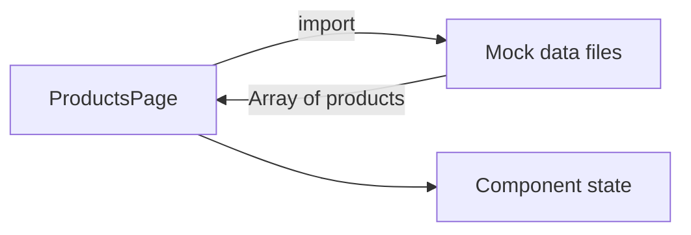
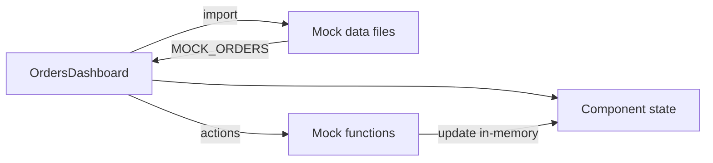
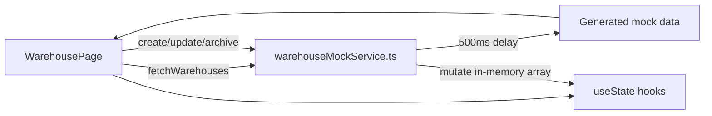
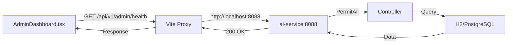

# Data Flow Validation Report

**QA Sprint 2 – Part 5** | **Release:** v1.0.0-rc1 | **Date:** 2026-07-17

---

## 1. Architecture Overview

```
[Frontend Web App] ─── Mock Services (in-memory) ─── [Component State]
       │
[Frontend Dashboards] ─── Vite Proxy (/api) ─── [Backend Services (port 808x)]
       │
[Mobile App] ─── ApiClient (Axios) ─── [Backend Services]
```

---

## 2. Data Flow Trace: Registration

```mermaid
flowchart LR
    A[RegisterPage] -->|sendOtp| B[authClient.ts stub]
    B -->|900ms delay| C[Simulated success]
    C -->|navigate| D[VerifyOtpPage]
    D -->|verifyOtp| B
    B -->|900ms delay| C
    C -->|navigate| E[AuthLoadingPage]
    E -->|1600ms timeout| F[/]
```

**Issues:**
- ❌ No real API call — entire flow is client-side simulation
- ❌ No user account created in identity-service
- ❌ No token generated or stored
- ❌ Role always defaults to 'administrator'

---

## 3. Data Flow Trace: Product Browsing



**Issues:**
- ❌ No API call to catalog-service
- ❌ Products are hardcoded mock data arrays
- ❌ No search, filter, or sort operations via API

---

## 4. Data Flow Trace: Order Management



**Issues:**
- ❌ No API call to order-service
- ❌ Order creation, status updates are in-memory only
- ❌ No synchronization with payment or fulfillment services

---

## 5. Data Flow Trace: Warehouse Management (Mock Service)



**Issues:**
- ❌ No API call to a real backend
- ❌ Data lost on page refresh (in-memory only)
- ❌ No cross-service synchronization

---

## 6. Data Flow Trace: Dashboard Admin Control Plane (Real API)



**Issues:**
- ⚠️ No auth headers sent from frontend
- ⚠️ Proxy routes all dashboards to same backend (8088)
- ❌ GatewayController exists but responds to `/api/v1/ai/execute` not `/api/v1/admin`

---

## 7. Data Flow Trace: Mobile Authentication (Real API)

```mermaid
flowchart LR
    A[LoginScreen] -->|POST /auth/request-otp| B[ApiClient.ts]
    B -->|Axios interceptor| C[Bearer token (if any)]
    C --> D[identity-service:8081]
    D -->|HTTP Basic| E[AuthController]
    E --> F[IdentityService]
    F --> G[PostgreSQL]
    G -->|UserAccount| F
    F -->|AuthResponse| D
    D -->|200 OK| B
    B --> A
```

**Issues:**
- ❌ Token refresh interceptor calls `/auth/refresh` which doesn't exist in identity-service
- ❌ Token storage is placeholder (`getStoredToken` is TODO stub)
- ❌ Biometric login sends `"MOCK_BIOMETRIC_TOKEN"`

---

## 8. Data Inconsistency Risks

| Risk | Description | Severity |
|------|-------------|----------|
| **Stale Mock Data** | Frontend mock data is generated once per session; may diverge from real scenarios | MEDIUM |
| **No Eventual Consistency** | No Kafka/SQS — services have independent databases with no sync mechanism | HIGH |
| **No Distributed Transactions** | Multi-service operations (checkout → order → payment → inventory) have no atomicity | HIGH |
| **No Audit Trail** | Data modifications leave no trace across services | HIGH |
| **Frontend-Backend Drift** | Frontend mocks may not match actual backend contracts | CRITICAL |
| **Cache Inconsistency** | No caching layer — stale data issues not applicable yet but no foundation for future | LOW |

---

## 9. Data Flow Coverage

| Flow | Frontend → API | API → Backend | Backend → State | State → UI | Status |
|------|---------------|---------------|-----------------|------------|--------|
| Registration | Mock (authClient stub) | N/A | N/A | ✅ | ❌ Mock only |
| Login | Mock (authClient stub) | N/A | N/A | ✅ | ❌ Mock only |
| Product Browse | Mock data files | N/A | N/A | ✅ | ❌ Mock only |
| Product Search | Not implemented | N/A | N/A | N/A | ❌ Missing |
| Cart Add/Remove | Not implemented | N/A | N/A | N/A | ❌ Missing |
| Checkout | Not implemented | N/A | N/A | N/A | ❌ Missing |
| Order History | Mock data files | N/A | N/A | ✅ | ❌ Mock only |
| Order Details | Mock data files | N/A | N/A | ✅ | ❌ Mock only |
| Payment | Mock (no UI) | N/A | N/A | N/A | ❌ Missing |
| Training List | Mock data files | N/A | N/A | ✅ | ❌ Mock only |
| Support Tickets | Mock data files | N/A | N/A | ✅ | ❌ Mock only |
| Admin Dashboard | Mock data files | N/A | N/A | ✅ | ❌ Mock only |
| Warehouse Mgmt | Mock service | N/A | N/A | ✅ | ❌ Mock only |
| Inventory Mgmt | Mock service | N/A | N/A | ✅ | ❌ Mock only |
| **Mobile Auth** | **Axios** | **HTTP Basic** | **PostgreSQL** | **✅** | **✅ Real API** |
| **Registry APIs** | **Fetch** | **permitAll** | **In-memory** | **✅** | **✅ Real API** |

---

## 10. Frontend-Backend Contract Alignment

| Frontend Mock | Backend Endpoint | Match? |
|---------------|-----------------|--------|
| authClient.sendOtp() | `POST /auth/otp/send` | ❌ Endpoint doesn't exist |
| authClient.verifyOtp() | `POST /auth/otp/verify` | ❌ Endpoint doesn't exist |
| authClient.register() | `POST /auth/register` | ⚠️ Exists but requires auth |
| authClient.login() | `POST /auth/login` | ⚠️ Uses @RequestParam, not @RequestBody |
| Mock orders data | `GET /orders` | ⚠️ Exists but frontend doesn't call it |
| Mock products data | `GET /products` | ⚠️ Exists but frontend doesn't call it |
| Mock support tickets | Not available | ❌ support-service is placeholder |
| Mock training data | `GET /trainings` | ⚠️ Exists but frontend doesn't call it |

---

## 11. Recommendations

1. **Connect frontend to real backends** — Replace mock data files with actual API calls
2. **Set up Postman/Newman collections** — Validate contracts end-to-end
3. **Implement data seeding** — Populate databases with test data matching mock scenarios
4. **Add integration tests** — Validate UI → API → Backend → Database flows
5. **Implement state management** — Use React Query or Redux for server state synchronization
6. **Add data flow monitoring** — Track request/response pairs for debugging

---

*End of Data Flow Validation Report*
