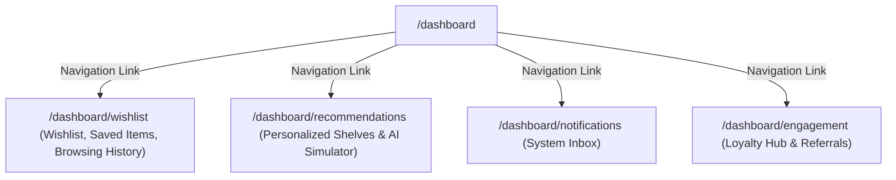

# Engagement System Architecture

This document maps the Information Architecture and components structure for the Customer Engagement features.

## Information Architecture (IA)

## Component Boundaries

1. **WishlistPage**
   - Coordinates filters, search text input, and sorting criteria.
   - Manages lists for saved-for-later checkouts and historical recently-viewed logs.
2. **RecommendationsPage**
   - Segregates recommendations into regional, seasonal, trending, and bought-together shelves.
   - Implements a simulated AI recommendation engine state switcher.
3. **NotificationsPage**
   - Details active notifications. Toggles read status and removes notifications from view.
4. **EngagementHubPage**
   - Keeps points balances in state. Reductions in points trigger redeemed coupon codes.
