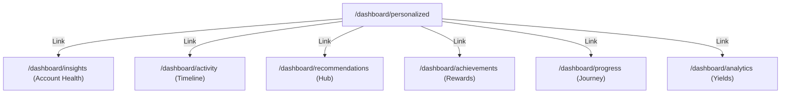

# Intelligence System Architecture

This document maps the Information Architecture and components structure for the SporeKart Personalization Workspace.

## Information Architecture (IA)

## Component Boundaries

1. **PersonalizedHome**: Central page greeting users, continuing study guides, displaying active order cards, and hosting the floating AI Assistant chatbot.
2. **CustomerInsights**: Summarizes grow checklists, loops transfers audit stats, and profile audits.
3. **ActivityFeed**: Filters logs (orders, courses, wishlist, tickets) by tab parameters.
4. **RecommendationHub**: Groups trending products, related courses, and recently viewed.
5. **AchievementCenter**: Integrates loyalty points, reward vouchers redeem buttons, and badges lists.
6. **ProgressCenter**: Maps chronological checklists of verified growth.
7. **AnalyticsDashboard**: Charts monthly yield metrics, target bars, and sterility percentages.
