# Phase 13 — Enterprise Intelligence & AI Platform

Sprint 28 — AI Platform Foundation | Part 1 — Enterprise AI Architecture | Chapter 2 — Existing Architecture Assessment & System Analysis

**Document Type:** Enterprise Engineering Architecture Assessment
**Status:** Draft
**Classification:** Internal — Engineering Governance
**Last Updated:** 2026-07-21

---

## Document Control

| Metadata | Value |
| --- | --- |
| RFC ID | P13-S28-P01-C02 |
| Phase | Phase 13 — Enterprise Intelligence & AI Platform |
| Sprint | Sprint 28 — AI Platform Foundation |
| Part | Part 1 — Enterprise AI Architecture |
| Chapter | Chapter 2 — Existing Architecture Assessment & System Analysis |
| Document Type | Enterprise Engineering Architecture Assessment |
| Target Audience | Engineering, Architecture, Product, Operations |
| Governing Branch | sporetest |
| Feature Branch | feature/p13-s28-p01-chapter02-system-assessment |

---

## Revision History

| Version | Date | Author | Change Description |
| --- | --- | --- | --- |
| 1.0 | 2026-07-21 | SporeKart Engineering | Initial Architecture Assessment — Platform Baseline |

---

## Review Status

| Gate | Status | Approver | Date |
| --- | --- | --- | --- |
| Architecture Review | Pending | — | — |
| Engineering Review | Pending | — | — |
| Security Review | Pending | — | — |
| Final Approval | Pending | — | — |

---

## Table of Contents

1. [Current Enterprise Architecture Overview](#1-current-enterprise-architecture-overview)
2. [Complete Repository Analysis](#2-complete-repository-analysis)
3. [Current Frontend Architecture](#3-current-frontend-architecture)
4. [Current Backend Architecture](#4-current-backend-architecture)
5. [Current Database Architecture](#5-current-database-architecture)
6. [Authentication Assessment](#6-authentication-assessment)
7. [RBAC Assessment](#7-rbac-assessment)
8. [Commerce Assessment](#8-commerce-assessment)
9. [Training Assessment](#9-training-assessment)
10. [Analytics Assessment](#10-analytics-assessment)
11. [Infrastructure Assessment](#11-infrastructure-assessment)
12. [Testing Assessment](#12-testing-assessment)
13. [Architecture Diagrams](#13-architecture-diagrams)
14. [Dependency Analysis](#14-dependency-analysis)
15. [Technical Debt Register](#15-technical-debt-register)
16. [Current Constraints](#16-current-constraints)
17. [AI Readiness Assessment](#17-ai-readiness-assessment)
18. [SWOT Analysis](#18-swot-analysis)
19. [Phase 13 Readiness](#19-phase-13-readiness)
20. [Recommendations](#20-recommendations)
21. [Executive Summary](#21-executive-summary)

---

## 1. Current Enterprise Architecture Overview

### 1.1 Architecture Style

SporeKart employs a **microservices architecture** with 16 domain-aligned backend services, a multi-application frontend strategy, and a centralized infrastructure layer. The architecture is deployed as a monorepo with no formal package workspace configuration.

The platform follows these architectural patterns:

- **Microservices**: 16 Java/Spring Boot 3.3 services with database-per-service isolation
- **Event-Driven**: Apache Kafka for asynchronous communication across all services
- **REST API**: Synchronous HTTP communication via well-defined REST endpoints
- **SPA Frontend**: React 18 applications with Vite build tooling
- **Mobile**: React Native / Expo for four mobile applications
- **Infrastructure-as-Code**: Terraform for AWS provisioning
- **Containerization**: Docker with docker-compose for local development and production

### 1.2 Monorepo Structure

The entire platform resides in a single Git repository on the `sporetest` branch. The monorepo contains:

- **12 frontend applications** under `frontend/`
- **16 backend microservices** under `services/`
- **5 mobile applications** under `mobile/`
- **Shared libraries** under `shared-*` directories (mostly placeholders)
- **Infrastructure** under `infrastructure/` and `platform/`
- **Documentation** under `docs/` (92+ entries)
- **Contracts** under `contracts/`

### 1.3 Current Maturity Assessment

| Domain | Maturity Level | Rating |
| --- | --- | --- |
| Architecture Definition | Defined | 4/5 |
| Documentation | Optimizing | 5/5 |
| Security Posture | Managed | 4/5 |
| Infrastructure-as-Code | Managed | 4/5 |
| CI/CD Pipeline | Repeatable | 3/5 |
| Testing Framework | Defined | 3.5/5 |
| Monitoring/Observability | Initial | 2.5/5 |
| Mobile Platform | Defined | 3.5/5 |
| **Overall** | **Defined** | **3.5/5** |

### 1.4 High-Level System Context

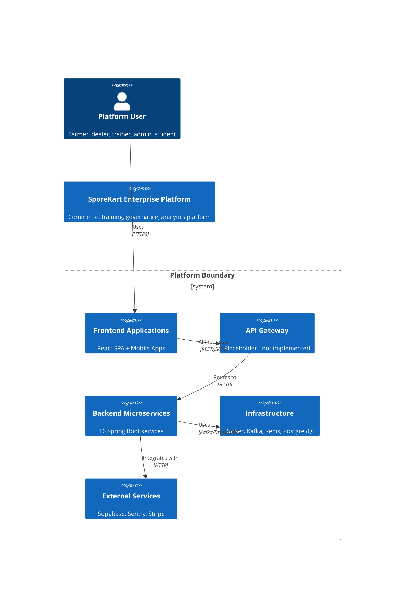

---

## 2. Complete Repository Analysis

### 2.1 Directory Structure Overview

The repository root contains 75+ top-level entries. The following table documents every major directory:

| Directory | Purpose | Maturity | Dependencies |
| --- | --- | --- | --- |
| `frontend/` | 12 React applications + design tokens | Developing | Supabase, Vite, React 18 |
| `services/` | 16 Java/Spring Boot microservices | Developing | Spring Boot 3.3, Kafka, Redis |
| `mobile/` | 5 React Native apps (shared-core + 4 apps) | Defined | Expo SDK 50, Zustand, React Query |
| `shared-config/` | Shared configuration (placeholder) | Initial | None |
| `shared-types/` | Shared TypeScript types (placeholder) | Initial | None |
| `shared-utils/` | Shared utilities (placeholder) | Initial | None |
| `shared-logger/` | Shared logging (placeholder) | Initial | None |
| `shared-errors/` | Shared error handling (placeholder) | Initial | None |
| `shared-testing/` | Playwright E2E testing framework | Developing | Playwright |
| `shared-events/` | Shared event contracts (placeholder) | Initial | None |
| `contracts/` | OpenAPI and AsyncAPI contracts | Initial | None |
| `platform/` | Docker, gateway, mesh, monitoring configs | Defined | Docker |
| `infrastructure/` | Terraform, nginx, database, helm | Managed | Terraform, AWS |
| `docs/` | All platform documentation | Optimizing | Markdown |
| `ci/` | CI/CD pipeline documentation | Initial | None |
| `docker/` | Production docker-compose + monitoring | Managed | Docker |
| `scripts/` | Bootstrap and utility scripts | Defined | Bash |
| `public/` | Static assets | Initial | None |
| `src/` | Root-level shared source (npm not configured) | Initial | None |

### 2.2 Frontend Applications Detail

| Application | Port | Framework | Routing | Auth | Purpose |
| --- | --- | --- | --- | --- | --- |
| `web-app` | 5173 | React 18.3 + Vite 5 | react-router-dom v6.26 | Supabase + Mock | Main enterprise SPA |
| `registry-center` | 5176 | React 18.3 + Vite 5 | react-router-dom v6.26 | Supabase | Service registry UI |
| `admin-control-plane` | 5177 | React 18.3 + Vite 5 | Tab-based (none) | Supabase | Admin control plane |
| `admin-dashboard` | 3000 | React 18.3 + Vite 6 | react-router-dom v6.26 | Supabase | AI assistant hub |
| `buyer-app` | 5174 | React 18.3 + Vite 5 | None (stub) | Supabase | Buyer placeholder |
| `compliance-dashboard` | (none) | React 18.2 + Vite 6 | Tab-based (none) | Supabase | Compliance monitoring |
| `approval-dashboard` | (none) | React 18.2 + Vite 6 | Tab-based (none) | Supabase | Approval workflows |
| `automation-dashboard` | (none) | React 18.2 + Vite 6 | Tab-based (none) | Supabase | Automation monitoring |
| `governance-dashboard` | (none) | React 18.2 + Vite 6 | Tab-based (none) | Supabase | Governance metrics |
| `risk-dashboard` | (none) | React 18.2 + Vite 6 | Tab-based (none) | Supabase | Risk monitoring |
| `shared-ui` | — | Placeholder | — | — | Not yet implemented |
| `tokens` | — | CSS custom properties | — | — | Design token system |

### 2.3 Shared Library Status

All shared libraries are at **initial maturity**:

| Library | Status | What Exists |
| --- | --- | --- |
| shared-config | Placeholder | README only + incomplete Supabase Node.js package |
| shared-types | Placeholder | README only |
| shared-utils | Placeholder | README only |
| shared-events | Placeholder | README only |
| shared-logger | Placeholder | README only |
| shared-errors | Placeholder | README only |
| shared-testing | **Implemented** | Full Playwright E2E test framework |

### 2.4 Repository Expansion Forecast

The repository is expected to grow with 11 additional AI services as Phase 13 progresses. The current structure supports expansion through the `services/` directory convention. However, the lack of a parent POM or workspace configuration will become a maintenance burden as 16+ services share common dependencies.

---

## 3. Current Frontend Architecture

### 3.1 Technology Stack

| Component | Technology | Version |
| --- | --- | --- |
| Framework | React | 18.2–18.3 |
| Build Tool | Vite | 5.x–6.x |
| Language | TypeScript | 5.5–5.6 |
| Routing | react-router-dom | 6.26 |
| HTTP Client | axios | 1.7 |
| Auth Provider | Supabase JS Client | 2.110 |
| Monitoring | Sentry | Latest |
| State Mgmt | React Context + Pub/Sub | Custom |
| Design System | CSS Custom Properties | Custom |
| Testing | None (no test framework found) | — |

### 3.2 Application Architecture

The frontend follows a **multi-SPA architecture** rather than a single unified application. The `web-app` is the primary application containing the public website, customer dashboard, admin panel, training workspace, design system playground, and demo pages. Nine standalone dashboard applications serve specialized purposes with simpler architectures.

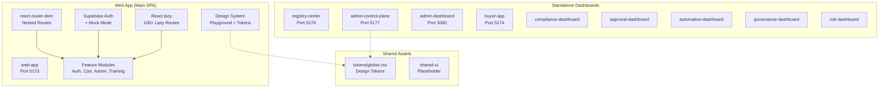

### 3.3 Routing Architecture

The `web-app` uses **data-driven routing** defined in `config/navigation.ts`. The `WORKSPACES` array defines 14 workspaces with associated roles:

- **Public**: home, search, products, cart, checkout
- **Customer** (`customer`, `grower`): account overview, orders, profile, wishlist
- **Orders** (`distributor`, `support`, `administrator`): order queue, fulfillment
- **Products** (`grower`, `distributor`, `administrator`): catalog, SKU management
- **Training** (public): course catalog, session detail
- **AI Workspace** (multiple roles): assistant, chat, prompts, knowledge
- **Governance** (`governance_manager`, `administrator`): policies, approvals, compliance
- **Analytics** (`business_owner`, `administrator`, `grower`): sales, operations metrics
- **Administration** (`administrator`): users, content, config, monitoring
- **CMS** (`administrator`, `trainer`): pages, media management
- **Support** (multiple roles): tickets, knowledge base
- **Settings** (multiple roles): profile, security, workspace, billing
- **Demo** (public): UX standard demos
- **Design System** (public): playground, catalog, tokens, accessibility

All route-level components use `React.lazy()` with `Suspense` for code splitting.

### 3.4 Authentication Implementation

Authentication uses a **layered abstraction**:

1. **Supabase Client Layer**: Global Supabase client singleton with session management
2. **Mock Facade**: `authClient.ts` routes between real Supabase and mock provider based on feature flags
3. **AuthService Layer**: Business logic for OTP send/verify, register, login, social login
4. **React Context**: `AppContext` exposes auth state, user, session, role
5. **RequireAuth Guard**: Route-level component checks authentication and role authorization

Strengths: Clean layering, mock mode enables offline development, role extraction from user metadata.

Weaknesses: No JWT validation on frontend, duplicated Supabase client across 10 apps, HTTP Basic on backend.

### 3.5 State Management

State management is intentionally minimal:

- **React Context**: `AppContext` for auth state, `CartContext` for shopping cart
- **Pub/Sub**: Custom `CartStore` with `subscribeCart`/`dispatchCart` pattern
- **Local State**: Component-level `useState` for most UI state
- **No external state library**: No Redux, Zustand, or Jotai

### 3.6 Design System

The design system is a **strength** of the platform:

- **CSS Custom Properties**: Comprehensive tokens for color, typography, spacing, elevation, z-index, breakpoints, animations
- **Semantic Layers**: Primitives, semantic tokens, theme variants (light, dark, high-contrast)
- **Component Preview**: Full playground at `/design-system/*` routes
- **Accessibility Center**: WCAG compliance, keyboard nav, ARIA usage, contrast validation
- **BEM-like Naming**: `.sk-*` prefix convention

### 3.7 Frontend Strengths

- Data-driven routing with workspace-based navigation
- Comprehensive lazy loading (100+ lazy routes)
- Weakly coupled auth layer with mock mode
- Sophisticated design system with theme support
- Accessibility-first approach
- Minimal, focused dependency sets

### 3.8 Frontend Weaknesses

- No shared component library (shared-ui is placeholder)
- No monorepo workspace — 10x duplication of package.json, tsconfig, vite config
- No test infrastructure across any frontend app
- Duplicated Supabase client initialization in every app
- Standalone dashboards have inconsistent architecture (tab-based vs routed)
- No state management library for complex cross-component state
- Web-app is a monolith — all features in one SPA

---

## 4. Current Backend Architecture

### 4.1 Microservice Inventory

The platform defines 16 microservices. Each service owns its database, has its own Maven POM, and runs on a dedicated port:

| Service | Port | Maturity | Business Logic | Docker | Kafka | Events |
| --- | --- | --- | --- | --- | --- | --- |
| identity-service | 8080 | Developing | Full (register, login, profile, OTP) | Real | Producer | 2 topics |
| catalog-service | 8081 | Foundation | CRUD (list, create products) | Placeholder | Configured | None |
| inventory-service | 8082 | Foundation | Basic stock tracking | Placeholder | Configured | None |
| cart-service | 8091 | Skeleton | Minimal CRUD | Real | Configured | None |
| order-service | 8084 | Foundation | Create, cancel, history | Placeholder | Configured | None |
| payment-service | 8085 | Placeholder | Minimal | Placeholder | Configured | None |
| fulfillment-service | 8086 | Placeholder | Minimal | Placeholder | Configured | None |
| training-service | 8087 | Placeholder | Minimal | Placeholder | Configured | None |
| notification-service | 8096 | Placeholder | Minimal | Placeholder | Configured | None |
| admin-service | 8089 | Developing | Dashboard, tickets, approvals | Real | Configured | None wired |
| analytics-service | 8090 | Placeholder | Minimal | Placeholder | Configured | None |
| ai-service | 8088 | Developing | Chat, RAG, assistants, ERP, finance, B2B | Real | Producer | 8 topics |
| risk-service | 8093 | Skeleton | Minimal | Real | Configured | None |
| search-service | 8094 | Skeleton | Minimal | Real | Configured | None |
| support-service | 8095 | Skeleton | Minimal | Real | Configured | None |
| content-service | 8092 | Skeleton | Minimal | Real | Configured | None |

### 4.2 Technology Stack (Uniform Across All Services)

| Component | Technology | Version |
| --- | --- | --- |
| Language | Java | 21 |
| Framework | Spring Boot | 3.3.3 |
| Build System | Apache Maven | Bundled |
| ORM | Spring Data JPA + Hibernate | Latest |
| Migrations | Flyway | Latest |
| Database | PostgreSQL | 16 |
| Caching | Redis (spring-boot-starter-data-redis) | Latest |
| Messaging | Apache Kafka (spring-kafka) | Latest |
| Security | Spring Security + HTTP Basic | Latest |
| API Docs | SpringDoc OpenAPI | 2.6.0 |
| Monitoring | Actuator + Micrometer Prometheus | Latest |
| Testing | JUnit 5 + Mockito + H2 | Latest |
| External Client | Supabase Java Client | 2.6.2 |

### 4.3 Service Communication Architecture

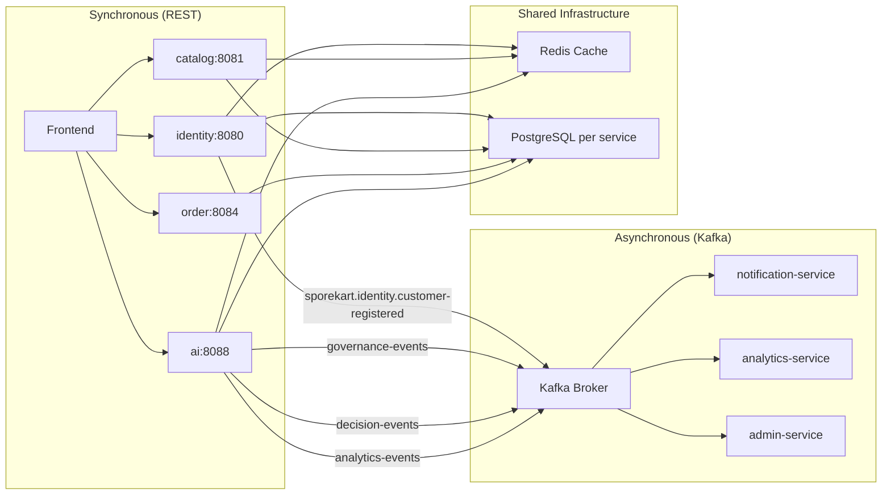

### 4.4 Key Services Analysis

**identity-service** — Most architecturally mature service. Uses hexagonal architecture with ports and adapters. Domain model is separate from JPA entities. Implements: BCryptPasswordEncoder, Kafka producer for domain events, Redis caching (10 min TTL), Flyway migrations. Has the only formal API contract (OpenAPI + AsyncAPI).

**ai-service** — Most complex service with approximately 40 controllers and 100+ domain classes. Uses Spring Modulith (1.2.4) as a modular monolith. Covers: chat, RAG, assistants, ERP, finance, GST, B2B, marketplace, warehouse, procurement, governance, policy, compliance, risk, decisions, automation, workflows, semantic search. Has ArchUnit architecture tests. This service is a candidate for future decomposition.

**admin-service** — Contains enterprise administration logic: dashboard, support tickets, approval workflows. Developing maturity with business logic present.

**Remaining 12 services** — Range from skeleton to placeholder. Most have the Spring Boot scaffolding but minimal business logic. They share the same dependency pattern and infrastructure configuration.

### 4.5 Shared Library Status (Backend)

All Java shared libraries are **empty placeholders**:

- `shared-config/`: README only
- `shared-types/`: README only
- `shared-utils/`: README only
- `shared-events/`: README only
- `shared-logger/`: README only
- `shared-errors/`: README only

No shared parent POM or BOM exists. Each service independently declares all dependencies. This creates dependency version inconsistency risk across 16 services.

### 4.6 Backend Strengths

- Consistent technology stack across all 16 services
- Database-per-service pattern with proper data isolation
- Flyway migrations on all services
- Actuator + Prometheus for basic observability
- Event-driven foundation with Kafka
- Redis caching available on most services
- identity-service has well-structured hexagonal architecture
- AI ADR coverage for architectural decisions

### 4.7 Backend Weaknesses

- HTTP Basic authentication (not production-secure)
- JWT configured in application.yml but not wired in SecurityConfig
- No API Gateway — clients must know 16 service URLs
- No service discovery
- Only 1 of 16 services has formal API contracts
- No circuit breaker or resilience patterns
- Exposed secrets in application.yml (Supabase keys, JWT secret)
- H2 database in runtime scope on 7 services (risk of production use)
- ai-service is a monolithic service in microservice clothing
- Most services are skeleton or placeholder level
- No integration or contract testing
- No distributed tracing beyond identity-service

---

## 5. Current Database Architecture

### 5.1 Database Strategy

SporeKart uses **Supabase** (managed PostgreSQL 15) as the primary data platform. The architecture follows a **database-per-service** pattern with 16 dedicated databases:

| Service | Database Name | DDL Strategy | Flyway |
| --- | --- | --- | --- |
| identity-service | `sporekart_identity` | validate | Enabled |
| catalog-service | `sporekart_catalog` | validate | Enabled |
| cart-service | `sporekart_cart` | validate | Enabled |
| content-service | `sporekart_content` | validate | Enabled |
| risk-service | `sporekart_risk` | validate | Enabled |
| search-service | `sporekart_search` | validate | Enabled |
| support-service | `sporekart_support` | validate | Enabled |
| inventory-service | `sporekart_inventory` | validate | Enabled |
| order-service | `sporekart_order` | none | Enabled |
| payment-service | `sporekart_payment` | none | Enabled |
| fulfillment-service | `sporekart_fulfillment` | none | Enabled |
| training-service | `sporekart_training` | none | Enabled |
| notification-service | `sporekart_notification` | none | Enabled |
| analytics-service | `sporekart_analytics` | none | Enabled |
| admin-service | `sporekart_admin` | none | Enabled |
| ai-service | `sporekart_ai` | none | Enabled |

### 5.2 Migration Strategy

All services use **Flyway** for database migration management. Migration scripts are stored in `classpath:db/migration`. The DDL strategy varies:

- **validate** mode (8 services): Hibernate validates entity mappings against existing schema at startup. Preferred for production where schema is managed by Flyway.
- **none** mode (8 services): Hibernate performs no DDL operations. Schema is managed exclusively by Flyway.

### 5.3 Current Schema

The initial migration (`001_initial_schema.sql`) defines:

- `user_profiles` — User accounts and profile data
- `products` — Product catalog entries
- `cart_items` — Shopping cart entries
- `orders` — Order headers
- `order_items` — Order line items
- `audit_log` — Audit trail entries

Row Level Security (RLS) is enabled on all tables per Supabase best practices.

### 5.4 Backup and Recovery

- Backup: Daily automated
- PITR retention: 7 days
- RTO: 1 hour
- RPO: 5 minutes
- Provider: Supabase managed service

### 5.5 Database Strengths

- Proper database-per-microservice isolation
- Flyway migrations version-controlled with application code
- validate mode prevents accidental schema drift
- Supabase provides managed PostgreSQL with automated backups
- RLS enabled on all tables
- ADR-015 codifies database standards

### 5.6 Database Weaknesses

- Only one migration per service exists (initial schema)
- No read replicas for analytics workloads
- No connection pooling configuration visible
- DDL strategy inconsistency (8 validate, 8 none)
- No database sharding strategy for future scale
- Supabase as dependency introduces vendor lock-in for database tier

---

## 6. Authentication Assessment

### 6.1 Current Authentication Architecture

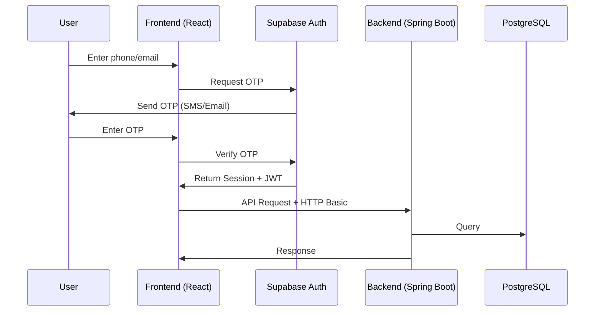

### 6.2 Authentication Flow

1. **OTP Initiation**: User enters phone number or email. Frontend calls `AuthService.sendOtp()` which delegates to Supabase `signInWithOtp()`.
2. **OTP Verification**: User enters the received code. Frontend calls `verifyOtp()`. Supabase returns a session with JWT.
3. **Session Management**: Frontend stores session. Supabase client handles auto-refresh.
4. **Role Extraction**: Role is extracted from `user.user_metadata.role`.
5. **Backend Authentication**: Backend services use HTTP Basic authentication with a shared username/password. JWT configured but not wired.

### 6.3 Authentication Components

| Component | Technology | Status |
| --- | --- | --- |
| Auth Backend | Supabase Auth | Production |
| OTP Delivery | Supabase (SMS/Email) | Production |
| Session Storage | Supabase auto-managed | Production |
| Frontend Auth State | React Context + Custom hooks | Production |
| Mock Provider | Custom authClient facade | Development |
| Backend Auth | HTTP Basic + Spring Security | Development |
| JWT Backend Validation | Configured but not wired | Incomplete |

### 6.4 Authentication Strengths

- OTP-based authentication provides passwordless login
- Supabase handles session management and token refresh
- Mock mode enables frontend development without backend
- Clean abstraction layer (authClient -> AuthService -> Context -> RequireAuth)
- Phone and email OTP channels supported
- Social login stubs for future expansion

### 6.5 Authentication Weaknesses

- **HTTP Basic on backend**: Not production-secure. Credentials shared across all services.
- **JWT not wired**: JWT secret, issuer, expiration configured in application.yml but no authentication filter implemented.
- **No OAuth2/OIDC**: No integration with external identity providers.
- **Exposed Supabase keys**: `SUPABASE_ANON_KEY` and `SUPABASE_SERVICE_ROLE_KEY` committed in application.yml files.
- **No MFA**: No multi-factor authentication support.
- **No session revocation**: No mechanism to invalidate active sessions.

---

## 7. RBAC Assessment

### 7.1 Current Role Model

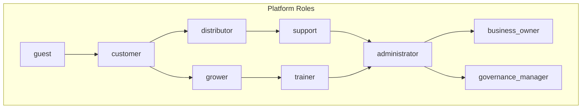

Nine roles are defined in `frontend/web-app/src/config/roles.ts`:

| Role | Description | Privilege Level |
| --- | --- | --- |
| guest | Unauthenticated visitor | Lowest |
| customer | Registered customer | Low |
| grower | Agricultural grower | Medium |
| trainer | Training provider | Medium |
| distributor | Supply chain distributor | Medium |
| support | Customer support agent | High |
| administrator | System administrator | Highest |
| business_owner | Enterprise business owner | High |
| governance_manager | Compliance and governance | High |

### 7.2 RBAC Implementation

**Frontend**:

- Defined in `config/roles.ts` as TypeScript type union
- Navigation visibility filtered by `getVisibleWorkspaces(activeRole)`
- Route protection via `<RequireAuth allowedRoles={[...]}>` component
- Role extracted from `user.user_metadata.role` in Supabase session

**Backend**:

- `@EnableMethodSecurity(prePostEnabled = true)` on most services
- `@PreAuthorize("hasRole('ADMIN')")` annotations used in admin-service and catalog-service
- No centralized permission service

### 7.3 RBAC Strengths

- Role-based navigation filtering is well-implemented
- Route-level protection via RequireAuth component
- Backend method-level security annotations
- Role hierarchy defined in config
- Workspace-based access control is extensible

### 7.4 RBAC Weaknesses

- Role defined in user_metadata only (not in dedicated permissions table)
- No permission granularity beyond role (no scope-based permissions)
- Backend role checking minimal (only admin-service and catalog-service)
- No cross-service permission propagation
- No permission audit trail
- RBAC is tightly coupled to frontend navigation — lacks a service-level permission API

---

## 8. Commerce Assessment

### 8.1 Current Commerce Components

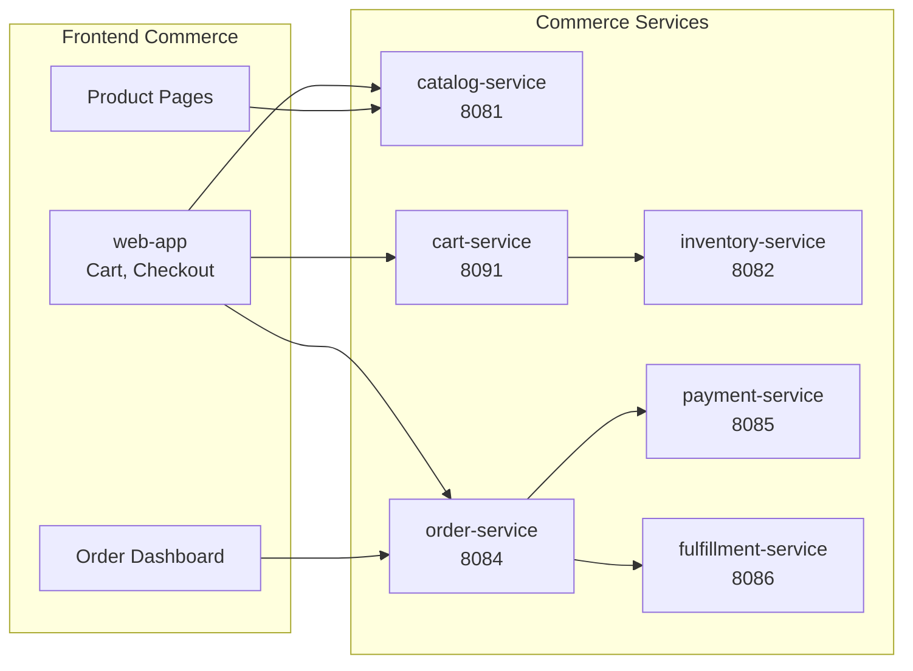

### 8.2 Commerce Implementation Status

| Component | Service | Status | Business Logic |
| --- | --- | --- | --- |
| Product Catalog | catalog-service | Foundation | CRUD operations for products |
| Shopping Cart | cart-service | Skeleton | Minimal cart CRUD |
| Inventory | inventory-service | Foundation | Basic stock tracking |
| Order Management | order-service | Foundation | Create, cancel, history |
| Payment Processing | payment-service | Placeholder | Minimal |
| Fulfillment | fulfillment-service | Placeholder | Minimal |

### 8.3 Commerce Frontend

The commerce frontend in `web-app` includes:

- Product listing and detail pages
- Cart context and drawer component
- Checkout flow
- Order history and tracking dashboard
- Mock data for development

### 8.4 Commerce Strengths

- Service boundaries align with commerce domain (catalog, cart, order, payment, fulfillment)
- Frontend cart has React Context + Pub/Sub pattern for reactive updates
- Mock data enables frontend development independently
- Order service has cancel and history workflows

### 8.5 Commerce Gaps and AI Opportunities

| Gap | Description | AI Opportunity |
| --- | --- | --- |
| No recommendations | Product discovery is manual search | AI-powered personalized recommendations |
| No dynamic pricing | All prices are static | AI-driven pricing optimization |
| No demand forecasting | Inventory managed reactively | ML-based demand prediction |
| No B2B negotiation | All pricing is fixed | AI-assisted B2B negotiation |
| No intelligent search | Basic keyword search only | Semantic search across catalog |
| No fraud detection | No payment risk assessment | AI-based transaction fraud detection |
| Manual fulfillment | No automated routing | AI-optimized fulfillment routing |

---

## 9. Training Assessment

### 9.1 Current Training Components

| Component | Service | Status |
| --- | --- | --- |
| Course Management | training-service | Placeholder |
| Learning Platform | web-app Training Workspace | Developing |
| Certificates | training-service | Placeholder |
| Progress Tracking | training-service | Placeholder |
| Student Workspace | web-app Student Workspace | Developing |

### 9.2 Training Frontend

The training frontend in `web-app` lives in two locations:

1. **Public Course Discovery**: `public-website/` — course catalog, learning paths, session details
2. **Student Workspace**: `admin/training-workspace/` — TrainingDashboardPage, courses, course-builder, course-taxonomy, course-curriculum, learning-resources, course-enrollment, student-workspace, analytics, communication

All training pages use mock data for development.

### 9.3 Training Strengths

- Dedicated training service with proper isolation
- Comprehensive training workspace in frontend
- Course builder, taxonomy, and curriculum modules defined
- Student workspace with analytics and communication
- Mock data enables frontend-first development

### 9.4 Training Limitations and AI Opportunities

| Limitation | Description | AI Opportunity |
| --- | --- | --- |
| No adaptive learning | Same content for all learners | AI-powered adaptive learning paths |
| No automated assessment | Manual evaluation only | AI-based assessment and grading |
| No skill gap analysis | No learner analytics | AI-driven skill gap identification |
| No content personalization | One-size-fits-all | AI personalized content recommendations |
| No intelligent Q&A | Manual support only | AI course assistant and Q&A bot |
| No content generation | Manual content creation | AI-generated course materials |
| No progress prediction | Reactive reporting | AI learner success prediction |

---

## 10. Analytics Assessment

### 10.1 Current Analytics Components

| Component | Service | Status |
| --- | --- | --- |
| Analytics Platform | analytics-service | Placeholder |
| Dashboards | governance-dashboard, risk-dashboard | Developing |
| KPIs | Configurable in dashboards | Basic |
| Reporting | analytics-service | Placeholder |

### 10.2 Current Analytics Implementation

Analytics are primarily delivered through standalone dashboards:

- **governance-dashboard**: Executive dashboard, governance metrics, KPI dashboard, risk distribution, compliance status
- **risk-dashboard**: Risk dashboard, trust dashboard, confidence dashboard, risk timeline, recommendation viewer
- **analytics-dashboard** (governed by admin-dashboard): AI assistant usage, conversation analytics

All dashboards use mock data. No connection to actual analytics-service.

### 10.3 Analytics Strengths

- Dashboard applications defined for governance, risk, and administration
- KPI metrics structure is well-defined
- ADR-012 specifies observability standards
- Prometheus + Grafana infrastructure in docker-compose

### 10.4 Analytics Limitations and AI Opportunities

| Limitation | Description | AI Opportunity |
| --- | --- | --- |
| No real data pipelines | All dashboards use mock data | Real-time analytics pipeline |
| No ML models | No predictive analytics | ML-based forecasting and prediction |
| No anomaly detection | Reactive monitoring only | AI-powered anomaly detection |
| No natural language queries | Dashboard-only analytics | AI-powered natural language analytics |
| No automated insights | Users must find insights manually | AI-generated insight summaries |
| No cost analytics | No AI cost tracking | AI operational cost analytics |
| No user behavior analytics | No personalization data | AI user behavior analysis |

---

## 11. Infrastructure Assessment

### 11.1 Current Infrastructure Architecture

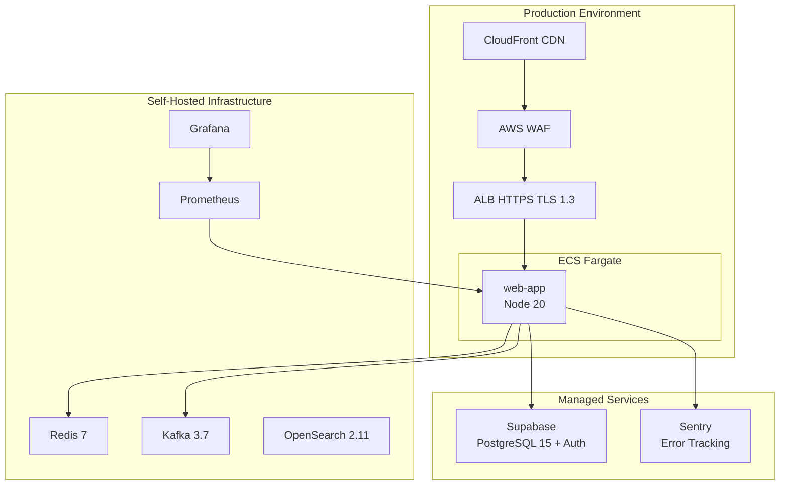

### 11.2 Docker Composition

Two docker-compose files exist:

**Production** (`docker/docker-compose.yml`):

- web-app (Node 20-alpine, multi-stage build)
- nginx (1.27-alpine, ports 80/443)
- redis (7-alpine)
- kafka (bitnami/kafka 3.7, KRaft mode)
- prometheus (v2.53.0)
- grafana (11.1.0)
- Persistent volumes for all data stores

**Platform Development** (`platform/docker/docker-compose.yml`):

- postgres (16-alpine)
- redis (7-alpine)
- kafka (bitnami/kafka)
- opensearch (2.11.0)

### 11.3 Cloud Infrastructure (Terraform)

Terraform defines (`infrastructure/terraform/`):

- **VPC**: 10.0.0.0/16 with DNS hostnames
- **Subnets**: 2 public and 2 private across 2 AZs
- **Internet Gateway** + **NAT Gateway** with EIP
- **ECS Fargate Cluster**: `sporekart-prod` (512 CPU / 1024 MB)
- **ALB**: HTTPS (TLS 1.3) with HTTP->HTTPS redirect
- **Security Groups**: ALB (443/80), Web App (4173 from ALB only)
- **CloudWatch Logs**: 30-day retention
- **IAM Roles**: ECS execution + task roles
- **Secrets Manager**: Supabase URL, Anon Key, Sentry DSN, Stripe PK

Notable: Terraform only defines the web frontend ECS task. No backend microservices are provisioned in infrastructure code.

### 11.4 Infrastructure Strengths

- Production-grade security (CSP, HSTS, TLS 1.3, WAF)
- Proper secret management via AWS Secrets Manager
- Multi-AZ deployment for high availability
- CDN layer with CloudFront
- Comprehensive nginx configuration with security headers
- Rate limiting at multiple layers (nginx + WAF)
- Monitoring stack (Prometheus + Grafana) defined

### 11.5 Infrastructure Weaknesses

- No backend services in ECS (Terraform only provisions web-app)
- Only 6 of 16 services have real Dockerfiles
- No staging environment
- No Kubernetes (intentional ECS decision, but limits portability)
- Monitoring implementation immature (only identity-service scraped)
- No auto-scaling policies defined
- No disaster recovery plan documented beyond database PITR
- No CI/CD pipeline for infrastructure changes

---

## 12. Testing Assessment

### 12.1 Testing Strategy Overview

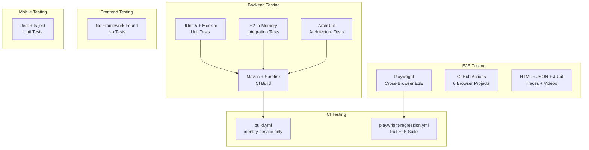

### 12.2 Backend Testing

All 16 services include Spring Boot Starter Test with JUnit 5 + Mockito. Seven services have explicit `maven-surefire-plugin` configuration. The `identity-service` has the most comprehensive test suite. The `ai-service` has ArchUnit tests enforcing module boundaries.

CI `build.yml` only runs `mvn test` for `identity-service` — not comprehensive across all services.

### 12.3 Frontend Testing

**No test framework or test files found** across any of the 10 frontend applications. This is a critical gap for a production enterprise platform.

### 12.4 Mobile Testing

All 5 mobile apps (customer-app, grower-app, dealer-app, admin-companion, shared-core) have Jest configured with `ts-jest` for TypeScript. Test scripts `test` and `test:watch` are defined.

### 12.5 E2E Testing (Playwright)

The `shared-testing/` directory contains a sophisticated Playwright setup:

- 6 browser projects: chromium, firefox, webkit, mobile-chrome, mobile-safari, tablet
- Parallel execution, 2 retries (CI), 1 retry (local)
- Video, screenshot, and trace capture on failure
- Multi-format reporting: HTML, JSON, JUnit XML
- Report isolation via parameterized `PLAYWRIGHT_REPORT_DIR`
- GitHub Actions workflow with matrix strategy

### 12.6 Testing Strengths

- Multi-layered strategy (unit, integration, E2E, architecture)
- Playwright E2E setup is sophisticated with CI integration
- Mobile apps have Jest configured
- ArchUnit tests for module boundary enforcement
- Testing documentation exists (11 documents in `docs/testing/`)

### 12.7 Testing Weaknesses

- **Zero frontend test coverage** — critical risk for a React-heavy platform
- CI build only tests identity-service
- No contract testing (PACT, Spring Cloud Contract)
- No performance/load testing implementation
- No accessibility testing automation
- No security testing automation in CI
- H2 used for integration tests (not production-like)

---

## 13. Architecture Diagrams

### 13.1 High-Level System Architecture

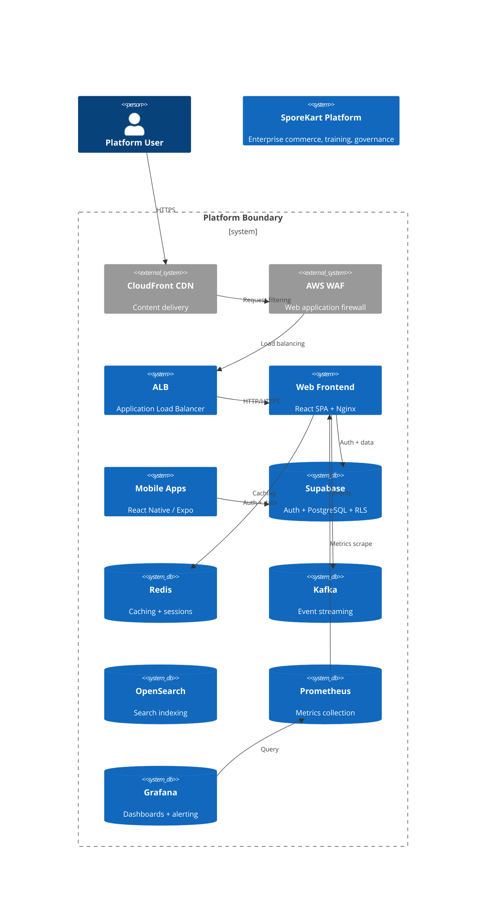

### 13.2 Repository Structure

```mermaid
graph TD
  ROOT[sporekart/]
  ROOT --> FE[frontend/]
  ROOT --> BE[services/]
  ROOT --> MO[mobile/]
  ROOT --> DOC[docs/]
  ROOT --> INFRA[infrastructure/]
  ROOT --> PLAT[platform/]
  ROOT --> SHARED[shared-*]
  ROOT --> CON[contracts/]
  ROOT --> CI[ci/]
  ROOT --> DOCKER[docker/]
  ROOT --> SCR[scripts/]

  FE --> WEB[web-app]
  FE --> RC[registry-center]
  FE --> ACP[admin-control-plane]
  FE --> AD[admin-dashboard]
  FE --> BA[buyer-app]
  FE --> CD[compliance-dashboard]
  FE --> APD[approval-dashboard]
  FE --> AUD[automation-dashboard]
  FE --> GD[governance-dashboard]
  FE --> RD[risk-dashboard]
  FE --> SU[shared-ui]
  FE --> TOK[tokens]

  BE --> ID[identity-service]
  BE --> CA[catalog-service]
  BE --> INV[inventory-service]
  BE --> CART[cart-service]
  BE --> ORD[order-service]
  BE --> PAY[payment-service]
  BE --> FUL[fulfillment-service]
  BE --> TR[training-service]
  BE --> NT[notification-service]
  BE --> ADM[admin-service]
  BE --> AN[analytics-service]
  BE --> AI[ai-service]
  BE --> RS[risk-service]
  BE --> SR[search-service]
  BE --> SP[support-service]
  BE --> CN[content-service]
```

### 13.3 Frontend Component Architecture

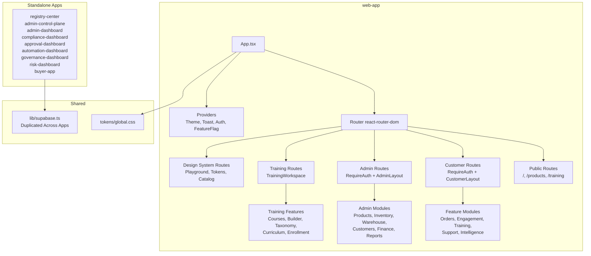

### 13.4 Backend Microservice Architecture

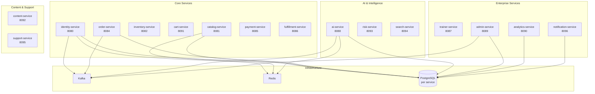

### 13.5 Authentication Flow

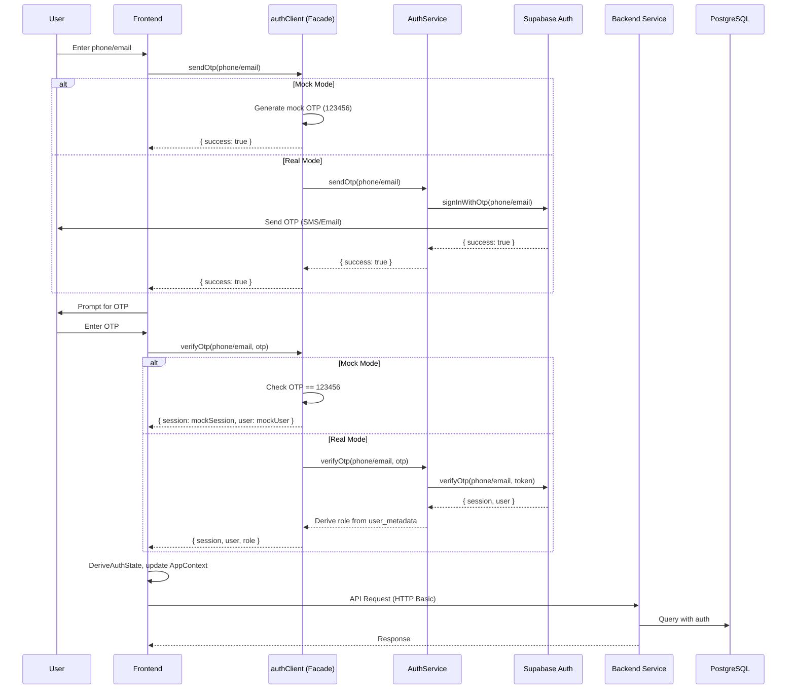

### 13.6 RBAC Flow

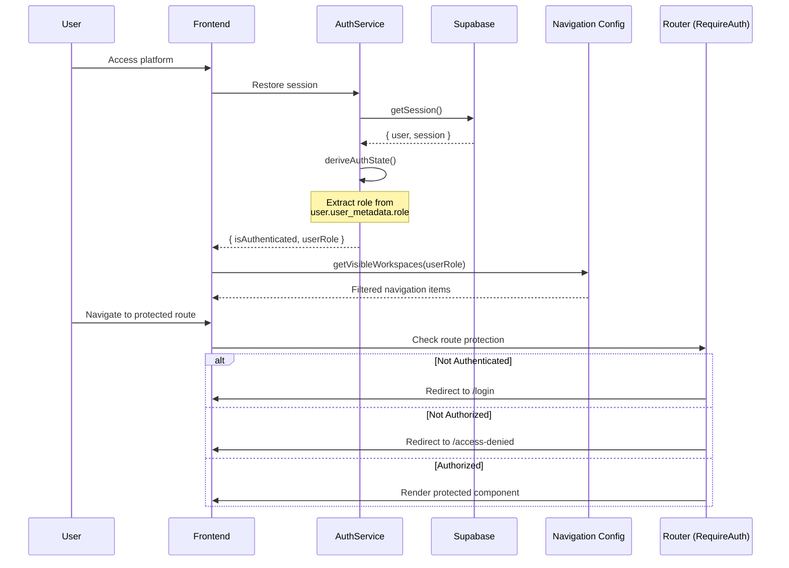

### 13.7 Commerce Flow

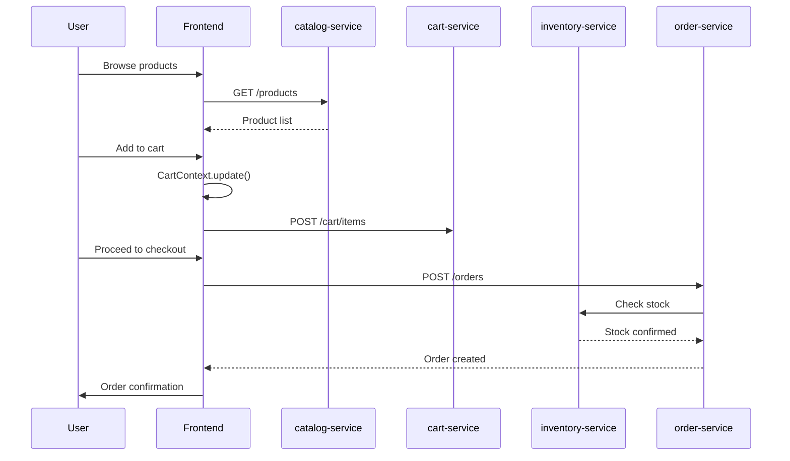

### 13.8 Training Flow

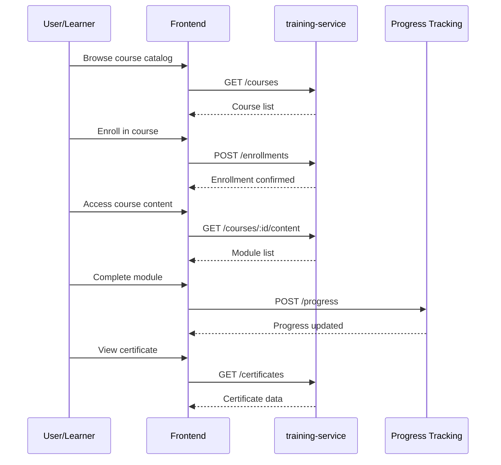

### 13.9 Infrastructure Deployment

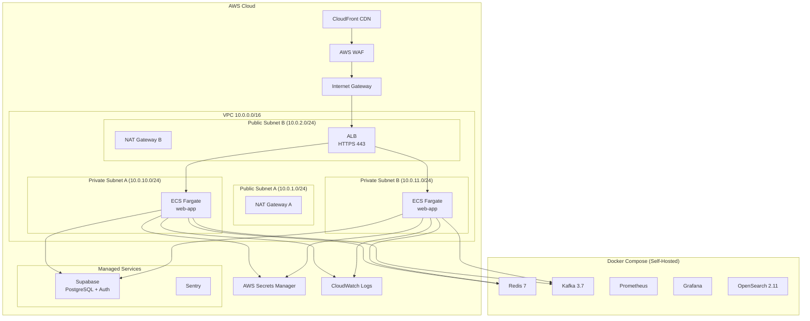

### 13.10 CI/CD Pipeline

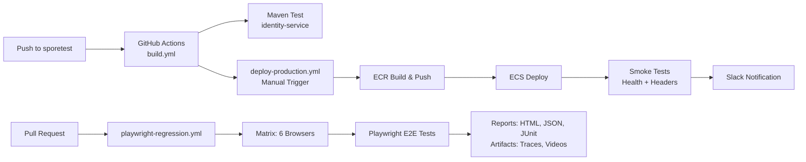

---

## 14. Dependency Analysis

### 14.1 Dependency Graph

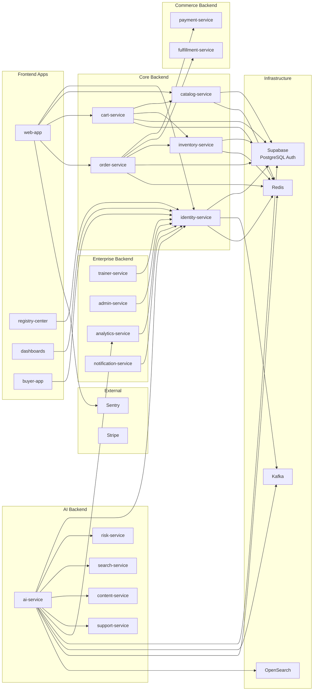

### 14.2 Coupling Analysis

| Category | Type | Services |
| --- | --- | --- |
| **Strong Coupling** | Synchronous REST | identity-service depended by all frontend apps and all backend services |
| **Weak Coupling** | Event-driven | ai-service emits events consumed by notification-service, analytics-service, admin-service |
| **Independent** | No external deps | content-service, support-service (no downstream consumers identified) |
| **Shared Libraries** | None | All shared library directories are placeholders |

### 14.3 Potential Bottlenecks

1. **identity-service**: Every app depends on it for authentication. If unavailable, the entire platform is inaccessible. No caching strategy for session validation.
2. **ai-service**: Monolithic service covering 15+ domains. Any change risk is high. Deployment coordination across domains is complex.
3. **Supabase**: Single point of failure for authentication and database. No fallback or caching for auth operations.
4. **Kafka**: Central message broker. If unavailable, all asynchronous communication fails. No dead letter queue handling visible.
5. **API Gateway**: Missing. Each frontend app must know all service URLs directly, creating tight coupling at the client level.

---

## 15. Technical Debt Register

### 15.1 Current Technical Debt

| ID | Category | Item | Impact | Priority |
| --- | --- | --- | --- | --- |
| TD-001 | Security | HTTP Basic authentication across all backend services | Critical | Critical |
| TD-002 | Security | Exposed Supabase keys and JWT secrets in application.yml | Critical | Critical |
| TD-003 | Security | No JWT filter wired despite configuration | Critical | Critical |
| TD-004 | Testing | Zero frontend test coverage across 10 applications | High | Critical |
| TD-005 | Architecture | No API Gateway implementation | High | High |
| TD-006 | Architecture | No service discovery | Medium | High |
| TD-007 | Infrastructure | Only web-app deployed via Terraform — no backend services | High | High |
| TD-008 | Infrastructure | 10 of 16 services have only placeholder Dockerfiles | Medium | High |
| TD-009 | Architecture | ai-service is monolithic (40+ controllers, 100+ domain classes) | Medium | High |
| TD-010 | Documentation | 6 shared-* directories are empty placeholders | Low | Medium |
| TD-011 | Architecture | No shared parent POM or BOM for 16 Maven projects | Medium | Medium |
| TD-012 | Architecture | No contract testing framework | Medium | Medium |
| TD-013 | Infrastructure | No staging environment | Medium | Medium |
| TD-014 | Architecture | No circuit breaker or resilience patterns | Medium | Medium |
| TD-015 | Infrastructure | Monitoring only scrapes identity-service | Medium | Medium |
| TD-016 | Code Quality | H2 database in runtime scope on 7 services | Medium | High |
| TD-017 | Frontend | 10x duplicated Supabase client initialization | Low | Low |
| TD-018 | Frontend | No monorepo workspace configuration | Low | Medium |
| TD-019 | Frontend | No shared component library (shared-ui placeholder) | Low | Medium |
| TD-020 | Backend | Only identity-service has formal API contracts | Medium | High |

### 15.2 Future Technical Debt (Will Accumulate Without Action)

| ID | Category | Item | Expected Impact |
| --- | --- | --- | --- |
| FT-001 | AI Architecture | AI logic embedded in ai-service without decomposition | High |
| FT-002 | AI Governance | No AI governance infrastructure | Critical |
| FT-003 | AI Observability | No AI-specific monitoring | High |
| FT-004 | AI Security | Prompt injection and data leakage risks | Critical |
| FT-005 | AI Testing | AI model testing not addressed in current framework | High |

### 15.3 Architecture Debt

- **Shared Library Gap**: No shared Java libraries despite 16 microservices. Each service independently manages flyway, springdoc, kafka, redis configurations.
- **API Contract Gap**: Only identity-service has OpenAPI/AsyncAPI contracts. Remaining 15 services lack formal contracts.
- **Gateway Gap**: No API Gateway means cross-cutting concerns (rate limiting, auth, routing, aggregation) cannot be enforced centrally.
- **Resilience Gap**: No circuit breakers, retries, bulkheads, or timeouts configured across any service.

### 15.4 Documentation Debt

- Shared library directories contain README-only placeholders
- 10 of 16 service Dockerfiles are placeholders (documentation of container setup needed)
- No architecture decision records for Phase 13 decisions (ADR-016+)
- Infrastructure directories (monitoring, observability, logging) are placeholders

### 15.5 Testing Debt

- Zero frontend tests
- CI build only tests identity-service (not all 16 services)
- No contract tests
- No performance/load tests
- No security tests in CI
- No accessibility tests

### 15.6 Infrastructure Debt

- No staging environment
- No backend services in Terraform
- Monitoring implementation is minimal
- No CI/CD pipeline for infrastructure changes
- No auto-scaling policies
- No disaster recovery runbook

---

## 16. Current Constraints

### 16.1 Business Constraints

| Constraint | Description | Impact |
| --- | --- | --- |
| Supabase Dependence | All auth and data rely on Supabase managed service | Vendor lock-in; cannot migrate auth without full rework |
| OTP-Only Authentication | No password-based or SSO authentication | Limits enterprise adoption where SSO is required |
| No Offline Support | All workflows require internet connectivity | Limits rural penetration where connectivity is unreliable |
| Manual Data Entry | Most data entry is manual | Limits scale without AI automation |

### 16.2 Architecture Constraints

| Constraint | Description | Impact |
| --- | --- | --- |
| No API Gateway | Clients directly address services | Client-side routing complexity; no centralized enforcement |
| No Service Mesh | No traffic management, mTLS, or observability at mesh level | Limits operational maturity |
| No Distributed Tracing | Only identity-service has tracing | Debugging across services is difficult |
| HTTP Basic Auth | Not production-secure | Cannot pass security audits |
| ai-service Monolith | 15+ domains in one service | High change risk; deployment coupling |

### 16.3 Technology Constraints

| Constraint | Description | Impact |
| --- | --- | --- |
| Java 21 + Spring Boot | Fixed technology stack | Cannot use Python/C++ AI services directly |
| Maven Build | Fixed build system | Cannot use Gradle or alternative build systems |
| No Python Runtime | No Python environment for ML models | Requires AI gateway abstraction for Python-based AI services |
| PostgreSQL Only | No polyglot persistence | All services must use PostgreSQL |

### 16.4 Operational Constraints

| Constraint | Description | Impact |
| --- | --- | --- |
| No Staging Environment | Only dev and prod | Cannot validate changes in production-like environment |
| Manual CI/CD | Build pipeline only tests one service | High risk of regression |
| No Incident Response | No documented incident response procedure | Delayed recovery from production issues |
| No Capacity Planning | No performance baseline or capacity model | Risk of undersized infrastructure |

### 16.5 Deployment Constraints

| Constraint | Description | Impact |
| --- | --- | --- |
| ECS Fargate Only | No Kubernetes | Limits portability and ecosystem |
| Single Region | All infrastructure in us-east-1 | No disaster recovery across regions |
| No Blue-Green | ECS rolling update only | Risk during deployment |
| No Canary Releases | No percentage-based rollouts | Risk of widespread impact from bad deployment |

### 16.6 Security Constraints

| Constraint | Description | Impact |
| --- | --- | --- |
| No MFA | OTP-based auth without multi-factor | Risk of account compromise |
| No Session Revocation | Cannot invalidate sessions | Compromised sessions remain active |
| No Rate Limiting on Backend | nginx rate limiting covers frontend only | Backend services lack request throttling |
| No Secrets Rotation | Secrets stored in application.yml | Exposure risk without rotation mechanism |

---

## 17. AI Readiness Assessment

### 17.1 Per-Module AI Readiness

| Module | Can AI Integrate? | Integration Approach | Complexity | Risk | Dependencies | Priority | Readiness Score |
| --- | --- | --- | --- | --- | --- | --- | --- |
| identity-service | Yes | Add AI-based anomaly detection for authentication patterns | Low | Low | AI Gateway | Low | 8/10 |
| catalog-service | Yes | Semantic search, automated categorization, recommendation engine | Medium | Low | AI Gateway + Vector DB | High | 7/10 |
| inventory-service | Yes | Demand forecasting, reorder prediction, anomaly detection | Medium | Medium | AI Gateway + ML models | High | 6/10 |
| cart-service | Yes | Cart abandonment prediction, intelligent upsell | Medium | Low | AI Gateway | Medium | 7/10 |
| order-service | Yes | Fraud detection, delivery time prediction | Medium | Medium | AI Gateway + Risk | High | 6/10 |
| payment-service | Yes | Fraud scoring, payment method recommendation | High | High | AI Gateway + Risk | High | 4/10 |
| fulfillment-service | Yes | Route optimization, warehouse assignment | High | Medium | AI Gateway | Medium | 5/10 |
| training-service | Yes | Adaptive learning, content generation, assessment | High | Medium | AI Gateway + Knowledge | High | 5/10 |
| notification-service | Yes | Smart notification timing, channel selection | Low | Low | AI Gateway | Low | 8/10 |
| admin-service | Yes | Ticket classification, auto-response, anomaly flagging | Medium | Low | AI Gateway + Prompt Mgmt | Medium | 7/10 |
| analytics-service | Yes | Natural language queries, automated insights, anomaly detection | Medium | Medium | AI Gateway | High | 6/10 |
| ai-service | Internal | Already contains AI — needs decomposition and governance | High | High | All services | Critical | 5/10 |
| risk-service | Yes | Risk scoring, fraud detection, compliance monitoring | High | High | AI Gateway + ML models | High | 4/10 |
| search-service | Yes | Semantic search, vector embeddings, hybrid search | Medium | Medium | AI Gateway + Vector DB | High | 6/10 |
| support-service | Yes | Intelligent ticket routing, auto-response, knowledge Q&A | Medium | Low | AI Gateway + Prompt Mgmt | High | 7/10 |
| content-service | Yes | Content categorization, automated tagging, version intelligence | Medium | Low | AI Gateway | Medium | 7/10 |

### 17.2 AI Readiness Score Summary

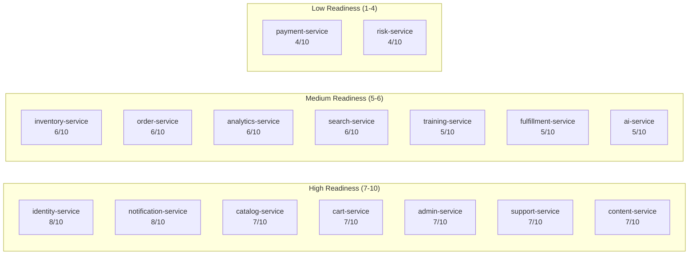

### 17.3 AI Integration Prerequisites

Before AI can integrate with any module, the following platform-level prerequisites must be satisfied:

1. **AI Gateway**: Central routing, authentication, and governance for all AI requests
2. **Provider Abstraction**: Unified interface across AI providers (OpenAI, Anthropic, open-source)
3. **Prompt Management**: Versioned, auditable prompt storage and management
4. **Vector Database**: Storage and retrieval for embeddings
5. **Knowledge Platform**: Unified knowledge graph across domain data
6. **AI Governance**: Permission-aware, auditable AI operations
7. **AI Observability**: Metrics, logging, tracing for AI operations

---

## 18. SWOT Analysis

### 18.1 Engineering SWOT

```mermaid
quadrantChart
  title Engineering SWOT Analysis
  x-axis Internal Factors --> External Factors
  y-axis Negative --> Positive
  quadrant-1 "Strengths"
  quadrant-2 "Opportunities"
  quadrant-3 "Weaknesses"
  quadrant-4 "Threats"
  "Documentation Excellence": [0.85, 0.85]
  "Consistent Tech Stack": [0.80, 0.75]
  "Design System": [0.75, 0.80]
  "ADR Governance": [0.70, 0.75]
  "Event Foundation": [0.65, 0.70]
  "No Frontend Tests": [0.25, 0.20]
  "No API Gateway": [0.20, 0.25]
  "HTTP Basic Auth": [0.15, 0.15]
  "Skeleton Services": [0.30, 0.30]
  "AI Platform Investment": [0.70, 0.20]
  "Multi-Tenant Expansion": [0.75, 0.15]
  "SaaS Transformation": [0.80, 0.10]
  "Vendor Lock-in Supabase": [0.20, 0.80]
  "Security Audit Concerns": [0.25, 0.85]
  "Competitive Pressure": [0.30, 0.90]
  "Team Velocity Constraints": [0.35, 0.85]
```

### 18.2 Strengths (Internal Positive)

| Strength | Impact | Evidence |
| --- | --- | --- |
| Documentation Excellence | Enables rapid onboarding and consistent engineering | 92+ docs, 22 ADRs, documentation-driven development |
| Consistent Tech Stack | Reduces cognitive overhead across teams | Java 21 + Spring Boot 3.3 across all 16 services |
| Sophisticated Design System | Accelerates frontend development | CSS custom properties, theme support, playground |
| ADR Governance | Ensures architectural decisions are recorded and enforced | Consistent ADR template with compliance sections |
| Event-Driven Foundation | Enables asynchronous, decoupled communication | Kafka configured on all services |
| Multi-Layer Testing | Multiple testing strategies for different layers | JUnit, Playwright, Jest across platforms |
| Infrastructure-as-Code | Production infrastructure defined and versioned | Terraform for AWS, Docker Compose |
| Production Security | Defense-in-depth security posture | CSP, HSTS, WAF, rate limiting, secrets management |

### 18.3 Weaknesses (Internal Negative)

| Weakness | Impact | Priority |
| --- | --- | --- |
| No Frontend Tests | Critical quality gap for React-heavy platform | Critical |
| No API Gateway | Clients coupled to service URLs; cross-cutting concerns not centralized | High |
| HTTP Basic Authentication | Not production-secure | Critical |
| 10 of 16 Services are Skeleton/Placeholder | Most business logic not implemented | High |
| No Service Discovery | Service URLs hardcoded; scaling requires configuration changes | High |
| ai-service is Monolithic | High change risk; deployment coupling | High |
| No Contract Testing | Service contracts can break without detection | High |
| Zero Monitoring Implementation | Prometheus only scrapes one service | Medium |
| No Staging Environment | Cannot validate changes in production-like environment | Medium |

### 18.4 Opportunities (External Positive)

| Opportunity | Impact | Timeline |
| --- | --- | --- |
| AI Platform Investment | Transformative capability adding intelligence to every domain | Phase 13 |
| Multi-Tenant Expansion | New revenue streams through SaaS | Phase 20 |
| Enterprise Knowledge Platform | Differentiator in agricultural enterprise market | Phase 15 |
| Mobile Intelligence | AI-powered mobile experiences for rural users | Phase 16 |
| API-First Marketplace | Enable third-party integrations and extensions | Phase 17 |
| Industry Leadership | First-mover advantage in AI-powered agricultural platform | Phase 13–20 |

### 18.5 Threats (External Negative)

| Threat | Impact | Mitigation |
| --- | --- | --- |
| Supabase Vendor Lock-in | Migration difficulty if Supabase changes pricing/features | Database-per-service enables independent migration |
| Security Audit Findings | HTTP Basic and exposed secrets will fail audits | Prioritized for remediation in Phase 13 |
| Competitive AI Platforms | Competitors may launch AI features faster | Platform integration advantage; data moat |
| LLM Provider API Changes | OpenAI/Anthropic API changes could break AI features | Provider abstraction layer planned |
| AI Regulatory Changes | New AI regulations could restrict capabilities | Governance-first architecture; explainable AI |
| Team Capacity Constraints | Phase 13 scope may exceed team bandwidth | Phased delivery; critical path prioritization |

---

## 19. Phase 13 Readiness

### 19.1 Readiness Assessment

| Criterion | Status | Rating | Notes |
| --- | --- | --- | --- |
| Architecture Ready | Yes | 4/5 | Stable; 16 services defined; consistent patterns |
| Documentation Ready | Yes | 5/5 | Comprehensive; 92+ docs; 22 ADRs |
| Testing Ready | Partial | 3/5 | Backend + E2E ready; frontend testing is a critical gap |
| Infrastructure Ready | Partial | 3.5/5 | Production infra defined; staging missing; monitoring immature |
| Repository Ready | Yes | 4/5 | Monorepo structure accommodates new services |
| Governance Ready | Yes | 4.5/5 | ADR process mature; documentation-driven development established |
| Security Ready | Partial | 3/5 | Strong perimeter security; HTTP Basic and exposed secrets are risks |
| AI Readiness | Low | 3/5 | No AI infrastructure exists; all AI services need to be built |
| **Overall Readiness** | **Partial** | **3.5/5** | **Foundation is solid but significant work needed for AI maturity** |

### 19.2 Readiness Score Breakdown

```mermaid
radar
  title Phase 13 Readiness Assessment
  "Architecture": 80
  "Documentation": 100
  "Testing": 60
  "Infrastructure": 70
  "Repository": 80
  "Governance": 90
  "Security": 60
  "AI Readiness": 40
```

### 19.3 Gaps to Address Before AI Implementation

| Gap | Required For | Priority | Suggested Sprint |
| --- | --- | --- | --- |
| JWT Authentication | Secure AI service communication | Critical | Sprint 28 |
| API Gateway | AI request routing and governance | Critical | Sprint 28 |
| Frontend Testing | AI feature quality assurance | High | Sprint 29 |
| Service Real Dockerfiles | AI service deployment | High | Sprint 29 |
| Monitoring Implementation | AI observability | High | Sprint 30 |
| Contract Testing | AI service contract validation | High | Sprint 30 |

---

## 20. Recommendations

### 20.1 Critical Priority

| # | Recommendation | Rationale | Effort | Dependencies |
| --- | --- | --- | --- | --- |
| R1 | Replace HTTP Basic with JWT authentication across all backend services | Security audit failure risk; prerequisite for production AI | 2–3 sprints | identity-service enhancement |
| R2 | Remove exposed secrets from application.yml; use Secrets Manager | Active security vulnerability | 1 sprint | Infrastructure update |
| R3 | Implement API Gateway (Spring Cloud Gateway) | Required for AI request routing, rate limiting, auth enforcement | 3–4 sprints | identity-service |
| R4 | Add frontend test infrastructure (Vitest + React Testing Library) | Critical quality gap; required before AI UI features | 2 sprints | Build tooling |
| R5 | Wire JWT authentication filter in all backend services | JWT configured but not active | 1–2 sprints | identity-service JWT filter |

### 20.2 High Priority

| # | Recommendation | Rationale | Effort |
| --- | --- | --- | --- |
| R6 | Create shared parent POM/BOM for dependency management | Reduce duplication; ensure version consistency | 1 sprint |
| R7 | Deploy backend microservices via Terraform ECS definitions | Production readiness for services | 3–4 sprints |
| R8 | Implement service discovery (Spring Cloud Consul or Kubernetes DNS) | Decouple service URLs | 2 sprints |
| R9 | Add resilient communication patterns (Resilience4j) | Production reliability | 2 sprints |
| R10 | Create OpenAPI contracts for all 16 services | Contract-first development enablement | 3–4 sprints |
| R11 | Implement staging environment | Pre-production validation | 3 sprints |
| R12 | Add contract testing (PACT or Spring Cloud Contract) | Service contract enforcement | 2 sprints |
| R13 | Remove H2 from runtime scope on affected services | Prevent accidental production use | 1 sprint |

### 20.3 Medium Priority

| # | Recommendation | Rationale | Effort |
| --- | --- | --- | --- |
| R14 | Implement distributed tracing across all services | Cross-service debugging | 2 sprints |
| R15 | Populate shared Java libraries | Reduce duplication | 3 sprints |
| R16 | Decompose ai-service into domain-specific services | Reduce change risk | 4–6 sprints |
| R17 | Implement full Prometheus scraping + Grafana dashboards | Production observability | 2 sprints |
| R18 | Add performance/load testing infrastructure | Capacity planning | 2 sprints |
| R19 | Create monorepo workspace configuration (npm workspaces) | Frontend dependency management | 1 sprint |
| R20 | Build shared component library (shared-ui) | Frontend consistency | 3 sprints |

### 20.4 Low Priority

| # | Recommendation | Rationale | Effort |
| --- | --- | --- | --- |
| R21 | Add pre-commit hooks for linting and type checking | Code quality automation | 1 sprint |
| R22 | Implement automated accessibility testing | WCAG compliance | 2 sprints |
| R23 | Add API rate limiting to backend services | Defense in depth | 1 sprint |
| R24 | Create disaster recovery runbook | Operational maturity | 1 sprint |
| R25 | Implement automated secrets rotation | Security best practice | 2 sprints |

### 20.5 Recommendation Prioritization Matrix

| Quadrant | Recommendations |
| --- | --- |
| **Must Do Before AI** | R1 (JWT Auth), R3 (API Gateway), R5 (Wire JWT) |
| **Must Do During Phase 13** | R2 (Secrets), R4 (Frontend Tests), R6 (Parent POM), R9 (Resilience) |
| **Should Do in Phase 13** | R7 (Terraform Backend), R11 (Staging), R14 (Tracing), R17 (Monitoring) |
| **Can Defer to Phase 14** | R16 (Decompose ai-service), R20 (Shared UI), R22 (Accessibility) |

---

## 21. Executive Summary

### 21.1 Current Platform Maturity

SporeKart has completed twelve engineering phases and achieved a **Defined/Managed maturity level** (3.5/5). The platform demonstrates production-grade architecture in several dimensions:

- **Documentation is exceptional** (5/5) — 92+ documentation entries, 22 Architecture Decision Records, documentation-driven development enforced as ADR-013.
- **Architecture is consistent** (4/5) — 16 microservices with uniform technology stack, database-per-service isolation, event-driven foundation, and well-defined domain boundaries.
- **Security posture is strong at the perimeter** (4/5) — CSP, HSTS, TLS 1.3, WAF, rate limiting, secrets management define a defense-in-depth strategy.

### 21.2 Architecture Quality

The architecture demonstrates **mature engineering practices**:

- Microservices with bounded contexts and database-per-service isolation
- Event-driven communication via Kafka
- Consistent Java 21 + Spring Boot 3.3 stack
- Flyway migrations across all services
- React 18 frontend with sophisticated design system
- Terraform infrastructure-as-code for AWS

Critical architecture gaps exist:

- **No API Gateway** — limits cross-cutting concerns
- **HTTP Basic authentication** — not production-secure
- **Zero frontend test coverage** — critical quality gap
- **10 of 16 services are skeletons** — most business logic not implemented
- **Exposed secrets in application.yml** — active security vulnerability

### 21.3 Technical Readiness

The platform is **partially ready** for Phase 13 AI implementation:

| Dimension | Readiness | Action Required |
| --- | --- | --- |
| Architecture | 4/5 — Ready for AI services | API Gateway needed for AI routing |
| Documentation | 5/5 — Fully ready | Continue ADR process for AI decisions |
| Testing | 3/5 — Gaps exist | Frontend tests, contract tests needed |
| Infrastructure | 3.5/5 — Gaps exist | Staging environment, monitoring needed |
| Security | 3/5 — Gaps exist | JWT auth, secrets remediation needed |
| AI Readiness | 3/5 — Foundation needed | AI Gateway, provider abstraction, knowledge platform |

### 21.4 AI Readiness

The platform has a **solid foundation** for AI integration:

- **Event-driven architecture** enables AI event consumption
- **Redis caching** provides low-latency retrieval for AI context
- **Kafka messaging** enables asynchronous AI processing
- **Supabase integration** provides unified auth and data layer
- **16 domain services** provide clean integration points
- **Comprehensive documentation** ensures consistent AI architecture

However, **no AI infrastructure exists** beyond the ai-service placeholder. The AI Gateway, provider abstraction, prompt management, knowledge platform, vector database, and AI governance infrastructure must be built from scratch in Phase 13.

### 21.5 Overall Enterprise Readiness

```mermaid
graph LR
  subgraph "Readiness Scores"
    A[Architecture<br/>4/5]
    B[Documentation<br/>5/5]
    C[Testing<br/>3/5]
    D[Infrastructure<br/>3.5/5]
    E[Security<br/>3/5]
    F[AI Readiness<br/>3/5]
  end

  A --> AVG[Overall<br/>3.5/5]
  B --> AVG
  C --> AVG
  D --> AVG
  E --> AVG
  F --> AVG
```

The platform is **ready to begin Phase 13** with the understanding that significant foundational work (API Gateway, JWT authentication, AI infrastructure) must be completed before production AI capabilities can be delivered. The recommendations in Section 20 provide a structured remediation path organized by priority.

This document becomes the **official architectural baseline** for all Phase 13 engineering work. Every architectural decision, service design, and implementation detail moving forward must be evaluated against the current state documented herein.

---

End of RFC P13-S28-P01-C02
