# Phase 13 — Enterprise Intelligence & AI Platform

Sprint 28 — AI Platform Foundation | Part 1 — Enterprise AI Architecture | Chapter 3 — Enterprise AI Platform Target Architecture

**Document Type:** Enterprise Target Architecture Blueprint
**Status:** Draft
**Classification:** Internal — Engineering Governance
**Last Updated:** 2026-07-21

---

## Document Control

| Metadata | Value |
| --- | --- |
| RFC ID | P13-S28-P01-C03 |
| Phase | Phase 13 — Enterprise Intelligence & AI Platform |
| Sprint | Sprint 28 — AI Platform Foundation |
| Part | Part 1 — Enterprise AI Architecture |
| Chapter | Chapter 3 — Enterprise AI Platform Target Architecture |
| Document Type | Enterprise Target Architecture Blueprint |
| Target Audience | Engineering, Architecture, Product, Operations, Executive |
| Governing Branch | sporetest |
| Feature Branch | feature/p13-s28-p01-chapter03-ai-target-architecture |

---

## Revision History

| Version | Date | Author | Change Description |
| --- | --- | --- | --- |
| 1.0 | 2026-07-21 | SporeKart Engineering | Initial Target Architecture — Enterprise AI Platform Blueprint |

---

## Review Status

| Gate | Status | Approver | Date |
| --- | --- | --- | --- |
| Architecture Review | Pending | — | — |
| Engineering Review | Pending | — | — |
| Security Review | Pending | — | — |
| Final Approval | Pending | — | — |

---

## Table of Contents

1. [Executive Architecture Vision](#1-executive-architecture-vision)
2. [Enterprise AI Architecture Principles](#2-enterprise-ai-architecture-principles)
3. [Enterprise AI Reference Architecture](#3-enterprise-ai-reference-architecture)
4. [AI Microservice Architecture](#4-ai-microservice-architecture)
5. [Complete Service Interaction](#5-complete-service-interaction)
6. [Enterprise AI Gateway](#6-enterprise-ai-gateway)
7. [Enterprise Prompt Platform](#7-enterprise-prompt-platform)
8. [Knowledge Platform](#8-knowledge-platform)
9. [Enterprise Vector Platform](#9-enterprise-vector-platform)
10. [Conversation Platform](#10-conversation-platform)
11. [Enterprise Agent Platform](#11-enterprise-agent-platform)
12. [Enterprise Copilot Architecture](#12-enterprise-copilot-architecture)
13. [AI Security Architecture](#13-ai-security-architecture)
14. [Enterprise AI Observability](#14-enterprise-ai-observability)
15. [Enterprise AI Cost Architecture](#15-enterprise-ai-cost-architecture)
16. [Deployment Architecture](#16-deployment-architecture)
17. [Event Driven AI Architecture](#17-event-driven-ai-architecture)
18. [Data Flow Diagrams](#18-data-flow-diagrams)
19. [Architecture Decision Records](#19-architecture-decision-records)
20. [Scalability Analysis](#20-scalability-analysis)
21. [Future Phase Mapping](#21-future-phase-mapping)
22. [Risk Assessment](#22-risk-assessment)
23. [Engineering Recommendations](#23-engineering-recommendations)
24. [Executive Summary](#24-executive-summary)

---

## 1. Executive Architecture Vision

### 1.1 What the AI Platform Becomes

The Enterprise AI Platform transforms SporeKart from an enterprise business platform into an **Enterprise AI Operating System**. This is not a feature overlay. It is a fundamental architectural layer that permeates every domain service, every user interface, and every business workflow.

The AI Platform becomes the **intelligence layer** that sits above and across all existing domain services. It does not replace them. It augments them. It provides reasoning, memory, knowledge retrieval, natural language understanding, and autonomous decision-making capabilities to every part of the platform.

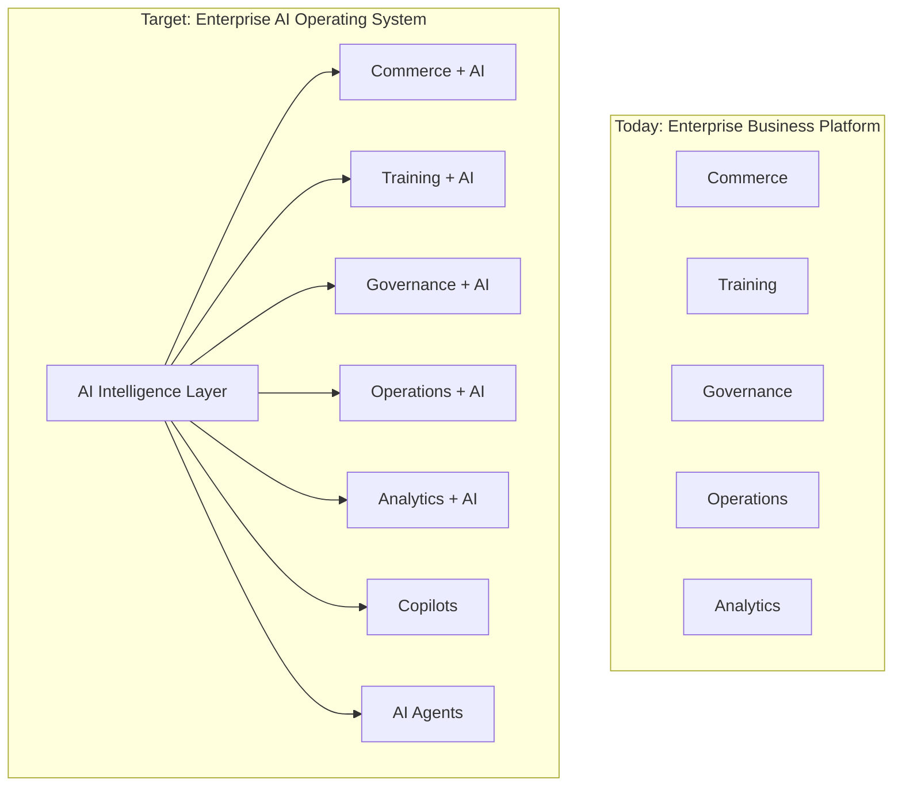

### 1.2 Business Objectives

| Objective | Target | Timeline |
| --- | --- | --- |
| Personalise every user interaction | 100% of platform sessions use AI personalisation | Phase 16 |
| Automate 50% of support tickets | Resolution without human intervention | Phase 15 |
| Reduce decision latency by 80% | AI surfaces insights before users ask | Phase 17 |
| Enable natural language across all platform interfaces | Every UI has a copilot | Phase 16 |
| Achieve 99.9% AI inference availability | Production AI SLA | Phase 14 |
| Support 1M+ inference requests per day | Platform scalability | Phase 15 |
| Maintain zero breaking changes | All AI is additive | Phase 13+ |

### 1.3 Engineering Objectives

- **Provider Independence**: Abstract all AI providers behind a unified interface. No single provider dependency.
- **Architecture Longevity**: The AI architecture must support Phase 13 through Phase 20 without restructuring.
- **Platform Integration**: AI services integrate with existing platform infrastructure (identity, RBAC, observability, event bus, API gateway).
- **Multi-Tenancy Ready**: AI architecture is designed for tenant isolation from day one.
- **Cost Transparency**: Every AI operation has measurable cost attributable to tenant, user, and feature.

### 1.4 Scalability Objectives

- **Horizontal Scalability**: Every AI service scales independently based on load.
- **Caching Strategy**: Multi-layer caching reduces inference costs by 60%+.
- **Async Processing**: Non-real-time AI operations are queued and processed asynchronously.
- **Provider Fallback**: Automatic failover between AI providers based on availability and cost.

### 1.5 Operational Objectives

- **Observability**: Every AI operation produces metrics, logs, and traces.
- **AI Incident Response**: Documented runbooks for AI service degradation and failure.
- **Cost Governance**: Budget enforcement, chargeback, and cost forecasting for AI operations.
- **Model Lifecycle Management**: Versioned model deployments with canary releases and rollback.

### 1.6 Long-Term Vision Through Phase 20

```text
Phase 13: Architecture & Foundation  ████████████░░░░░░░░░░░░░░░░░░░░░░
Phase 14: AI Services                ░░░░░░░░░░████████████░░░░░░░░░░░░
Phase 15: Knowledge & Search         ░░░░░░░░░░░░░░░░░░████████████░░░░
Phase 16: Copilot & Workflows        ░░░░░░░░░░░░░░░░░░░░░░░░░░████████
Phase 17: Predictive & Decision      ░░░░░░░░░░░░░░░░░░░░░░░░░░░░░░░░░░
Phase 18: AI Maturity                ░░░░░░░░░░░░░░░░░░░░░░░░░░░░░░░░░░
Phase 19: Enterprise Systems         ░░░░░░░░░░░░░░░░░░░░░░░░░░░░░░░░░░
Phase 20: Multi-Tenant SaaS          ░░░░░░░░░░░░░░░░░░░░░░░░░░░░░░░░░░
```

---

## 2. Enterprise AI Architecture Principles

### 2.1 AI-First

Every new platform capability is evaluated for AI augmentation first. AI is not an afterthought. It is the primary consideration for how users interact with the platform.

### 2.2 Domain-Driven Design

AI capabilities are organised by domain boundaries. The AI platform does not become a monolith. Each AI capability aligns with a domain service boundary. The AI Gateway routes requests to the appropriate domain AI service.

### 2.3 Microservices

AI services are independent microservices with their own data stores, scaling policies, and deployment lifecycle. No AI service shares a database with another service.

### 2.4 Event-Driven

AI services communicate asynchronously via Kafka. Domain events trigger AI processing. AI decisions emit events that trigger downstream actions. The event bus is the backbone of AI orchestration.

### 2.5 Knowledge First

All AI capabilities are grounded in platform knowledge. No AI response is generated without reference to authoritative data. The knowledge platform is the source of truth for all AI-generated content.

### 2.6 Retrieval Augmented Generation (RAG)

Every AI generation is grounded in retrieved context. The generation step is preceded by a retrieval step that fetches relevant knowledge from the vector database and knowledge graph.

### 2.7 LLM Agnostic

The platform does not depend on any single language model. Models are abstracted behind the provider interface. New models can replace existing ones without application code changes.

### 2.8 Provider Independent

The provider abstraction layer supports OpenAI, Anthropic, Azure OpenAI, Google Vertex AI, open-source models, and future providers. Provider selection is configurable at runtime.

### 2.9 Security First

AI operations are subject to the same security controls as every platform operation. Input validation, output sanitisation, prompt injection protection, and data isolation are mandatory.

### 2.10 Privacy First

Personally identifiable information is never sent to AI providers without explicit consent. Data residency requirements are respected. Tenant data isolation is enforced.

### 2.11 Observability First

Every AI operation produces structured logs, metrics, and traces. AI behaviour is always observable. Debugging AI issues in production is possible without code changes.

### 2.12 Cloud Native

AI services are designed for cloud deployment with horizontal scaling, graceful degradation, and stateless processing where possible.

### 2.13 Multi-Tenant Ready

Tenant isolation is designed into every AI service from day one. Data isolation, model isolation, cost attribution, and governance policies are tenant-aware.

### 2.14 Highly Available

AI services are deployed across multiple availability zones. Provider failover ensures continuity when a provider is unavailable.

### 2.15 Fault Tolerant

AI services handle provider failures, network failures, and data failures gracefully. Circuit breakers prevent cascading failures. Dead letter queues capture failed requests for analysis.

### 2.16 Cost Efficient

Every AI operation has measurable cost. Caching, prompt optimisation, and provider routing minimise cost while maintaining quality.

### 2.17 Future Proof

The architecture supports future AI capabilities without restructuring. New providers, models, embedding strategies, and agent patterns can be added without changing the core architecture.

---

## 3. Enterprise AI Reference Architecture

### 3.1 Architecture Overview

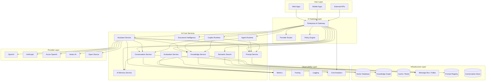

### 3.2 Layer Responsibilities

| Layer | Components | Responsibility |
| --- | --- | --- |
| User Layer | Web Apps, Mobile Apps, External APIs | User interaction and API consumption |
| AI Gateway Layer | Gateway, Provider Router, Policy Engine | Authentication, routing, policy enforcement, cost control |
| AI Core Services | 12 services | AI business logic: conversation, knowledge, prompts, search, agents |
| Infrastructure Layer | Vector DB, Knowledge Graph, Redis, Kafka | Data storage, caching, messaging |
| Provider Layer | OpenAI, Anthropic, Azure, Vertex, Open Source | Model inference abstraction |
| Observability Layer | Metrics, Tracing, Logging, Cost Analytics | AI performance monitoring and cost tracking |

### 3.3 Architecture Decisions Summary

| Decision | Choice | Rationale |
| --- | --- | --- |
| API Gateway Pattern | AI Gateway as central entry point | Single point for auth, routing, policy, and cost control |
| Microservice Decomposition | 12 AI microservices | Independent scaling, deployment, and team ownership |
| Provider Abstraction | Unified provider interface | Provider independence and future-proofing |
| Vector Database | Dedicated vector store for embeddings | Required for semantic search and RAG at scale |
| Message Bus | Kafka for all async AI communication | Integrates with existing platform infrastructure |
| Cache Layer | Redis for AI response caching | Reduces inference costs and latency |
| Observability | Prometheus + OpenTelemetry + structured logging | Consistent with platform observability standards |

---

## 4. AI Microservice Architecture

### 4.1 AI Gateway Service

**Purpose**: Central entry point for all AI operations. Authentication, routing, rate limiting, cost tracking.

**Responsibilities**:

- Authenticate and authorise every AI request
- Route requests to the appropriate AI core service
- Enforce rate limits per tenant, user, and API key
- Track cost per request for chargeback
- Cache responses where applicable
- Route provider selection based on policy

**REST APIs**:

- `POST /v1/ai/chat` → Routes to Conversation Service
- `POST /v1/ai/complete` → Routes to Assistant Service
- `POST /v1/ai/embed` → Routes to Knowledge Service
- `POST /v1/ai/search` → Routes to Semantic Search
- `GET /v1/ai/cost` → Cost analytics
- `GET /v1/ai/health` → Health check

**Kafka Events**:

- `ai.gateway.request` — Emitted for every AI request
- `ai.gateway.response` — Emitted with response metadata
- `ai.gateway.error` — Emitted on failure

**Dependencies**: identity-service, RBAC service, platform API gateway

**Scaling Strategy**: Stateless horizontal scaling behind load balancer. Auto-scaling based on request rate.

**Security**: JWT token validation, API key authentication, rate limiting, request validation.

**Deployment**: Docker container on ECS Fargate. 2+ AZs. Health check endpoint.

### 4.2 Assistant Service

**Purpose**: General-purpose AI assistant for chat, Q&A, and task completion across all platform domains.

**Responsibilities**:

- Process natural language user requests
- Route requests to appropriate domain context
- Orchestrate multi-step AI workflows
- Integrate with knowledge service for RAG
- Integrate with prompt service for prompt selection

**REST APIs**:

- `POST /v1/assistant/chat` — Single-turn Q&A
- `POST /v1/assistant/stream` — Streaming response
- `GET /v1/assistant/sessions/{id}` — Session history

**Kafka Events**:

- `assistant.query.received` — User query received
- `assistant.query.completed` — Response generated
- `assistant.feedback` — User feedback on response

**Dependencies**: AI Gateway, Conversation Service, Knowledge Service, Prompt Service, Provider Service

**Scaling Strategy**: Horizontally scalable. Instance count based on concurrent session load.

### 4.3 Conversation Service

**Purpose**: Manage multi-turn conversation state, history, and context across all AI interactions.

**Responsibilities**:

- Store and retrieve conversation history
- Manage context windows for LLM interactions
- Support conversation threading and branching
- Provide conversation analytics
- Handle conversation expiry and archival

**REST APIs**:

- `POST /v1/conversations` — Create conversation
- `GET /v1/conversations/{id}` — Get conversation
- `POST /v1/conversations/{id}/messages` — Add message
- `GET /v1/conversations/{id}/messages` — List messages
- `DELETE /v1/conversations/{id}` — Delete conversation

**Kafka Events**:

- `conversation.created` — New conversation started
- `conversation.message.added` — Message added
- `conversation.expired` — Conversation archived

**Dependencies**: AI Memory Service, Prompt Service

**Scaling Strategy**: Horizontally scalable. Session affinity optional. Data partitioned by tenant.

### 4.4 Knowledge Service

**Purpose**: Central service for knowledge ingestion, retrieval, and management across all platform domains.

**Responsibilities**:

- Ingest documents from all platform services
- Chunk and embed documents for vector search
- Maintain knowledge graph of entity relationships
- Provide retrieval APIs for RAG
- Handle content freshness and updates

**REST APIs**:

- `POST /v1/knowledge/documents` — Ingest document
- `POST /v1/knowledge/query` — Query knowledge base
- `GET /v1/knowledge/sources/{id}` — Get source details
- `DELETE /v1/knowledge/sources/{id}` — Remove source

**Kafka Events**:

- `knowledge.document.ingested` — Document processed
- `knowledge.document.updated` — Document refreshed
- `knowledge.document.deleted` — Document removed

**Dependencies**: Vector Platform, Content Service, domain services

**Scaling Strategy**: Horizontally scalable. Embedding generation is CPU/GPU intensive and may require dedicated instances.

### 4.5 Prompt Service

**Purpose**: Central registry for prompt templates with versioning, governance, and A/B testing.

**Responsibilities**:

- Store and version prompt templates
- Support prompt templating with variable injection
- Manage prompt approval workflow
- A/B test prompt variants
- Track prompt performance metrics

**REST APIs**:

- `POST /v1/prompts` — Create prompt template
- `GET /v1/prompts/{id}` — Get prompt template
- `PUT /v1/prompts/{id}/versions` — Create new version
- `POST /v1/prompts/{id}/render` — Render prompt with variables
- `GET /v1/prompts/{id}/performance` — Prompt metrics

**Kafka Events**:

- `prompt.created` — New prompt registered
- `prompt.version.created` — New version published
- `prompt.approved` — Prompt approved for production

**Dependencies**: None (standalone service with its own database)

**Scaling Strategy**: Horizontally scalable. Read-heavy workload. Caching for rendered prompts.

### 4.6 Semantic Search Service

**Purpose**: Natural language search across all platform content using vector embeddings.

**Responsibilities**:

- Accept natural language queries
- Generate query embeddings
- Perform vector similarity search
- Support hybrid search (vector + keyword)
- Re-rank results for relevance
- Filter results by permissions

**REST APIs**:

- `POST /v1/search` — Search across platform
- `POST /v1/search/hybrid` — Hybrid search
- `GET /v1/search/indices` — List search indices

**Kafka Events**:

- `search.query` — Search query executed
- `search.index.updated` — Search index refreshed

**Dependencies**: Vector Platform, Platform Search Service, RBAC Service

**Scaling Strategy**: Horizontally scalable. Vector search is CPU/memory intensive. Dedicated instances for production.

### 4.7 Provider Service

**Purpose**: Abstract AI provider API differences behind a unified interface with failover and load balancing.

**Responsibilities**:

- Abstract OpenAI, Anthropic, Azure OpenAI, Vertex AI, open-source models
- Handle provider authentication and API key management
- Implement retry with exponential backoff
- Provider failover based on availability
- Track provider latency and error rates

**REST APIs**:

- Internal only. Called by other AI services.

**Kafka Events**:

- `provider.request` — LLM request sent
- `provider.response` — LLM response received
- `provider.error` — Provider error
- `provider.failover` — Provider failover triggered

**Dependencies**: AI Gateway (for configuration), Secret Management (for API keys)

**Scaling Strategy**: Horizontally scalable. Connection pooling to provider APIs.

### 4.8 Evaluation Service

**Purpose**: Evaluate AI response quality, accuracy, safety, and performance.

**Responsibilities**:

- Score AI responses for quality
- Detect hallucinations
- Check for policy compliance
- Track response latency
- Generate evaluation reports

**REST APIs**:

- `POST /v1/evaluation/score` — Score an AI response
- `GET /v1/evaluation/reports` — Get evaluation reports
- `GET /v1/evaluation/metrics` — Get evaluation metrics

**Kafka Events**:

- `evaluation.completed` — Evaluation finished
- `evaluation.alert` — Quality threshold breached

**Dependencies**: AI Gateway, Monitoring Service

**Scaling Strategy**: Horizontally scalable. Asynchronous processing.

### 4.9 Document Intelligence Service

**Purpose**: Extract, classify, and structure information from documents across the platform.

**Responsibilities**:

- Extract text from documents (PDF, Word, HTML, Markdown)
- Classify documents by type, domain, and sensitivity
- Extract entities and relationships
- Generate document summaries
- Structure document metadata

**REST APIs**:

- `POST /v1/documents/extract` — Extract text
- `POST /v1/documents/classify` — Classify document
- `POST /v1/documents/summarize` — Generate summary

**Kafka Events**:

- `document.processed` — Document processed
- `document.classified` — Classification completed

**Dependencies**: Knowledge Service, Content Service

**Scaling Strategy**: Horizontally scalable. Document processing is CPU intensive.

### 4.10 AI Memory Service

**Purpose**: Store and retrieve AI agent and conversation memory for context-aware interactions.

**Responsibilities**:

- Store short-term and long-term memory
- Retrieve relevant memories for context
- Manage memory expiry and consolidation
- Support episodic, semantic, and procedural memory

**REST APIs**:

- `POST /v1/memory/store` — Store memory
- `POST /v1/memory/query` — Query relevant memories
- `DELETE /v1/memory/{id}` — Delete memory
- `GET /v1/memory/sessions/{id}` — Session memories

**Kafka Events**:

- `memory.stored` — Memory persisted
- `memory.consolidated` — Memory consolidated

**Dependencies**: Vector Database, Redis Cache

**Scaling Strategy**: Horizontally scalable. Memory partitioned by tenant and session.

### 4.11 Agent Runtime Service

**Purpose**: Execute autonomous AI agents that plan and execute multi-step tasks.

**Responsibilities**:

- Accept goals and break them into tasks
- Execute tasks using platform services
- Handle approval chains for sensitive actions
- Manage agent state and recovery
- Support agent scheduling and retries

**REST APIs**:

- `POST /v1/agents/execute` — Execute goal
- `GET /v1/agents/{id}/status` — Agent execution status
- `POST /v1/agents/{id}/cancel` — Cancel execution
- `GET /v1/agents/{id}/plan` — View execution plan

**Kafka Events**:

- `agent.execution.started` — Agent execution began
- `agent.task.completed` — Task completed
- `agent.execution.completed` — Goal achieved
- `agent.execution.failed` — Execution failed

**Dependencies**: Knowledge Service, Prompt Service, Conversation Service, Domain Services

**Scaling Strategy**: Horizontally scalable. Stateful — requires persistent storage for agent state.

### 4.12 AI Analytics Service

**Purpose**: Central analytics for AI platform usage, cost, performance, and quality.

**Responsibilities**:

- Aggregate AI usage metrics across all services
- Track cost per model, tenant, user, and feature
- Generate AI performance reports
- Monitor AI quality metrics
- Alert on cost anomalies

**REST APIs**:

- `GET /v1/ai-analytics/usage` — Usage statistics
- `GET /v1/ai-analytics/cost` — Cost breakdown
- `GET /v1/ai-analytics/performance` — Performance metrics
- `GET /v1/ai-analytics/alerts` — Active cost alerts

**Kafka Events**:

- `ai-analytics.usage.report` — Periodic usage report
- `ai-analytics.cost.alert` — Cost threshold breached

**Dependencies**: AI Gateway, Evaluation Service, Platform Analytics Service

**Scaling Strategy**: Horizontally scalable. Write-heavy. Time-series data partitioning.

---

## 5. Complete Service Interaction

### 5.1 Communication Patterns

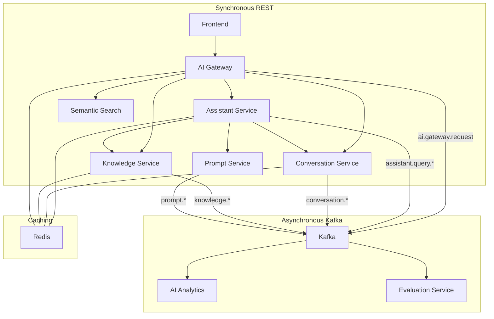

### 5.2 Retry Policies

| Service | Max Retries | Backoff | Circuit Breaker |
| --- | --- | --- | --- |
| AI Gateway | 3 | Exponential (100ms base) | Yes — 50% error rate |
| Assistant Service | 2 | Fixed (200ms) | Yes — 40% error rate |
| Provider Service | 3 | Exponential (500ms base) | Yes — 30% error rate |
| Knowledge Service | 2 | Fixed (100ms) | Yes — 50% error rate |
| Conversation Service | 1 | None | No |

### 5.3 Dead Letter Queues

Each Kafka consumer group has a corresponding DLQ topic:

| DLQ Topic | Consumers | Processing |
| --- | --- | --- |
| `ai.dlq.gateway` | AI Analytics | Log and alert |
| `ai.dlq.assistant` | AI Operations | Re-process with backoff |
| `ai.dlq.knowledge` | AI Operations | Manual inspection |
| `ai.dlq.provider` | AI Operations | Provider health check |

### 5.4 Timeouts

| Operation | Timeout | Fallback |
| --- | --- | --- |
| LLM Inference | 30s | Return cached response |
| Embedding Generation | 10s | Return degraded embedding |
| Knowledge Retrieval | 5s | Return empty context |
| Semantic Search | 5s | Return keyword-only results |
| Conversation History | 2s | Return empty history |

---

## 6. Enterprise AI Gateway

### 6.1 Gateway Architecture

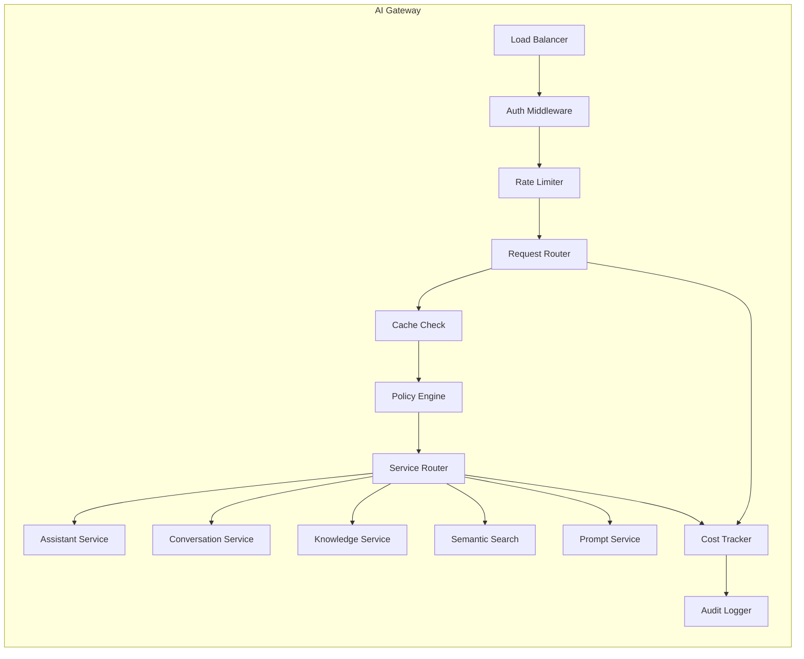

### 6.2 Authentication

- **JWT Bearer Tokens**: All AI requests carry a JWT from the identity service
- **API Keys**: Server-to-server AI requests use API keys managed by the gateway
- **Tenant Context**: Every request is tagged with tenant ID for isolation
- **User Context**: Every request includes user ID and role for permission enforcement

### 6.3 Authorization

- **Role-Based Access**: AI features are gated by user role (admin, manager, operator, viewer)
- **Scope-Based Access**: Fine-grained permissions per AI capability (chat, search, knowledge, agents)
- **Tenant Isolation**: Users can only access AI capabilities within their tenant
- **Service Authorization**: Inter-service AI calls require valid service-to-service tokens

### 6.4 Rate Limiting

| Scope | Limit | Burst | Consequence |
| --- | --- | --- | --- |
| Per Tenant | 100 req/min | 20 | 429 Too Many Requests |
| Per User | 30 req/min | 10 | 429 Too Many Requests |
| Per API Key | 500 req/min | 50 | 429 Too Many Requests |
| Per Model (GPT-4) | 10 req/min | 5 | Queue or degrade |

### 6.5 Provider Routing

- **Cost-Based Routing**: Route to cheapest provider that meets quality requirements
- **Latency-Based Routing**: Route to lowest-latency provider for real-time interactions
- **Model-Based Routing**: Route specific models to specific providers
- **Fallback Routing**: If primary provider fails, route to secondary provider
- **Weighted Routing**: Distribute load across providers based on configured weights

### 6.6 Prompt Routing

- **Domain Routing**: Route prompts to domain-specific prompt templates
- **Intent Routing**: Classify user intent and route to appropriate prompt
- **Model Routing**: Route specific prompts to specific models based on prompt requirements

### 6.7 Observability

| Metric | Source | Destination |
| --- | --- | --- |
| Request count | AI Gateway | Prometheus |
| Request latency | AI Gateway | Prometheus |
| Error rate | AI Gateway | Prometheus |
| Cost per request | AI Gateway | Cost Analytics |
| Cache hit rate | Redis | Prometheus |
| Rate limit hits | AI Gateway | Prometheus |

### 6.8 Caching Strategy

| Cache Type | TTL | Invalidation |
| --- | --- | --- |
| Response Cache | 1 hour | On content update |
| Embedding Cache | 24 hours | On model change |
| Auth Token Cache | 5 minutes | On expiry |
| Rate Limit State | 1 minute | Automatic |

### 6.9 Cost Control

- **Budget Enforcement**: Per-tenant and per-feature budget caps
- **Model Selection**: Route to cheaper models for non-critical queries
- **Cache Optimization**: Maximise cache hits to reduce inference calls
- **Prompt Compression**: Optimise prompt length to reduce token usage
- **Response Streaming**: Stream responses to reduce perceived latency

---

## 7. Enterprise Prompt Platform

### 7.1 Prompt Registry

The Prompt Registry is a versioned, governable repository of all AI prompt templates used across the platform.

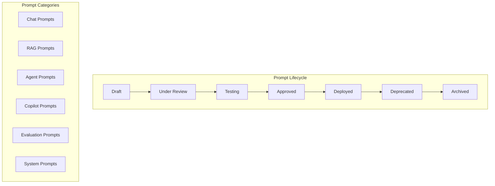

### 7.2 Prompt Versioning

- **Semantic Versioning**: Major.Minor.Patch for prompt changes
- **Version History**: Every prompt change is recorded with author, timestamp, and change reason
- **Version Comparison**: Diff tool for comparing prompt versions
- **Environment Pinning**: Different versions can be deployed to dev, staging, and production

### 7.3 Prompt Approval Workflow

1. Author creates or edits prompt template
2. Prompt enters "Under Review" state
3. Reviewer validates prompt for accuracy, safety, and performance
4. Prompt enters "Testing" state with canary deployment
5. Performance metrics are collected and evaluated
6. Prompt is approved and deployed to production
7. Prompt enters "Deprecated" state when superseded

### 7.4 Prompt Security

- **Variable Injection Validation**: Runtime variables are validated for injection attacks
- **Output Sanitisation**: All AI outputs are sanitised for XSS and injection
- **PII Detection**: Prompts are scanned for PII before sending to providers
- **Prompt Injection Detection**: User input is scanned for prompt injection attempts
- **Rate Limiting**: Prompt rendering is rate-limited per user

### 7.5 Prompt Templates

Each prompt template includes:

- **System Message**: The system-level instruction to the LLM
- **User Template**: Template for user input with variable placeholders
- **Context Template**: Template for RAG context insertion
- **Output Schema**: Expected output format (JSON schema for structured outputs)
- **Example Registry**: Few-shot examples for in-context learning

### 7.6 Prompt Analytics

| Metric | Source | Purpose |
| --- | --- | --- |
| Token count per prompt | Prompt Service | Cost tracking |
| Response quality score | Evaluation Service | Quality monitoring |
| Latency per prompt | Prompt Service | Performance monitoring |
| Error rate per prompt | AI Gateway | Reliability monitoring |
| A/B test results | Prompt Service | Version comparison |

---

## 8. Knowledge Platform

### 8.1 Knowledge Repository

The Knowledge Platform aggregates content from all platform services into a unified, searchable, AI-consumable knowledge base.

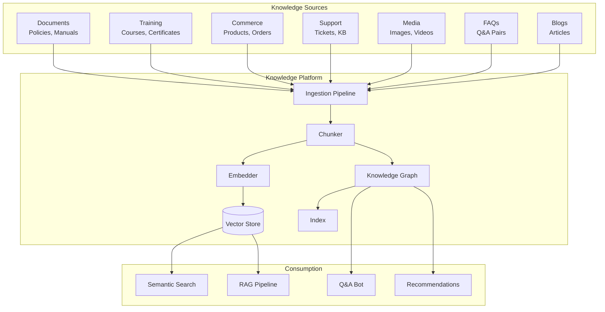

### 8.2 Ingestion Pipeline

- **Pull-Based**: Knowledge Service pulls content from each domain service on a schedule
- **Event-Based**: Domain services emit events when content changes, triggering re-ingestion
- **Full Sync**: Periodic full re-index to catch any missed changes
- **Freshness Tracking**: Each document tracks its last ingestion time and source version

### 8.3 Document Processing

| Step | Description | Technology |
| --- | --- | --- |
| Extraction | Parse document format | Apache Tika / Custom parser |
| Cleaning | Remove formatting, extract text | Custom pipeline |
| Chunking | Split into semantic chunks | Token-based + semantic boundaries |
| Embedding | Generate vector embeddings | Provider abstraction layer |
| Indexing | Store in vector database | Qdrant / Weaviate / pgvector |
| Graph Extraction | Extract entities and relationships | LLM-based extraction |

### 8.4 Enterprise Knowledge Graph

The knowledge graph connects entities across all platform domains:

- **Products** → Categories, Suppliers, Orders, Certifications
- **Users** → Roles, Training, Orders, Tickets, Certificates
- **Courses** → Modules, Certificates, Enrollments, Instructors
- **Orders** → Products, Customers, Payments, Fulfillment
- **Policies** → Compliance Requirements, Risk Categories
- **Tickets** → Products, Users, Categories, Resolutions

### 8.5 Content Freshness

| Content Type | Re-index Frequency | Trigger |
| --- | --- | --- |
| Product Catalog | Real-time | Product update event |
| Training Content | Hourly | Course change event |
| Support Tickets | Real-time | Ticket update event |
| Policies | Daily | Scheduled sync |
| FAQ | Daily | Scheduled sync |
| Media | Weekly | Scheduled sync |

---

## 9. Enterprise Vector Platform

### 9.1 Vector Platform Architecture

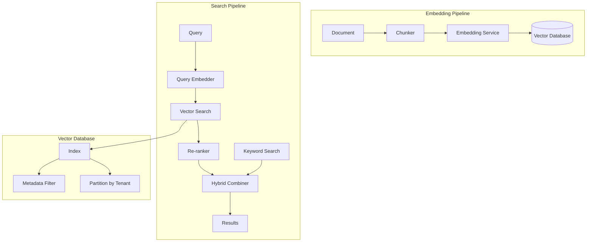

### 9.2 Embedding Strategy

| Content Type | Embedding Model | Dimensions | Chunk Size |
| --- | --- | --- | --- |
| Short text (< 512 tokens) | text-embedding-3-small | 1536 | Full text |
| Documents | text-embedding-3-large | 3072 | 512 tokens with 128 overlap |
| Code | code-embedding | 1536 | Function/method level |
| Images | CLIP | 512 | Full image |
| Multi-lingual | multilingual-e5 | 1024 | 256 tokens |

### 9.3 Vector Database Selection

| Criterion | Requirement |
| --- | --- |
| Query latency | < 50ms for p99 |
| Throughput | 10,000 queries/second |
| Index type | HNSW for ANN search |
| Filtering | Metadata filtering for tenant isolation |
| Hybrid search | Vector + keyword (BM25) |
| Scalability | Horizontal sharding |
| Cloud-native | Managed service or Kubernetes deployment |
| Cost | $0.10/GB/month storage |

**Recommended**: Qdrant (self-hosted on Kubernetes) or pgvector (for simpler deployments with existing PostgreSQL).

### 9.4 Hybrid Search Strategy

- **Vector Search**: Semantic similarity for understanding intent
- **Keyword Search**: BM25 for exact term matching
- **Hybrid Fusion**: Reciprocal Rank Fusion to combine results
- **Re-ranking**: Cross-encoder model for final relevance ranking
- **Result Diversity**: MMR (Maximum Marginal Relevance) to ensure diverse results

### 9.5 Multi-Language Support

- **Detection**: Language detection at query time
- **Embedding**: Multi-lingual embedding models for cross-language search
- **Translation**: Optional query translation for high-precision search
- **Tokenization**: Language-aware tokenization for chunking

---

## 10. Conversation Platform

### 10.1 Conversation Platform Architecture

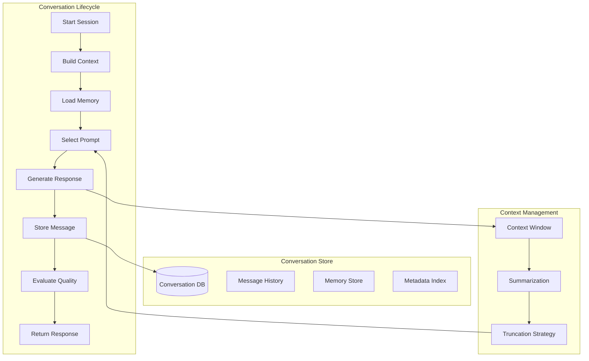

### 10.2 Conversation Storage

- **Database**: PostgreSQL for conversation metadata and message store
- **Partitioning**: Partitioned by tenant and date for query performance
- **Retention**: 90 days active, 1 year warm, 7 years cold archive
- **Encryption**: All conversation data encrypted at rest and in transit
- **Backup**: Daily snapshots with 30-day retention

### 10.3 Memory Architecture

| Memory Type | Description | Retention | Storage |
| --- | --- | --- | --- |
| Episodic | Specific conversation events | Session | Vector + PostgreSQL |
| Semantic | Facts learned from interactions | 30 days | Vector Database |
| Procedural | How to perform tasks | Permanent | Knowledge Graph |
| Working | Current conversation context | Session | Redis |

### 10.4 Context Window Management

- **Token Budget**: Configurable per model (default: 80% of model context window)
- **Compression**: Summarise older messages to free context space
- **Sliding Window**: Keep last N messages, summarise the rest
- **Priority Retention**: System messages and recent user messages retained first

### 10.5 Conversation Analytics

| Metric | Source | Purpose |
| --- | --- | --- |
| Active conversations | Conversation Service | Usage tracking |
| Average conversation length | Conversation Service | Engagement |
| Message latency | Conversation Service | Performance |
| Topic distribution | Conversation Service | Feature adoption |
| User satisfaction | Evaluation Service | Quality monitoring |
| Conversation drop-off | Conversation Service | UX optimization |

---

## 11. Enterprise Agent Platform

### 11.1 Agent Architecture

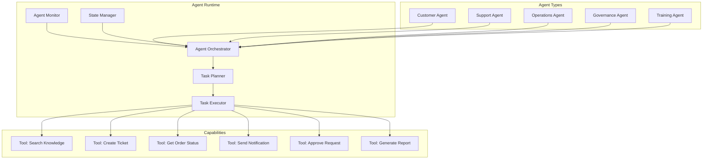

### 11.2 Agent Types

| Agent | Domain | Capabilities | Approval Required |
| --- | --- | --- | --- |
| Customer Agent | Customer Service | Answer questions, track orders, update profile | No |
| Support Agent | Technical Support | Diagnose issues, create tickets, escalate | No |
| Operations Agent | Platform Operations | Monitor alerts, restart services, scale resources | Yes |
| Governance Agent | Compliance | Detect violations, generate reports, flag risks | Yes |
| Training Agent | Learning | Recommend courses, track progress, assess skills | No |

### 11.3 Task Planning

- **Goal Decomposition**: Break user goal into sub-tasks
- **Dependency Resolution**: Identify task dependencies for ordering
- **Parallel Execution**: Execute independent tasks concurrently
- **Re-planning**: Adjust plan when tasks fail or new context emerges

### 11.4 Approval Chains

| Action | Approval Required | Approver |
| --- | --- | --- |
| Read data | No | — |
| Create support ticket | No | — |
| Update order status | Yes | Support Manager |
| Cancel order | Yes | Operations Manager |
| Modify user permissions | Yes | Administrator |
| Execute financial operation | Yes | Finance Manager |
| Deploy infrastructure change | Yes | Operations Lead |

### 11.5 Agent Recovery

- **State Persistence**: Agent state persisted to PostgreSQL after every step
- **Retry Policy**: 3 retries with exponential backoff for failed tasks
- **Dead Letter Queue**: Failed agent executions sent to DLQ for manual review
- **Timeout Handling**: Agents that exceed time budget are paused and escalated
- **Graceful Degradation**: If non-critical tasks fail, continue with remaining tasks

### 11.6 Agent Registry

All agent capabilities are registered in a central Agent Registry:

```yaml
agent:
  name: support-agent
  version: 1.0.0
  capabilities:
    - search_knowledge_base
    - create_ticket
    - get_order_status
    - escalate_to_human
  models:
    primary: gpt-4o
    fallback: gpt-4o-mini
  limits:
    max_tasks_per_execution: 10
    max_runtime_minutes: 30
  approval_required: false
```

---

## 12. Enterprise Copilot Architecture

### 12.1 Copilot Framework

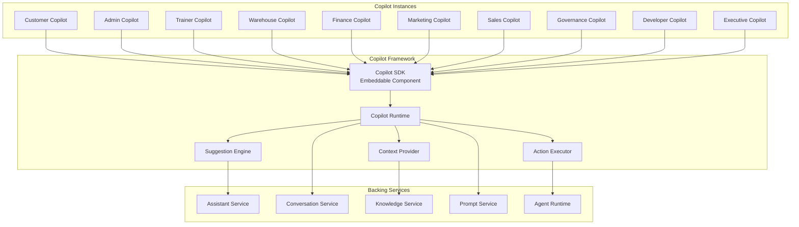

### 12.2 Customer Copilot

- **Domain**: E-commerce, order management, support
- **Capabilities**: Product recommendations, order tracking, FAQ answers, return initiation
- **Knowledge**: Product catalog, order history, support tickets, FAQ
- **UI**: Chat widget in web-app and mobile

### 12.3 Admin Copilot

- **Domain**: Platform administration, user management, configuration
- **Capabilities**: User lookup, permission management, configuration help, audit queries
- **Knowledge**: Admin documentation, configuration reference, audit logs
- **UI**: Chat panel in admin dashboard

### 12.4 Trainer Copilot

- **Domain**: Training and learning management
- **Capabilities**: Course creation assistance, learner progress analysis, content recommendations
- **Knowledge**: Course library, learner data, training analytics
- **UI**: Chat panel in training workspace

### 12.5 Warehouse Copilot

- **Domain**: Inventory management, warehouse operations
- **Capabilities**: Stock queries, reorder suggestions, inventory analytics, shipment tracking
- **Knowledge**: Inventory data, warehouse documentation, logistics reference
- **UI**: Chat panel in inventory dashboard

### 12.6 Finance Copilot

- **Domain**: Financial operations, payments, invoicing
- **Capabilities**: Transaction queries, payment reconciliation assistance, financial report generation
- **Knowledge**: Financial data, payment history, accounting policies
- **UI**: Chat panel in finance dashboard

### 12.7 Marketing Copilot

- **Domain**: Marketing campaigns, content, analytics
- **Capabilities**: Campaign performance analysis, content suggestions, audience insights
- **Knowledge**: Marketing analytics, campaign data, content library
- **UI**: Chat panel in marketing dashboard

### 12.8 Sales Copilot

- **Domain**: Sales operations, pipeline management
- **Capabilities**: Lead insights, sales forecasting, proposal assistance
- **Knowledge**: Sales data, product catalog, pricing reference
- **UI**: Chat panel in sales dashboard

### 12.9 Governance Copilot

- **Domain**: Compliance, policy, risk management
- **Capabilities**: Policy queries, compliance status, risk assessment assistance
- **Knowledge**: Policy library, compliance records, risk register
- **UI**: Chat panel in governance dashboard

### 12.10 Developer Copilot

- **Domain**: Platform engineering, API documentation
- **Capabilities**: API reference queries, code generation, documentation assistance
- **Knowledge**: API contracts, developer documentation, code patterns
- **UI**: Chat panel in developer portal

### 12.11 Executive Copilot

- **Domain**: Business intelligence, strategic decisions
- **Capabilities**: KPI queries, trend analysis, report generation, what-if analysis
- **Knowledge**: Platform analytics, business metrics, strategic documents
- **UI**: Chat panel in executive dashboard

---

## 13. AI Security Architecture

### 13.1 Security Architecture Overview

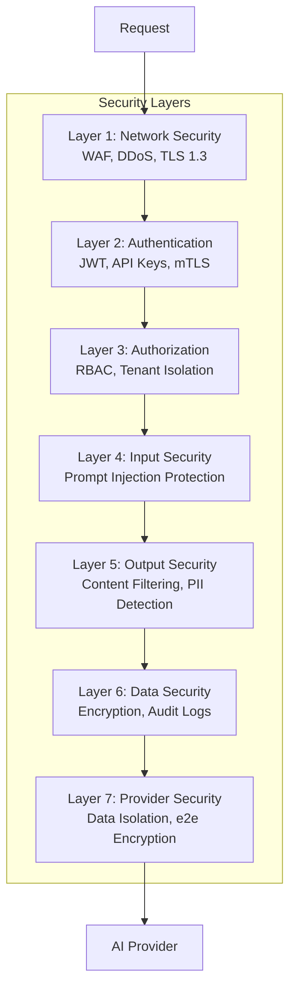

### 13.2 Prompt Injection Protection

| Protection | Method | Implementation |
| --- | --- | --- |
| Input Sanitisation | Strip control characters and injection patterns | Gateway middleware |
| Instruction Boundary | Clear separation of system and user prompts | Prompt template design |
| Role Enforcement | System role cannot be overridden by user | Provider API configuration |
| Anomaly Detection | ML-based detection of injection attempts | Evaluation Service |
| Rate Limiting | Aggressive rate limiting on failure patterns | AI Gateway |

### 13.3 Jailbreak Protection

- **Pattern Detection**: Regular expression and ML-based jailbreak pattern detection
- **Prompt Red-Teaming**: Automated red-teaming of prompts during testing
- **Continuous Monitoring**: Evaluation service monitors for jailbreak attempts
- **Provider Security Features**: Use provider-level content moderation APIs

### 13.4 Content Filtering

| Category | Action | Escalation |
| --- | --- | --- |
| Hate speech | Block response | Log and alert |
| Violence | Block response | Log and alert |
| Sexual content | Block response | Log |
| Personal information | Redact | Log and alert |
| Security credentials | Block response | Critical alert |
| Competitor mentions | Flag for review | Log |

### 13.5 PII Protection

- **Detection**: Regex and ML-based PII detection on both input and output
- **Redaction**: PII is redacted before sending to provider
- **Masking**: Sensitive data is masked in logs and analytics
- **GDPR Compliance**: Data residency enforcement per tenant configuration
- **Consent Management**: PII usage requires explicit user consent

### 13.6 Data Isolation

| Type | Isolation Mechanism |
| --- | --- |
| Tenant Data | Database-level partitioning, vector index partitioning |
| Tenant Models | Separate model deployments per tenant (if required) |
| Tenant Context | Tenant ID in every request context |
| Tenant Audit | Separate audit log partition per tenant |
| Tenant Encryption | Per-tenant encryption keys |

### 13.7 Audit Logs

Every AI operation produces an immutable audit record:

```json
{
  "auditId": "uuid",
  "timestamp": "2026-07-21T12:00:00Z",
  "tenantId": "tenant-123",
  "userId": "user-456",
  "operation": "chat.completion",
  "model": "gpt-4o",
  "provider": "openai",
  "inputTokens": 150,
  "outputTokens": 200,
  "cost": 0.0035,
  "responseId": "provider-resp-789",
  "policyResult": "pass"
}
```

### 13.8 Zero Trust Architecture

- **Verify Every Request**: Every AI request is authenticated and authorised
- **Least Privilege**: AI services only have access to data they need
- **Micro-segmentation**: AI services are isolated in their own network segments
- **Continuous Validation**: Sessions are validated on every request, not cached
- **Assume Breach**: Security controls assume the attacker is already inside the network

---

## 14. Enterprise AI Observability

### 14.1 Observability Architecture

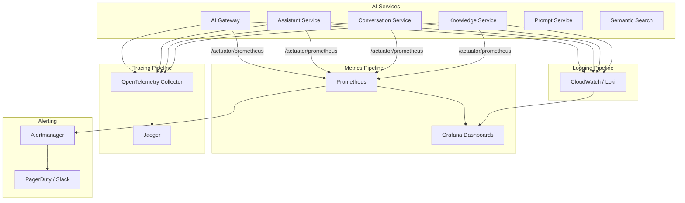

### 14.2 Key Metrics

| Category | Metric | Source | Threshold |
| --- | --- | --- | --- |
| Gateway | Request rate | AI Gateway | < 10K req/min |
| Gateway | Latency p50/p95/p99 | AI Gateway | < 500ms / < 2s / < 5s |
| Gateway | Error rate | AI Gateway | < 1% |
| LLM | Inference latency | Provider Service | < 2s p95 |
| LLM | Token usage per request | Provider Service | Monitor trend |
| Knowledge | Retrieval latency | Knowledge Service | < 100ms p95 |
| Knowledge | Chunk count per query | Knowledge Service | Monitor trend |
| Search | Query latency | Semantic Search | < 200ms p95 |
| Search | Result count | Semantic Search | > 3 results |
| Cost | Cost per tenant | AI Analytics | Per budget |
| Quality | Hallucination rate | Evaluation Service | < 5% |
| Quality | User satisfaction | Evaluation Service | > 4/5 |

### 14.3 Distributed Tracing

- **Trace Propagation**: W3C Trace Context headers propagated across all AI services
- **Span Attributes**: Tenant ID, user ID, model name, token count, cost
- **Sampling**: 100% for errors, 10% for successful requests
- **Storage**: Jaeger with 7-day retention

### 14.4 Evaluation Pipeline

| Evaluation Type | Trigger | Method |
| --- | --- | --- |
| Response quality | Every response | LLM-based scoring |
| Hallucination detection | Every response | Fact-check against knowledge base |
| Policy compliance | Every response | Rule-based + LLM-based |
| Latency measurement | Every request | Automated timing |
| A/B comparison | A/B test period | Statistical analysis |

### 14.5 Hallucination Tracking

- **Detection**: Fact-check AI responses against retrieved knowledge
- **Scoring**: Confidence score for every factual claim
- **Alerting**: Alert when hallucination rate exceeds threshold
- **Dashboard**: Hallucination rate by model, prompt, tenant, and time
- **Root Cause Analysis**: Correlate hallucinations with specific prompts and knowledge gaps

---

## 15. Enterprise AI Cost Architecture

### 15.1 Cost Architecture Overview

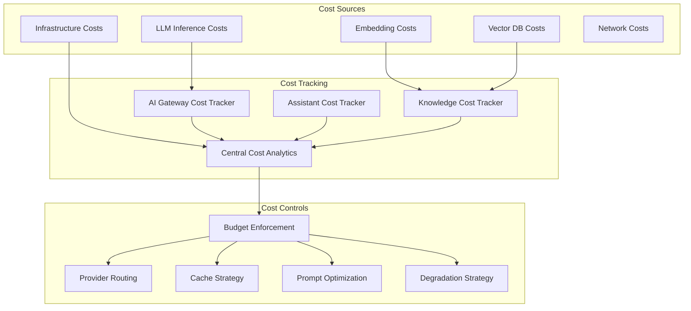

### 15.2 Model Cost Tracking

| Model | Provider | Cost per 1K Input Tokens | Cost per 1K Output Tokens |
| --- | --- | --- | --- |
| GPT-4o | OpenAI | $0.0025 | $0.0100 |
| GPT-4o-mini | OpenAI | $0.00015 | $0.0006 |
| Claude 3.5 Sonnet | Anthropic | $0.0030 | $0.0150 |
| Claude 3 Haiku | Anthropic | $0.00025 | $0.00125 |
| Gemini 1.5 Pro | Vertex AI | $0.00125 | $0.0050 |
| Gemini 1.5 Flash | Vertex AI | $0.000075 | $0.0003 |

### 15.3 Cache Strategy

| Cache Layer | TTL | Est. Savings |
| --- | --- | --- |
| Response Cache | 1 hour | 30% |
| Embedding Cache | 24 hours | 40% |
| Search Result Cache | 5 minutes | 20% |
| Similar Question Cache | 1 hour | 15% |
| **Total** | | **60%+** |

### 15.4 Prompt Optimization

| Technique | Savings | Complexity |
| --- | --- | --- |
| Prompt compression | 30% token reduction | Low |
| Few-shot example selection | 20% token reduction | Medium |
| Dynamic context window | 25% token reduction | Medium |
| Intent-based model selection | 50% cost reduction | High |
| Batch processing | 30% cost reduction | Medium |

### 15.5 Provider Routing Strategy

| Scenario | Primary Provider | Fallback Provider |
| --- | --- | --- |
| Real-time chat | GPT-4o-mini | Claude 3 Haiku |
| Complex reasoning | GPT-4o | Claude 3.5 Sonnet |
| Document analysis | Gemini 1.5 Pro | GPT-4o |
| Embeddings | text-embedding-3-small | — |
| Batch processing | Gemini 1.5 Flash | GPT-4o-mini |

### 15.6 Budget Enforcement

- **Hard Caps**: Request rejected when budget exceeded
- **Soft Caps**: Degradation to cheaper model when budget warning triggered
- **Per-Tenant Budget**: Configurable budget per enterprise tenant
- **Per-Feature Budget**: Separate budgets for chat, search, agents, copilots
- **Auto-Top-Up**: Automatic budget increase with approval workflow

### 15.7 Chargeback

- **Per-Tenant Attribution**: All costs attributed to specific tenant
- **Per-User Attribution**: Costs attributed to specific user
- **Per-Feature Attribution**: Costs attributed to specific AI feature
- **Billing Integration**: Cost data exported to billing system
- **Cost Dashboard**: Real-time cost visibility for tenant administrators

### 15.8 Cost Forecasting

- **Trend Analysis**: ML-based forecasting of AI costs
- **Growth Modeling**: Model cost growth based on user adoption
- **Alerting**: Alert when forecast exceeds budget
- **Capacity Planning**: Cost projections for infrastructure scaling

---

## 16. Deployment Architecture

### 16.1 Deployment Architecture Overview

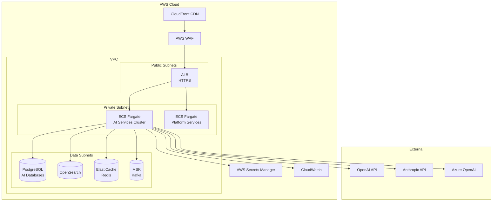

### 16.2 Container Strategy

- **Base Image**: eclipse-temurin:21-jre for Java services
- **Python Services**: python:3.12-slim for embedding and evaluation services
- **Multi-Stage Build**: Build in separate stage, runtime in minimal image
- **Image Scanning**: Trivy scan in CI pipeline before ECR push
- **Tagging**: git-sha + semantic version tag

### 16.3 Orchestration

| Component | Platform | Rationale |
| --- | --- | --- |
| AI Services | ECS Fargate | Consistent with existing platform |
| Vector Database | Self-hosted on ECS / Amazon OpenSearch | Performance and cost control |
| Redis | ElastiCache | Managed, high availability |
| Kafka | MSK (Managed Streaming for Kafka) | Managed, durable |
| PostgreSQL | RDS (or Supabase for compatible services) | Managed |

### 16.4 Scaling Strategy

| Service | Min Instances | Max Instances | Scale Trigger |
| --- | --- | --- | --- |
| AI Gateway | 2 | 10 | CPU > 70%, request rate |
| Assistant Service | 2 | 20 | Concurrent sessions |
| Conversation Service | 2 | 15 | Active conversations |
| Knowledge Service | 2 | 10 | Queue depth |
| Prompt Service | 2 | 5 | Request rate |
| Semantic Search | 2 | 15 | Query rate |
| Provider Service | 2 | 10 | Inference queue |
| Agent Runtime | 2 | 10 | Active agents |
| Evaluation Service | 1 | 5 | Queue depth |
| AI Analytics | 1 | 3 | Data volume |

### 16.5 Load Balancing

- **AI Gateway**: Application Load Balancer with path-based routing
- **Internal Services**: Service mesh (App Mesh) for inter-service communication
- **Session Affinity**: Not required — services are stateless
- **Health Checks**: `/actuator/health` for all services

### 16.6 Service Discovery

- **DNS-Based**: Service names registered in private Route53 hosted zone
- **Pattern**: `{service-name}.ai.sporekart.internal`
- **Example**: `gateway.ai.sporekart.internal`, `assistant.ai.sporekart.internal`

### 16.7 Blue-Green Deployment

1. Deploy new version to green (inactive) target group
2. Run smoke tests against green target group
3. Switch ALB to route traffic to green target group
4. Monitor metrics for 15 minutes
5. If successful, terminate blue target group
6. If failed, switch back to blue target group

### 16.8 Canary Deployment

1. Deploy new version to 10% of instances
2. Route 10% of traffic to new version
3. Monitor error rate, latency, and cost metrics
4. Increment to 25%, 50%, 100% if metrics pass
5. Rollback if error rate increases by > 1%

### 16.9 Disaster Recovery

| Scenario | RTO | RPO | Recovery Strategy |
| --- | --- | --- | --- |
| Single service failure | 5 min | 0 | Auto-scaling replaces instance |
| AZ failure | 15 min | 0 | Multi-AZ deployment |
| Region failure | 1 hour | 5 min | Multi-region (Phase 18+) |
| Provider API failure | 1 min | 0 | Automatic provider failover |
| Data corruption | 30 min | 5 min | PITR from database backup |

### 16.10 Multi-Region Strategy (Phase 18+)

- **Active-Passive**: Primary region handles all traffic, secondary region on standby
- **Data Replication**: Cross-region database replication
- **DNS Failover**: Route53 health-check-based DNS failover
- **Configuration**: AWS Systems Manager Parameter Store for region-specific config

---

## 17. Event Driven AI Architecture

### 17.1 Event Flow Architecture

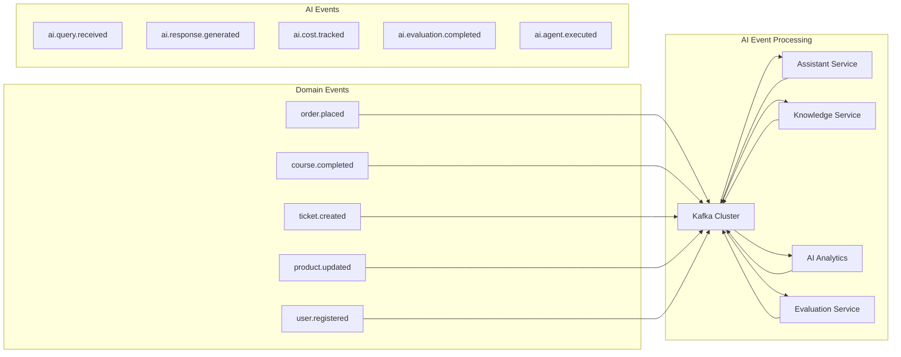

### 17.2 Kafka Topics

| Topic | Partitions | Retention | Producers | Consumers |
| --- | --- | --- | --- | --- |
| `ai.gateway.request` | 6 | 7 days | AI Gateway | AI Analytics, Evaluation |
| `ai.gateway.response` | 6 | 7 days | AI Gateway | AI Analytics |
| `ai.gateway.error` | 3 | 30 days | AI Gateway | AI Operations |
| `ai.assistant.query` | 6 | 7 days | Assistant Service | AI Analytics, Evaluation |
| `ai.assistant.response` | 6 | 7 days | Assistant Service | AI Analytics, Conversation |
| `ai.conversation.event` | 6 | 7 days | Conversation Service | AI Analytics |
| `ai.knowledge.ingest` | 3 | 30 days | Domain Services | Knowledge Service |
| `ai.knowledge.event` | 6 | 7 days | Knowledge Service | AI Analytics, Semantic Search |
| `ai.prompt.event` | 3 | 30 days | Prompt Service | AI Analytics |
| `ai.provider.request` | 6 | 7 days | Provider Service | AI Analytics |
| `ai.provider.response` | 6 | 7 days | Provider Service | AI Analytics, Evaluation |
| `ai.provider.error` | 3 | 30 days | Provider Service | AI Operations |
| `ai.agent.execution` | 6 | 7 days | Agent Runtime | AI Analytics |
| `ai.evaluation.result` | 3 | 30 days | Evaluation Service | AI Analytics, AI Operations |
| `ai.analytics.metric` | 3 | 90 days | AI Analytics | Monitoring |
| `ai.dlq.gateway` | 1 | 90 days | AI Gateway | AI Operations |
| `ai.dlq.assistant` | 1 | 90 days | Assistant Service | AI Operations |
| `ai.dlq.provider` | 1 | 90 days | Provider Service | AI Operations |

### 17.3 Event Schema

Every event follows a standard schema:

```json
{
  "eventId": "uuid",
  "eventType": "ai.assistant.query.received",
  "eventVersion": "1.0.0",
  "occurredAt": "2026-07-21T12:00:00Z",
  "producerService": "assistant-service",
  "tenantId": "tenant-123",
  "userId": "user-456",
  "correlationId": "corr-789",
  "causationId": "cause-012",
  "data": {}
}
```

### 17.4 Idempotency

- **Event IDempotency**: Events are idempotent via eventId deduplication
- **Processing Idempotency**: Event processors check for duplicate eventId before processing
- **Kafka Idempotence**: Producer idempotence enabled for exactly-once semantics
- **Outbox Pattern**: Database transactions include event emission to ensure atomicity

### 17.5 Outbox Pattern

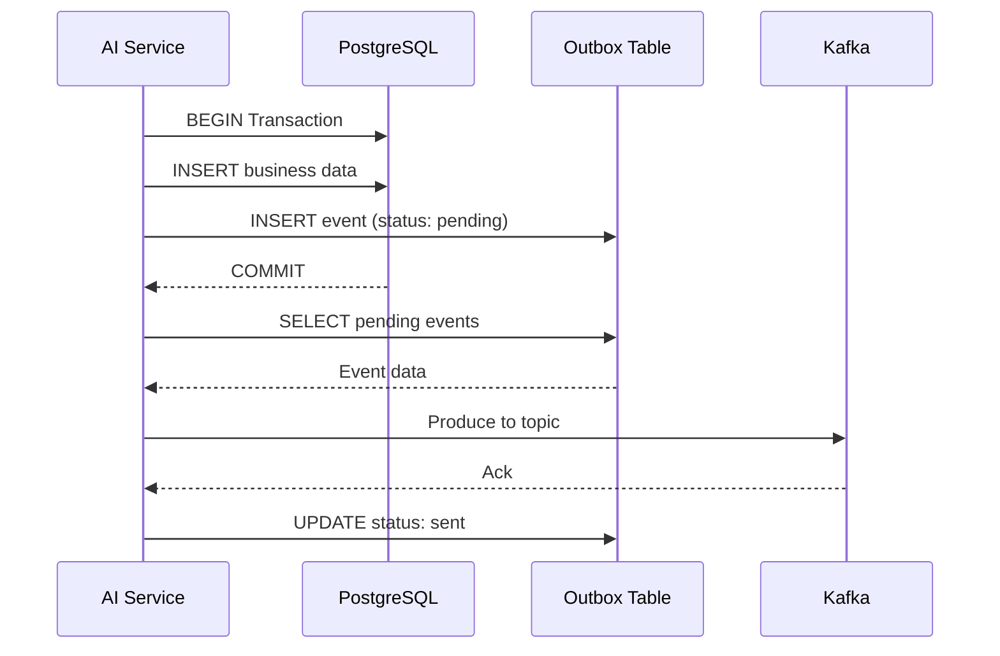

---

## 18. Data Flow Diagrams

### 18.1 User to AI Flow

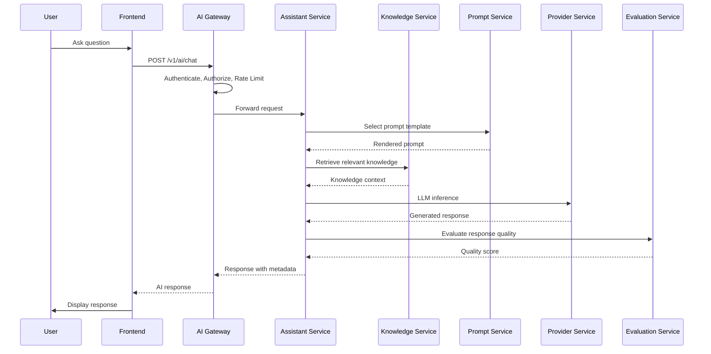

### 18.2 Knowledge Ingestion Flow

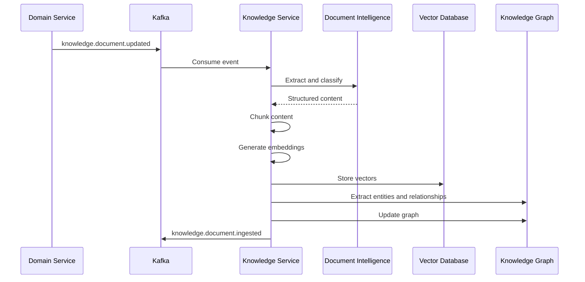

### 18.3 Prompt Flow

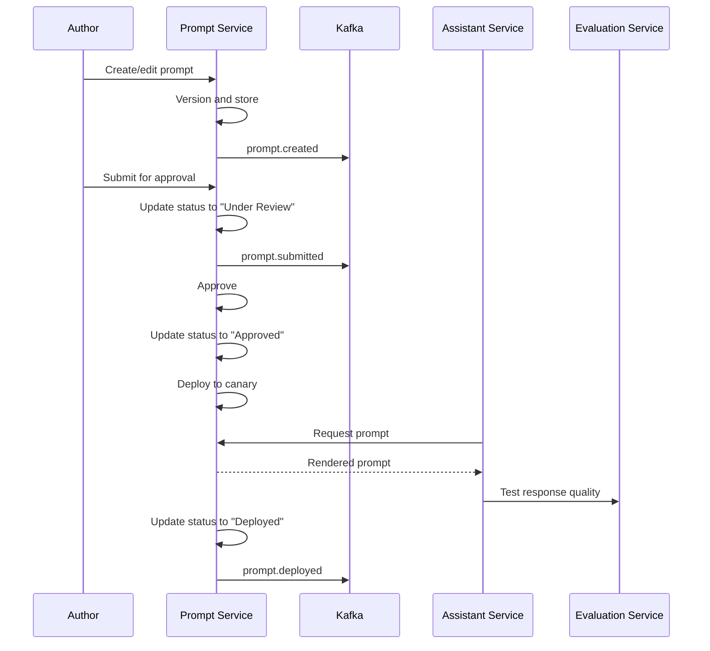

### 18.4 Conversation Flow

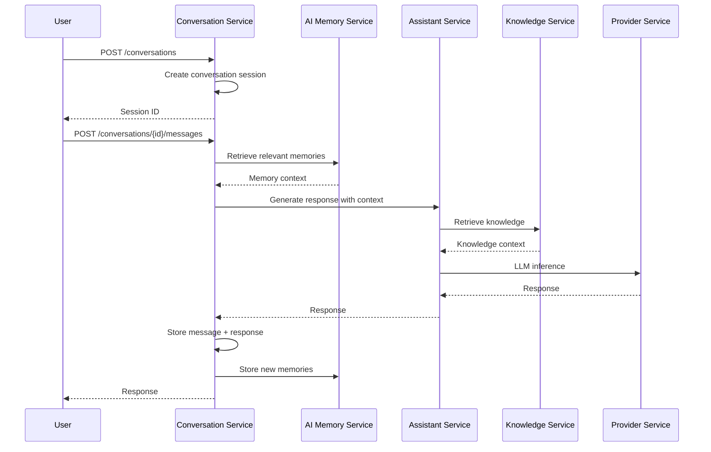

### 18.5 Embedding Flow

```mermaid
sequenceDiagram
  participant SRC as Content Source
  participant KS as Knowledge Service
  participant EMB as Embedding Service
  participant VD as Vector Database

  SRC->>KS: Document or text
  KS->>KS: Validate and clean
  KS->>KS: Chunk into segments
  KS->>EMB: Generate embeddings
  EMB->>PR: LLM embedding API
  PR-->>EMB: Embedding vectors
  EMB-->>KS: Vectors + metadata
  KS->>VD: Upsert vectors with metadata
  VD-->>KS: Confirmation
  KS->>KS: Update index metadata
```

### 18.6 Provider Flow

```mermaid
sequenceDiagram
  participant SVC as AI Service
  participant PR as Provider Service
  participant OAI as OpenAI
  participant ANT as Anthropic
  participant AZ as Azure OpenAI

  SVC->>PR: LLM inference request
  PR->>PR: Check provider health
  PR->>PR: Select primary provider
  PR->>OAI: API call

  alt Success
    OAI-->>PR: Response
    PR-->>SVC: Response
  else Rate Limit
    OAI-->>PR: 429
    PR->>ANT: Fallback call
    ANT-->>PR: Response
    PR-->>SVC: Response (with fallback flag)
  else Error
    OAI-->>PR: 5xx
    PR->>AZ: Fallback call
    AZ-->>PR: Response
    PR-->>SVC: Response (with fallback flag)
  end
```

### 18.7 Copilot Flow

```mermaid
sequenceDiagram
  participant U as User
  participant COP as Copilot SDK
  participant CTX as Context Provider
  participant AS as Assistant Service
  participant KS as Knowledge Service
  participant AR as Agent Runtime

  U->>COP: Open copilot
  COP->>CTX: Get context (page, role, permissions)
  CTX-->>COP: Context data
  COP->>AS: Suggest actions based on context
  AS-->>COP: Contextual suggestions
  COP->>U: Display suggestions

  U->>COP: Click suggestion
  COP->>AS: Execute suggestion
  AS->>KS: Retrieve knowledge
  KS-->>AS: Knowledge
  alt Simple action
    AS-->>COP: Direct response
    COP->>U: Display result
  else Complex action
    AS->>AR: Execute multi-step action
    AR-->>AS: Action result
    AS-->>COP: Response with action result
    COP->>U: Display result
  end
```

### 18.8 Agent Flow

```mermaid
sequenceDiagram
  participant U as User
  participant AR as Agent Runtime
  participant PLAN as Task Planner
  participant EXEC as Task Executor
  participant TOOL as Tool Registry
  participant KS as Knowledge Service
  participant APR as Approval Service

  U->>AR: Execute goal
  AR->>PLAN: Decompose goal
  PLAN-->>AR: Task plan

  loop For each task
    AR->>EXEC: Execute task
    EXEC->>TOOL: Find tool for task
    TOOL-->>EXEC: Tool handler
    EXEC->>KS: Retrieve knowledge
    KS-->>EXEC: Context

    alt Requires Approval
      EXEC->>APR: Request approval
      APR-->>EXEC: Approved/Rejected
    end

    EXEC-->>AR: Task result
    AR->>AR: Update state
  end

  AR-->>U: Goal completed
```

### 18.9 Evaluation Flow

```mermaid
sequenceDiagram
  participant AI as AI Service
  participant K as Kafka
  participant EV as Evaluation Service
  participant PR as Provider Service
  participant AN as AI Analytics

  AI->>K: ai.assistant.response
  K->>EV: Consume response
  EV->>PR: LLM evaluation request
  PR-->>EV: Quality score
  EV->>EV: Policy compliance check
  EV->>EV: Hallucination detection
  EV->>K: ai.evaluation.result
  K->>AN: Consume evaluation
  AN->>AN: Update metrics

  alt Quality below threshold
    EV->>AI: Quality alert
    EV->>K: ai.evaluation.alert
  end
```

### 18.10 Deployment Flow

```mermaid
sequenceDiagram
  participant DEV as Developer
  participant GH as GitHub
  participant CI as CI Pipeline
  participant ECR as ECR
  participant ECS as ECS Fargate

  DEV->>GH: Push code
  GH->>CI: Trigger build
  CI->>CI: Run tests
  CI->>CI: Build Docker image
  CI->>ECR: Push image
  CI->>ECS: Update service (blue-green)

  ECS->>ECS: Deploy to green target group
  ECS->>ECS: Run smoke tests
  alt Tests pass
    ECS->>ECS: Switch ALB to green
    ECS->>ECS: Terminate blue target group
    CI-->>DEV: Deployment successful
  else Tests fail
    ECS->>ECS: Keep blue target group
    CI-->>DEV: Deployment failed
  end
```

---

## 19. Architecture Decision Records

### ADR-011: Enterprise AI Gateway

| Field | Value |
| --- | --- |
| ID | ADR-011 |
| Title | Enterprise AI Gateway Pattern |
| Status | Accepted |
| Date | 2026-07-21 |

**Context**: The platform requires a central entry point for all AI operations to enforce authentication, rate limiting, cost tracking, and routing. Without a gateway, each AI service would independently manage these cross-cutting concerns.

**Decision**: Implement an Enterprise AI Gateway as the single entry point for all AI requests. The gateway handles authentication, authorization, rate limiting, cost tracking, caching, and provider routing.

**Alternatives Considered**:

- Decentralized: Each AI service manages its own auth and rate limiting — rejected due to duplication and inconsistency risk.
- Service Mesh Sidecar: Use Istio/App Mesh for cross-cutting concerns — rejected because AI-specific concern (cost tracking, provider routing) require application-level processing.
- Existing Platform API Gateway: Extend the planned platform gateway — defer until platform gateway is implemented.

**Consequences**:

- Positive: Single point for cross-cutting AI concerns, consistent auth and rate limiting, centralized cost tracking.
- Negative: Gateway becomes a potential bottleneck if not properly scaled (mitigated by stateless horizontal scaling).
- Negative: Adds one network hop to every AI request (mitigated by co-location in same AZ).

**Tradeoffs**: Latency vs. centralized control. The gateway adds < 5ms overhead per request in exchange for consistent governance.

### ADR-012: Vector Database Selection

| Field | Value |
| --- | --- |
| ID | ADR-012 |
| Title | Vector Database for AI Platform |
| Status | Accepted |
| Date | 2026-07-21 |

**Context**: The AI platform requires a vector database for semantic search, RAG embedding storage, and AI memory. The choice impacts search quality, query latency, scalability, and operational complexity.

**Decision**: Use Qdrant as the primary vector database, with pgvector as a fallback for simpler deployments.

**Alternatives Considered**:

- Pinecone: Managed service with zero operations — rejected due to higher cost at scale and data residency concerns.
- Weaviate: Full-text + vector hybrid — rejected due to higher operational complexity than Qdrant.
- pgvector: PostgreSQL extension — accepted as fallback for simpler deployments, but rejected as primary due to performance limitations at scale (> 10M vectors).
- Milvus: High-performance distributed vector DB — rejected due to operational complexity for current scale.

**Consequences**:

- Positive: Qdrant provides horizontal scaling, filtering, and multi-tenancy support.
- Positive: pgvector fallback enables simple deployments without additional infrastructure.
- Negative: Additional infrastructure to operate (Qdrant cluster).
- Tradeoff: Vector database choice balanced between performance and operational complexity.

### ADR-013: Prompt Registry Architecture

| Field | Value |
| --- | --- |
| ID | ADR-013 |
| Title | Centralized Prompt Registry with Versioning |
| Status | Accepted |
| Date | 2026-07-21 |

**Context**: AI prompts require versioning, approval workflows, and performance tracking. Without a central registry, prompts are hardcoded in application code, making updates risky and governance impossible.

**Decision**: Implement a Prompt Service with a versioned registry for all prompt templates. Prompts follow a lifecycle: Draft → Review → Testing → Approved → Deprecated → Archived.

**Alternatives Considered**:

- Hardcoded prompts: Simple but no versioning, governance, or A/B testing — rejected.
- File-based prompts: Better than hardcoded but no approval workflow — rejected.
- Database-backed registry: Full lifecycle management — accepted.

**Consequences**:

- Positive: All prompts are versioned, auditable, and governable.
- Positive: A/B testing enables data-driven prompt optimization.
- Negative: Additional service to maintain.
- Tradeoff: Governance vs. developer velocity. The approval workflow adds process overhead in exchange for quality control.

### ADR-014: Conversation Platform

| Field | Value |
| --- | --- |
| ID | ADR-014 |
| Title | Dedicated Conversation Service |
| Status | Accepted |
| Date | 2026-07-21 |

**Context**: Multi-turn AI conversations require state management, context window handling, and memory. Embedding this in individual AI services creates duplication and inconsistency.

**Decision**: Implement a dedicated Conversation Service that manages conversation state, history, context windows, and memory retrieval for all AI interactions.

**Alternatives Considered**:

- In-memory conversation state: Fast but lost on service restart — rejected.
- Database-per-service conversations: Each service manages its own conversation — rejected due to inconsistency.
- Centralized conversation service: Single source of truth for all conversations — accepted.

**Consequences**:

- Positive: Consistent conversation management across all AI features.
- Positive: Single integration point for conversation analytics.
- Negative: Conversation Service is a dependency for all conversational AI features.
- Tradeoff: Centralized state management vs. distributed autonomy.

### ADR-015: Agent Runtime Architecture

| Field | Value |
| --- | --- |
| ID | ADR-015 |
| Title | Autonomous Agent Runtime |
| Status | Accepted |
| Date | 2026-07-21 |

**Context**: Autonomous AI agents require planning, execution, state management, and approval workflows. A dedicated runtime is needed to prevent agent logic from being scattered across services.

**Decision**: Implement a dedicated Agent Runtime service that handles goal decomposition, task planning, execution, approval chains, and state management.

**Alternatives Considered**:

- Embedded in Assistant Service: Simpler but lacks isolation and scaling independence — rejected.
- Serverless functions: Each agent as a function — rejected due to state management complexity.
- Dedicated Agent Runtime: Full lifecycle management — accepted.

**Consequences**:

- Positive: Agents are independently deployable and scalable.
- Positive: Approval chains are centralized and auditable.
- Negative: Additional service complexity.
- Tradeoff: Agent autonomy vs. governance. Agents require constraints while maintaining effectiveness.

### ADR-016: Copilot Framework

| Field | Value |
| --- | --- |
| ID | ADR-016 |
| Title | Embeddable Copilot Framework |
| Status | Accepted |
| Date | 2026-07-21 |

**Context**: Multiple copilot instances are needed across different platform domains (customer, admin, trainer, warehouse, finance). Each copilot shares common infrastructure but requires domain-specific configuration.

**Decision**: Implement a Copilot Framework with an embeddable SDK that provides context-aware suggestions, action execution, and integration with the Conversation and Knowledge services. Each copilot is a configuration instance of this framework.

**Alternatives Considered**:

- Separate copilot services per domain: Full independence but high duplication — rejected.
- Copilot SDK + configuration: Shared framework with domain-specific configuration — accepted.
- Generic chat interface: No copilot-specific features — rejected.

**Consequences**:

- Positive: Consistent copilot experience across all domains.
- Positive: New copilots can be added by configuration without code changes.
- Negative: Framework must be flexible enough to support diverse copilot requirements.
- Tradeoff: Framework flexibility vs. domain-specific optimization.

---

## 20. Scalability Analysis

### 20.1 Tiered Scalability Model

| Tier | Users | Daily Requests | AI Services | Infrastructure |
| --- | --- | --- | --- | --- |
| Starter | 100 | 1,000 | 2 instances each | 1 AZ, minimum resources |
| Growth | 1,000 | 10,000 | 3–5 instances each | 2 AZs, moderate resources |
| Scale | 10,000 | 100,000 | 5–10 instances each | 2 AZs, auto-scaling |
| Enterprise | 100,000 | 1,000,000 | 10–20 instances each | 3 AZs, dedicated clusters |
| Global | 1,000,000+ | 10,000,000+ | 20+ instances each | Multi-region, global load balancing |

### 20.2 Bottleneck Analysis

| Component | Bottleneck | Mitigation |
| --- | --- | --- |
| AI Gateway | Request throughput | Stateless horizontal scaling, connection pooling |
| Provider Service | LLM API rate limits | Multi-provider routing, request queuing |
| Knowledge Service | Embedding generation | GPU instances for batch processing |
| Vector Database | Query throughput | Index optimization, read replicas, sharding |
| Conversation Service | Database writes | Partitioning by tenant, connection pooling |
| Agent Runtime | Task execution | Parallel task execution, resource limits |

### 20.3 Scaling Strategy by Tier

**Starter (100 users, 1K req/day)**:

- AI Gateway: 1 instance (t3.small)
- Core AI services: 1 instance each (t3.small)
- Vector DB: pgvector on existing PostgreSQL
- Cache: Redis on existing Redis instance
- Kafka: Single broker

**Growth (1K users, 10K req/day)**:

- AI Gateway: 2 instances (t3.medium)
- Core AI services: 2 instances each (t3.medium)
- Vector DB: Qdrant single node
- Cache: Dedicated ElastiCache (cache.t3.small)
- Kafka: 3 broker cluster

**Scale (10K users, 100K req/day)**:

- AI Gateway: 3 instances (t3.large)
- Core AI services: 3–5 instances each (t3.large)
- Vector DB: Qdrant 3-node cluster
- Cache: ElastiCache (cache.r5.large)
- Kafka: 3 broker cluster with replication

**Enterprise (100K users, 1M req/day)**:

- AI Gateway: 5 instances (c5.xlarge)
- Core AI services: 5–10 instances each (c5.xlarge)
- Vector DB: Qdrant 6-node cluster with replication
- Cache: ElastiCache cluster (cache.r5.xlarge)
- Kafka: 6 broker cluster with replication

---

## 21. Future Phase Mapping

### 21.1 Phase 13 — Architecture and Foundation (Sprints 28–33)

- Architecture documentation (Chapters 1–14)
- API contracts for all AI services
- AI Gateway scaffolding
- Provider abstraction scaffolding
- Prompt service scaffolding
- Knowledge platform scaffolding
- Infrastructure scaffolding (Docker, CI/CD)
- ADR records

### 21.2 Phase 14 — AI Services Implementation

- AI Gateway implementation and deployment
- Provider Service implementation
- Prompt Service implementation
- Conversation Service implementation
- Assistant Service implementation
- AI Analytics Service implementation
- Integration with identity service and RBAC
- AI governance enforcement

### 21.3 Phase 15 — Knowledge and Search

- Knowledge Service implementation
- Vector Database deployment
- Semantic Search implementation
- Document Intelligence implementation
- Knowledge Graph implementation
- RAG pipeline implementation
- Content ingestion workflows

### 21.4 Phase 16 — Copilot and Workflows

- Copilot Framework SDK implementation
- Customer Copilot implementation
- Admin Copilot implementation
- Trainer Copilot implementation
- AI-augmented commerce workflows
- AI-augmented training workflows
- AI-augmented governance workflows

### 21.5 Phase 17 — Agents and Decision Support

- Agent Runtime implementation
- Task planning and execution engine
- Approval chain implementation
- Predictive analytics models
- Decision support engine
- What-if analysis capabilities

### 21.6 Phase 18 — AI Maturity and Optimisation

- Model performance optimization
- Cost optimization
- Multi-modal AI (image, audio, video)
- Edge AI inference
- A/B testing infrastructure
- Incident response maturity

### 21.7 Phase 19 — Enterprise Systems Integration

- AI-augmented HRMS
- AI-augmented CRM
- AI-augmented ERP
- Cross-domain AI agents
- Unified enterprise intelligence layer

### 21.8 Phase 20 — Multi-Tenant SaaS and Franchise AI

- Multi-tenant AI isolation
- SaaS AI metering and billing
- Franchise AI configuration
- Federated learning
- AI marketplace for third-party models

---

## 22. Risk Assessment

### 22.1 Technical Risks

| Risk | Probability | Impact | Mitigation |
| --- | --- | --- | --- |
| AI provider API changes break platform | Medium | High | Provider abstraction layer; multi-provider support |
| Vector database performance degrades at scale | Medium | High | Index optimization; read replicas; sharding strategy |
| Kafka becomes bottleneck for AI events | Low | Medium | Topic partitioning; consumer group scaling |
| AI service latency impacts user experience | Medium | Medium | Caching; async processing; provider fallback |
| Model drift degrades AI response quality | High | High | Continuous evaluation; automated drift detection |

### 22.2 Security Risks

| Risk | Probability | Impact | Mitigation |
| --- | --- | --- | --- |
| Prompt injection compromises AI | Medium | Critical | Input validation; instruction boundaries; anomaly detection |
| Data leakage through model responses | Low | Critical | Content filtering; PII detection; audit logging |
| Unauthorized tenant data access | Low | High | Tenant isolation at database and vector index level |
| AI provider data privacy violation | Low | High | Data residency enforcement; e2e encryption; provider review |

### 22.3 Operational Risks

| Risk | Probability | Impact | Mitigation |
| --- | --- | --- | --- |
| AI provider outage | Medium | High | Multi-provider failover; graceful degradation |
| AI costs exceed budget | Medium | High | Budget enforcement; cost tracking; provider routing |
| AI incidents hard to debug | Medium | High | Observability-first design; distributed tracing; structured logging |
| Model version management complexity | Medium | Medium | Versioned deployments; canary releases; rollback automation |

### 22.4 Cost Risks

| Risk | Probability | Impact | Mitigation |
| --- | --- | --- | --- |
| LLM token costs higher than expected | Medium | High | Prompt optimization; caching; model tiering |
| Vector database storage costs at scale | Medium | Medium | Storage tiering; compression; retention policies |
| GPU instance costs for self-hosted models | Low | Medium | Use managed APIs for most workloads; reserve instances |

### 22.5 Vendor Lock-in Risks

| Risk | Probability | Impact | Mitigation |
| --- | --- | --- | --- |
| OpenAI API dependency | Medium | Medium | Provider abstraction; Anthropic/Azure/Vertex fallbacks |
| Qdrant dependency | Low | Low | pgvector fallback; standard vector index format |
| AWS ECS dependency | Low | Low | Container standardization enables portability |

### 22.6 Latency Risks

| Risk | Probability | Impact | Mitigation |
| --- | --- | --- | --- |
| LLM inference latency | High | Medium | Streaming responses; smaller model for simple queries |
| Vector search latency at scale | Medium | Medium | Index optimization; caching; approximate nearest neighbor |
| Network latency to provider APIs | Medium | Low | Provider co-location; edge inference in future phases |

### 22.7 Compliance Risks

| Risk | Probability | Impact | Mitigation |
| --- | --- | --- | --- |
| AI outputs violate regulations | Medium | High | Content filtering; policy enforcement; human review |
| Data residency requirements not met | Low | High | Tenant-level data residency configuration |
| AI decision auditability insufficient | Low | Medium | Immutable audit trails; full provenance tracking |

---

## 23. Engineering Recommendations

### 23.1 Critical Priority (Must Do Before Sprint 29)

| # | Recommendation | Rationale |
| --- | --- | --- |
| R1 | Implement AI Gateway scaffolding with auth and routing | Prerequisite for all AI services; enables parallel development |
| R2 | Implement Provider Service with OpenAI and Anthropic support | Unblock all AI development that requires LLM inference |
| R3 | Implement Prompt Service with versioning | Centralize prompt management before building copilots and assistants |
| R4 | Define OpenAPI contracts for all 12 AI services | Contract-first development; enables parallel service development |

### 23.2 High Priority (Sprint 29–30)

| # | Recommendation | Rationale |
| --- | --- | --- |
| R5 | Implement Conversation Service with PostgreSQL storage | Required for all conversational AI features |
| R6 | Implement Knowledge Service with Qdrant integration | Required for RAG capabilities |
| R7 | Implement AI Analytics Service with Prometheus integration | Cost tracking and observability required from day one |
| R8 | Implement Evaluation Service for response quality monitoring | Quality assurance for all AI features |
| R9 | Deploy Qdrant cluster to production | Underlying vector infrastructure for search and RAG |

### 23.3 Medium Priority (Sprint 31–32)

| # | Recommendation | Rationale |
| --- | --- | --- |
| R10 | Implement Semantic Search Service | Search functionality for copilots and platform search |
| R11 | Implement Document Intelligence Service | Document processing for knowledge ingestion |
| R12 | Implement AI Memory Service | Context-aware conversations and agent memory |
| R13 | Implement Copilot Framework SDK | Embeddable AI assistant component |
| R14 | Implement Assistant Service | General-purpose AI assistant for all domains |

### 23.4 Low Priority (Sprint 33 and Beyond)

| # | Recommendation | Rationale |
| --- | --- | --- |
| R15 | Implement Agent Runtime with task planning | Autonomous agent capabilities |
| R16 | Implement approval chain integration | Governed AI actions |
| R17 | Implement domain-specific copilots | Customer, admin, trainer, warehouse, finance copilots |
| R18 | Implement multi-region disaster recovery | Global scalability |
| R19 | Implement A/B testing infrastructure for prompts | Data-driven prompt optimization |

### 23.5 Implementation Order

```mermaid
graph LR
  subgraph "Sprint 28 (Foundation)"
    S28A[ADR Records]
    S28B[API Contracts]
    S28C[Infrastructure Scaffolding]
  end

  subgraph "Sprint 29 (Core)"
    S29A[AI Gateway]
    S29B[Provider Service]
    S29C[Prompt Service]
  end

  subgraph "Sprint 30 (Knowledge)"
    S30A[Conversation Service]
    S30B[Qdrant Deployment]
    S30C[Knowledge Service]
  end

  subgraph "Sprint 31 (Analytics)"
    S31A[AI Analytics]
    S31B[Evaluation Service]
    S31C[Assistant Service]
  end

  subgraph "Sprint 32 (Search)"
    S32A[Semantic Search]
    S32B[Document Intelligence]
    S32C[AI Memory]
  end

  subgraph "Sprint 33 (Experience)"
    S33A[Copilot Framework]
    S33B[Domain Copilots]
    S33C[Agent Runtime]
  end

  S28A --> S29A
  S28B --> S29A
  S28C --> S29A
  S29A --> S30A
  S29B --> S30A
  S29C --> S30A
  S30A --> S31A
  S30B --> S31A
  S30C --> S31A
  S31A --> S32A
  S31B --> S32A
  S31C --> S32A
  S32A --> S33A
  S32B --> S33A
  S32C --> S33A
```

---

## 24. Executive Summary

### 24.1 Architecture Summary

The Enterprise AI Platform Target Architecture defines a **12-service microservices architecture** organised around domain boundaries and AI-specific concerns:

- **AI Gateway**: Central entry point for authentication, routing, rate limiting, and cost tracking
- **Assistant Service**: General-purpose AI assistant for chat, Q&A, and task completion
- **Conversation Service**: Multi-turn conversation state management
- **Knowledge Service**: Knowledge ingestion, retrieval, and knowledge graph management
- **Prompt Service**: Versioned prompt registry with governance and A/B testing
- **Semantic Search**: Natural language search across all platform content
- **Provider Service**: AI provider abstraction with failover and cost-based routing
- **Evaluation Service**: AI response quality, safety, and performance evaluation
- **Document Intelligence**: Document extraction, classification, and summarization
- **AI Memory Service**: Short-term and long-term memory for context-aware interactions
- **Agent Runtime**: Autonomous AI agent execution with planning and approval chains
- **AI Analytics**: Central cost, usage, and performance analytics

### 24.2 Business Benefits

| Benefit | Impact | Timeline |
| --- | --- | --- |
| Natural language interfaces across all platform domains | 60% reduction in time-to-task | Phase 16 |
| AI-augmented support reduces ticket volume | 50% first-contact resolution | Phase 15 |
| Personalized recommendations increase average order value | 20%+ uplift | Phase 15 |
| Knowledge platform reduces information retrieval time | 80% faster information access | Phase 15 |
| Autonomous agents automate repetitive workflows | 70% reduction in manual operations | Phase 17 |
| AI governance ensures compliant AI operations | Audit-ready from day one | Phase 13 |

### 24.3 Engineering Benefits

- **Provider Independence**: No single provider dependency; runtime model selection
- **Architecture Longevity**: Designed for Phase 13 through Phase 20 without restructuring
- **Platform Integration**: Leverages existing identity, RBAC, Kafka, Redis, monitoring infrastructure
- **Multi-Tenancy Ready**: Tenant isolation designed from day one
- **Cost Transparency**: Every AI operation has measurable, attributable cost
- **Observability**: Metrics, traces, and logs for every AI operation

### 24.4 Future Scalability

- **Starter (100 users)**: Single instance per service, pgvector, shared Redis
- **Scale (10K users)**: Auto-scaling clusters, Qdrant, dedicated ElastiCache
- **Enterprise (100K+ users)**: Multi-AZ, multi-region, dedicated GPU instances

### 24.5 AI Readiness

The platform is **architecturally ready** for AI implementation beginning in Sprint 29. The target architecture provides:

- Clear service boundaries and responsibilities
- Defined communication patterns (REST + Kafka)
- Provider abstraction for LLM independence
- Vector platform for semantic search and RAG
- Conversation platform for context-aware interactions
- Agent platform for autonomous task execution
- Copilot framework for domain-specific AI assistants
- Security, observability, and cost controls built into every layer

### 24.6 Enterprise Readiness

This Target Architecture document, combined with the Executive Vision (Chapter 1) and Architecture Assessment (Chapter 2), provides the complete architectural specification for the Enterprise AI Platform. Every decision is documented with rationale, alternatives considered, and tradeoffs acknowledged.

The architecture meets enterprise standards for:

- Security: Defense-in-depth with prompt injection protection, content filtering, tenant isolation, and audit trails
- Reliability: Multi-AZ, multi-provider, circuit breakers, retry policies, dead letter queues
- Scalability: Horizontal scaling for every service, caching strategy, async processing
- Maintainability: Microservice decomposition, contract-first development, observability-first design
- Governance: ADR process, prompt governance, approval chains, cost controls

**This document becomes the official Enterprise AI Architecture specification for all implementation work beginning with Sprint 29 and continuing through Phase 20.**

---

End of RFC P13-S28-P01-C03
