# Phase 13 — Enterprise Intelligence & AI Platform

Sprint 28 — AI Platform Foundation | Part 1 — Enterprise AI Architecture | Chapter 4 — Domain-Driven Design, Bounded Contexts & Enterprise AI Service Contracts

**Document Type:** Enterprise Domain Architecture Specification (DDD + Service Contract RFC)
**Status:** Draft
**Classification:** Internal — Engineering Governance
**Last Updated:** 2026-07-21

---

## Document Control

| Metadata | Value |
| --- | --- |
| RFC ID | P13-S28-P01-C04 |
| Phase | Phase 13 — Enterprise Intelligence & AI Platform |
| Sprint | Sprint 28 — AI Platform Foundation |
| Part | Part 1 — Enterprise AI Architecture |
| Chapter | Chapter 4 — Domain-Driven Design, Bounded Contexts & Enterprise AI Service Contracts |
| Document Type | Enterprise Domain Architecture Specification (DDD + Service Contract RFC) |
| Target Audience | Engineering, Architecture, Product, Operations, Executive |
| Governing Branch | sporetest |
| Feature Branch | feature/p13-s28-p01-chapter04-ddd-service-contracts |

---

## Revision History

| Version | Date | Author | Change Description |
| --- | --- | --- | --- |
| 1.0 | 2026-07-21 | SporeKart Engineering | Initial DDD Specification — Enterprise AI Domain Model, Bounded Contexts, and Service Contracts |

---

## Review Status

| Gate | Status | Approver | Date |
| --- | --- | --- | --- |
| Architecture Review | Pending | — | — |
| Engineering Review | Pending | — | — |
| Security Review | Pending | — | — |
| DDD Review | Pending | — | — |
| Final Approval | Pending | — | — |

---

## Table of Contents

1. [Enterprise Domain Model](#1-enterprise-domain-model)
2. [Complete Domain Map](#2-complete-domain-map)
3. [Bounded Context Definition](#3-bounded-context-definition)
4. [Aggregate Roots](#4-aggregate-roots)
5. [Entities, Value Objects, Factories, Repositories, Domain Services](#5-entities-value-objects-factories-repositories-domain-services)
6. [Enterprise Ubiquitous Language](#6-enterprise-ubiquitous-language)
7. [Context Mapping](#7-context-mapping)
8. [Service Ownership Matrix](#8-service-ownership-matrix)
9. [REST API Ownership](#9-rest-api-ownership)
10. [Event Ownership](#10-event-ownership)
11. [Data Ownership](#11-data-ownership)
12. [Dependency Rules](#12-dependency-rules)
13. [Anti-Corruption Layers](#13-anti-corruption-layers)
14. [AI Knowledge Domain](#14-ai-knowledge-domain)
15. [Conversation Domain](#15-conversation-domain)
16. [Prompt Domain](#16-prompt-domain)
17. [Agent Domain](#17-agent-domain)
18. [Copilot Domain](#18-copilot-domain)
19. [Evaluation Domain](#19-evaluation-domain)
20. [Provider Domain](#20-provider-domain)
21. [Mermaid Domain Diagrams](#21-mermaid-domain-diagrams)
22. [Architecture Decision Records](#22-architecture-decision-records)
23. [Implementation Constraints](#23-implementation-constraints)
24. [Future Expansion Strategy](#24-future-expansion-strategy)
25. [Executive Summary](#25-executive-summary)
---
## 1. Enterprise Domain Model

### 1.1 Why Domain-Driven Design

Domain-Driven Design (DDD) is the architectural foundation for the Enterprise AI Platform because it directly addresses the complexity of integrating artificial intelligence into an existing multi-domain enterprise system. SporeKart spans commerce, training, warehousing, identity, payments, analytics, content, support, and governance. Introducing AI capabilities across all these domains without a rigorous DDD approach would result in service entanglement, ownership ambiguity, and architectural erosion.

DDD provides three critical guarantees:

**Strategic Design.** DDD forces explicit identification of core domains, supporting domains, and generic domains. The AI Platform is a new core domain that must coexist with existing core domains without subsuming them. Strategic design ensures AI services augment existing domains rather than absorb them.

**Bounded Contexts.** Every AI capability receives a strict boundary. The Prompt Platform does not leak into the Knowledge Platform. The Agent Runtime does not own conversation state. The Evaluation Platform does not execute prompts. Each bounded context has one owner, one database, one lifecycle, and one responsibility.

**Ubiquitous Language.** Engineers, product managers, business stakeholders, and operations teams share a single vocabulary. A Prompt is a Prompt everywhere. A Vector is a Vector everywhere. An Agent is an Agent everywhere. No translation layers between business and engineering terminology.

### 1.2 Why Bounded Contexts

A bounded context is the boundary within which a domain model is valid. Outside that boundary, the model may have different meanings or may not exist at all. For the Enterprise AI Platform, bounded contexts are non-negotiable because:

**AI services must not share databases.** Data coupling between AI services creates implicit contracts that violate independent deployability. Each bounded context owns its persistence store exclusively.

**AI services must fail independently.** When the Provider Platform experiences a latency spike, the Conversation Platform must continue serving cached responses. This is only possible with strict bounded contexts and bulkhead isolation.

**AI services must evolve independently.** The Prompt Platform may release new versioning semantics without coordinating with the Knowledge Platform. The Evaluation Platform may add new metrics without impacting the Agent Runtime.

**AI services must scale independently.** The Vector Store requires GPU-backed infrastructure. The AI Gateway requires high-throughput ingress. The Knowledge Platform requires object storage throughput. Each bounded context defines its own scaling strategy.

### 1.3 Business Domains: Core, Supporting, Generic

Eric Evans defines three domain categories. The Enterprise AI Platform reclassifies every SporeKart domain:

#### Core Domains (Competitive Advantage — Invest Heavily)

| Domain | Rationale |
| --- | --- |
| Commerce | Revenue generation, marketplace operations, order orchestration |
| Training | Primary differentiation, certification business, content delivery |
| AI Platform | New intelligence layer, future competitive advantage |
| Knowledge | AI-augmented enterprise memory, spans all domains |
| Identity | Security, access control, regulatory compliance |

Commerce and Training remain the business core. The AI Platform becomes a new core domain because it fundamentally changes how users interact with every part of the system.

#### Supporting Domains (Business Necessity — Invest Appropriately)

| Domain | Rationale |
| --- | --- |
| Inventory | Required for commerce, no strategic differentiation |
| Warehouse | Operational necessity, fulfillment execution |
| Payments | Financial operations, compliance requirement |
| Analytics | Business intelligence, reporting, observability |
| Notification | Cross-cutting communication, event delivery |
| Search | Information retrieval, content discovery |
| Content | Media management, document storage |
| Support | Customer service, issue resolution |
| Governance | Compliance, policy enforcement, auditing |
| Risk | Fraud detection, financial risk, operational risk |
| Certification | Credential management, verification |

#### Generic Domains (Commodity — Buy or Use Open Source)

| Domain | Rationale |
| --- | --- |
| Vector Store | Pinecone, Weaviate, pgvector — commodity infrastructure |
| Provider Platform | OpenAI, Anthropic, Google — third-party LLM providers |
| Object Storage | S3-compatible storage — commodity infrastructure |
| Message Broker | Kafka — commodity event infrastructure |
| Cache | Redis — commodity caching infrastructure |

### 1.4 How AI Changes Existing Business Domains

AI does not replace existing domains. It augments every domain with intelligence capabilities:

**Commerce + AI.** Product recommendations, dynamic pricing, fraud detection, intelligent order routing, demand forecasting, conversational commerce.

**Training + AI.** Adaptive learning paths, automated grading, intelligent content recommendations, personalized tutoring, certification validation.

**Inventory + AI.** Demand prediction, automated replenishment, warehouse optimization, supplier intelligence.

**Identity + AI.** Behavioral authentication, anomaly detection, intelligent access control.

**Payments + AI.** Fraud detection, payment routing optimization, reconciliation automation.

**Analytics + AI.** Natural language querying, automated insight generation, predictive analytics, anomaly detection.

**Notification + AI.** Intelligent notification routing, personalization, timing optimization.

**Search + AI.** Semantic search, vector search, hybrid retrieval-augmented generation.

**Content + AI.** Automated content categorization, intelligent tagging, content generation, translation.

**Support + AI.** Intelligent ticket routing, automated response, sentiment analysis, knowledge-assisted resolution.

**Governance + AI.** Policy-as-code validation, automated compliance checks, intelligent auditing.

**Risk + AI.** Predictive risk scoring, real-time fraud detection, automated mitigation.
---
## 2. Complete Domain Map

### 2.1 Existing Business Domains (Current State)

| Domain | Bounded Context | Service | Status |
| --- | --- | --- | --- |
| Identity | Identity Context | identity-service | Active |
| Commerce | Order Context | order-service | Active |
| Commerce | Cart Context | cart-service | Active |
| Commerce | Catalog Context | catalog-service | Active |
| Inventory | Inventory Context | inventory-service | Active |
| Warehouse | Fulfillment Context | fulfillment-service | Active |
| Training | Training Context | training-service | Active |
| Training | Certification Context | training-service | Active |
| Student | Student Context | training-service | Active |
| Payments | Payment Context | payment-service | Active |
| Analytics | Analytics Context | analytics-service | Active |
| Notification | Notification Context | notification-service | Active |
| Search | Search Context | search-service | Active |
| Content | Content Context | content-service | Active |
| Support | Support Context | support-service | Active |
| Governance | Governance Context | risk-service | Active |
| Risk | Risk Context | risk-service | Active |
| Registry | Registry Context | registry-service | Active |

### 2.2 Future AI Domains (Target State)

| Domain | Bounded Context | Service | Status |
| --- | --- | --- | --- |
| AI Gateway | AI Gateway Context | ai-gateway-service | Planned |
| Prompt Platform | Prompt Context | prompt-service | Planned |
| Knowledge Platform | Knowledge Context | knowledge-service | Planned |
| Conversation Platform | Conversation Context | conversation-service | Planned |
| Semantic Search | Semantic Context | semantic-service | Planned |
| Embeddings | Embedding Context | embedding-service | Planned |
| Vector Store | Vector Context | vector-service | Planned |
| AI Memory | Memory Context | memory-service | Planned |
| Provider Platform | Provider Context | provider-service | Planned |
| Agent Runtime | Agent Context | agent-service | Planned |
| Copilot Runtime | Copilot Context | copilot-service | Planned |
| Evaluation Platform | Evaluation Context | evaluation-service | Planned |
| AI Analytics | AI Analytics Context | ai-analytics-service | Planned |
| Document Intelligence | Document Context | document-service | Planned |
| Policy Engine | Policy Context | policy-engine-service | Planned |

### 2.3 Domain Categorization Map

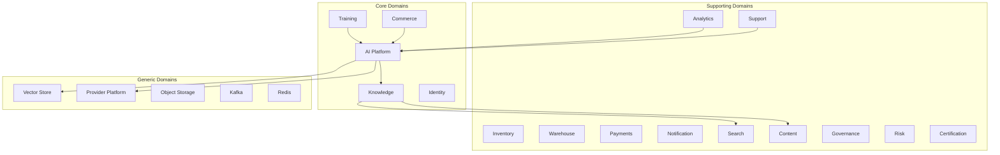
---
## 3. Bounded Context Definition

### 3.1 Identity Context

| Attribute | Value |
| --- | --- |
| **Purpose** | Manage user identities, authentication, authorization, sessions, roles, permissions |
| **Responsibilities** | User registration, login, SSO, OAuth, RBAC, session management, MFA, profile management |
| **Business Owner** | Chief Security Officer |
| **Engineering Owner** | Identity Team |
| **Owned Data** | Users, roles, permissions, sessions, authentication tokens, MFA devices, login history |
| **Owned APIs** | POST /auth/login, POST /auth/register, POST /auth/refresh, GET /users/me, PUT /users/{id}, GET /roles, POST /roles, DELETE /sessions/{id} |
| **Owned Events** | UserRegistered, UserLoggedIn, UserLoggedOut, RoleAssigned, RoleRevoked, PasswordChanged, MFARegistered |
| **Dependencies** | None (autonomous identity provider) |
| **Consumers** | All services, all frontends, mobile apps |
| **Security** | PCI-DSS, SOC2, GDPR, RBAC enforcement, rate limiting, brute force protection |
| **Scaling Strategy** | Horizontal pod autoscaling, read replicas for session lookups, Redis cluster for session cache |
| **Future Evolution** | FIDO2 WebAuthn, passkeys, decentralized identity (DID), AI-driven anomaly detection |

### 3.2 Order Context

| Attribute | Value |
| --- | --- |
| **Purpose** | Manage order lifecycle from creation through fulfillment |
| **Responsibilities** | Order creation, order validation, order status tracking, order cancellation, return processing, refund orchestration |
| **Business Owner** | VP of Commerce |
| **Engineering Owner** | Commerce Team |
| **Owned Data** | Orders, order items, order statuses, order history, returns, refunds, shipping addresses |
| **Owned APIs** | POST /orders, GET /orders/{id}, PUT /orders/{id}/status, POST /orders/{id}/cancel, POST /orders/{id}/return |
| **Owned Events** | OrderCreated, OrderConfirmed, OrderShipped, OrderDelivered, OrderCancelled, OrderReturned, RefundInitiated, RefundCompleted |
| **Dependencies** | Identity (user validation), Inventory (stock reservation), Payment (charge capture), Notification (order updates) |
| **Consumers** | Frontend storefront, admin dashboard, fulfillment service, analytics service |
| **Security** | Order ownership validation, payment data isolation, audit logging |
| **Scaling Strategy** | Event-driven async processing, order write-through cache, read replicas for order history |
| **Future Evolution** | AI-driven order routing, predictive delivery windows, autonomous return processing |

### 3.3 Cart Context

| Attribute | Value |
| --- | --- |
| **Purpose** | Manage shopping cart state for active user sessions |
| **Responsibilities** | Cart creation, item add/remove, quantity updates, cart persistence, cart abandonment handling |
| **Business Owner** | VP of Commerce |
| **Engineering Owner** | Commerce Team |
| **Owned Data** | Carts, cart items, saved-for-later items, cart metadata |
| **Owned APIs** | GET /cart, POST /cart/items, PUT /cart/items/{id}, DELETE /cart/items/{id}, POST /cart/checkout |
| **Owned Events** | CartCreated, ItemAdded, ItemRemoved, CartAbandoned, CartConverted |
| **Dependencies** | Identity (user context), Catalog (product data) |
| **Consumers** | Frontend storefront, mobile apps |
| **Security** | Cart ownership isolation, anonymous cart to user cart merge |
| **Scaling Strategy** | Redis-backed session cart, eventual persistence, TTL-based abandonment |
| **Future Evolution** | AI-powered cart recommendations, intelligent abandon recovery, predictive cart |

### 3.4 Catalog Context

| Attribute | Value |
| --- | --- |
| **Purpose** | Manage product catalog, categories, pricing, availability, product information |
| **Responsibilities** | Product CRUD, category management, pricing, SEO data, product search indexing, inventory integration |
| **Business Owner** | VP of Commerce |
| **Engineering Owner** | Commerce Team |
| **Owned Data** | Products, SKUs, categories, prices, discounts, product attributes, media references, SEO metadata |
| **Owned APIs** | GET /products, GET /products/{id}, POST /products, PUT /products/{id}, GET /categories, POST /categories, GET /products/search |
| **Owned Events** | ProductCreated, ProductUpdated, ProductDeactivated, CategoryCreated, PriceChanged, StockLow |
| **Dependencies** | Identity (admin auth), Inventory (stock levels) |
| **Consumers** | Storefront, search service, order service, content service, AI knowledge platform |
| **Security** | Admin write access, public read access, pricing tier isolation |
| **Scaling Strategy** | CDN-cached product data, read-through cache, elasticsearch for product search |
| **Future Evolution** | AI-powered product descriptions, dynamic pricing, visual search, semantic product discovery |

### 3.5 Inventory Context

| Attribute | Value |
| --- | --- |
| **Purpose** | Manage stock levels, warehouse inventory, stock movements, inventory reservations |
| **Responsibilities** | Stock tracking, reservation, release, replenishment alerts, inventory valuation, stock counting |
| **Business Owner** | VP of Operations |
| **Engineering Owner** | Inventory Team |
| **Owned Data** | Inventory records, stock levels, reservations, warehouse stock, stock movements, inventory audits |
| **Owned APIs** | GET /inventory/{sku}, PUT /inventory/{sku}/stock, POST /inventory/reserve, POST /inventory/release, GET /inventory/audit |
| **Owned Events** | StockUpdated, StockReserved, StockReleased, StockLow, StockOut, InventoryAuditTriggered |
| **Dependencies** | Identity (admin auth), Catalog (SKU reference) |
| **Consumers** | Order service, fulfillment service, catalog service |
| **Security** | Write-access restricted to fulfillment and admin services, public read for stock availability |
| **Scaling Strategy** | Write-optimized database, Redis for real-time stock checks, eventual consistency for stock updates |
| **Future Evolution** | AI-driven demand forecasting, predictive replenishment, intelligent stock distribution |

### 3.6 Fulfillment Context

| Attribute | Value |
| --- | --- |
| **Purpose** | Manage order fulfillment, warehouse operations, shipping, delivery tracking |
| **Responsibilities** | Pick-pack-ship workflow, warehouse task management, carrier integration, delivery tracking, returns handling |
| **Business Owner** | VP of Operations |
| **Engineering Owner** | Fulfillment Team |
| **Owned Data** | Fulfillment orders, pick lists, pack lists, shipment records, tracking data, warehouse tasks, carrier configurations |
| **Owned APIs** | POST /fulfillment/orders, GET /fulfillment/orders/{id}, PUT /fulfillment/orders/{id}/status, POST /fulfillment/ship, GET /fulfillment/tracking/{id} |
| **Owned Events** | FulfillmentCreated, FulfillmentPicked, FulfillmentPacked, FulfillmentShipped, FulfillmentDelivered, FulfillmentException |
| **Dependencies** | Order (fulfillment data), Inventory (stock release), Notification (shipping updates) |
| **Consumers** | Admin dashboard, warehouse mobile apps, order service |
| **Security** | Warehouse staff role-based access, carrier API key management |
| **Scaling Strategy** | Task queue-based warehouse operations, event-driven status updates, async carrier communication |
| **Future Evolution** | AI-optimized pick paths, autonomous warehouse robots, predictive delivery windows |

### 3.7 Training Context

| Attribute | Value |
| --- | --- |
| **Purpose** | Manage training programs, courses, modules, assessments, learning paths |
| **Responsibilities** | Course creation, module management, assessment administration, progress tracking, learning path orchestration, certification prep |
| **Business Owner** | VP of Training |
| **Engineering Owner** | Training Team |
| **Owned Data** | Courses, modules, lessons, assessments, questions, answers, learning paths, progress records, enrollment data |
| **Owned APIs** | GET /courses, GET /courses/{id}, POST /courses, PUT /courses/{id}, POST /courses/{id}/enroll, GET /progress/{userId}, POST /assessments/{id}/submit |
| **Owned Events** | CourseCreated, CoursePublished, StudentEnrolled, ProgressUpdated, AssessmentCompleted, ModuleCompleted, CourseCompleted |
| **Dependencies** | Identity (student/auth), Content (media assets), Certification (credentialing) |
| **Consumers** | Student portal, admin dashboard, certification service, analytics service |
| **Security** | Course-level access control, assessment integrity, progress data privacy |
| **Scaling Strategy** | Read-optimized course catalog, write sharding for progress data, CDN for course media |
| **Future Evolution** | AI-powered adaptive learning, automated assessment generation, intelligent tutoring, personalized learning paths |

### 3.8 Certification Context

| Attribute | Value |
| --- | --- |
| **Purpose** | Manage certifications, credentials, badges, verification |
| **Responsibilities** | Certification creation, credential issuance, digital badging, verification, expiry management, renewal |
| **Business Owner** | VP of Training |
| **Engineering Owner** | Training Team |
| **Owned Data** | Certifications, credentials, badges, verification records, expiry dates, renewal history |
| **Owned APIs** | GET /certifications, POST /certifications/{id}/issue, GET /certifications/verify/{credentialId}, POST /certifications/{id}/renew |
| **Owned Events** | CertificationIssued, CertificationExpired, CertificationRevoked, CertificationRenewed, BadgeAwarded |
| **Dependencies** | Identity (user verification), Training (completion validation) |
| **Consumers** | Student portal, employer verification portal, admin dashboard |
| **Security** | Tamper-proof credential records, blockchain-ready verification, public verification API |
| **Scaling Strategy** | Immutable credential store, CDN-hosted badges, async verification |
| **Future Evolution** | Blockchain-based credentials, decentralized verification, AI-powered skill validation |

### 3.9 Student Context

| Attribute | Value |
| --- | --- |
| **Purpose** | Manage student profiles, learning history, preferences, progress |
| **Responsibilities** | Student profile management, learning history, preferences, progress tracking, skill mapping |
| **Business Owner** | VP of Training |
| **Engineering Owner** | Training Team |
| **Owned Data** | Student profiles, learning history, skill maps, preferences, progress snapshots |
| **Owned APIs** | GET /students/{id}, PUT /students/{id}/profile, GET /students/{id}/progress, GET /students/{id}/skills |
| **Owned Events** | StudentProfileUpdated, LearningGoalSet, SkillAcquired, LearningStreakAchieved |
| **Dependencies** | Identity (user context), Training (enrollment data) |
| **Consumers** | Student portal, training service, analytics service, AI recommendations |
| **Security** | Student data privacy, FERPA compliance, parent/guardian access controls |
| **Scaling Strategy** | Read replicas for profile data, write sharding for learning history |
| **Future Evolution** | AI-powered skill gap analysis, personalized learning recommendations, career path prediction |

### 3.10 Payment Context

| Attribute | Value |
| --- | --- |
| **Purpose** | Manage payment processing, transactions, invoices, refunds, billing |
| **Responsibilities** | Payment capture, transaction processing, invoice generation, refund processing, billing cycles, payment method management |
| **Business Owner** | CFO |
| **Engineering Owner** | Payments Team |
| **Owned Data** | Transactions, invoices, payment methods, billing addresses, refund records, payment gateway configurations |
| **Owned APIs** | POST /payments/charge, POST /payments/refund, GET /payments/{id}, GET /invoices, POST /invoices, GET /payment-methods |
| **Owned Events** | PaymentSucceeded, PaymentFailed, PaymentRefunded, InvoiceGenerated, InvoicePaid, InvoiceOverdue, PaymentMethodAdded |
| **Dependencies** | Identity (user validation), Order (order reference) |
| **Consumers** | Order service, notification service, accounting service |
| **Security** | PCI-DSS compliance, tokenization, PII isolation, encryption at rest and in transit |
| **Scaling Strategy** | Idempotent payment processing, async gateway communication, dead letter queue for failed payments |
| **Future Evolution** | AI-driven payment routing, fraud detection, dynamic pricing, subscription intelligence |
### 3.11 Analytics Context

| Attribute | Value |
| --- | --- |
| **Purpose** | Manage business analytics, reporting, dashboards, metrics |
| **Responsibilities** | Metric collection, report generation, dashboard rendering, data aggregation, business intelligence |
| **Business Owner** | VP of Analytics |
| **Engineering Owner** | Analytics Team |
| **Owned Data** | Metrics, reports, dashboards, aggregated data, business KPIs, analytical models |
| **Owned APIs** | GET /metrics, POST /reports, GET /reports/{id}, GET /dashboards, POST /dashboards, GET /kpi |
| **Owned Events** | ReportGenerated, DashboardUpdated, KPIThresholdCrossed, AnomalyDetected |
| **Dependencies** | All services (metric sources) |
| **Consumers** | Admin dashboards, executive dashboards, external reporting |
| **Security** | Role-based report access, data isolation, PII scrubbing |
| **Scaling Strategy** | Column-store database, materialized view aggregation, async report generation |
| **Future Evolution** | AI-powered insight generation, natural language querying, predictive analytics, automated anomaly detection |

### 3.12 Notification Context

| Attribute | Value |
| --- | --- |
| **Purpose** | Manage all outbound communications across email, SMS, push, in-app |
| **Responsibilities** | Template management, delivery routing, channel preference management, delivery status tracking, retry logic |
| **Business Owner** | VP of Engineering |
| **Engineering Owner** | Platform Team |
| **Owned Data** | Notification templates, delivery records, channel configurations, user preferences, delivery logs |
| **Owned APIs** | POST /notifications/send, POST /notifications/templates, GET /notifications/{id}, PUT /notifications/preferences |
| **Owned Events** | NotificationSent, NotificationDelivered, NotificationFailed, NotificationBounced, PreferenceUpdated |
| **Dependencies** | Identity (user contact info), All services (notification triggers) |
| **Consumers** | All services, all frontends |
| **Security** | PII protection in message content, unsubscribe compliance, CAN-SPAM compliance |
| **Scaling Strategy** | Async delivery queue, channel-specific workers, batch processing for email |
| **Future Evolution** | AI-driven notification timing optimization, personalized content, intelligent channel selection |

### 3.13 Search Context

| Attribute | Value |
| --- | --- |
| **Purpose** | Manage full-text search, faceted search, indexing, search relevance |
| **Responsibilities** | Index management, search query processing, relevance tuning, faceted navigation, autocomplete, spell correction |
| **Business Owner** | VP of Engineering |
| **Engineering Owner** | Platform Team |
| **Owned Data** | Search indexes, search analytics, query logs, relevance configurations, synonyms |
| **Owned APIs** | POST /search/query, POST /search/index, POST /search/reindex, GET /search/suggest, POST /search/synonyms |
| **Owned Events** | IndexUpdated, IndexRebuilt, SearchPerformed, RelevanceTuned |
| **Dependencies** | Catalog, Content, Training, Knowledge (index sources) |
| **Consumers** | Storefront, admin dashboards, API consumers |
| **Security** | Index-level access control, query auditing |
| **Scaling Strategy** | Elasticsearch cluster, read replicas for search queries, index write sharding |
| **Future Evolution** | AI-powered semantic search, hybrid search (vector + keyword), personalized search results |

### 3.14 Content Context

| Attribute | Value |
| --- | --- |
| **Purpose** | Manage media assets, documents, files, content metadata |
| **Responsibilities** | Asset upload, media transcoding, content categorization, metadata management, version control, content delivery |
| **Business Owner** | VP of Engineering |
| **Engineering Owner** | Platform Team |
| **Owned Data** | Media assets, documents, images, videos, metadata, content relationships, version history |
| **Owned APIs** | POST /content/upload, GET /content/{id}, DELETE /content/{id}, PUT /content/{id}/metadata, GET /content/search |
| **Owned Events** | ContentUploaded, ContentProcessed, ContentUpdated, ContentDeleted, ContentArchived |
| **Dependencies** | Identity (auth), Object Storage (S3) |
| **Consumers** | Training service, catalog service, knowledge service, support service |
| **Security** | Asset-level access control, DRM enforcement, watermarking |
| **Scaling Strategy** | CDN delivery, multi-region object storage, async media processing pipeline |
| **Future Evolution** | AI-powered content tagging, automated moderation, intelligent content generation, translation |

### 3.15 Support Context

| Attribute | Value |
| --- | --- |
| **Purpose** | Manage customer support tickets, cases, knowledge base, agent workflows |
| **Responsibilities** | Ticket management, case routing, SLA tracking, knowledge base management, agent assignment, customer communication |
| **Business Owner** | VP of Support |
| **Engineering Owner** | Support Team |
| **Owned Data** | Tickets, cases, support conversations, knowledge base articles, SLAs, agent assignments, satisfaction ratings |
| **Owned APIs** | POST /tickets, GET /tickets/{id}, PUT /tickets/{id}/status, POST /tickets/{id}/assign, GET /kb/articles, POST /kb/articles |
| **Owned Events** | TicketCreated, TicketAssigned, TicketResolved, TicketReopened, KbArticleCreated, SatisfactionRatingSubmitted |
| **Dependencies** | Identity (user/customer context), Notification (case updates), Knowledge (AI-assisted resolution) |
| **Consumers** | Customer portal, admin dashboard, agent workspace |
| **Security** | Ticket-level access control, customer data isolation, audit logging |
| **Scaling Strategy** | Multi-tier ticket routing, async notification, knowledge base CDN |
| **Future Evolution** | AI-powered ticket triage, automated resolution, sentiment analysis, intelligent agent assist |

### 3.16 Governance Context

| Attribute | Value |
| --- | --- |
| **Purpose** | Manage compliance, policy enforcement, auditing, regulatory reporting |
| **Responsibilities** | Policy management, compliance monitoring, audit trail, regulatory reporting, access reviews, risk assessment |
| **Business Owner** | Chief Compliance Officer |
| **Engineering Owner** | Governance Team |
| **Owned Data** | Policies, compliance records, audit logs, regulatory reports, access reviews, risk assessments |
| **Owned APIs** | POST /governance/policies, GET /governance/policies, GET /governance/audit, POST /governance/compliance/check, GET /governance/reports |
| **Owned Events** | PolicyCreated, PolicyViolationDetected, ComplianceCheckCompleted, AuditTriggered, RegulatoryReportGenerated |
| **Dependencies** | All services (audit sources), Identity (access data) |
| **Consumers** | Compliance team, auditors, regulatory bodies |
| **Security** | Immutable audit logs, tamper-proof compliance records, role-based governance access |
| **Scaling Strategy** | Append-only audit log storage, event-driven compliance checks, async report generation |
| **Future Evolution** | AI-powered compliance monitoring, automated policy enforcement, intelligent audit analysis |

### 3.17 Risk Context

| Attribute | Value |
| --- | --- |
| **Purpose** | Manage fraud detection, risk scoring, operational risk, financial risk |
| **Responsibilities** | Risk scoring, fraud detection, transaction screening, risk rule management, case management |
| **Business Owner** | Chief Risk Officer |
| **Engineering Owner** | Risk Team |
| **Owned Data** | Risk scores, fraud cases, risk rules, transaction screening records, blacklists, risk models |
| **Owned APIs** | POST /risk/score, POST /risk/check, GET /risk/cases/{id}, POST /risk/rules, POST /risk/blacklist |
| **Owned Events** | RiskScored, FraudAlertTriggered, CaseCreated, CaseResolved, RuleUpdated, BlacklistUpdated |
| **Dependencies** | Identity (user data), Order (transaction data), Payment (payment data) |
| **Consumers** | Payment service, order service, support service |
| **Security** | Risk data isolation, model IP protection, case data privacy |
| **Scaling Strategy** | Real-time risk scoring with Redis, async case processing, machine learning model serving |
| **Future Evolution** | AI-powered fraud detection, real-time risk adaptation, predictive risk modeling |

### 3.18 Registry Context

| Attribute | Value |
| --- | --- |
| **Purpose** | Manage service registry, service discovery, configuration management |
| **Responsibilities** | Service registration, health checking, configuration distribution, service mesh integration |
| **Business Owner** | VP of Engineering |
| **Engineering Owner** | Platform Team |
| **Owned Data** | Service instances, health status, configurations, service endpoints, metadata |
| **Owned APIs** | POST /registry/register, POST /registry/heartbeat, GET /registry/services, GET /registry/services/{id} |
| **Owned Events** | ServiceRegistered, ServiceDeregistered, ServiceHealthChanged, ConfigurationUpdated |
| **Dependencies** | All services (registration) |
| **Consumers** | All services, API gateway, load balancers |
| **Security** | Mutual TLS, registration authentication |
| **Scaling Strategy** | Gossip protocol-based discovery, distributed configuration store |
| **Future Evolution** | AI-driven service mesh optimization, predictive scaling, intelligent routing |

### 3.19 AI Gateway Context

| Attribute | Value |
| --- | --- |
| **Purpose** | Manage all AI traffic routing, rate limiting, auth, observability, cost tracking |
| **Responsibilities** | Request routing, rate limiting, API key management, usage tracking, cost attribution, response caching, load shedding |
| **Business Owner** | VP of AI |
| **Engineering Owner** | AI Platform Team |
| **Owned Data** | API keys, rate limit counters, usage records, cost logs, request/response audit logs, cache entries |
| **Owned APIs** | POST /ai/gateway/chat, POST /ai/gateway/completion, POST /ai/gateway/embedding, GET /ai/gateway/usage, GET /ai/gateway/health |
| **Owned Events** | AIRequestRouted, AIResponseReceived, RateLimitExceeded, CostThresholdAlerted, ProviderFailed |
| **Dependencies** | Provider Platform (LLM execution), Identity (API key validation) |
| **Consumers** | All AI services, all copilots, all agents |
| **Security** | API key authentication, request/response audit, PII redaction, cost attack protection |
| **Scaling Strategy** | Stateless horizontal scaling, Redis-backed rate limiting, cache-aside response caching |
| **Future Evolution** | Smart request routing, cost-aware provider selection, multi-model load balancing |

### 3.20 Prompt Context

| Attribute | Value |
| --- | --- |
| **Purpose** | Manage prompt templates, versions, registry, deployment, evaluation |
| **Responsibilities** | Prompt creation, version management, prompt registry, approval workflow, deployment, A/B testing, prompt evaluation |
| **Business Owner** | VP of AI |
| **Engineering Owner** | AI Platform Team |
| **Owned Data** | Prompts, prompt versions, prompt metadata, prompt registry, approval records, deployment history, A/B test configs |
| **Owned APIs** | POST /prompts, GET /prompts/{id}, POST /prompts/{id}/versions, PUT /prompts/{id}/deploy, POST /prompts/{id}/evaluate |
| **Owned Events** | PromptCreated, PromptVersioned, PromptApproved, PromptDeployed, PromptRolledBack, PromptEvaluated |
| **Dependencies** | Identity (auth), AI Gateway (execution) |
| **Consumers** | Agent service, copilot service, conversation service |
| **Security** | Prompt-level access control, approval gates for production deployment, version immutability |
| **Scaling Strategy** | Centralized prompt registry, CDN-hosted prompt templates, async evaluation |
| **Future Evolution** | AI-generated prompt optimization, automated prompt testing, multi-variant orchestration |
### 3.21 Knowledge Context

| Attribute | Value |
| --- | --- |
| **Purpose** | Manage enterprise knowledge base, document ingestion, chunking, indexing, retrieval |
| **Responsibilities** | Knowledge source ingestion, document processing, chunking strategy, embedding generation, retrieval, relevance ranking |
| **Business Owner** | VP of AI |
| **Engineering Owner** | AI Platform Team |
| **Owned Data** | Knowledge sources, documents, chunks, embeddings, retrieval logs, relevance scores, knowledge graphs |
| **Owned APIs** | POST /knowledge/sources, POST /knowledge/ingest, POST /knowledge/search, POST /knowledge/chunk, GET /knowledge/documents/{id} |
| **Owned Events** | KnowledgeSourceAdded, DocumentIngested, DocumentChunked, DocumentIndexed, KnowledgeSearched, ChunkEmbedded |
| **Dependencies** | Content (source documents), Embedding (vector generation), Vector Store (index persistence) |
| **Consumers** | Conversation service, copilot service, agent service, search service |
| **Security** | Document-level access control, source authentication, PII detection and redaction |
| **Scaling Strategy** | Async ingestion pipeline, batch embedding processing, vector index sharding, read replica for queries |
| **Future Evolution** | Knowledge graph construction, multi-modal knowledge, automated knowledge discovery, cross-lingual retrieval |

### 3.22 Conversation Context

| Attribute | Value |
| --- | --- |
| **Purpose** | Manage conversation threads, messages, memory, context for AI interactions |
| **Responsibilities** | Thread management, message persistence, conversation memory, context window management, summarization, history pruning |
| **Business Owner** | VP of AI |
| **Engineering Owner** | AI Platform Team |
| **Owned Data** | Conversations, threads, messages, memory entries, context snapshots, summaries, user feedback |
| **Owned APIs** | POST /conversations, GET /conversations/{id}, POST /conversations/{id}/messages, GET /conversations/{id}/messages, POST /conversations/{id}/summarize |
| **Owned Events** | ConversationCreated, MessageAdded, ConversationSummarized, MemoryUpdated, ContextPruned, FeedbackSubmitted |
| **Dependencies** | Identity (user context), AI Gateway (LLM execution), Knowledge (retrieval), Memory (persistence) |
| **Consumers** | Copilot service, agent service, frontend chat UIs |
| **Security** | Conversation-level access control, message audit, data retention compliance |
| **Scaling Strategy** | Time-series message storage, context window sharding, periodic summarization offload |
| **Future Evolution** | Persistent long-term memory, multi-session context, emotional state tracking, conversation branching |

### 3.23 Embedding Context

| Attribute | Value |
| --- | --- |
| **Purpose** | Manage text embedding generation, model routing, batch processing, cache |
| **Responsibilities** | Embedding generation, model selection, batch processing, embedding cache, dimension management |
| **Business Owner** | VP of AI |
| **Engineering Owner** | AI Platform Team |
| **Owned Data** | Embedding cache entries, model configurations, batch job records, embedding metadata |
| **Owned APIs** | POST /embeddings/generate, POST /embeddings/batch, GET /embeddings/models, GET /embeddings/cache/stats |
| **Owned Events** | EmbeddingGenerated, EmbeddingBatchCompleted, EmbeddingCacheHit, EmbeddingModelSwitched |
| **Dependencies** | AI Gateway (LLM provider routing), Provider Platform (embedding models) |
| **Consumers** | Knowledge service, vector service, semantic service, search service |
| **Security** | Content PII redaction before embedding, model usage tracking |
| **Scaling Strategy** | GPU-backed batch processing, embedding cache with LRU eviction, async batch pipeline |
| **Future Evolution** | Multi-modal embeddings, cross-modal retrieval, embedding compression, streaming embeddings |

### 3.24 Vector Context

| Attribute | Value |
| --- | --- |
| **Purpose** | Manage vector indexes, collections, similarity search, vector persistence |
| **Responsibilities** | Collection management, vector indexing, similarity search, index optimization, vector persistence, HNSW/IVF configuration |
| **Business Owner** | VP of AI |
| **Engineering Owner** | AI Platform Team |
| **Owned Data** | Vector collections, index configurations, vector data, search metadata, index statistics |
| **Owned APIs** | POST /vectors/collections, DELETE /vectors/collections/{id}, POST /vectors/collections/{id}/upsert, POST /vectors/collections/{id}/search, GET /vectors/collections/{id}/stats |
| **Owned Events** | CollectionCreated, CollectionDeleted, VectorsUpserted, VectorSearchPerformed, IndexOptimized |
| **Dependencies** | Embedding (vector data source) |
| **Consumers** | Knowledge service, semantic service, search service |
| **Security** | Collection-level access control, data isolation between tenants |
| **Scaling Strategy** | Distributed vector index (HNSW), index sharding, GPU-accelerated search, read replica for queries |
| **Future Evolution** | Hybrid vector-keyword search, multi-vector search, streaming vector ingestion, real-time index updates |

### 3.25 Semantic Context

| Attribute | Value |
| --- | --- |
| **Purpose** | Manage semantic search, hybrid search, reranking, query understanding |
| **Responsibilities** | Query understanding, semantic retrieval, hybrid search orchestration, reranking, query expansion, facet extraction |
| **Business Owner** | VP of AI |
| **Engineering Owner** | AI Platform Team |
| **Owned Data** | Search indexes, query logs, reranking models, search configurations, synonyms, query understanding models |
| **Owned APIs** | POST /semantic/search, POST /semantic/rerank, POST /semantic/query/expand, POST /semantic/index, GET /semantic/stats |
| **Owned Events** | SemanticSearchPerformed, QueryExpanded, RerankingCompleted, IndexUpdated |
| **Dependencies** | Knowledge (document corpus), Vector (similarity search), Embedding (query embedding), AI Gateway (reranking model) |
| **Consumers** | Copilot service, search service, conversation service |
| **Security** | Index-level access control, query audit logging |
| **Scaling Strategy** | Stateless search orchestration, async reranking, query result caching |
| **Future Evolution** | Multi-modal semantic search, personalized search, conversational search, proactive information delivery |

### 3.26 Memory Context

| Attribute | Value |
| --- | --- |
| **Purpose** | Manage AI memory, long-term and short-term memory, episodic memory, semantic memory |
| **Responsibilities** | Memory storage, memory retrieval, memory consolidation, memory pruning, working memory, episodic recording |
| **Business Owner** | VP of AI |
| **Engineering Owner** | AI Platform Team |
| **Owned Data** | Memory entries, episodic records, semantic memory, memory relationships, consolidation metadata |
| **Owned APIs** | POST /memory/store, POST /memory/recall, DELETE /memory/prune, POST /memory/consolidate, GET /memory/stats |
| **Owned Events** | MemoryStored, MemoryRecalled, MemoryConsolidated, MemoryPruned, MemoryRetrieved |
| **Dependencies** | Conversation (memory source), Embedding (memory encoding) |
| **Consumers** | Conversation service, agent service, copilot service |
| **Security** | User-level memory isolation, memory retention policies, GDPR right-to-erasure |
| **Scaling Strategy** | Hierarchical memory storage (hot/warm/cold), periodic consolidation, TTL-based pruning |
| **Future Evolution** | Episodic memory with temporal reasoning, semantic memory graphs, cross-session memory, memory sharing |

### 3.27 Provider Context

| Attribute | Value |
| --- | --- |
| **Purpose** | Manage LLM provider configurations, routing, fallback, credentials |
| **Responsibilities** | Provider configuration, model catalog, credential management, routing logic, fallback chains, provider health monitoring |
| **Business Owner** | VP of AI |
| **Engineering Owner** | AI Platform Team |
| **Owned Data** | Provider configurations, credentials (encrypted), model catalog, routing rules, health status, cost rates |
| **Owned APIs** | GET /providers, POST /providers, PUT /providers/{id}/config, GET /providers/{id}/health, POST /providers/routing/strategy |
| **Owned Events** | ProviderRegistered, ProviderHealthChanged, ProviderDisabled, ProviderRotated, RoutingStrategyUpdated |
| **Dependencies** | Identity (auth), External LLM APIs (OpenAI, Anthropic, Google, Azure) |
| **Consumers** | AI Gateway, embedding service, evaluation service |
| **Security** | Encrypted credential storage, provider secret rotation, API key isolation |
| **Scaling Strategy** | Stateless provider management, health check aggregation, async credential rotation |
| **Future Evolution** | Multi-provider load balancing, cost-aware routing, latency-aware provider selection, provider arbitrage |

### 3.28 Agent Context

| Attribute | Value |
| --- | --- |
| **Purpose** | Manage autonomous agents, agent execution, planning, tools, workflows |
| **Responsibilities** | Agent registration, execution orchestration, planning, tool binding, workflow management, agent recovery, approval workflows |
| **Business Owner** | VP of AI |
| **Engineering Owner** | AI Platform Team |
| **Owned Data** | Agent definitions, execution plans, agent state, tool registrations, workflow definitions, execution logs, approval records |
| **Owned APIs** | POST /agents, POST /agents/{id}/execute, GET /agents/{id}/status, POST /agents/{id}/cancel, POST /agents/{id}/approve, POST /agents/workflows |
| **Owned Events** | AgentRegistered, AgentExecutionStarted, AgentStepCompleted, AgentExecutionCompleted, AgentExecutionFailed, AgentApprovalRequested, AgentToolInvoked |
| **Dependencies** | AI Gateway (LLM), Conversation (message context), Knowledge (information retrieval), Prompt (prompt templates), Provider (LLM routing) |
| **Consumers** | Copilot service, admin dashboard, automation service |
| **Security** | Agent capability sandboxing, human-in-the-loop approval, execution audit trail |
| **Scaling Strategy** | Async execution queue, state machine persistence, checkpoint/restore for long-running agents |
| **Future Evolution** | Multi-agent orchestration, agent team collaboration, autonomous learning, agent marketplace |

### 3.29 Copilot Context

| Attribute | Value |
| --- | --- |
| **Purpose** | Manage copilot interfaces, copilot configurations, copilot knowledge binding |
| **Responsibilities** | Copilot registration, capability binding, knowledge source configuration, UI configuration, copilot analytics |
| **Business Owner** | VP of AI |
| **Engineering Owner** | AI Platform Team |
| **Owned Data** | Copilot definitions, capability configurations, knowledge bindings, UI configurations, copilot analytics |
| **Owned APIs** | POST /copilots, GET /copilots/{id}, PUT /copilots/{id}/knowledge, POST /copilots/{id}/chat, GET /copilots/{id}/analytics |
| **Owned Events** | CopilotRegistered, CopilotConfigured, CopilotQueried, CopilotKnowledgeBound, CopilotFeedbackSubmitted |
| **Dependencies** | Agent (execution), Conversation (chat), Knowledge (retrieval), Prompt (templates), AI Gateway (LLM) |
| **Consumers** | Frontend copilot UIs, mobile apps |
| **Security** | Copilot-level access control, capability-based authorization, data isolation |
| **Scaling Strategy** | Stateless copilot orchestration, async knowledge retrieval, response caching |
| **Future Evolution** | Personalized copilot experiences, proactive copilot suggestions, cross-copilot coordination, copilot marketplace |

### 3.30 Evaluation Context

| Attribute | Value |
| --- | --- |
| **Purpose** | Manage AI evaluation, prompt scoring, quality metrics, hallucination detection |
| **Responsibilities** | Evaluation pipeline, prompt scoring, grounding verification, hallucination detection, latency measurement, cost tracking, quality metrics, feedback collection |
| **Business Owner** | VP of AI |
| **Engineering Owner** | AI Platform Team |
| **Owned Data** | Evaluation runs, scores, metrics, grounding checks, hallucination reports, latency records, cost data, feedback |
| **Owned APIs** | POST /evaluations, GET /evaluations/{id}, POST /evaluations/{id}/score, POST /evaluations/{id}/grounding, GET /evaluations/metrics |
| **Owned Events** | EvaluationStarted, EvaluationCompleted, ScoreRecorded, HallucinationDetected, GroundingVerified, QualityThresholdBreached |
| **Dependencies** | AI Gateway (execution results), Prompt (prompt metadata), Knowledge (grounding context), Provider (model info) |
| **Consumers** | AI Platform dashboard, prompt management, quality assurance |
| **Security** | Evaluation data isolation, score tamper protection |
| **Scaling Strategy** | Async evaluation pipeline, parallel scoring, batch metric computation |
| **Future Evolution** | Automated regression testing, continuous evaluation, production monitoring, drift detection |

### 3.31 AI Analytics Context

| Attribute | Value |
| --- | --- |
| **Purpose** | Manage AI-specific analytics, usage patterns, cost analysis, performance metrics |
| **Responsibilities** | AI usage metrics, cost attribution, provider performance comparison, model performance tracking, anomaly detection |
| **Business Owner** | VP of AI |
| **Engineering Owner** | AI Platform Team |
| **Owned Data** | AI usage metrics, cost allocation data, model performance metrics, provider comparison data, anomaly records |
| **Owned APIs** | GET /ai-analytics/usage, GET /ai-analytics/costs, GET /ai-analytics/performance, GET /ai-analytics/providers, POST /ai-analytics/reports |
| **Owned Events** | UsageThresholdCrossed, CostAnomalyDetected, PerformanceDegradationAlerted, ReportGenerated |
| **Dependencies** | AI Gateway (usage data), Provider (cost data), Evaluation (quality data) |
| **Consumers** | AI Platform dashboard, finance team, engineering team |
| **Security** | Cost data access control, anonymized metrics |
| **Scaling Strategy** | Column-store time-series database, pre-aggregated rollups, async report generation |
| **Future Evolution** | Real-time AI cost dashboards, predictive cost modeling, provider optimization recommendations |

### 3.32 Document Context

| Attribute | Value |
| --- | --- |
| **Purpose** | Manage document intelligence, OCR, document classification, extraction, processing |
| **Responsibilities** | Document ingestion, OCR processing, document classification, field extraction, document validation, document generation |
| **Business Owner** | VP of AI |
| **Engineering Owner** | AI Platform Team |
| **Owned Data** | Document images, OCR results, classifications, extracted fields, validation results, generated documents, processing logs |
| **Owned APIs** | POST /documents/process, POST /documents/classify, POST /documents/extract, POST /documents/generate, GET /documents/{id} |
| **Owned Events** | DocumentReceived, DocumentProcessed, DocumentClassified, DocumentExtracted, DocumentValidated, DocumentGenerated |
| **Dependencies** | Content (document storage), AI Gateway (LLM/vision for extraction), Knowledge (document context) |
| **Consumers** | Support service, training service, compliance service |
| **Security** | Document-level access control, PII redaction, data retention policies |
| **Scaling Strategy** | Async document processing pipeline, GPU-backed OCR, parallel document classification |
| **Future Evolution** | Multi-modal document understanding, handwritten text recognition, layout analysis, automated document generation |

### 3.33 Policy Engine Context

| Attribute | Value |
| --- | --- |
| **Purpose** | Manage AI governance policies, safety guardrails, content filters, usage policies |
| **Responsibilities** | Policy definition, policy enforcement, content filtering, safety guardrails, usage policy validation, policy audit |
| **Business Owner** | VP of AI |
| **Engineering Owner** | AI Platform Team |
| **Owned Data** | Policies, policy versions, enforcement logs, violation records, filter configurations, audit trails |
| **Owned APIs** | POST /policies, GET /policies/{id}, POST /policies/{id}/validate, POST /policies/enforce, GET /policies/violations |
| **Owned Events** | PolicyCreated, PolicyEnforced, ViolationDetected, PolicyViolationResolved, FilterUpdated |
| **Dependencies** | AI Gateway (content to filter), Governance (compliance alignment) |
| **Consumers** | AI Gateway, prompt service, agent service |
| **Security** | Policy tamper protection, immutable violation records, separation of duties |
| **Scaling Strategy** | Stateless policy evaluation, pre-compiled policy rules, async violation processing |
| **Future Evolution** | AI-driven policy optimization, real-time content adaptation, multi-jurisdiction policy management |
---
## 4. Aggregate Roots

### 4.1 Aggregate Root Definitions

Each aggregate root defines the consistency boundary for a cluster of domain objects. All operations within an aggregate are transactional. Operations across aggregates use eventual consistency via domain events.

#### Identity Domain

| Aggregate Root | Invariants | Consistency Rules | Lifecycle | Ownership | Relationships |
| --- | --- | --- | --- | --- | --- |
| User | Email must be unique. Username must be unique. Must have at least one role. | Password hash must be immutable after creation. MFA state transitions must be logged. | Created -> Active -> Suspended -> Deleted | Identity Team | Has Roles, Has Sessions, Has MFA Devices |
| Role | Name must be unique within tenant. Permissions must be non-empty. | Immutable after creation. Versioned for audit. | Created -> Active -> Deprecated -> Archived | Identity Team | Has Permissions |
| Session | Must reference valid User. Must have expiry. Cannot be created for suspended users. | Single token per session. Refresh rotates token. Concurrent sessions allowed. | Created -> Active -> Expired -> Revoked | Identity Team | Belongs to User |

#### Commerce Domain

| Aggregate Root | Invariants | Consistency Rules | Lifecycle | Ownership | Relationships |
| --- | --- | --- | --- | --- | --- |
| Product | SKU must be unique. Must have valid price > 0. Must belong to a category. | Price changes create audit entry. Deactivation requires no active orders. | Draft -> Active -> Deactivated -> Archived | Commerce Team | Belongs to Category, Has SKUs |
| Category | Slug must be unique. Parent must exist if specified. Cannot be own parent. | Tree hierarchy. Orphan check on delete. | Active -> Inactive | Commerce Team | Has Products, Has Children |
| Order | Must have at least one item. Total must equal sum of item totals. Must reference valid User. | Status transitions are strict (Pending -> Confirmed -> Shipped -> Delivered). Cancellation requires reason. | Pending -> Confirmed -> Processing -> Shipped -> Delivered -> Completed or Cancelled | Commerce Team | Has Items, Belongs to User, Has Payment |
| Cart | User must be valid (or anonymous). Items must reference valid Products. | Abandoned carts cleaned after TTL. Merge on login for anonymous carts. | Active -> Converted -> Abandoned | Commerce Team | Has Items, Belongs to User |
| Discount | Code must be unique. Dates must be valid. Usage must not exceed limits. | Stacking rules defined by category. One-time use enforced. | Scheduled -> Active -> Expired -> Depleted | Commerce Team | Applies to Products/Categories |

#### Training Domain

| Aggregate Root | Invariants | Consistency Rules | Lifecycle | Ownership | Relationships |
| --- | --- | --- | --- | --- | --- |
| Course | Slug must be unique. Must have at least one module. Instructor must be valid. | Published courses cannot have structural changes without new version. | Draft -> Published -> Archived -> Retired | Training Team | Has Modules, Has Instructor, Has Enrollments |
| Module | Must belong to a Course. Must have at least one lesson. Order must be unique within course. | Content versioned independently of course version. | Draft -> Published -> Archived | Training Team | Belongs to Course, Has Lessons |
| Assessment | Must belong to a Course or Module. Must have passing score. Questions must have valid answers. | Retake policy enforced. Answer order randomized. | Draft -> Published -> Closed | Training Team | Belongs to Course/Module, Has Questions |
| Enrollment | Must reference valid User and Course. Status transitions are strict. | Duplicate enrollment prevented. Completion recorded on passing final assessment. | Enrolled -> Active -> Paused -> Completed -> Dropped | Training Team | References User, References Course |
| Certification | Code must be unique. Must reference valid Course or Assessment path. | Verification link cryptographically signed. Expiry enforced. | Draft -> Active -> Expired -> Revoked | Training Team | References Course, Issued to User |

#### AI Platform Domains

| Aggregate Root | Invariants | Consistency Rules | Lifecycle | Ownership | Relationships |
| --- | --- | --- | --- | --- | --- |
| KnowledgeDocument | Source must be valid. Content must be non-empty. Document hash must be unique. | Chunks must cover complete content. Embedding must match chunk hash. | Ingested -> Chunked -> Indexed -> Failed -> Archived | AI Platform | Has Chunks, Has Embeddings, Belongs to Source |
| KnowledgeChunk | Must belong to a Document. Order must be sequential. Content must be non-empty. | Chunk hash must match content. Overlap must not exceed 10%. | Created -> Embedded -> Indexed | AI Platform | Belongs to Document, Has Embedding |
| Prompt | Name must be unique within tenant. Must have at least one version. Active version must be deployed. | Immutable version history. Production deployment requires approval. | Draft -> Active -> Deprecated -> Archived | AI Platform | Has Versions, Has Evaluations |
| PromptVersion | Must belong to a Prompt. Template must be valid. Variables must match template. | Version content immutable after creation. Version monotonically increasing. | Created -> Staged -> Approved -> Deployed -> RolledBack | AI Platform | Belongs to Prompt |
| Conversation | Must reference valid User. Must have at least one message. | Context window limits enforced. Periodic summarization for long threads. | Active -> Archived -> Deleted | AI Platform | Has Messages, Has Memory |
| ConversationMessage | Must belong to a Conversation. Role must be user/assistant/system/tool. Content must be non-empty. | Message order immutable after append. Tool calls must reference valid tools. | Created -> Edited -> Flagged | AI Platform | Belongs to Conversation |
| Agent | Name must be unique. Must have at least one capability. System prompt must be valid. | Capability set immutable during execution. Approval gates enforced. | Registered -> Active -> Suspended -> Archived | AI Platform | Has Capabilities, Has Tools, References Prompts |
| AgentExecution | Must belong to an Agent. Must have a plan. Status transitions are strict. | Checkpoint every step. Idempotent step retry. Total execution time bounded. | Created -> Planning -> Executing -> Completed -> Failed -> Cancelled | AI Platform | Belongs to Agent, Has Steps |
| Copilot | Name must be unique. Must have at least one knowledge binding. Must reference valid Agent. | Knowledge source access validated on bind. Capability scope immutable. | Registered -> Active -> Disabled -> Archived | AI Platform | Has Knowledge Bindings, References Agent |
| Evaluation | Must reference valid Prompt. Must have at least one metric. Score range must be 0-1. | Grounding checks mandatory for production evaluations. Results immutable. | Started -> Running -> Completed -> Failed | AI Platform | Has Scores, References Prompt/Agent |
| EmbeddingJob | Must reference valid source content. Model must be supported. Batch size must be within limits. | All items in batch processed or none. Cache checked before generation. | Queued -> Processing -> Completed -> Failed | AI Platform | Has Embeddings, References Model |
| VectorCollection | Name must be unique. Dimension must match model. Index config must be valid. | Upsert operations idempotent. Index build async. | Created -> Indexing -> Ready -> Optimizing -> Deleted | AI Platform | Has Vectors, Has Index Config |
| ProviderConfiguration | Provider must be valid. API key must be encrypted. Rate limits must be configured. | Health check periodic. Fallback chain validated. Credential rotation scheduled. | Active -> Degraded -> Disabled -> Rotating | AI Platform | Has Models, Has Fallbacks |
| AIRequest | Must reference valid API key. Model must be supported. Token limits enforced. | Request/response logged. Cost attributed. Rate limit checked before routing. | Received -> Routed -> Executing -> Completed -> Failed | AI Platform | Belongs to Provider, Has Response |
| Policy | Name must be unique. Rule set must be non-empty. Policy version tracked. | Immutable enforcement log. Policy changes require approval. | Draft -> Active -> Enforced -> Archived | AI Platform | Has Rules, Has Violations |
| MemoryRecord | Must reference valid User or Conversation. Content must be non-empty. Type must be valid. | TTL enforced. Periodic consolidation. Episodic memory immutable. | Stored -> Consolidated -> Pruned | AI Platform | Belongs to User/Conversation |
| DocumentProcess | Input document must be valid. Pipeline steps sequential. Output validated. | PII detected and redacted. Audit trail complete. | Received -> Classifying -> Extracting -> Validating -> Completed -> Failed | AI Platform | Has Classifications, Has Extractions |

### 4.2 Aggregate Relationship Diagram

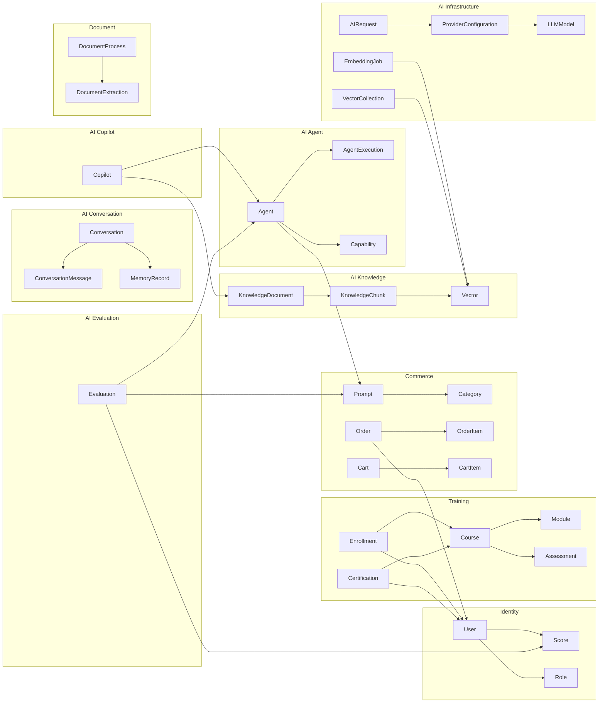
---
## 5. Entities, Value Objects, Factories, Repositories, Domain Services

### 5.1 Identity Domain

| DDD Component | Type | Description |
| --- | --- | --- |
| User | Entity | Aggregate root. Unique identifier. Mutable profile data. |
| UserId | Value Object | Wraps UUID. Typed identifier. |
| Email | Value Object | Validated email format. Normalized to lowercase. |
| PhoneNumber | Value Object | E.164 format. Country code validated. |
| PasswordHash | Value Object | BCrypt hash. Immutable after creation. |
| Role | Entity | Aggregate root. Named permission set. |
| RoleId | Value Object | Typed UUID. |
| Permission | Value Object | String-based. Format: resource:action. |
| Session | Entity | Aggregate root. Token-based. Has expiry. |
| SessionToken | Value Object | JWT or opaque token. Typed. |
| MfaDevice | Entity | TOTP or SMS device. Belongs to User. |
| UserFactory | Factory | Creates User with default role, validates uniqueness. |
| RoleFactory | Factory | Creates Role with permission set validation. |
| UserRepository | Repository | Persistence for User aggregate. Unique constraints enforced. |
| RoleRepository | Repository | Persistence for Role aggregate. |
| AuthenticationService | Domain Service | Login, logout, refresh, MFA verification. Orchestrates User, Session, MfaDevice. |
| AuthorizationService | Domain Service | Role-permission evaluation. Hierarchical permission resolution. |

### 5.2 Commerce Domain

| DDD Component | Type | Description |
| --- | --- | --- |
| Product | Entity | Aggregate root. Core commerce entity. |
| ProductId | Value Object | Typed UUID. |
| Sku | Value Object | String. Unique per tenant. Format validation. |
| Money | Value Object | Amount + Currency. Immutable. Arithmetic operations. |
| Category | Entity | Aggregate root. Tree-structured. |
| CategoryId | Value Object | Typed UUID. |
| CategoryPath | Value Object | Materialized path. Slash-delimited. |
| Order | Entity | Aggregate root. Order lifecycle. |
| OrderId | Value Object | Typed UUID. Human-readable format. |
| OrderItem | Entity | Line item within Order. Quantity + Product + Price. |
| OrderStatus | Value Object | Enumeration of valid statuses. Strict transitions. |
| Cart | Entity | Aggregate root. Transient shopping state. |
| CartItem | Entity | Item within Cart. Product + Quantity. |
| Discount | Entity | Aggregate root. Coupon or automatic discount. |
| DiscountCode | Value Object | Alphanumeric. Case-insensitive. |
| ProductFactory | Factory | Creates Product with SKU generation and defaults. |
| OrderFactory | Factory | Creates Order from Cart. Validates stock, prices, discounts. |
| ProductRepository | Repository | Persistence for Product aggregate. Search support. |
| OrderRepository | Repository | Persistence for Order aggregate. Query by status, user, date. |
| CartRepository | Repository | Persistence for Cart aggregate. TTL-based. |
| PricingService | Domain Service | Calculates prices with discounts, taxes, shipping. |
| InventoryService | Domain Service | Cross-context stock check. Calls Inventory context. |
| OrderValidationService | Domain Service | Validates order before confirmation. Multi-step validation. |

### 5.3 Training Domain

| DDD Component | Type | Description |
| --- | --- | --- |
| Course | Entity | Aggregate root. Training program. |
| CourseId | Value Object | Typed UUID. |
| Module | Entity | Course subsection. Ordered. |
| ModuleId | Value Object | Typed UUID. |
| Lesson | Entity | Atomic learning unit within Module. |
| LessonId | Value Object | Typed UUID. |
| ContentBody | Value Object | Rich text or multimedia reference. |
| Assessment | Entity | Aggregate root. Test or quiz. |
| AssessmentId | Value Object | Typed UUID. |
| Question | Entity | Individual assessment item. |
| Answer | Value Object | Possible response. Marked correct/incorrect. |
| Score | Value Object | Numeric score. Normalized 0-100. |
| Enrollment | Entity | Aggregate root. Student-course relationship. |
| EnrollmentId | Value Object | Typed UUID. |
| Progress | Value Object | Completion percentage. Module-level tracking. |
| Certification | Entity | Aggregate root. Credential record. |
| CertificationId | Value Object | Typed UUID. |
| CredentialCode | Value Object | Verification code. Cryptographically generated. |
| CourseFactory | Factory | Creates Course with initial module structure. |
| AssessmentFactory | Factory | Creates Assessment with question bank validation. |
| CourseRepository | Repository | Persistence for Course aggregate. Search and catalog queries. |
| EnrollmentRepository | Repository | Persistence for Enrollment aggregate. Progress tracking. |
| CertificationRepository | Repository | Persistence for Certification aggregate. Immutable store. |
| ProgressService | Domain Service | Calculates progress across modules. Triggers completion events. |
| GradingService | Domain Service | Evaluates assessment submissions. Calculates scores. |
| CertificationService | Domain Service | Issues certifications on completion. Manages expiry. |

### 5.4 AI Knowledge Domain

| DDD Component | Type | Description |
| --- | --- | --- |
| KnowledgeDocument | Entity | Aggregate root. Source document in knowledge base. |
| KnowledgeDocumentId | Value Object | Typed UUID. |
| SourceType | Value Object | Enum: policy, blog, training, product, order, faq, certificate, media. |
| DocumentHash | Value Object | SHA-256 hash. Deduplication key. |
| ChunkStrategy | Value Object | Enum: fixed_size, semantic, sentence, paragraph. |
| KnowledgeChunk | Entity | Segment of a document. Atomic unit for embedding. |
| KnowledgeChunkId | Value Object | Typed UUID. |
| ChunkContent | Value Object | Text content of chunk. |
| ChunkMetadata | Value Object | Position, overlap, source reference. |
| KnowledgeSource | Entity | External source configuration. |
| KnowledgeSourceId | Value Object | Typed UUID. |
| IngestionStatus | Value Object | Enum: pending, processing, completed, failed. |
| RelevanceScore | Value Object | Float 0-1. Retrieval ranking score. |
| KnowledgeDocumentFactory | Factory | Creates document from source. Computes hash. Determines chunk strategy. |
| KnowledgeChunkFactory | Factory | Creates chunks from document. Applies chunk strategy. Computes overlap. |
| KnowledgeDocumentRepository | Repository | Persistence for KnowledgeDocument aggregate. Retrieval queries. |
| KnowledgeChunkRepository | Repository | Persistence for KnowledgeChunk. Proximity queries. |
| IngestionService | Domain Service | Orchestrates ingestion pipeline: fetch, chunk, embed, index. |
| RetrievalService | Domain Service | Multi-strategy retrieval: keyword, semantic, hybrid. Relevance ranking. |
| DeduplicationService | Domain Service | Hash-based dedup. Content similarity detection. |

### 5.5 Conversation Domain

| DDD Component | Type | Description |
| --- | --- | --- |
| Conversation | Entity | Aggregate root. Conversation session. |
| ConversationId | Value Object | Typed UUID. |
| ConversationThread | Entity | Sub-conversation or topic branch. |
| ConversationThreadId | Value Object | Typed UUID. |
| ConversationMessage | Entity | Individual message within thread. |
| ConversationMessageId | Value Object | Typed UUID. |
| MessageRole | Value Object | Enum: user, assistant, system, tool. |
| MessageContent | Value Object | Text content. Supports markdown. |
| ToolCall | Value Object | Function/tool invocation record. Name + arguments + result. |
| ContextWindow | Value Object | Token count tracking. Sliding window reference. |
| ConversationSummary | Value Object | LLM-generated summary. Periodic. |
| MemoryReference | Value Object | Links to MemoryRecord. |
| ConversationFactory | Factory | Creates Conversation with system message. Initializes context window. |
| ConversationMessageFactory | Factory | Creates message with role validation. Attaches tool calls. |
| ConversationRepository | Repository | Persistence for Conversation aggregate. Message history queries. |
| ConversationMessageRepository | Repository | Persistence for messages. Time-series ordered. |
| ConversationService | Domain Service | Orchestrates conversation flow: message, context, LLM, response, store. |
| ContextService | Domain Service | Manages context window. Prunes old messages. Generates summaries. |
| HistoryService | Domain Service | Provides historical context. Cross-thread reference. |

### 5.6 Prompt Domain

| DDD Component | Type | Description |
| --- | --- | --- |
| Prompt | Entity | Aggregate root. Named prompt template. |
| PromptId | Value Object | Typed UUID. |
| PromptVersion | Entity | Immutable version of a prompt. |
| PromptVersionId | Value Object | Typed UUID. |
| PromptTemplate | Value Object | Template string with variables. Mustache/Handlebars syntax. |
| PromptVariable | Value Object | Variable definition. Name + type + default + validation. |
| PromptStatus | Value Object | Enum: draft, staged, approved, deployed, rolled_back. |
| ApprovalRecord | Entity | Approval action for deployment. Who + when + status. |
| PromptConfig | Value Object | Model selection, temperature, max_tokens, top_p, etc. |
| PromptFactory | Factory | Creates Prompt with initial version. Validates template syntax. |
| PromptVersionFactory | Factory | Creates new version from template. Increments version number. |
| PromptRepository | Repository | Persistence for Prompt aggregate. Version history queries. |
| ApprovalRepository | Repository | Persistence for approval records. |
| PromptDeploymentService | Domain Service | Manages deployment workflow. Version promotion. |
| PromptValidationService | Domain Service | Validates template syntax, variables, and config. |

### 5.7 Agent Domain

| DDD Component | Type | Description |
| --- | --- | --- |
| Agent | Entity | Aggregate root. Autonomous agent definition. |
| AgentId | Value Object | Typed UUID. |
| Capability | Entity | Agent capability. Named function descriptor. |
| CapabilityId | Value Object | Typed UUID. |
| Tool | Entity | External tool registration for agent use. |
| ToolId | Value Object | Typed UUID. |
| ToolDefinition | Value Object | OpenAPI/JSON Schema tool definition. |
| AgentExecution | Entity | Aggregate root. Single execution instance. |
| AgentExecutionId | Value Object | Typed UUID. |
| ExecutionPlan | Value Object | Multi-step plan generated by LLM. |
| ExecutionStep | Entity | Single step within execution. |
| ExecutionStepId | Value Object | Typed UUID. |
| ExecutionStatus | Value Object | Enum: created, planning, executing, completed, failed, cancelled. |
| ApprovalRequest | Entity | Human-in-the-loop approval record. |
| Workflow | Entity | Aggregate root. Predefined agent workflow. |
| WorkflowId | Value Object | Typed UUID. |
| AgentFactory | Factory | Creates Agent with capabilities and tools. |
| AgentExecutionFactory | Factory | Creates execution from agent definition and input. |
| AgentRepository | Repository | Persistence for Agent aggregate. |
| AgentExecutionRepository | Repository | Persistence for executions. Checkpoint support. |
| PlanningService | Domain Service | Generates execution plan from user request. |
| ToolExecutionService | Domain Service | Executes tool calls. Manages tool timeouts and retries. |
| RecoveryService | Domain Service | Handles execution failures. Retry, fallback, rollback. |

### 5.8 Copilot Domain

| DDD Component | Type | Description |
| --- | --- | --- |
| Copilot | Entity | Aggregate root. Copilot interface definition. |
| CopilotId | Value Object | Typed UUID. |
| CopilotCapability | Value Object | Named capability with scope. |
| KnowledgeBinding | Entity | Links copilot to knowledge source. |
| KnowledgeBindingId | Value Object | Typed UUID. |
| CopilotConfig | Value Object | UI configuration, response style, persona. |
| CopilotFeedback | Entity | User feedback on copilot response. |
| CopilotFeedbackId | Value Object | Typed UUID. |
| CopilotFactory | Factory | Creates Copilot with capabilities and default config. |
| CopilotRepository | Repository | Persistence for Copilot aggregate. |
| KnowledgeBindingRepository | Repository | Persistence for knowledge bindings. |
| CopilotQueryService | Domain Service | Routes query to appropriate agent. Binds knowledge. Formats response. |

### 5.9 Evaluation Domain

| DDD Component | Type | Description |
| --- | --- | --- |
| Evaluation | Entity | Aggregate root. Evaluation run. |
| EvaluationId | Value Object | Typed UUID. |
| Metric | Value Object | Named metric with value. Score normalized 0-1. |
| MetricName | Value Object | Enum: relevance, accuracy, grounding, hallucination, latency, cost, quality, satisfaction. |
| GroundingCheck | Value Object | Verifies response against source. Citation accuracy. |
| HallucinationReport | Value Object | Detected hallucination details. Span + severity. |
| QualityScore | Value Object | Aggregate quality score. Weighted combination. |
| EvaluationRun | Entity | Single evaluation execution. |
| EvaluationRunId | Value Object | Typed UUID. |
| EvaluationFactory | Factory | Creates Evaluation with metric configuration. |
| EvaluationRepository | Repository | Persistence for Evaluation aggregate. |
| ScoringService | Domain Service | Computes metrics. Applies weights. Generates aggregate scores. |
| GroundingService | Domain Service | Verifies grounding. Citation check. Source alignment. |
| HallucinationDetectionService | Domain Service | Detects hallucinations. NLI-based or LLM-judge. |

### 5.10 Provider Domain

| DDD Component | Type | Description |
| --- | --- | --- |
| ProviderConfiguration | Entity | Aggregate root. LLM provider setup. |
| ProviderConfigurationId | Value Object | Typed UUID. |
| ProviderType | Value Object | Enum: openai, anthropic, google, azure, ollama, custom. |
| ApiCredential | Value Object | Encrypted API key or token. |
| ModelConfig | Entity | Model-specific configuration. |
| ModelConfigId | Value Object | Typed UUID. |
| ModelName | Value Object | Provider-specific model identifier. |
| RateLimit | Value Object | RPM, TPM, concurrent limits. |
| FallbackChain | Value Object | Ordered list of fallback providers. |
| HealthStatus | Value Object | Enum: healthy, degraded, unhealthy, disabled. |
| CostRate | Value Object | Cost per token. Input + output pricing. |
| ProviderConfigurationFactory | Factory | Creates provider configuration with credential encryption. |
| ProviderConfigurationRepository | Repository | Persistence for ProviderConfiguration aggregate. |
| RoutingService | Domain Service | Routes requests to optimal provider. Health-aware. Cost-aware. |
| FallbackService | Domain Service | Executes fallback chain on failure. Timeout management. |
| HealthCheckService | Domain Service | Periodic provider health checks. Status aggregation. |
---
## 6. Enterprise Ubiquitous Language

### 6.1 Official Business Glossary

All engineering teams, product managers, and business stakeholders MUST use exactly these terms. No synonyms, no aliases, no localized terminology.

| Term | Definition | Domain |
| --- | --- | --- |
| Agent | Autonomous AI entity that plans and executes tasks using tools and LLMs | AI Platform |
| Agent Execution | Single run of an agent from request to completion | AI Platform |
| AI Gateway | Entry point for all AI requests handling routing, rate limiting, auth, and cost tracking | AI Platform |
| AI Memory | Persistent storage of facts, context, and experiences across conversations | AI Platform |
| API Key | Authentication credential for programmatic access to services | Identity |
| Assessment | Test or quiz used to evaluate learner progress | Training |
| Cart | Temporary collection of products a user intends to purchase | Commerce |
| Certification | Formal credential awarded upon completion of training requirements | Training |
| Chunk | Segment of a document used as atomic unit for embedding and retrieval | AI Knowledge |
| Collection | Named group of vectors with shared dimensionality and index configuration | AI Vector |
| Context | Relevant information provided to an LLM alongside a prompt for grounding | AI Platform |
| Context Window | Token-limited scope of conversation history available to the LLM | AI Conversation |
| Conversation | Threaded exchange of messages between user and AI | AI Conversation |
| Copilot | Domain-specific AI assistant bound to knowledge sources and agent capabilities | AI Platform |
| Course | Structured training program composed of modules and assessments | Training |
| Embedding | Dense vector representation of text generated by an embedding model | AI Embedding |
| Enrollment | Record of a student participation in a course | Training |
| Evaluation | Systematic measurement of AI output quality, grounding, and performance | AI Evaluation |
| Grounding | Verification that AI responses are supported by provided source documents | AI Evaluation |
| Hallucination | AI-generated content not supported by source data or factually incorrect | AI Evaluation |
| Ingestion | Process of importing, chunking, embedding, and indexing documents | AI Knowledge |
| Invoice | Billing document generated for completed transactions | Payments |
| Knowledge | Curated enterprise information used to ground AI responses | AI Knowledge |
| LLM | Large Language Model, the core inference engine | AI Provider |
| Memory | Stored information about users, conversations, and facts across sessions | AI Memory |
| Message | Single atomic unit of communication in a conversation | AI Conversation |
| Module | Ordered subsection of a course containing lessons | Training |
| Notification | Outbound communication delivered via email, SMS, push, or in-app | Notification |
| Order | Record of a completed purchase transaction | Commerce |
| Payment | Financial transaction for goods or services | Payments |
| Policy | Rule or constraint governing AI behavior, content, or usage | AI Policy |
| Product | Sellable item in the catalog | Commerce |
| Prompt | Template used to instruct an LLM, with variables and configuration | AI Prompt |
| Provider | Third-party LLM service (OpenAI, Anthropic, Google, etc.) | AI Provider |
| Retrieval | Process of finding relevant documents or chunks for a given query | AI Knowledge |
| Risk Score | Numeric assessment of fraud or operational risk | Risk |
| Role | Named set of permissions assigned to users | Identity |
| Semantic Search | Search that understands meaning and intent beyond keyword matching | AI Semantic |
| Session | Authenticated user connection with expiry and state | Identity |
| SKU | Stock Keeping Unit, unique product variant identifier | Commerce |
| Student | User enrolled in training programs | Training |
| Thread | Branch or subtopic within a conversation | AI Conversation |
| Token | Atomic unit of text processed by an LLM (approx 4 characters) | AI Provider |
| Tool | External capability an agent can invoke (API, function, database) | AI Agent |
| User | Human entity interacting with the platform | Identity |
| Vector | Mathematical representation of data in high-dimensional space | AI Vector |
| Workflow | Predefined sequence of agent steps for automated processes | AI Agent |
---
## 7. Context Mapping

### 7.1 Context Mapping Strategies

DDD defines seven context mapping patterns. The Enterprise AI Platform uses the following:

| Pattern | Usage |
| --- | --- |
| **Shared Kernel** | Shared domain model between tightly coupled services. Avoided in AI Platform, every AI context owns its model exclusively. |
| **Customer-Supplier** | Upstream service supplies data; downstream service consumes it. Used between AI Gateway (supplier) and all AI services (customers). |
| **Conformist** | Downstream service conforms to upstream model without translation. Used between Conversation and AI Gateway, conversation accepts gateway response format. |
| **Open Host Service** | Service publishes a protocol others can use directly. AI Gateway exposes REST and gRPC interfaces for all AI consumption. |
| **Published Language** | Well-defined interchange format. JSON Schema contracts between all AI services. Avro for Kafka events. |
| **Anti-Corruption Layer** | Translation layer between contexts. Required between all existing business domains and AI domains. |
| **Separate Ways** | No integration between contexts. Used for domains with zero interaction requirements. |

### 7.2 Context Mapping Matrix

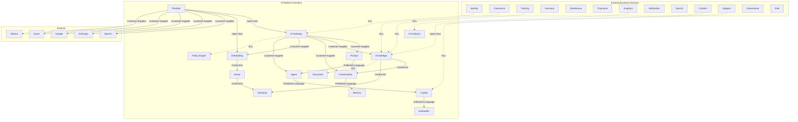

### 7.3 Anti-Corruption Layer Details

#### Commerce to AI

| Direction | ACL Strategy |
| --- | --- |
| Commerce to AI (Knowledge) | Product data translated to KnowledgeDocument via CommerceProductAdapter. Commerce domain model never exposed to AI. Only published knowledge documents cross boundary. |
| AI to Commerce (Recommendations) | AI recommendations translated to Commerce-friendly format via AIRecommendationAdapter. Business rules applied before Commerce accepts recommendations. |

#### Training to AI

| Direction | ACL Strategy |
| --- | --- |
| Training to AI (Knowledge) | Course content, assessments, and materials translated to KnowledgeDocument via TrainingContentAdapter. Only finalized, published content crosses boundary. |
| AI to Training (Personalization) | AI recommendations for learning paths translated to Training format via AILearningAdapter. Training validates recommendations against curriculum constraints. |

#### Analytics to AI

| Direction | ACL Strategy |
| --- | --- |
| AI to Analytics (Metrics) | AI usage, cost, and performance metrics translated to Analytics format via AIMetricsAdapter. Aggregated, anonymized data only. |
| Analytics to AI (Insights) | Business metrics translated for AI consumption via AnalyticsInsightsAdapter. Only non-sensitive aggregated data crosses boundary. |

#### Support to AI

| Direction | ACL Strategy |
| --- | --- |
| Support to AI (Knowledge) | Support tickets and resolutions translated to KnowledgeDocument via SupportKnowledgeAdapter. PII stripped. Only resolved cases. |
| AI to Support (Automation) | AI-generated responses and ticket classifications translated to Support format via AISupportAdapter. Human review queue for sensitive cases. |

#### Knowledge to Existing Services

| Direction | ACL Strategy |
| --- | --- |
| Content to Knowledge | Content service documents ingested via ContentIngestionAdapter. Metadata mapped. Access control preserved. |
| Search to Knowledge | Existing search indexes augmented with AI semantic results via SearchEnrichmentAdapter. Hybrid search results merged transparently. |

---
## 8. Service Ownership Matrix

| Service | Team | Repository | Database | Events | API | Infrastructure | Documentation | Testing |
| --- | --- | --- | --- | --- | --- | --- | --- | --- |
| identity-service | Identity Team | services/identity-service | identity-db | identity-events | REST | Kubernetes | docs/services/identity | identity-tests |
| order-service | Commerce Team | services/order-service | order-db | order-events | REST | Kubernetes | docs/services/order | order-tests |
| cart-service | Commerce Team | services/cart-service | cart-db | cart-events | REST | Kubernetes | docs/services/cart | cart-tests |
| catalog-service | Commerce Team | services/catalog-service | catalog-db | catalog-events | REST | Kubernetes | docs/services/catalog | catalog-tests |
| inventory-service | Inventory Team | services/inventory-service | inventory-db | inventory-events | REST | Kubernetes | docs/services/inventory | inventory-tests |
| fulfillment-service | Fulfillment Team | services/fulfillment-service | fulfillment-db | fulfillment-events | REST | Kubernetes | docs/services/fulfillment | fulfillment-tests |
| training-service | Training Team | services/training-service | training-db | training-events | REST | Kubernetes | docs/services/training | training-tests |
| payment-service | Payments Team | services/payment-service | payment-db | payment-events | REST | Kubernetes | docs/services/payment | payment-tests |
| analytics-service | Analytics Team | services/analytics-service | analytics-db | analytics-events | REST | Kubernetes | docs/services/analytics | analytics-tests |
| notification-service | Platform Team | services/notification-service | notification-db | notification-events | REST | Kubernetes | docs/services/notification | notification-tests |
| search-service | Platform Team | services/search-service | elasticsearch | search-events | REST | Kubernetes | docs/services/search | search-tests |
| content-service | Platform Team | services/content-service | content-db + S3 | content-events | REST | Kubernetes | docs/services/content | content-tests |
| support-service | Support Team | services/support-service | support-db | support-events | REST | Kubernetes | docs/services/support | support-tests |
| governance-service | Governance Team | services/governance-service | governance-db | governance-events | REST | Kubernetes | docs/services/governance | governance-tests |
| risk-service | Risk Team | services/risk-service | risk-db | risk-events | REST | Kubernetes | docs/services/risk | risk-tests |
| ai-gateway-service | AI Platform Team | services/ai-gateway-service | gateway-db + Redis | gateway-events | REST + gRPC | Kubernetes | docs/services/ai-gateway | ai-gateway-tests |
| prompt-service | AI Platform Team | services/prompt-service | prompt-db | prompt-events | REST | Kubernetes | docs/services/prompt | prompt-tests |
| knowledge-service | AI Platform Team | services/knowledge-service | knowledge-db + S3 | knowledge-events | REST + gRPC | Kubernetes | docs/services/knowledge | knowledge-tests |
| conversation-service | AI Platform Team | services/conversation-service | conversation-db | conversation-events | REST + WebSocket | Kubernetes | docs/services/conversation | conversation-tests |
| embedding-service | AI Platform Team | services/embedding-service | embedding-cache | embedding-events | REST + gRPC | Kubernetes (GPU) | docs/services/embedding | embedding-tests |
| vector-service | AI Platform Team | services/vector-service | vector-db | vector-events | REST + gRPC | Kubernetes (GPU) | docs/services/vector | vector-tests |
| semantic-service | AI Platform Team | services/semantic-service | semantic-cache | semantic-events | REST | Kubernetes | docs/services/semantic | semantic-tests |
| memory-service | AI Platform Team | services/memory-service | memory-db | memory-events | REST + gRPC | Kubernetes | docs/services/memory | memory-tests |
| provider-service | AI Platform Team | services/provider-service | provider-db | provider-events | REST | Kubernetes | docs/services/provider | provider-tests |
| agent-service | AI Platform Team | services/agent-service | agent-db | agent-events | REST + gRPC | Kubernetes | docs/services/agent | agent-tests |
| copilot-service | AI Platform Team | services/copilot-service | copilot-db | copilot-events | REST + WebSocket | Kubernetes | docs/services/copilot | copilot-tests |
| evaluation-service | AI Platform Team | services/evaluation-service | evaluation-db | evaluation-events | REST | Kubernetes | docs/services/evaluation | evaluation-tests |
| ai-analytics-service | AI Platform Team | services/ai-analytics-service | ai-analytics-db | ai-analytics-events | REST | Kubernetes | docs/services/ai-analytics | ai-analytics-tests |
| document-service | AI Platform Team | services/document-service | document-db + S3 | document-events | REST | Kubernetes (GPU) | docs/services/document | document-tests |
| policy-engine-service | AI Platform Team | services/policy-engine-service | policy-db | policy-events | REST | Kubernetes | docs/services/policy | policy-tests |
---
## 9. REST API Ownership

### 9.1 API Standards

All APIs across every service MUST conform to these standards:

| Standard | Requirement |
| --- | --- |
| Base URL | /api/{service-name}/v{version} |
| Versioning | URL-based major version. Header-based minor version. |
| Authentication | Bearer JWT (Authorization header) for internal services. API key for external consumers. |
| Authorization | RBAC enforced via JWT claims or API key scopes. |
| Content-Type | application/json for request and response bodies. |
| Error Format | RFC 7807 Problem Details. Standard error envelope. |
| Pagination | Cursor-based for lists. Page/pageSize as fallback. |
| Rate Limits | X-RateLimit-* headers. 429 with Retry-After. |
| Idempotency | Idempotency-Key header for mutation endpoints. |
| Caching | ETag + If-None-Match for GET endpoints. Cache-Control headers. |

### 9.2 AI Gateway API Contract

Base URL: /api/ai-gateway/v1

| Endpoint | Method | Auth | Owner | Description |
| --- | --- | --- | --- | --- |
| /chat/completions | POST | API Key | AI Gateway | Chat completion with streaming support |
| /completions | POST | API Key | AI Gateway | Text completion endpoint |
| /embeddings | POST | API Key | AI Gateway | Text embedding generation |
| /models | GET | API Key | AI Gateway | List available models |
| /models/{model} | GET | API Key | AI Gateway | Model details and capabilities |
| /usage | GET | API Key | AI Gateway | Usage statistics and limits |
| /health | GET | None | AI Gateway | Health check endpoint |

### 9.3 Prompt Service API Contract

Base URL: /api/prompt-service/v1

| Endpoint | Method | Auth | Owner | Description |
| --- | --- | --- | --- | --- |
| /prompts | GET | JWT | Prompt Service | List prompts with pagination |
| /prompts | POST | JWT | Prompt Service | Create new prompt |
| /prompts/{id} | GET | JWT | Prompt Service | Get prompt details |
| /prompts/{id} | PUT | JWT | Prompt Service | Update prompt metadata |
| /prompts/{id}/versions | POST | JWT | Prompt Service | Create new version |
| /prompts/{id}/versions/{versionId} | GET | JWT | Prompt Service | Get version details |
| /prompts/{id}/deploy | POST | JWT | Prompt Service | Deploy version to environment |
| /prompts/{id}/rollback | POST | JWT | Prompt Service | Rollback to previous version |
| /prompts/{id}/approve | POST | JWT | Prompt Service | Approve version for production |

### 9.4 Knowledge Service API Contract

Base URL: /api/knowledge-service/v1

| Endpoint | Method | Auth | Owner | Description |
| --- | --- | --- | --- | --- |
| /sources | GET | JWT | Knowledge Service | List knowledge sources |
| /sources | POST | JWT | Knowledge Service | Register knowledge source |
| /sources/{id} | DELETE | JWT | Knowledge Service | Remove knowledge source |
| /documents | GET | JWT | Knowledge Service | List documents with filters |
| /documents | POST | JWT | Knowledge Service | Ingest document |
| /documents/{id} | GET | JWT | Knowledge Service | Get document details |
| /documents/{id}/chunks | GET | JWT | Knowledge Service | List document chunks |
| /search | POST | JWT/API | Knowledge Service | Search knowledge base |
| /search/hybrid | POST | JWT/API | Knowledge Service | Hybrid semantic + keyword search |

### 9.5 Conversation Service API Contract

Base URL: /api/conversation-service/v1

| Endpoint | Method | Auth | Owner | Description |
| --- | --- | --- | --- | --- |
| /conversations | POST | JWT | Conversation Service | Create conversation |
| /conversations/{id} | GET | JWT | Conversation Service | Get conversation details |
| /conversations/{id} | DELETE | JWT | Conversation Service | Delete conversation |
| /conversations/{id}/messages | POST | JWT | Conversation Service | Send message |
| /conversations/{id}/messages | GET | JWT | Conversation Service | List messages with cursor pagination |
| /conversations/{id}/messages/{msgId} | GET | JWT | Conversation Service | Get message details |
| /conversations/{id}/summarize | POST | JWT | Conversation Service | Generate conversation summary |
| /conversations/{id}/context | GET | JWT | Conversation Service | Get current context window |

### 9.6 Agent Service API Contract

Base URL: /api/agent-service/v1

| Endpoint | Method | Auth | Owner | Description |
| --- | --- | --- | --- | --- |
| /agents | GET | JWT | Agent Service | List agents |
| /agents | POST | JWT | Agent Service | Register agent |
| /agents/{id} | GET | JWT | Agent Service | Get agent details |
| /agents/{id} | PUT | JWT | Agent Service | Update agent configuration |
| /agents/{id} | DELETE | JWT | Agent Service | Deactivate agent |
| /agents/{id}/execute | POST | JWT | Agent Service | Execute agent with input |
| /agents/{id}/executions/{execId} | GET | JWT | Agent Service | Get execution status |
| /agents/{id}/executions/{execId}/cancel | POST | JWT | Agent Service | Cancel execution |
| /agents/{id}/approve | POST | JWT | Agent Service | Approve pending agent action |

### 9.7 Copilot Service API Contract

Base URL: /api/copilot-service/v1

| Endpoint | Method | Auth | Owner | Description |
| --- | --- | --- | --- | --- |
| /copilots | GET | JWT | Copilot Service | List copilots available to user |
| /copilots/{id} | GET | JWT | Copilot Service | Get copilot details |
| /copilots/{id}/chat | POST | JWT | Copilot Service | Send message to copilot |
| /copilots/{id}/knowledge | GET | JWT | Copilot Service | List bound knowledge sources |
| /copilots/{id}/knowledge | POST | JWT | Copilot Service | Bind knowledge source |

### 9.8 Provider Service API Contract

Base URL: /api/provider-service/v1

| Endpoint | Method | Auth | Owner | Description |
| --- | --- | --- | --- | --- |
| /providers | GET | JWT | Provider Service | List configured providers |
| /providers | POST | JWT | Provider Service | Add provider configuration |
| /providers/{id} | GET | JWT | Provider Service | Get provider details |
| /providers/{id} | PUT | JWT | Provider Service | Update provider configuration |
| /providers/{id} | DELETE | JWT | Provider Service | Remove provider |
| /providers/{id}/health | GET | JWT | Provider Service | Get provider health status |
| /providers/{id}/rotate | POST | JWT | Provider Service | Rotate API credentials |

### 9.9 Evaluation Service API Contract

Base URL: /api/evaluation-service/v1

| Endpoint | Method | Auth | Owner | Description |
| --- | --- | --- | --- | --- |
| /evaluations | GET | JWT | Evaluation Service | List evaluations |
| /evaluations | POST | JWT | Evaluation Service | Create evaluation run |
| /evaluations/{id} | GET | JWT | Evaluation Service | Get evaluation results |
| /evaluations/{id}/cancel | POST | JWT | Evaluation Service | Cancel running evaluation |
| /metrics | GET | JWT | Evaluation Service | List available metrics |
---
## 10. Event Ownership

### 10.1 Event Standards

All events across every service MUST conform to these standards:

| Standard | Requirement |
| --- | --- |
| Schema Registry | Confluent Schema Registry. Avro format. |
| Topic Naming | {domain}.{service}.{event-name}.v{version} |
| Idempotency | Event idempotency key (eventId UUID). Exactly-once delivery semantics. |
| Ordering | Partition key = aggregateId. All events for an aggregate ordered within partition. |
| Retention | 7 days default. Configurable per topic. |
| Dead Letter Queue | {topic}.dlq for failed events. DLQ consumer per service. |
| Retry | 3 retries with exponential backoff. Max 30s delay. |
| Event Versioning | Backward-compatible schema evolution. New fields optional with defaults. |

### 10.2 Business Domain Events

| Event Name | Topic | Publisher | Key Consumers |
| --- | --- | --- | --- |
| UserRegistered | identity.user.registered.v1 | identity-service | notification, analytics |
| UserLoggedIn | identity.user.logged-in.v1 | identity-service | analytics, risk |
| OrderCreated | commerce.order.created.v1 | order-service | fulfillment, notification, analytics, inventory |
| OrderConfirmed | commerce.order.confirmed.v1 | order-service | fulfillment, notification |
| OrderShipped | commerce.order.shipped.v1 | fulfillment-service | order, notification, analytics |
| PaymentSucceeded | payment.payment.succeeded.v1 | payment-service | order, notification, analytics |
| PaymentFailed | payment.payment.failed.v1 | payment-service | order, notification, risk |
| CoursePublished | training.course.published.v1 | training-service | notification, search |
| StudentEnrolled | training.student.enrolled.v1 | training-service | notification, analytics |
| CertificationIssued | training.certification.issued.v1 | training-service | notification, analytics |
| TicketCreated | support.ticket.created.v1 | support-service | notification, analytics |
| StockLow | inventory.stock.low.v1 | inventory-service | order, notification |

### 10.3 AI Platform Events

| Event Name | Topic | Publisher | Key Consumers |
| --- | --- | --- | --- |
| AIRequestRouted | ai.gateway.request-routed.v1 | ai-gateway-service | ai-analytics, evaluation |
| AIResponseReceived | ai.gateway.response-received.v1 | ai-gateway-service | ai-analytics, evaluation |
| RateLimitExceeded | ai.gateway.rate-limit-exceeded.v1 | ai-gateway-service | ai-analytics, notification |
| PromptDeployed | ai.prompt.deployed.v1 | prompt-service | agent, copilot, evaluation |
| PromptEvaluated | ai.prompt.evaluated.v1 | evaluation-service | prompt-service |
| DocumentIngested | ai.knowledge.document-ingested.v1 | knowledge-service | embedding-service |
| DocumentChunked | ai.knowledge.document-chunked.v1 | knowledge-service | embedding-service |
| DocumentIndexed | ai.knowledge.document-indexed.v1 | vector-service | knowledge-service |
| KnowledgeSearched | ai.knowledge.searched.v1 | knowledge-service | ai-analytics |
| ConversationCreated | ai.conversation.created.v1 | conversation-service | memory, ai-analytics |
| MessageAdded | ai.conversation.message-added.v1 | conversation-service | memory, evaluation |
| ConversationSummarized | ai.conversation.summarized.v1 | conversation-service | memory-service |
| MemoryStored | ai.memory.stored.v1 | memory-service | conversation-service |
| MemoryConsolidated | ai.memory.consolidated.v1 | memory-service | conversation-service |
| EmbeddingGenerated | ai.embedding.generated.v1 | embedding-service | knowledge, vector |
| AgentExecutionStarted | ai.agent.execution-started.v1 | agent-service | copilot, ai-analytics |
| AgentExecutionCompleted | ai.agent.execution-completed.v1 | agent-service | copilot, evaluation, ai-analytics |
| AgentExecutionFailed | ai.agent.execution-failed.v1 | agent-service | copilot, ai-analytics |
| CopilotQueried | ai.copilot.queried.v1 | copilot-service | ai-analytics, evaluation |
| EvaluationCompleted | ai.evaluation.completed.v1 | evaluation-service | prompt, ai-analytics |
| HallucinationDetected | ai.evaluation.hallucination-detected.v1 | evaluation-service | prompt, ai-analytics |
| ProviderHealthChanged | ai.provider.health-changed.v1 | provider-service | ai-gateway-service |
| ViolationDetected | ai.policy.violation-detected.v1 | policy-engine-service | governance, ai-analytics |

### 10.4 Event Flow Diagram

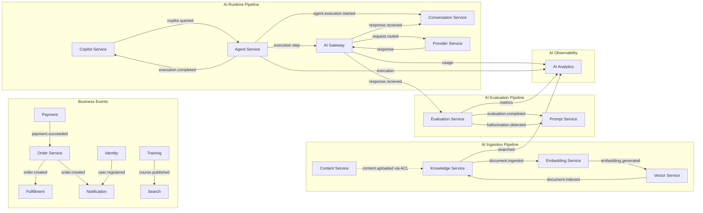
---
## 11. Data Ownership

### 11.1 Data Ownership Principles

1. **Every aggregate root owns its database table(s).** No two aggregates share the same table.
2. **Every service owns its database exclusively.** No other service reads or writes directly to another service database.
3. **Cross-service data access is through APIs only.** No shared databases, no direct query access.
4. **Caching is owned by the service that owns the data.** Cache-aside pattern with TTL.
5. **Vector storage is owned by the Vector context.** All vector write operations go through vector-service.
6. **Object storage is owned by the Content context.** All file storage goes through content-service.
7. **Audit logs are owned by the Governance context.** All services emit audit events.
8. **Backup and retention policies are defined per service.** Minimum 30-day retention for operational data.

### 11.2 Database Ownership Summary

| Service | Database Engine | Database Name | Cache (Redis) | Vector | Object | Audit | Backup | Retention |
| --- | --- | --- | --- | --- | --- | --- | --- | --- |
| identity-service | PostgreSQL | identity-db | Session (15min) | - | - | Events | Daily | 7 year |
| order-service | PostgreSQL | order-db | Order (5min) | - | - | Events | Daily | 7 year |
| cart-service | Redis | cart-db | Primary store | - | - | Events | RDB snap | 7 day |
| catalog-service | PostgreSQL | catalog-db | Product (1h) | - | - | Events | Daily | 5 year |
| inventory-service | PostgreSQL | inventory-db | Stock (30s) | - | - | Events | Daily | 2 year |
| fulfillment-service | PostgreSQL | fulfillment-db | Status (5min) | - | - | Events | Daily | 2 year |
| training-service | PostgreSQL | training-db | Course (1h) | - | - | Events | Daily | 5 year |
| payment-service | PostgreSQL | payment-db | Payment (5min) | - | - | Events | Daily | 10 year |
| analytics-service | ClickHouse | analytics-db | Report (1h) | - | - | Events | Daily | 2 year |
| notification-service | PostgreSQL | notification-db | Template (1h) | - | - | Events | Daily | 90 day |
| search-service | Elasticsearch | search-index | Query (5min) | - | - | Events | Snapshot | 30 day |
| content-service | PostgreSQL + S3 | content-db | Metadata (1h) | - | S3 | Events | Daily | 7 year |
| support-service | PostgreSQL | support-db | Ticket (5min) | - | - | Events | Daily | 3 year |
| governance-service | PostgreSQL | governance-db | - | - | - | Immutable | Daily | 10 year |
| risk-service | PostgreSQL | risk-db | Score (30s) | - | - | Events | Daily | 3 year |
| ai-gateway-service | PostgreSQL + Redis | gateway-db | Rate, Response (5min) | - | - | Full logs | Daily | 90 day |
| prompt-service | PostgreSQL | prompt-db | Prompt (1h) | - | - | Events | Daily | 5 year |
| knowledge-service | PostgreSQL + S3 | knowledge-db | Chunk (1h) | - | S3 | Events | Daily | 5 year |
| conversation-service | PostgreSQL | conversation-db | Active (1h) | - | - | Events | Daily | 90 day |
| embedding-service | Redis | embedding-cache | LRU cache | - | - | Events | RDB snap | 7 day |
| vector-service | pgvector/Weaviate | vector-db | Search (5min) | Primary | - | Events | Snapshot | 30 day |
| semantic-service | Redis | semantic-cache | Search (5min) | - | - | Events | RDB snap | 7 day |
| memory-service | PostgreSQL | memory-db | Working (15min) | - | - | Events | Daily | 30 day |
| provider-service | PostgreSQL | provider-db | Provider (5min) | - | - | Events | Daily | 90 day |
| agent-service | PostgreSQL | agent-db | Execution (30min) | - | - | Events | Daily | 90 day |
| copilot-service | PostgreSQL | copilot-db | Copilot (5min) | - | - | Events | Daily | 90 day |
| evaluation-service | PostgreSQL | evaluation-db | Eval (1h) | - | - | Events | Daily | 1 year |
| ai-analytics-service | ClickHouse | ai-analytics-db | Report (1h) | - | - | Events | Daily | 2 year |
| document-service | PostgreSQL + S3 | document-db | Process (5min) | - | S3 | Events | Daily | 90 day |
| policy-engine-service | PostgreSQL | policy-db | Policy (5min) | - | - | Events | Daily | 5 year |

---
## 12. Dependency Rules

### 12.1 Allowed Dependencies

| Layer | May Depend On |
| --- | --- |
| AI Services | AI Gateway (LLM execution), Identity (JWT validation), Internal service APIs only |
| Business Services | Identity (auth), Internal service APIs only |
| AI Gateway | Provider Service, Identity (API key validation) |
| Provider Service | External LLM APIs only |
| Copilot Service | Agent, Knowledge, Conversation, AI Gateway, Prompt |
| Agent Service | Conversation, Knowledge, AI Gateway, Prompt |
| Knowledge Service | Content (via ACL), Embedding, Vector |
| All Services | Registry, Governance (audit events) |

### 12.2 Forbidden Dependencies

| Pattern | Forbidden | Rationale |
| --- | --- | --- |
| Direct database access | Any service reading/writing another service database | Breaks bounded context. Creates hidden coupling. |
| Synchronous cascading | AI service calling another AI service synchronously in request path | Creates latency chains. Reduces resilience. |
| Circular dependencies | Service A to Service B to Service A | Creates deployment coupling. Hard to debug. |
| Shared domain models | Sharing JPA entities across services | Creates fragile build-time coupling. |
| Shared caches | Writing to another service Redis instance | Data ownership violation. |
| Direct external access | AI services calling LLM providers directly | Bypasses AI Gateway. No rate limiting or audit. |
| Shared databases | Multiple services writing to same database | Bounded context violation. Schema coupling. |

### 12.3 Layering Rules

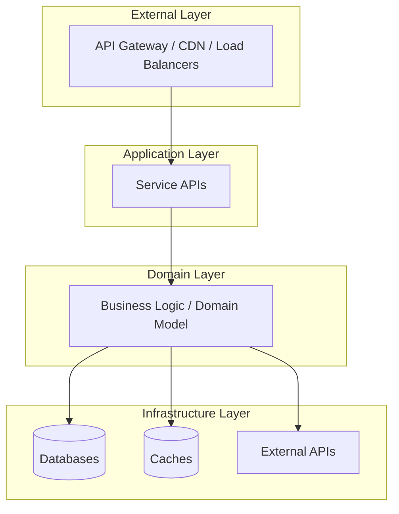

- Outer layers may depend on inner layers.
- Inner layers NEVER depend on outer layers.
- Cross-service communication is always at the Application layer.

### 12.4 Communication Rules

| Pattern | Rules |
| --- | --- |
| Synchronous (REST/gRPC) | Allowed for queries and commands requiring immediate response. Must have timeout (max 5s). Must have circuit breaker. |
| Asynchronous (Kafka) | Preferred for cross-service communication and event notifications. |
| Streaming (WebSocket/gRPC) | Allowed for real-time communication. Must handle reconnection. |
---
## 13. Anti-Corruption Layers

### 13.1 ACL Architecture

Anti-Corruption Layers (ACLs) prevent domain model leakage between bounded contexts. Every ACL is a dedicated translation layer that converts between the upstream domain model and the downstream domain model.

### 13.2 Commerce Knowledge ACL

| Adapter | Input (Commerce) | Output (Knowledge) | Translation Rules |
| --- | --- | --- | --- |
| CommerceProductAdapter | Product, SKU, Category | KnowledgeDocument | Product name to title. Description to content. Category to tag. SKU to metadata. |
| CommerceOrderAdapter | Order, OrderItem | KnowledgeDocument | Only completed orders. PII stripped. |
| CommerceFAQAdapter | Product FAQ, Support KB | KnowledgeDocument | Q&A pairs preserved. Category from product. |

### 13.3 Training Knowledge ACL

| Adapter | Input (Training) | Output (Knowledge) | Translation Rules |
| --- | --- | --- | --- |
| TrainingContentAdapter | Course, Module, Lesson | KnowledgeDocument | Course title to title hierarchy. Lesson content as primary. |
| TrainingAssessmentAdapter | Assessment, Questions | KnowledgeDocument | Question bank as FAQ content. Answers as reference. |
| TrainingCertificationAdapter | Certification, Credential | KnowledgeDocument | Requirements and syllabus as reference. |

### 13.4 Support Knowledge ACL

| Adapter | Input (Support) | Output (Knowledge) | Translation Rules |
| --- | --- | --- | --- |
| SupportTicketAdapter | Ticket, Resolution | KnowledgeDocument | Problem to question. Resolution to answer. PII stripped. |
| SupportKBAdapter | KB Article | KnowledgeDocument | Direct mapping. Category preserved. |

### 13.5 ACL Rules

1. ACL runs in the consuming service process space.
2. ACL never modifies upstream data.
3. ACL validates translated data.
4. ACL logs all translations for audit.
5. ACL handles upstream model changes via adapter versioning.
6. ACL strips PII, financial data, and credentials.

---
## 14. AI Knowledge Domain

### 14.1 Knowledge Domain Model

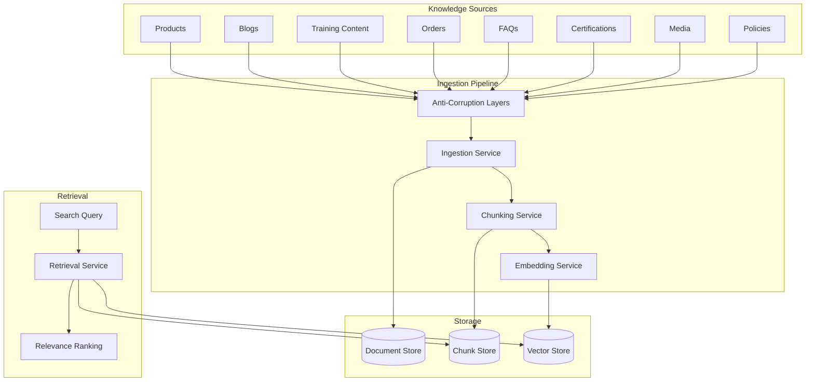

### 14.2 Knowledge Source Lifecycle

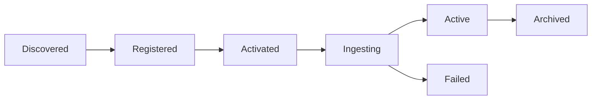

### 14.3 Document Lifecycle


| Stage | Description | Owner |
| --- | --- | --- |
| Received | Document accepted from source | Knowledge Service |
| Validated | Format, size, dedup check | Knowledge Service |
| Chunked | Content split into chunks | Knowledge Service |
| Embedded | Chunks converted to vectors | Embedding Service |
| Indexed | Vectors stored in vector index | Vector Service |
| Archived | Document retained but deindexed | Knowledge Service |

### 14.4 Knowledge Ownership Rules

1. Knowledge-service owns all document and chunk data.
2. Chunking strategy is configured per source type.
3. Embedding is delegated to embedding-service via API call.
4. Vector storage is delegated to vector-service via API call.
5. Retrieval combines keyword search + vector search.
6. Relevance ranking combines BM25 + cosine similarity + optional reranker.

---
## 15. Conversation Domain

### 15.1 Conversation Domain Model

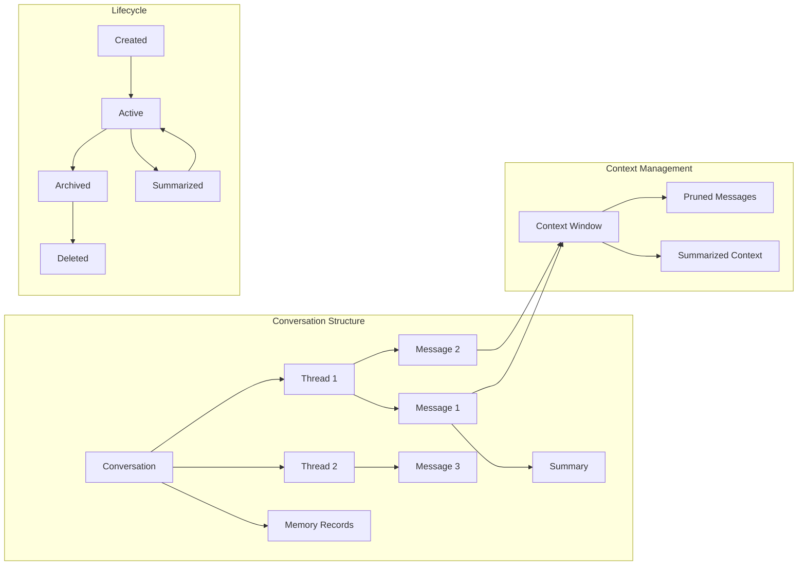

### 15.2 Conversation Lifecycle

Created -> Active -> [Summarized -> Active]* -> Archived -> Deleted

| Stage | Description | Owner |
| --- | --- | --- |
| Created | New conversation initialized with system message | Conversation Service |
| Active | Conversation accepting messages | Conversation Service |
| Summarized | Periodic summary generated for long context | Conversation Service |
| Archived | Conversation closed, retained for history | Conversation Service |
| Deleted | Conversation purged per retention policy | Conversation Service |

### 15.3 Context Window Strategy

| Strategy | Description | Trigger |
| --- | --- | --- |
| Sliding Window | Keep last N messages. Prune oldest. | Token count exceeds limit |
| Summarization | Generate summary of pruned messages | After every pruning |
| Hierarchical | Summary + Recent messages + Full context | When full context exceeds limit |
| Selective | Keep messages with high relevance score | Based on query relevance |

### 15.4 Conversation Ownership Rules

1. Conversation-service owns all conversation, thread, and message data.
2. Conversations are user-scoped. Cross-user conversation requires explicit sharing.
3. Context window management is internal to conversation-service.
4. Memory delegation to memory-service via API.
5. LLM calls are delegated to AI Gateway.
6. Retrieval from knowledge-service is performed for every user message.

---
## 16. Prompt Domain

### 16.1 Prompt Domain Model

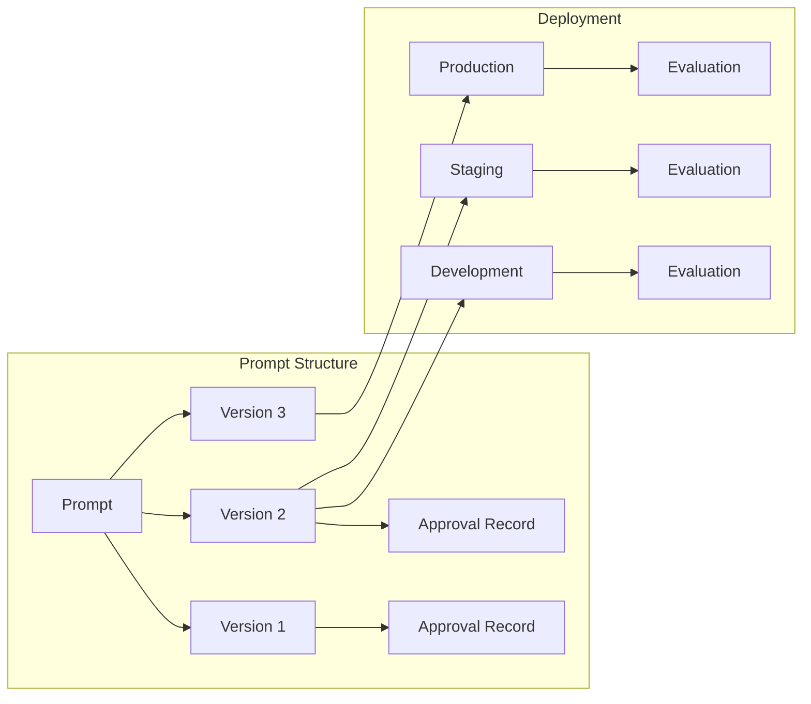

### 16.2 Prompt Lifecycle

Draft -> Staged -> Approved -> Deployed -> Active -> RolledBack -> Deprecated -> Archived

| Stage | Description | Owner |
| --- | --- | --- |
| Draft | Prompt being authored. Not visible to consumers. | Prompt Author |
| Staged | Prompt submitted for review. | Prompt Author |
| Approved | Prompt approved by designated approver. | Approver |
| Deployed | Prompt deployed to target environment. | Prompt Service |
| Active | Prompt serving production traffic. | Prompt Service |
| RolledBack | Previous version restored. | Prompt Service |
| Deprecated | Prompt marked for removal. | Prompt Service |
| Archived | Prompt data retained but inactive. | Prompt Service |

### 16.3 Prompt Versioning Rules

1. Versions are immutable after creation.
2. Version numbers increment monotonically.
3. Each version stores the full template, not a diff.
4. Production deployment requires at least one approval.
5. Rollback creates a new deployment pointing to a previous version.
6. Concurrent versions can be A/B tested.
---
## 17. Agent Domain

### 17.1 Agent Domain Model

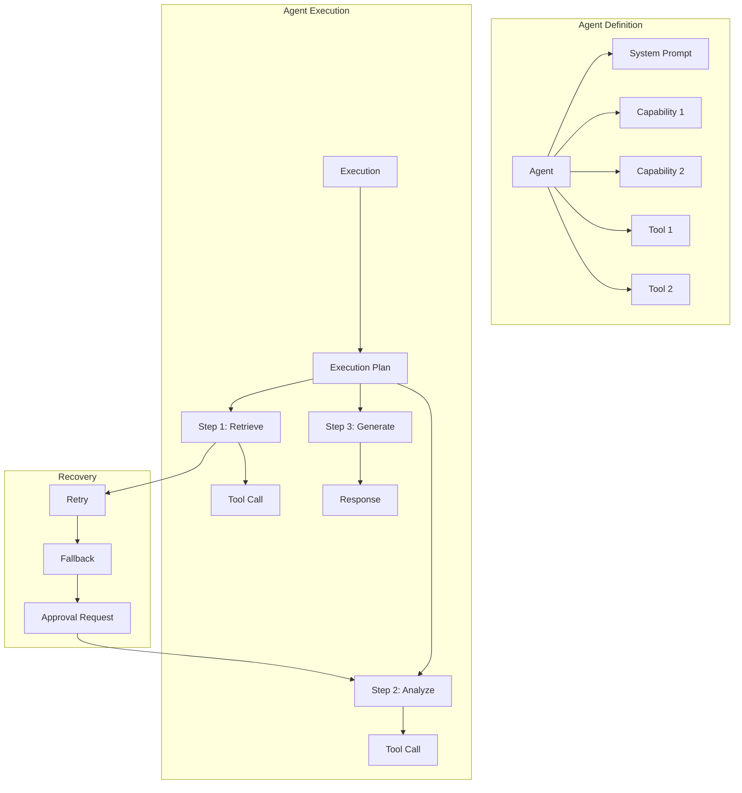

### 17.2 Agent Lifecycle

Registered -> Active -> Suspended -> Archived

### 17.3 Execution Lifecycle

Created -> Planning -> Executing -> Completed / Failed / Cancelled

### 17.4 Agent Ownership Rules

1. Agent-service owns agent definitions, capabilities, tools, and executions.
2. System prompts are managed by prompt-service and referenced by agents.
3. Tool executions are delegated to the appropriate service via API.
4. Human-in-the-loop approval is enforced for high-risk operations.
5. Each execution has a maximum duration (configurable, default 15 minutes).
6. Checkpoints are persisted every step for recovery.

---
## 18. Copilot Domain

### 18.1 Copilot Types and Responsibilities

| Copilot | Primary Users | Primary Knowledge | Key Capabilities |
| --- | --- | --- | --- |
| Customer Copilot | End customers | Product catalog, FAQs, orders, support KB | Product search, order status, returns, FAQs |
| Admin Copilot | Platform administrators | Policies, user management, system config | User management, policy lookup, system health |
| Trainer Copilot | Trainers, instructors | Course content, assessments, student data | Course authoring, student progress, grading assist |
| Developer Copilot | Engineering team | API docs, code repos, architecture docs | Code generation, API reference, troubleshooting |
| Warehouse Copilot | Warehouse staff | Inventory, fulfillment, shipping | Stock lookup, pick path, shipment tracking |
| Finance Copilot | Finance team | Invoices, payments, costs, budgets | Invoice lookup, expense analysis, cost reporting |
| Governance Copilot | Compliance team | Policies, audit logs, regulations | Policy lookup, compliance check, audit analysis |
| Business Copilot | Executives | KPIs, reports, analytics | Report generation, insight queries, trend analysis |

### 18.2 Copilot Domain Model

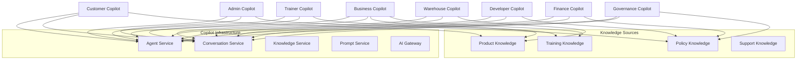

### 18.3 Copilot Lifecycle

Registered -> Configured -> Active -> Disabled -> Archived

---
## 19. Evaluation Domain

### 19.1 Evaluation Domain Model

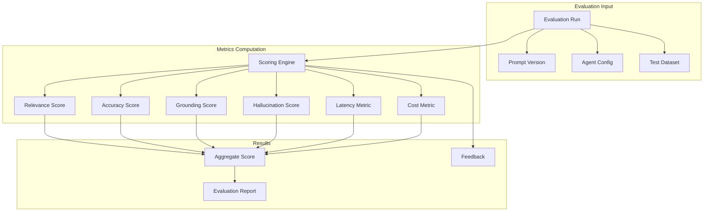

### 19.2 Metrics Definition

| Metric | Description | Calculation | Weight |
| --- | --- | --- | --- |
| Relevance | How relevant is the response to the query | LLM-judge or embedding similarity | 25% |
| Accuracy | Factual correctness of the response | Ground-truth comparison | 25% |
| Grounding | Percentage of claims supported by sources | Citation verification | 20% |
| Hallucination | Presence of unsupported claims | NLI-based detection | 15% |
| Latency | Response generation time | P50/P95/P99 in ms | 5% |
| Cost | Cost per response | Token count model rate | 5% |
| Satisfaction | User satisfaction score | User feedback 1-5 | 5% |

### 19.3 Evaluation Ownership Rules

1. Evaluation-service owns all evaluation runs, metrics, and scores.
2. Evaluation datasets are versioned and stored in evaluation-db.
3. LLM-judge calls go through AI Gateway.
4. Evaluation results are immutable after completion.
5. Production traffic evaluation is sampled at configurable rate.

---
## 20. Provider Domain

### 20.1 Provider Domain Model

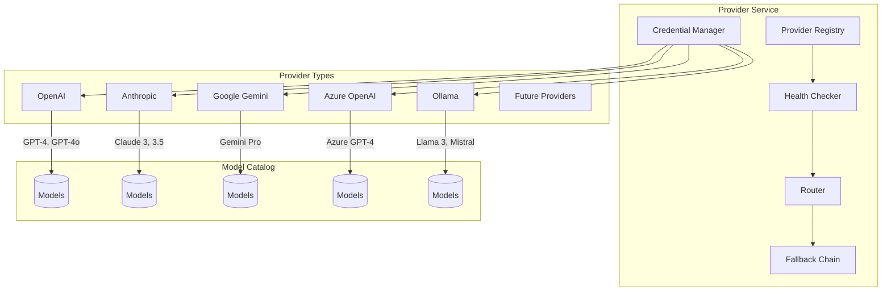

### 20.2 Provider Selection Strategy

| Strategy | Description | Use Case |
| --- | --- | --- |
| Primary | Always use configured primary provider | Default routing |
| Cost-Optimized | Select cheapest provider meeting requirements | Batch processing |
| Latency-Optimized | Select fastest provider | Interactive chat |
| Health-Aware | Skip unhealthy providers | Resilience |
| Fallback | Try providers in order on failure | Fault tolerance |

### 20.3 Provider Ownership Rules

1. Provider-service owns all provider configurations, credentials, and routing logic.
2. Credentials are encrypted at rest and in transit.
3. Credential rotation is managed by provider-service.
4. Health checks run every 60 seconds per provider.
5. Fallback chains are configured per model type.
6. Direct LLM calls from other services are forbidden, all traffic goes through AI Gateway.
---
## 21. Mermaid Domain Diagrams

### 21.1 Complete Domain Map

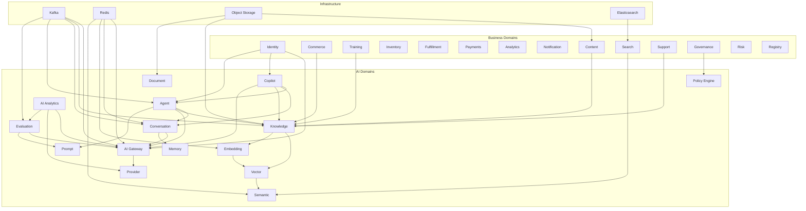

### 21.2 Bounded Context Diagram

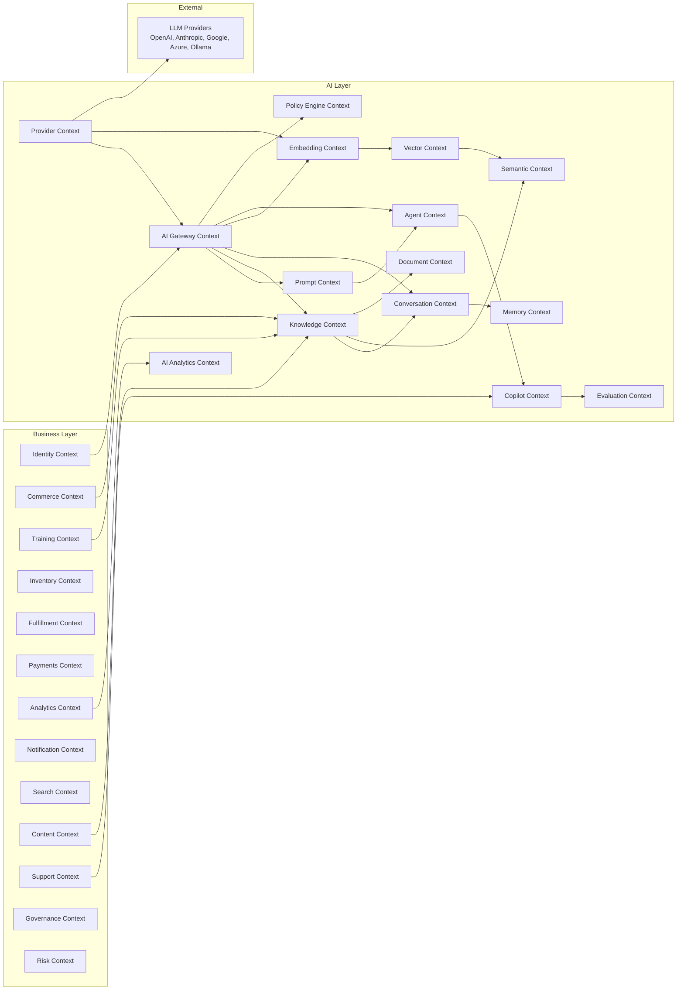

### 21.3 Context Mapping

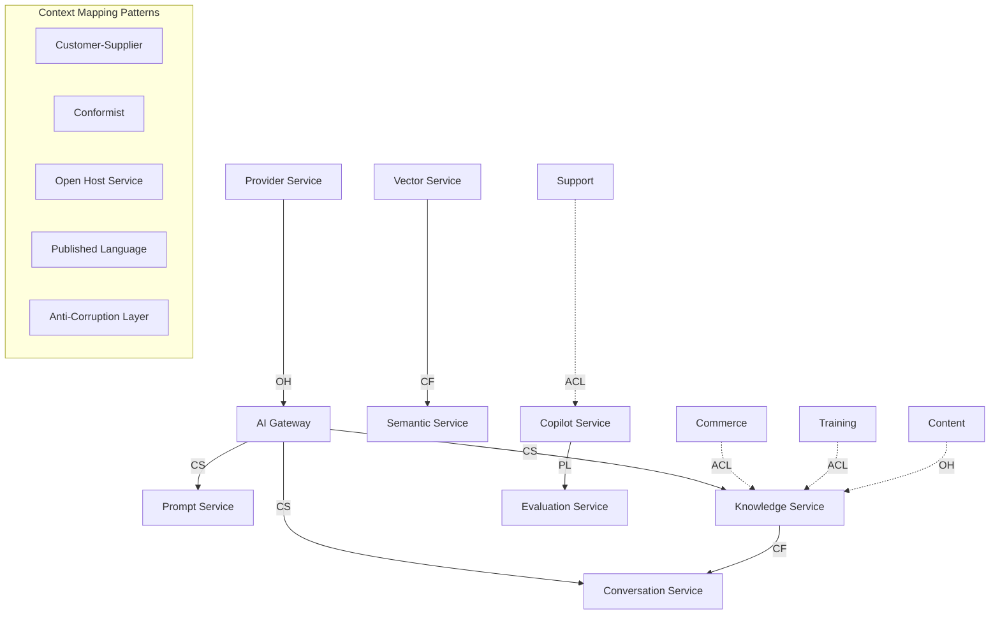

### 21.4 Knowledge Flow

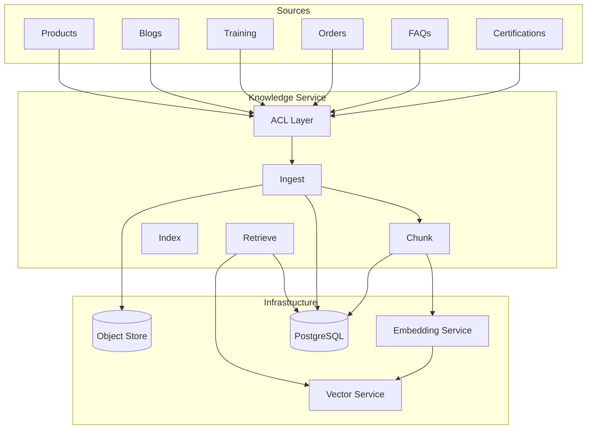

### 21.5 Conversation Flow

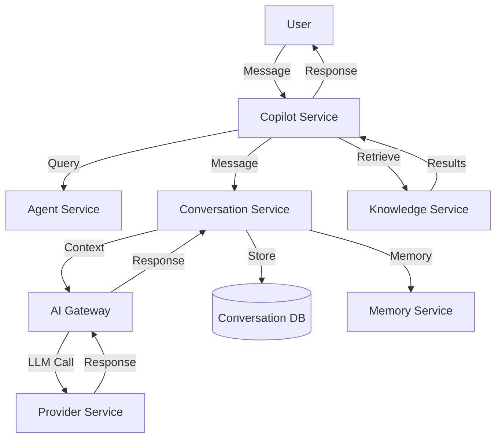

### 21.6 Evaluation Flow

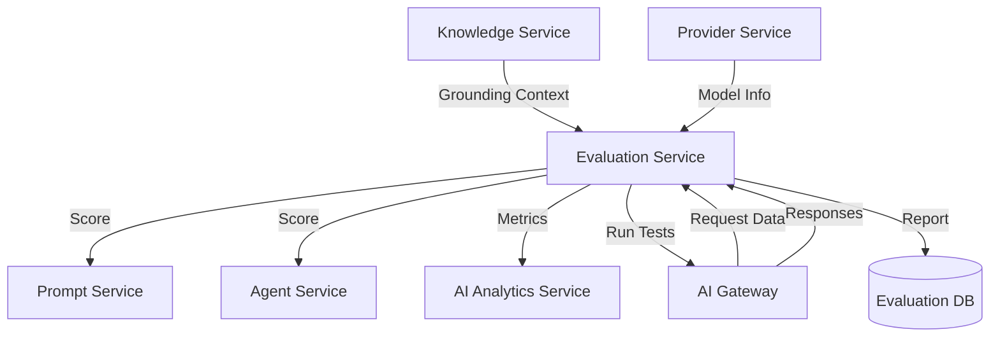

### 21.7 Copilot Relationships

```mermaid
graph TB
  CP[Copilot Service]
  CP --> AG[Agent Service]
  CP --> CV[Conversation Service]
  CP --> KN[Knowledge Service]
  CP --> PR[Prompt Service]
  CP --> GW[AI Gateway]
  CP --> DB[(Copilot DB)]

  CC[Customer Copilot] --> CP
  AC[Admin Copilot] --> CP
  TC[Trainer Copilot] --> CP
  DC[Developer Copilot] --> CP
  WC[Warehouse Copilot] --> CP
  FC[Finance Copilot] --> CP
  GC[Governance Copilot] --> CP
  BC[Business Copilot] --> CP
```

### 21.8 Future Expansion

```mermaid
gantt
  title AI Platform Expansion Roadmap
  dateFormat YYYY-MM-DD
  section Sprint 29
  AI Gateway Foundation      :done, s29a, 2026-08-01, 14d
  Provider Service           :done, s29b, 2026-08-01, 14d
  Prompt Service MVP         :done, s29c, 2026-08-08, 10d
  section Sprint 30
  Knowledge Service Core     :active, s30a, 2026-08-15, 14d
  Embedding Service          :active, s30b, 2026-08-15, 14d
  Vector Service             :active, s30c, 2026-08-22, 10d
  section Sprint 31
  Conversation Service       :s31a, 2026-09-01, 14d
  Memory Service             :s31b, 2026-09-01, 14d
  section Sprint 32
  Agent Service              :s32a, 2026-09-15, 14d
  Copilot Service            :s32b, 2026-09-22, 10d
  section Sprint 33
  Evaluation Service         :s33a, 2026-10-01, 14d
  AI Analytics               :s33b, 2026-10-01, 14d
  section Phase 14
  Semantic Search            :p14a, 2026-10-15, 14d
  Document Intelligence      :p14b, 2026-10-15, 14d
  section Phase 15
  Policy Engine              :p15a, 2026-11-01, 14d
  Agent Marketplace          :p15b, 2026-11-01, 14d
  section Phase 16
  Multi-Agent Orchestration  :p16a, 2026-11-15, 14d
  Cross-Session Memory       :p16b, 2026-11-15, 14d
  section Phase 17
  AI Compliance Suite        :p17a, 2026-12-01, 14d
  Cost Optimization Engine   :p17b, 2026-12-01, 14d
  section Phase 18
  Multi-Modal AI             :p18a, 2026-12-15, 14d
  section Phase 19
  Autonomous Workflows       :p19a, 2027-01-01, 14d
  section Phase 20
  Full AI Autonomy           :p20a, 2027-01-15, 14d
```
---
## 22. Architecture Decision Records

### ADR-017: Domain-Driven Design

| Attribute | Value |
| --- | --- |
| ID | ADR-017 |
| Title | Domain-Driven Design as Architectural Foundation |
| Status | Accepted |
| Context | The Enterprise AI Platform must integrate with 18 existing business services and add 15 new AI services. Without a unifying architectural approach, service boundaries will erode, ownership will become ambiguous, and the system will degrade into a distributed monolith. |
| Problem | How to architect a multi-domain enterprise system with AI capabilities that ensures service independence, clear ownership, and maintainable boundaries over years of evolution. |
| Decision | Adopt Domain-Driven Design as the primary architectural methodology. Every service is designed within a bounded context. Every bounded context has one owner, one database, one API surface, and one lifecycle. Ubiquitous language is enforced across all teams. |
| Alternatives | Service-based architecture (no domain boundaries), microservices without DDD, layered architecture, event-driven architecture alone. |
| Consequences | All teams must learn DDD terminology. Initial design phase takes longer. Service boundaries require up-front agreement. |
| Tradeoffs | Higher initial design cost vs. significantly lower maintenance cost. More rigid boundaries vs. clearer ownership. |

### ADR-018: Bounded Context Strategy

| Attribute | Value |
| --- | --- |
| ID | ADR-018 |
| Title | Bounded Context Ownership and Boundaries |
| Status | Accepted |
| Context | With 33 services across business and AI domains, overlapping responsibilities and unclear data ownership are the primary risks. |
| Problem | How to define boundaries that prevent overlap while allowing necessary cross-service communication. |
| Decision | Each bounded context owns exactly one domain aggregate. No two contexts share a database. Cross-context communication is through APIs (synchronous) or events (asynchronous). Anti-corruption layers protect all AI-to-business boundaries. |
| Alternatives | Shared databases, shared domain models, shared caches. |
| Consequences | Contexts are independently deployable. Data duplication is accepted for performance. Eventual consistency is the default. |
| Tradeoffs | Data duplication increases storage costs. Eventual consistency adds complexity. Strict boundaries reduce flexibility. |

### ADR-019: Aggregate Design

| Attribute | Value |
| --- | --- |
| ID | ADR-019 |
| Title | Aggregate Root Design Principles |
| Status | Accepted |
| Context | Each bounded context contains multiple entities. The boundary of transactional consistency must be clearly defined. |
| Problem | How to design aggregates that balance consistency requirements with performance and scalability. |
| Decision | Aggregates are designed following Evans rules: reference other aggregates by identity only, keep aggregates small, use eventual consistency across aggregate boundaries, one transaction per aggregate. AI aggregates have smaller boundaries than business aggregates. |
| Alternatives | Large aggregates with full transactional consistency. Anemic domain model. |
| Consequences | Aggregates are independently scalable. Cross-aggregate operations are eventually consistent. |
| Tradeoffs | Smaller aggregates = more eventual consistency. Larger aggregates = more locking and contention. |

### ADR-020: Event Ownership

| Attribute | Value |
| --- | --- |
| ID | ADR-020 |
| Title | Event Schema and Topic Ownership |
| Status | Accepted |
| Context | Cross-service communication through events requires strict schema governance and ownership. |
| Problem | How to manage event schemas, prevent breaking changes, and ensure clear ownership. |
| Decision | Every event is owned by the publishing service. Event schemas use Avro with Confluent Schema Registry. Topics follow {domain}.{service}.{event-name}.v{version} naming. Breaking changes create new topic versions. Backward-compatible evolution is required. |
| Alternatives | JSON Schema, Protocol Buffers, shared event libraries. |
| Consequences | Schema registry adds operational complexity. Topic versioning creates multiple topic families. |
| Tradeoffs | Schema registry overhead vs. protection from breaking changes. |

### ADR-021: Service Contracts

| Attribute | Value |
| --- | --- |
| ID | ADR-021 |
| Title | Service Contract First Development |
| Status | Accepted |
| Context | Services must communicate through well-defined interfaces. Ad-hoc API development leads to inconsistencies. |
| Problem | How to ensure all service APIs follow consistent patterns for versioning, auth, pagination, errors, and documentation. |
| Decision | All service APIs follow contract-first development. OpenAPI 3.1 specifications are written before implementation. All APIs follow the standards defined in Section 9.1. API reviews are mandatory before implementation. |
| Alternatives | Code-first development, informal API documentation. |
| Consequences | Initial development is slower. API quality and consistency are significantly higher. |
| Tradeoffs | Contract-first overhead vs. API consistency and consumer confidence. |

### ADR-022: Context Mapping

| Attribute | Value |
| --- | --- |
| ID | ADR-022 |
| Title | Context Mapping Patterns |
| Status | Accepted |
| Context | Different bounded contexts require different integration patterns. One pattern does not fit all. |
| Problem | How to choose the right context mapping pattern for each integration. |
| Decision | AI Gateway uses Open Host Service for all AI services. AI services use Customer-Supplier with AI Gateway. Anti-Corruption Layers protect all business-to-AI boundaries. Published Language (Avro) for all events. Conformist for downstream services consuming standardized output. |
| Alternatives | Shared Kernel (risky for AI), Separate Ways (loses integration value). |
| Consequences | Multiple patterns increase architectural complexity. Each pattern has well-defined use cases. |
| Tradeoffs | Pattern diversity vs. standardization. ACL overhead vs. domain protection. |

### ADR-023: Anti-Corruption Layer

| Attribute | Value |
| --- | --- |
| ID | ADR-023 |
| Title | Anti-Corruption Layer between Business and AI Domains |
| Status | Accepted |
| Context | Existing business domains (Commerce, Training, Support) have deeply established domain models. AI domains must integrate without leaking business domain complexity into AI models. |
| Problem | How to prevent business domain model leakage into AI domains while enabling knowledge transfer. |
| Decision | Dedicated ACLs run in the consuming service (knowledge-service) process space. Each ACL translates between business domain models and AI domain models. ACLs strip PII, validate data, log translations, and never modify upstream data. |
| Alternatives | Direct model sharing (creates coupling), manual translation (error-prone), shared libraries. |
| Consequences | ACLs add latency and complexity. Business domain changes require ACL updates. Domain isolation guarantees long-term maintainability. |
| Tradeoffs | Translation latency vs. domain purity. ACL maintenance cost vs. architectural integrity. |

---
## 23. Implementation Constraints

### 23.1 What Developers MUST Do

1. **Define bounded contexts before writing code.** Every new service must have a documented bounded context.
2. **Use contract-first development.** OpenAPI 3.1 before implementation. Avro schemas before events.
3. **Own your data.** Every service owns its database exclusively. No cross-service database access.
4. **Use ubiquitous language.** Use exactly the terms defined in Section 6. No synonyms or aliases.
5. **Design aggregates with consistency boundaries.** One transaction per aggregate. Eventual consistency across aggregates.
6. **Implement ACLs for business-to-AI integration.** No direct business domain model references in AI services.
7. **Route all LLM traffic through AI Gateway.** No direct provider calls from any service.
8. **Log all cross-context operations.** Audit trail for every API call and event.
9. **Version every API and event.** Major version in URL. Minor version in header. Event version in topic.
10. **Test in isolation.** Each service test suite must not depend on other services.

### 23.2 What Developers MUST NOT Do

1. **Do NOT share databases.** No service reads or writes another service database, even read-only.
2. **Do NOT share domain models.** No JPA entities, DTOs, or domain objects shared across services.
3. **Do NOT bypass AI Gateway.** No direct LLM provider calls from any service.
4. **Do NOT create circular dependencies.** Service A depends on B depends on A is forbidden.
5. **Do NOT use synchronous calls for event propagation.** Commands requiring async delivery use Kafka events.
6. **Do NOT ignore idempotency.** All mutation endpoints must handle idempotency keys.
7. **Do NOT skip ACLs.** Business-to-AI integration must always go through ACL.
8. **Do NOT create overlapping ownership.** Every service, event, and API has exactly one owner.
9. **Do NOT skip API reviews.** Every new or changed API endpoint requires architecture review.
10. **Do NOT break event compatibility.** Event schemas must be backward-compatible.

### 23.3 Naming Conventions

| Artifact | Convention | Example |
| --- | --- | --- |
| Service | {domain}-service | knowledge-service |
| Repository | services/{domain}-service | services/knowledge-service |
| Package | com.sporekart.{domain} | com.sporekart.knowledge |
| Database | {domain}-db | knowledge-db |
| Kafka Topic | {domain}.{service}.{event}.v{version} | ai.knowledge.document-ingested.v1 |
| API Endpoint | /api/{service}/v{version} | /api/knowledge-service/v1 |
| Event Schema | {Domain}{Event}Event | DocumentIngestedEvent |
| Aggregate Root | {Domain}{Entity} | KnowledgeDocument |
| Repository Class | {Entity}Repository | KnowledgeDocumentRepository |
| Domain Service | {Domain}{Service} | IngestionService |

### 23.4 Package Conventions

```
com.sporekart.{domain}/
  application/          # Application layer (controllers, DTOs, use cases)
  domain/               # Domain layer (entities, value objects, aggregates)
    model/              # Domain models
    service/            # Domain services
    repository/         # Repository interfaces
    event/              # Domain events
  infrastructure/       # Infrastructure layer (persistence, messaging, clients)
    persistence/        # Repository implementations
    messaging/          # Kafka producers/consumers
    client/             # External service clients (REST, gRPC)
    config/             # Service configuration
```

---
## 24. Future Expansion Strategy

### 24.1 Sprint 29: Core AI Infrastructure

**Services:** AI Gateway, Provider Service, Prompt Service MVP

- Deploy AI Gateway with basic routing and rate limiting.
- Implement Provider Service with OpenAI, Anthropic, and Azure support.
- Build Prompt Service with versioning and deployment.
- Establish Kafka event infrastructure for AI domains.
- Implement API standards across all three services.

### 24.2 Sprint 30: Knowledge Foundation

**Services:** Knowledge Service Core, Embedding Service, Vector Service

- Build document ingestion pipeline with chunking.
- Implement embedding generation with caching.
- Deploy vector store (pgvector) with HNSW indexes.
- Create basic retrieval API (keyword + vector).
- Implement ACLs for Commerce and Training knowledge sources.

### 24.3 Sprint 31: Conversation Platform

**Services:** Conversation Service, Memory Service

- Implement conversation thread management.
- Build message persistence with context window management.
- Deploy memory service with short-term and long-term storage.
- Implement conversation summarization.
- Integrate with Knowledge Service for grounded responses.

### 24.4 Sprint 32: Agent and Copilot Runtime

**Services:** Agent Service, Copilot Service

- Build agent definition and execution engine.
- Implement tool registration and execution.
- Deploy copilot service with knowledge binding.
- Build Customer Copilot and Admin Copilot.
- Implement human-in-the-loop approval workflows.

### 24.5 Sprint 33: Evaluation and Analytics

**Services:** Evaluation Service, AI Analytics Service

- Build evaluation pipeline with metric computation.
- Implement hallucination detection and grounding verification.
- Deploy AI analytics dashboard for cost and performance.
- Implement continuous evaluation for production monitoring.
- Create evaluation-driven prompt improvement workflow.

### 24.6 Phase 14: Advanced AI Capabilities

- Semantic Search with hybrid retrieval and reranking.
- Document Intelligence with OCR and classification.
- Multi-modal knowledge ingestion (images, video).
- Advanced provider routing with cost optimization.

### 24.7 Phase 15: AI Governance and Marketplace

- Policy Engine with content filtering and safety guardrails.
- Agent Marketplace for reusable agent definitions.
- Copilot Marketplace for domain-specific copilot templates.
- Compliance automation suite.

### 24.8 Phase 16: Autonomous AI

- Multi-agent orchestration and agent team collaboration.
- Cross-session memory with persistent context.
- Autonomous decision-making with bounded autonomy levels.
- AI-driven workflow generation.

### 24.9 Phase 17: Enterprise AI Optimization

- AI Compliance Suite for regulatory requirements.
- Cost Optimization Engine with intelligent provider selection.
- Performance optimization with model distillation.
- Enterprise AI SLA monitoring.

### 24.10 Phase 18: Multi-Modal AI

- Multi-modal embedding and retrieval.
- Vision-language model integration.
- Audio processing and transcription.
- Video content analysis.

### 24.11 Phase 19: Autonomous Workflows

- End-to-end autonomous business workflows.
- Self-healing agent execution.
- Predictive AI operations.
- Proactive knowledge discovery.

### 24.12 Phase 20: Full AI Autonomy

- Full enterprise AI operating system.
- Autonomous business process management.
- Self-optimizing AI infrastructure.
- Continuous learning and adaptation.

---
## 25. Executive Summary

### 25.1 DDD Quality

This document defines the complete Domain-Driven Design model for the SporeKart Enterprise AI Platform. Every business domain (18 contexts) and every AI domain (15 contexts) receives a bounded context with clear purpose, responsibilities, ownership, data, APIs, events, dependencies, security, scaling strategy, and future evolution path. Aggregate roots are defined for every domain with explicit invariants, consistency rules, lifecycles, and relationships. Ubiquitous language provides a single vocabulary across all teams.

### 25.2 Architecture Quality

The architecture enforces strict service boundaries with no overlapping ownership, no shared databases, no circular dependencies, and no direct LLM access. Anti-corruption layers protect all business-to-AI boundaries. Event ownership is defined for every event topic with clear publisher and consumer responsibilities. REST API contracts are standardized across all services. Dependency rules prevent architectural erosion.

### 25.3 Ownership

Every service, API endpoint, event topic, database, and infrastructure component has exactly one owning team. The ownership matrix (Section 8) provides complete traceability. No overlapping ownership exists. Every artifact has a single point of accountability.

### 25.4 Future Readiness

The architecture supports phased delivery across 6 sprints (Sprint 29-33) and 6 phases (Phase 14-20). Each phase adds new AI capabilities while maintaining existing boundaries. The Future Expansion Strategy (Section 24) provides a clear roadmap from AI Gateway to Full AI Autonomy with explicit service boundaries at each stage.

### 25.5 Scalability

Every service has an independent scaling strategy. AI Gateway scales horizontally as stateless ingress. Vector Service scales with GPU-backed indexes. Knowledge Service scales with async ingestion pipelines. Conversation Service scales with time-series message storage. Each service can scale independently based on its specific load profile.

### 25.6 Engineering Readiness

Implementation constraints (Section 23) provide clear MUST and MUST NOT rules for every developer. Naming conventions, package conventions, and API conventions ensure consistent implementation. ADR-017 through ADR-023 provide the architectural rationale for every significant decision. The document is ready for Sprint 29 implementation.
