# Phase 13 — Enterprise Intelligence & AI Platform

Sprint 28 — AI Platform Foundation | Part 1 — Enterprise AI Architecture | Chapter 5 — Enterprise Engineering Standards, Development Workflow, Git Governance, Testing Strategy & Delivery Framework

**Document Type:** Enterprise Engineering Standards (FAANG Engineering Playbook)
**Status:** Draft
**Classification:** Internal — Engineering Governance
**Last Updated:** 2026-07-21

---

## Document Control

| Metadata | Value |
| --- | --- |
| RFC ID | P13-S28-P01-C05 |
| Phase | Phase 13 — Enterprise Intelligence & AI Platform |
| Sprint | Sprint 28 — AI Platform Foundation |
| Part | Part 1 — Enterprise AI Architecture |
| Chapter | Chapter 5 — Enterprise Engineering Standards & Development Governance |
| Document Type | Enterprise Engineering Standards (FAANG Engineering Playbook) |
| Target Audience | Engineering, Architecture, DevOps, QA, Product, Security |
| Governing Branch | sporetest |
| Feature Branch | feature/p13-s28-p01-chapter05-engineering-governance |

---

## Revision History

| Version | Date | Author | Change Description |
| --- | --- | --- | --- |
| 1.0 | 2026-07-21 | SporeKart Engineering | Initial Engineering Standards, FAANG-grade Engineering Playbook for Phases 13-20 |

---

## Review Status

| Gate | Status | Approver | Date |
| --- | --- | --- | --- |
| Architecture Review | Pending | — | — |
| Engineering Review | Pending | — | — |
| Security Review | Pending | — | — |
| DevOps Review | Pending | — | — |
| Final Approval | Pending | — | — |

---

## Table of Contents

1. [Engineering Philosophy](#1-engineering-philosophy)
2. [Engineering Principles](#2-engineering-principles)
3. [Official Development Lifecycle](#3-official-development-lifecycle)
4. [Git Governance](#4-git-governance)
5. [Branch Protection Rules](#5-branch-protection-rules)
6. [Sprint Development Workflow](#6-sprint-development-workflow)
7. [Phase Testing Workflow](#7-phase-testing-workflow)
8. [Release Workflow](#8-release-workflow)
9. [Commit Standards](#9-commit-standards)
10. [Pull Request Standards](#10-pull-request-standards)
11. [Code Review Standards](#11-code-review-standards)
12. [Definition of Done](#12-definition-of-done)
13. [Developer Self Testing](#13-developer-self-testing)
14. [Formal QA Strategy](#14-formal-qa-strategy)
15. [Testing Pyramid](#15-testing-pyramid)
16. [AI Testing Standards](#16-ai-testing-standards)
17. [CI/CD Governance](#17-cicd-governance)
18. [Code Quality Standards](#18-code-quality-standards)
19. [Documentation Standards](#19-documentation-standards)
20. [Security Standards](#20-security-standards)
21. [Performance Standards](#21-performance-standards)
22. [Engineering Metrics](#22-engineering-metrics)
23. [Risk Management](#23-risk-management)
24. [Future Engineering Evolution](#24-future-engineering-evolution)
25. [Engineering Handbook Summary](#25-engineering-handbook-summary)

---

## 1. Engineering Philosophy

### 1.1 Engineering Culture

The SporeKart engineering organization operates with a single mission: build an enterprise AI operating system that is reliable, scalable, secure, and maintainable across four years of continuous delivery. Every engineer owns this mission. Every line of code contributes to it.

**Ownership Culture.** Every service, component, API, event, and database has exactly one owner. Ownership means the engineer and their team are responsible for design, implementation, testing, deployment, monitoring, and on-call. No shared ownership. No ambiguous responsibility.

**Excellence Culture.** FAANG-grade engineering is non-negotiable. Code is reviewed. Tests are required. Documentation is mandatory. Performance is measured. Security is verified. Quality is gated at every stage from commit to production.

**Learning Culture.** Engineers are expected to understand every layer of the stack. A frontend engineer understands the AI gateway. An AI engineer understands the commerce domain. Cross-functional knowledge prevents architecture erosion.

### 1.2 Product Thinking

Every engineer thinks in terms of business outcomes, not technical outputs. A feature is not done when it compiles. It is done when it delivers measurable value to customers, trainers, admins, or warehouse operators.

Engineers participate in product discovery. Engineers challenge requirements that compromise architecture. Engineers propose simplifications that reduce complexity without reducing value.

### 1.3 Customer Obsession

Every engineering decision traces back to customer impact. API latency affects the customer copilot experience. Prompt quality affects training certification accuracy. Database indexing affects order checkout speed.

Engineers define success metrics before writing code. If a feature cannot be measured, it is not worth building.

### 1.4 Clean Architecture

Every service follows the Clean Architecture pattern with dependencies pointing inward. The Infrastructure layer depends on the Domain layer. The Application layer depends on the Domain layer. The Domain layer depends on nothing external.

### 1.5 Ownership

Every artifact in the system has a single owner. Ownership means accountability for design, implementation, testing, deployment, monitoring, documentation, and evolution.

| Artifact | Owner | Accountability |
| --- | --- | --- |
| Service | Engineering Team | All aspects of the service lifecycle |
| API Endpoint | Service Team | Contract, versioning, deprecation |
| Kafka Topic | Publishing Service | Schema, evolution, retention |
| Database Table | Owning Service | Schema, indexing, migration |
| Event Schema | Publishing Service | Versioning, compatibility |
| Configuration | Service Team | Validity, rotation, secrets |
| Documentation | Service Team | Accuracy, freshness |
| Tests | Service Team | Coverage, reliability |

### 1.6 Automation First

Everything that can be automated must be automated. CI/CD is mandatory. Code quality checks are automated. Test execution is automated. Deployment is automated. Rollbacks are automated.

Manual processes are documented as risks. Any manual step required for deployment or operations must have an associated automation ticket.

### 1.7 Testing First

Tests are written before or concurrently with production code. No code is merged without tests. Unit tests cover domain logic. Integration tests cover infrastructure. Contract tests cover APIs. E2E tests cover critical paths. AI evaluation tests cover AI modules.

### 1.8 Documentation First

Documentation is not an afterthought. Every feature requires an ADR for significant decisions, OpenAPI 3.1 for APIs, Mermaid diagrams for architecture changes, README updates for service changes, migration notes for breaking changes, and release notes for every release.

Code without documentation is incomplete. PRs without documentation changes are rejected.

### 1.9 AI First

From Phase 13 forward, every engineering decision considers AI implications. New APIs are designed for AI consumption. New data models consider embedding and retrieval. New services expose AI-friendly interfaces.

### 1.10 Security First

Security is designed into every component from inception. Authentication, authorization, input validation, output encoding, encryption, audit logging, and rate limiting are mandatory in every service. Security reviews are required for new services, new API endpoints, authentication changes, PII data model changes, external integrations, and AI prompt handling.

### 1.11 Scalability First

Every service is designed for scale from day one. Horizontal scaling, statelessness, caching, async processing, and database indexing are part of initial design. Services must document their scaling strategy before implementation.

### 1.12 Quality First

Quality is built in, not bolted on. Code reviews catch design issues. Tests catch regression. Static analysis catches bugs. Monitoring catches runtime issues. Post-mortems catch process issues. Every quality gate must be passed before moving to the next stage.

### 1.13 Long-term Maintainability

Every line of code is written with the understanding that someone else will maintain it years later. Clean code, meaningful names, clear structure, comprehensive tests, and thorough documentation are non-negotiable. Shortcuts that sacrifice maintainability are forbidden. Technical debt must be documented and tracked with a remediation plan.
---
## 2. Engineering Principles

### 2.1 SOLID Principles

Every class, module, and service in the SporeKart codebase MUST adhere to SOLID principles:

**Single Responsibility Principle.** Every class has exactly one reason to change. A service handles one domain. A repository persists one aggregate. A controller handles one resource. If a class has more than one responsibility, it must be refactored.

**Open-Closed Principle.** Classes are open for extension but closed for modification. New behavior is added through composition, inheritance, or strategy patterns, not by modifying existing, tested code.

**Liskov Substitution Principle.** Subtypes must be substitutable for their base types. Every implementation of a repository interface must satisfy the contract defined by the interface. Every event handler must handle all valid event formats.

**Interface Segregation Principle.** Interfaces are small and focused. No client should depend on methods it does not use. A repository interface exposes only the query methods required by its consumers.

**Dependency Inversion Principle.** High-level modules do not depend on low-level modules. Both depend on abstractions. The domain layer defines repository interfaces. The infrastructure layer implements them. The domain layer never imports infrastructure classes.

### 2.2 DRY (Don't Repeat Yourself)

Duplication is forbidden. Every piece of business logic, validation rule, transformation, and domain invariant exists in exactly one place. Cross-service duplication is prevented through shared libraries (shared-kernel module).

Exceptions to DRY are documented. Duplication across bounded contexts is acceptable only when the contexts are explicitly separate and the logic is expected to diverge.

### 2.3 KISS (Keep It Simple, Stupid)

Simple solutions are preferred over complex solutions. If a problem can be solved with a straightforward implementation, do not introduce patterns, frameworks, or abstractions.

Complexity is a liability. Every abstraction, indirection, and design pattern must justify its existence through measurable reduction in coupling or increase in maintainability.

### 2.4 YAGNI (You Ain't Gonna Need It)

Build what is required now, not what might be needed in the future. Speculative generality is forbidden. If a feature is not in the current sprint backlog, it is not implemented.

YAGNI exceptions require an ADR demonstrating that the speculative code reduces future implementation cost by more than 50%.

### 2.5 Domain-Driven Design

Every service follows Domain-Driven Design as defined in Chapter 4. Bounded contexts, aggregates, entities, value objects, domain services, repositories, factories, and domain events are the building blocks of every service.

### 2.6 Clean Architecture

Every service follows Clean Architecture with strict dependency rules:
- Domain layer: entities, value objects, aggregate roots, repository interfaces, domain events
- Application layer: use cases, application services, DTOs, mappers
- Infrastructure layer: repository implementations, messaging clients, external API clients, configuration

Dependencies flow inward. The domain layer has zero external dependencies.

### 2.7 Hexagonal Architecture

Every service implements ports and adapters. Ports are interfaces defined in the domain or application layer. Adapters are implementations in the infrastructure layer.

Primary adapters (driving): REST controllers, gRPC servers, message consumers, CLI commands
Secondary adapters (driven): database repositories, Kafka producers, REST clients, gRPC clients

### 2.8 Event-Driven Design

Cross-service communication is primarily event-driven. Events are published to Kafka when domain state changes. Consumers react asynchronously. Synchronous APIs are used only for queries and commands requiring immediate response.

Event-driven design ensures loose coupling, independent deployability, and fault isolation between services.

### 2.9 Microservices

Every bounded context is implemented as an independently deployable microservice. Services communicate through:
- REST/gRPC for synchronous queries and commands
- Kafka events for asynchronous notifications
- WebSocket/gRPC streams for real-time communication

### 2.10 CQRS

Command Query Responsibility Segregation is applied at the service boundary. Commands (writes) and queries (reads) may use different models and different storage strategies. Read models are optimized for query performance. Write models are optimized for consistency.

Full CQRS with separate read/write databases is used where query and write loads differ significantly. In-memory CQRS (separate models, same database) is used for simpler cases.

### 2.11 Event Sourcing

Event sourcing is NOT adopted for Phase 13-14. It is evaluated for Phase 15+ for specific domains (Order, Conversation, Agent Execution) where full audit history is required. Current state persistence is used for all services.

### 2.12 Strangler Pattern

Legacy services are replaced incrementally using the Strangler Pattern. New functionality is implemented in new services. Traffic is gradually redirected from old to new. Old services are decommissioned only when zero traffic remains.

### 2.13 Backward Compatibility

APIs are always backward-compatible. Breaking changes require a new API version. Events are always backward-compatible. Breaking event schemas require a new topic version. Database migrations are backward-compatible. Breaking migrations are applied in phases.

### 2.14 Versioning

| Artifact | Versioning Strategy | Example |
| --- | --- | --- |
| REST API | URL-based major version | /api/v1/orders |
| gRPC API | Package version | com.sporekart.order.v1 |
| Kafka Event | Topic version | commerce.order.created.v1 |
| Database Schema | Migration version | V20260721_01__create_orders.sql |
| Service Docker Image | Semantic version | 1.2.3 |
| Shared Library | Semantic version | 2.1.0 |
---
## 3. Official Development Lifecycle

### 3.1 Lifecycle Overview

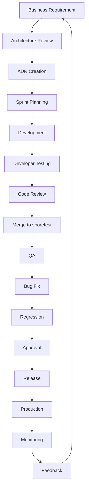

### 3.2 Step-by-Step Lifecycle

#### Step 1: Business Requirement

A business requirement originates from Product Management, Customer Feedback, Engineering Proposals, or Compliance Mandates. Every requirement must include:
- Problem statement
- Business value
- Success metrics
- Acceptance criteria
- Priority (P0-P3)

Requirements are tracked in the project management system with a unique identifier.

#### Step 2: Architecture Review

Architecture review is mandatory for:
- New services
- New bounded contexts
- Cross-service API changes
- Database schema changes
- Event schema changes
- Security architecture changes
- AI model integration changes
- Performance-critical changes

The review is conducted by the Architecture Review Board comprising senior engineers from each domain. The review produces either approval, changes required, or rejection with documented rationale.

#### Step 3: ADR Creation

Every significant architecture decision requires an Architecture Decision Record. ADRs follow the template: Context, Problem, Decision, Alternatives, Consequences, Tradeoffs.

ADRs are stored in docs/adr/ and numbered sequentially. ADR review is part of the architecture review gate.

#### Step 4: Sprint Planning

Approved architecture decisions are scheduled into sprints during Sprint Planning. Each sprint has:
- Sprint goal
- Committed stories
- Stretch goals
- Capacity allocation (development, testing, documentation, review)
- Risk assessment

#### Step 5: Development

Development follows the standards defined in this document:
- Feature branches from sporetest
- Clean Architecture within each service
- Contract-first API development
- Tests written concurrently
- Documentation updated concurrently
- Commits follow conventional commit format

#### Step 6: Developer Testing

Before requesting review, the developer must complete:
- TypeScript/Java compilation check
- Lint check (ESLint, Checkstyle)
- Unit tests (all pass)
- Integration tests (all pass)
- Manual testing of the feature
- Accessibility check (frontend)
- Performance sanity check
- Security self-review

#### Step 7: Code Review

Code review is mandatory for every change. The reviewer checks:
- Architecture alignment
- Code quality
- Test coverage
- Security
- Documentation
- Backward compatibility
- Naming and conventions

Review severity levels:
- P0: Must fix before merge (blocking)
- P1: Should fix before merge
- P2: Should fix in follow-up PR
- P3: Suggestion, can ignore

#### Step 8: Merge

After all P0 and P1 comments are resolved, the PR is approved and squash-merged into sporetest. The feature branch is deleted after merge.

#### Step 9: QA

QA is triggered automatically after merge to sporetest. QA executes:
- Smoke tests
- Integration tests
- Regression tests
- Security scans
- Performance benchmarks
- AI evaluation tests

#### Step 10: Bug Fix

Bugs found during QA are logged in the bug register with severity:
- P0: Production blocker, fix immediately
- P1: Critical, fix within current sprint
- P2: Major, fix within next sprint
- P3: Minor, fix when scheduled

Bug fixes follow the same development lifecycle but with expedited review.

#### Step 11: Regression

After bug fixes, the full regression suite is executed. No partial regression is allowed. The complete test suite must pass.

#### Step 12: Approval

Release approval requires:
- All tests pass
- All P0/P1 bugs fixed
- Architecture review sign-off
- Security review sign-off
- QA sign-off
- Product owner sign-off

#### Step 13: Release

The release follows the Release Workflow (Section 8). A release branch is created, validated, and deployed to production. The release is tagged.

#### Step 14: Production

Production deployment follows a phased rollout:
1. Canary deployment (5% traffic, 30 minutes)
2. Staged rollout (25% traffic, 2 hours)
3. Full rollout (100% traffic)
4. Post-deployment validation

#### Step 15: Monitoring

Post-deployment monitoring includes:
- Error rates and latency
- Business metrics
- AI quality metrics
- Cost metrics
- Usage patterns
- Anomaly detection

#### Step 16: Feedback

Monitoring data feeds back into business requirements. Production incidents create bug tickets. Performance degradation creates optimization tickets. Feature usage creates enhancement tickets.
---
## 4. Git Governance

### 4.1 Git Branch Strategy

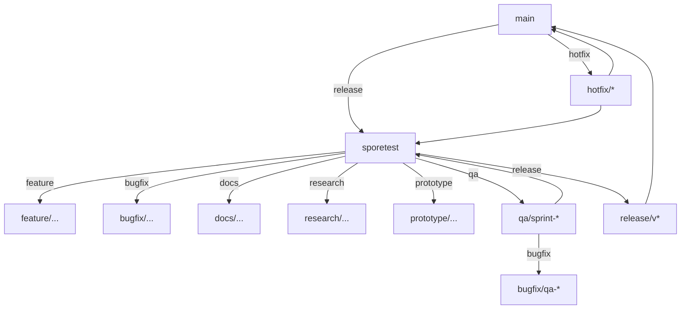

### 4.2 Permanent Branches

#### main

| Attribute | Value |
| --- | --- |
| Purpose | Production code. Only released, tagged versions. |
| Naming | main |
| Protection | Protected. No direct commits. |
| Source | release/* or hotfix/* branches |
| Deletion | Never |
| Retention | Permanent |
| Tags | Every merge is tagged with version number |

#### sporetest

| Attribute | Value |
| --- | --- |
| Purpose | Integration branch. Active development. |
| Naming | sporetest |
| Protection | Protected. No direct commits. |
| Source | feature/*, bugfix/*, docs/*, research/*, prototype/* |
| Deletion | Never |
| Retention | Permanent |
| Tags | Phase completion tags |

### 4.3 Temporary Branches

#### feature/

| Attribute | Value |
| --- | --- |
| Purpose | New features and enhancements |
| Naming | feature/{short-description} |
| Source | sporetest |
| Merge Target | sporetest |
| Protection | Unprotected |
| Deletion | After merge to sporetest |
| Retention | Deleted immediately after merge |
| Examples | feature/p13-s28-p01-chapter05-engineering-governance, feature/ai-gateway-rate-limiting |

#### bugfix/

| Attribute | Value |
| --- | --- |
| Purpose | Bug fixes found during development |
| Naming | bugfix/{issue-id}-{short-description} |
| Source | sporetest |
| Merge Target | sporetest |
| Protection | Unprotected |
| Deletion | After merge to sporetest |
| Retention | Deleted immediately after merge |
| Examples | bugfix/ORD-1234-order-total-calculation |

#### qa/

| Attribute | Value |
| --- | --- |
| Purpose | Phase testing and stabilization |
| Naming | qa/sprint-{number} or qa/phase-{number} |
| Source | sporetest |
| Merge Target | sporetest |
| Protection | Unprotected |
| Deletion | After merge to sporetest |
| Retention | Deleted after phase completion |

#### release/

| Attribute | Value |
| --- | --- |
| Purpose | Release candidate preparation and stabilization |
| Naming | release/v{major}.{minor}.{patch}[-rc{num}] |
| Source | sporetest |
| Merge Target | main |
| Protection | Unprotected |
| Deletion | After merge to main |
| Retention | Retain for 90 days for audit |

#### hotfix/

| Attribute | Value |
| --- | --- |
| Purpose | Emergency production fixes |
| Naming | hotfix/{issue-id}-{short-description} |
| Source | main |
| Merge Target | main and sporetest |
| Protection | Unprotected |
| Deletion | After merge to main and sporetest |
| Retention | Deleted after merge |

### 4.4 Support Branches

#### docs/

| Attribute | Value |
| --- | --- |
| Purpose | Documentation-only changes |
| Naming | docs/{short-description} |
| Source | sporetest |
| Merge Target | sporetest |
| Protection | Unprotected |
| Deletion | After merge |
| Examples | docs/api-standards-update, ddd/chapter04-service-contracts |

#### research/

| Attribute | Value |
| --- | --- |
| Purpose | Technical research and spikes |
| Naming | research/{topic} |
| Source | sporetest |
| Merge Target | sporetest or discarded |
| Protection | Unprotected |
| Deletion | After research complete |

#### prototype/

| Attribute | Value |
| --- | --- |
| Purpose | Proof-of-concept implementations |
| Naming | prototype/{concept} |
| Source | sporetest |
| Merge Target | sporetest or discarded |
| Protection | Unprotected |
| Deletion | After prototype evaluation |

### 4.5 Tagging Strategy

| Tag Type | Format | Example | Owner |
| --- | --- | --- | --- |
| Release | v{major}.{minor}.{patch} | v1.2.3 | Release Manager |
| Release Candidate | v{major}.{minor}.{patch}-rc{num} | v1.2.3-rc2 | Release Manager |
| Phase Complete | phase-{num}-complete | phase-13-complete | Engineering Lead |
| Sprint Complete | sprint-{num}-complete | sprint-28-complete | Engineering Lead |

### 4.6 Retention Policy

| Artifact | Retention |
| --- | --- |
| main branch | Permanent |
| sporetest branch | Permanent |
| Feature branches | Deleted after merge |
| Bugfix branches | Deleted after merge |
| QA branches | Deleted after phase complete |
| Release branches | 90 days after merge |
| Hotfix branches | Deleted after merge |
| Release tags | Permanent |
| Phase tags | Permanent |
| Git history | Permanent |

---
## 5. Branch Protection Rules

### 5.1 main Protection

| Rule | Setting |
| --- | --- |
| Require pull request reviews | 2 approvals required |
| Dismiss stale reviews | Yes |
| Require review from Code Owners | Yes |
| Require status checks | CI mandatory, All checks must pass |
| Require branches to be up to date | Yes |
| Restrict push access | Admin only |
| Allow force pushes | Never |
| Allow deletions | Never |
| Require signed commits | Yes |
| Require linear history | Yes |
| Include administrators | Yes |
| Lock branch | Always |

### 5.2 sporetest Protection

| Rule | Setting |
| --- | --- |
| Require pull request reviews | 1 approval required |
| Dismiss stale reviews | Yes |
| Require review from Code Owners | No |
| Require status checks | CI mandatory, All checks must pass |
| Require branches to be up to date | Yes |
| Restrict push access | Team leads and above |
| Allow force pushes | Never |
| Allow deletions | Never |
| Require signed commits | Yes |
| Require linear history | No (squash merge) |
| Include administrators | Yes |

### 5.3 Feature Branch Rules

| Rule | Setting |
| --- | --- |
| Protection | Unprotected |
| Push access | Anyone |
| Force pushes | Allowed (author only) |
| Commit signing | Recommended |
| Retention | Deleted after merge |
| Branch naming | feature/{description} |

---
## 6. Sprint Development Workflow

### 6.1 Workflow Diagram

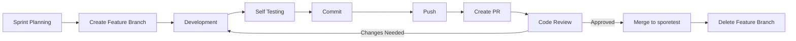

### 6.2 Step-by-Step Workflow

#### Step 1: Sprint Planning
- Team selects stories from the prioritized backlog
- Stories are assigned to engineers
- Each story has acceptance criteria and definition of done
- Engineers estimate effort using story points
- Capacity is confirmed

#### Step 2: Create Feature Branch
- Branch from sporetest: `git checkout -b feature/{description}`
- Branch name uses kebab-case, max 50 characters
- Description matches the story or ticket identifier

#### Step 3: Development
- Write code following Clean Architecture
- Write tests concurrently (TDD preferred)
- Write documentation concurrently (OpenAPI, README, ADR)
- Make small, focused commits
- Keep branches short-lived (max 3 days)

#### Step 4: Self Testing
- Run `npm run lint` or `mvn checkstyle:check`
- Run `npm run test` or `mvn test`
- Run integration tests
- Manually verify the feature
- Run `npm run build` or `mvn compile`

#### Step 5: Commit
- Stage related changes: `git add <files>`
- Commit with conventional commit message
- Keep commits atomic (one concern per commit)

#### Step 6: Push
- Push branch: `git push origin feature/{description}`
- Rebase on sporetest before pushing if needed

#### Step 7: Create PR
- PR title matches conventional commit format
- PR description includes purpose, architecture impact, testing evidence
- Add reviewers (minimum 1, recommended 2)
- Add labels (feature, bugfix, docs, etc.)

#### Step 8: Code Review
- Reviewer checks code within 4 business hours
- Address all P0 and P1 comments
- Re-request review after changes
- PR is squashed into a single commit on merge

#### Step 9: Merge
- Squash merge into sporetest
- Merge commit message follows conventional commit format
- Ensure CI passes before merge

#### Step 10: Delete Feature Branch
- Delete remote branch: `git push origin --delete feature/{description}`
- Delete local branch: `git branch -D feature/{description}`
---
## 7. Phase Testing Workflow

### 7.1 Workflow Diagram

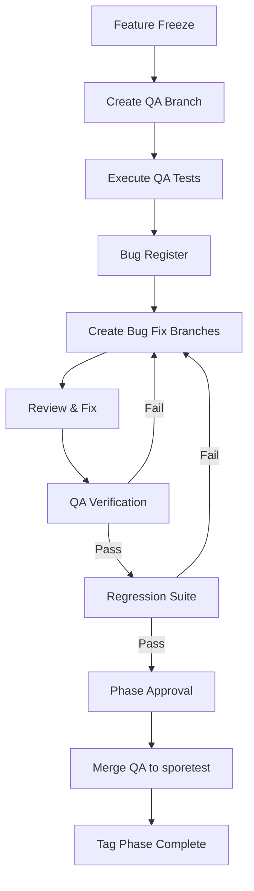

### 7.2 Feature Freeze

At the scheduled feature freeze date:
- No new features are accepted into the phase
- Only bug fixes and documentation improvements are permitted
- Feature freeze is announced 48 hours in advance
- Exceptions require Engineering Lead approval

### 7.3 Create QA Branch

```bash
git checkout sporetest
git checkout -b qa/phase-13
git push origin qa/phase-13
```

### 7.4 Execute QA Tests

QA executes the complete test suite:
- Smoke tests (30 minutes)
- Integration tests (2 hours)
- Regression tests (4 hours)
- Security scans (2 hours)
- Performance benchmarks (2 hours)
- AI evaluation tests (varies by phase)
- Accessibility audits (1 hour)
- Cross-browser tests (1 hour)

### 7.5 Bug Register

All bugs found during QA are logged with:
- Unique bug ID
- Severity (P0-P3)
- Description and reproduction steps
- Affected component
- Screenshots or logs
- Assigned engineer
- Status (open, in-progress, verified, closed)

### 7.6 Bug Fix Branches

```bash
git checkout qa/phase-13
git checkout -b bugfix/PH13-001-fix-order-calculation
```

Bug fix branches follow the same development and review process but with expedited review (2 hours target).

### 7.7 QA Verification

After each bug fix is merged to the QA branch:
- QA re-tests the specific bug
- QA runs the affected test suite
- Bug status is updated to verified or reopened

### 7.8 Regression Suite

After all P0 and P1 bugs are fixed and verified:
- Full regression suite is executed
- No partial regression runs
- Regression must pass 100%

### 7.9 Phase Approval

Phase approval requires:
- All tests pass
- All P0/P1 bugs fixed
- P2 bugs documented with remediation plan
- QA sign-off
- Security sign-off
- Engineering Lead sign-off

### 7.10 Merge to sporetest

```bash
git checkout sporetest
git merge qa/phase-13 --squash
git tag phase-13-complete
git push origin sporetest --tags
```

### 7.11 Tag Phase Complete

The phase completion tag is used as the starting point for the next phase.

---
## 8. Release Workflow

### 8.1 Release Branch Strategy

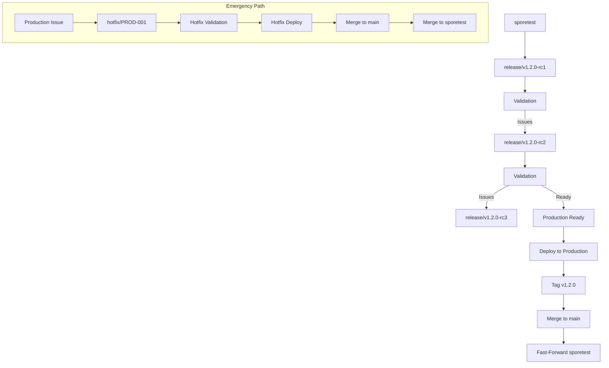

### 8.2 Create Release Branch

```bash
git checkout sporetest
git checkout -b release/v1.2.0-rc1
git push origin release/v1.2.0-rc1
```

### 8.3 Release Candidate Process

| RC | Criteria | Duration |
| --- | --- | --- |
| RC1 | All features complete. Known bugs documented. | 2 days |
| RC2 | All P0/P1 bugs fixed. Regression passed. | 2 days |
| RC3 | All P2 bugs fixed. Full regression passed. Security audit complete. | 1 day |

### 8.4 Validation Gates

| Gate | Checks | Owner |
| --- | --- | --- |
| Functional | All acceptance criteria met | QA |
| Regression | Full test suite passes | QA |
| Security | Vulnerability scan, dependency check, pen test | Security |
| Performance | Latency targets met, no regressions | Performance |
| AI Quality | Prompt accuracy, grounding, hallucination eval | AI Engineering |
| Documentation | Release notes, migration notes, API docs | Engineering |
| Compliance | Regulatory requirements met | Compliance |

### 8.5 Production Deployment

```bash
# Tag the release
git tag v1.2.0

# Deploy to production
./scripts/deploy-production.sh v1.2.0
```

Phased rollout:
1. Canary: 5% of traffic for 30 minutes
2. Staged: 25% of traffic for 2 hours
3. Full: 100% of traffic
4. Monitor: Watch error rates and latency for 24 hours

### 8.6 Production Tag

Every production deployment is tagged:
```bash
git tag -a v1.2.0 -m "Release v1.2.0"
git push origin v1.2.0
```

### 8.7 Merge to main

```bash
git checkout main
git merge release/v1.2.0 --no-ff
git push origin main
```

### 8.8 Fast-Forward sporetest

```bash
git checkout sporetest
git merge main --ff-only
git push origin sporetest
```

### 8.9 Rollback Strategy

| Scenario | Rollback Action | Time |
| --- | --- | --- |
| Bug in new feature | Revert feature flag | 5 minutes |
| Performance regression | Rollback to previous version | 15 minutes |
| Security vulnerability | Immediate rollback to last secure version | 5 minutes |
| Data corruption | Database restore from backup | 1 hour |

Rollback commands:
```bash
# Deploy previous version
./scripts/deploy-production.sh v1.1.9

# Revert git if needed
git revert v1.2.0
git push origin main
```

### 8.10 Emergency Fixes

Emergency fixes bypass the normal release cycle:
1. Bug is triaged as P0
2. Hotfix branch from the release tag
3. Single fix only, no scope creep
4. Expedited review (1 hour target)
5. Direct merge to main
6. Cherry-pick to sporetest

### 8.11 Hotfix Flow

```bash
git checkout v1.2.0
git checkout -b hotfix/PROD-42-fix-payment-timeout
# Fix the bug
git commit -m "fix: resolve payment timeout race condition"
git push origin hotfix/PROD-42-fix-payment-timeout
# PR and review
git checkout main
git merge hotfix/PROD-42-fix-payment-timeout
git tag v1.2.1
git push origin main --tags
git checkout sporetest
git merge main --ff-only
git push origin sporetest
```
---
## 9. Commit Standards

### 9.1 Conventional Commits

Every commit message MUST follow the Conventional Commits specification:

```
<type>(<scope>): <description>

[optional body]

[optional footer]
```

### 9.2 Commit Types

| Type | Usage | Example |
| --- | --- | --- |
| feat | New feature | feat(ai-gateway): add rate limiting for streaming requests |
| fix | Bug fix | fix(order-service): correct tax calculation for international orders |
| refactor | Code restructuring | refactor(knowledge-service): extract chunking strategy to strategy pattern |
| docs | Documentation only | docs(phase13): add Chapter 5 engineering governance standards |
| test | Adding or updating tests | test(conversation-service): add grounding verification tests |
| perf | Performance improvement | perf(vector-service): optimize HNSW index build parameters |
| style | Formatting, linting | style(catalog-service): format all files to match checkstyle config |
| build | Build system changes | build: upgrade Spring Boot to 3.3.0 |
| ci | CI/CD changes | ci: add AI evaluation step to GitHub Actions pipeline |
| revert | Reverting a previous change | revert: feat(prompt-service): rollback prompt caching |

### 9.3 Scope Examples

| Scope | Description |
| --- | --- |
| ai-gateway | AI Gateway service |
| prompt-service | Prompt management service |
| knowledge-service | Knowledge base service |
| conversation-service | Conversation platform service |
| agent-service | Agent runtime service |
| copilot-service | Copilot orchestration service |
| provider-service | LLM provider management service |
| embedding-service | Text embedding service |
| vector-service | Vector database service |
| memory-service | AI memory service |
| evaluation-service | AI evaluation service |
| order-service | Order management service |
| catalog-service | Product catalog service |
| training-service | Training platform service |
| identity-service | Identity and access service |
| phase13 | Phase 13 documentation |
| docs | General documentation |
| ci | CI/CD configuration |

### 9.4 Commit Best Practices

1. **One commit per logical change.** Do not combine unrelated changes in a single commit.
2. **Write descriptive commit messages.** The description should explain WHAT and WHY, not HOW.
3. **Use imperative mood.** "Fix bug" not "Fixed bug" or "Fixes bug".
4. **Keep commits small.** If a change exceeds 200 lines, consider breaking it into multiple commits.
5. **Reference issues.** Use "Closes #123" or "Refs #456" in the footer.
6. **No WIP commits.** Work-in-progress commits must be squashed before merge.
7. **Signed commits.** All commits must be signed with GPG or SSH keys.

### 9.5 Examples for Phase 13

```
feat(ai-gateway): implement token-based rate limiting

Add sliding window rate limiter that tracks token usage per API key
across 1-minute windows. Rate limit configuration stored in Redis.
Returns 429 with Retry-After header when limit exceeded.

Closes: P13-427
```

```
docs(phase13): add Chapter 5 engineering governance standards

Define FAANG-grade engineering playbook covering development workflow,
git governance, testing strategy, CI/CD, and AI quality standards.

This is the official engineering handbook for Phases 13-20.
```

```
test(evaluation-service): add hallucination detection test suite

Implement 50 test cases for hallucination detection covering:
- Factual accuracy verification
- Source grounding validation
- Temporal consistency checks
- Cross-reference validation

All tests pass against golden dataset v2.1.
```

---
## 10. Pull Request Standards

### 10.1 PR Template

Every PR MUST include the following sections:

```markdown
## Purpose
<!-- What does this PR do? Why is it needed? -->

## Architecture Impact
<!-- How does this change affect the architecture? -->
<!-- - New services? -->
<!-- - New APIs? -->
<!-- - Database changes? -->
<!-- - Event changes? -->

## Testing Evidence
<!-- What testing was performed? -->
<!-- - Unit tests: X/Y passing -->
<!-- - Integration tests: X/Y passing -->
<!-- - Manual testing: described below -->
<!-- - AI evaluation scores (if applicable) -->

## Screenshots
<!-- For UI changes. Include before/after. -->

## Performance
<!-- Performance impact assessment -->
<!-- - Latency impact -->
<!-- - Database query changes -->
<!-- - Caching strategy -->

## Security
<!-- Security implications -->
<!-- - Authentication changes? -->
<!-- - Authorization changes? -->
<!-- - PII handling? -->
<!-- - Rate limiting? -->

## Documentation
<!-- Documentation changes -->
<!-- - ADR updated? -->
<!-- - API docs updated? -->
<!-- - README updated? -->
<!-- - Migration notes? -->

## Reviewer Checklist
- [ ] Architecture aligns with DDD boundaries
- [ ] Code follows Clean Architecture
- [ ] Naming conventions followed
- [ ] Tests adequate and passing
- [ ] Documentation updated
- [ ] Backward compatible
- [ ] No security concerns
- [ ] Performance impact acceptable

## Definition of Done
- [ ] All acceptance criteria met
- [ ] Tests written and passing
- [ ] Documentation updated
- [ ] Code reviewed
- [ ] PR approved
```

### 10.2 PR Size Guidelines

| Size | Lines Changed | Action |
| --- | --- | --- |
| Small | < 100 | Normal review |
| Medium | 100-500 | Review, consider splitting |
| Large | 500-1000 | Must be split into smaller PRs |
| X-Large | > 1000 | Blocked. Must split. |

### 10.3 PR Labels

| Label | Description |
| --- | --- |
| feature | New feature |
| bugfix | Bug fix |
| docs | Documentation only |
| refactor | Code restructuring |
| test | Test changes |
| perf | Performance improvement |
| ai | AI-specific change |
| security | Security-related change |
| needs-review | Ready for review |
| work-in-progress | Not ready for review |
| do-not-merge | Blocked or pending |

### 10.4 PR Lifecycle

1. Developer creates PR with template
2. CI checks run automatically
3. Developer marks needs-review
4. Reviewer assigned automatically or manually
5. Reviewer examines code and leaves comments
6. Developer responds to all comments
7. Resolved conversations are marked
8. Reviewer approves or requests changes
9. Approved PR is squash-merged
10. Branch is deleted

---
## 11. Code Review Standards

### 11.1 Reviewer Checklist

Every reviewer MUST check the following:

#### Architecture
- Does the change respect bounded contexts?
- Are dependency rules followed (inward only)?
- Are aggregates consistent?
- Is the change backward-compatible?
- Does the change introduce circular dependencies?

#### Naming
- Package names follow conventions: com.sporekart.{domain}
- Classes follow UpperCamelCase
- Methods and variables follow lowerCamelCase
- Constants follow UPPER_SNAKE_CASE
- Database columns follow snake_case
- Kafka topics follow {domain}.{service}.{event}.v{version}

#### DDD
- Are aggregate boundaries respected?
- Are entities distinct from value objects?
- Are repositories used for persistence?
- Are domain services used for cross-entity logic?
- Are domain events published for state changes?

#### Security
- Is input validated and sanitized?
- Is authentication enforced?
- Is authorization checked?
- Are secrets handled correctly?
- Is PII protected?
- Are rate limits applied?

#### Performance
- Are N+1 query patterns avoided?
- Are database indexes used?
- Is caching applied appropriately?
- Are async patterns used for blocking operations?
- Are memory allocations reasonable?

#### Testing
- Are unit tests present for domain logic?
- Are integration tests present for infrastructure?
- Are edge cases covered?
- Are error paths tested?
- Do tests run quickly?

#### Documentation
- Is API documentation updated?
- Is ADR created or updated if needed?
- Are README files updated?
- Are inline comments meaningful?

#### Backward Compatibility
- Are existing API contracts preserved?
- Are event schemas backward-compatible?
- Are database migrations reversible?
- Are feature flags used for breaking changes?

#### Future Scalability
- Will this design support 10x load?
- Are there obvious bottlenecks?
- Is the design extensible for future requirements?

### 11.2 Review Severity Levels

| Severity | Label | Meaning | Action |
| --- | --- | --- | --- |
| P0 | blocking | Bug, security issue, architectural violation | Must fix before merge |
| P1 | required | Missing test, missing doc, naming violation | Should fix before merge |
| P2 | recommended | Improvement suggestion, minor cleanup | Fix in follow-up PR |
| P3 | optional | Style preference, alternative approach | Can ignore |

### 11.3 Review SLA

| PR Type | First Review | Re-Review | Merge |
| --- | --- | --- | --- |
| Feature | 4 business hours | 2 business hours | After approval |
| Bugfix | 2 business hours | 1 business hour | After approval |
| Hotfix | 30 minutes | 15 minutes | Immediate |
| Documentation | 8 business hours | 4 business hours | After approval |

### 11.4 Review Code of Conduct

1. Review the code, not the author
2. Focus on the change, not the person
3. Explain WHY a change is needed, not just WHAT
4. Provide examples and references
5. Distinguish between requirements and suggestions
6. Approve when all P0 and P1 comments are resolved
7. Request changes only for P0 issues
8. Respond to review comments within SLA

---
## 12. Definition of Done

### 12.1 Feature Level DoD

- [ ] Acceptance criteria met
- [ ] Code compiles and builds successfully
- [ ] Lint checks pass with zero warnings
- [ ] Unit tests written and passing (coverage > 80%)
- [ ] Integration tests written and passing
- [ ] API documentation updated (OpenAPI 3.1)
- [ ] ADR created if architecture impact
- [ ] README updated if service change
- [ ] Migration notes written if breaking change
- [ ] PR reviewed and approved
- [ ] Feature flag added if risky
- [ ] Performance impact assessed

### 12.2 Sprint Level DoD

- [ ] All committed features meet Feature DoD
- [ ] All P0/P1 bugs fixed and verified
- [ ] Sprint goal achieved
- [ ] Test coverage maintained or improved
- [ ] All CI checks pass
- [ ] No regression in performance benchmarks
- [ ] Documentation updated for the sprint
- [ ] Sprint retrospective completed
- [ ] Unfinished stories returned to backlog
- [ ] Technical debt documented if any

### 12.3 Phase Level DoD

- [ ] All sprint goals achieved
- [ ] Feature freeze enforced
- [ ] Full regression suite passes
- [ ] All P0/P1 bugs from QA fixed
- [ ] Security audit complete
- [ ] Performance benchmarks met
- [ ] Architecture review complete
- [ ] All ADRs for the phase accepted
- [ ] Documentation complete
- [ ] Migration scripts tested
- [ ] Rollback plan documented
- [ ] Phase completion tag created

### 12.4 Release Level DoD

- [ ] All phase DoD items complete
- [ ] Release candidate validated
- [ ] Production readiness review complete
- [ ] Security sign-off obtained
- [ ] Compliance sign-off obtained
- [ ] Release notes written and reviewed
- [ ] Rollback plan verified
- [ ] Communication sent to stakeholders
- [ ] Deployment window confirmed
- [ ] Runbook updated

### 12.5 Production Level DoD

- [ ] Release deployed to production
- [ ] Canary validation passed (5%, 30 min)
- [ ] Staged rollout passed (25%, 2 hours)
- [ ] Full rollout completed (100%)
- [ ] Post-deployment monitoring activated
- [ ] Error rates within baseline
- [ ] Latency within SLO
- [ ] Business metrics confirming feature value
- [ ] On-call team notified
- [ ] Release tag created
---
## 13. Developer Self Testing

### 13.1 Pre-Commit Checklist

Before every commit, the developer MUST run:

| Check | Backend (Java) | Frontend (TypeScript) | Mobile (React Native) |
| --- | --- | --- | --- |
| Compilation | mvn compile | npx tsc --noEmit | npx tsc --noEmit |
| Lint | mvn checkstyle:check | npm run lint | npm run lint |
| Unit Tests | mvn test | npm run test | npm run test |
| Build | mvn package | npm run build | npm run build |
| Format | mvn spotless:check | npx prettier --check | npx prettier --check |

### 13.2 Required Commands

```bash
# Backend (Java/Spring Boot)
mvn clean verify              # Full build with tests
mvn checkstyle:check          # Code style check
mvn spotless:check            # Formatting check
mvn test                      # Unit and integration tests
mvn compile                   # Compilation check

# Frontend (React/TypeScript)
npm run lint                  # ESLint check
npm run format:check          # Prettier check
npm run typecheck             # TypeScript type check
npm run test                  # Unit tests
npm run test:coverage         # Test coverage report
npm run build                 # Production build

# Mobile (React Native)
npm run lint                  # ESLint check
npm run test                  # Unit tests
npm run build:android         # Android build
npm run build:ios             # iOS build
```

### 13.3 Test Coverage Requirements

| Layer | Coverage Target | Minimum |
| --- | --- | --- |
| Domain (entities, VOs, services) | 95% | 90% |
| Application (use cases) | 90% | 80% |
| Infrastructure (repositories) | 80% | 70% |
| API (controllers) | 85% | 75% |
| UI (components) | 70% | 60% |

### 13.4 Self-Testing Flow

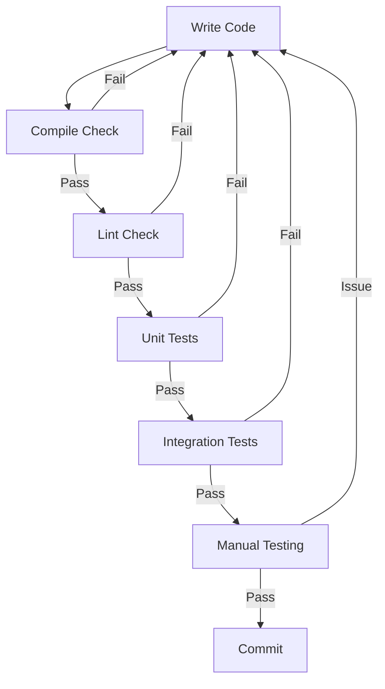

### 13.5 Manual Testing Requirements

1. **Happy path.** Test the primary use case end-to-end.
2. **Error paths.** Test validation errors, authentication errors, not-found errors.
3. **Edge cases.** Test empty states, boundary values, large inputs.
4. **Performance.** Verify response times are within SLO.
5. **Accessibility.** Tab through UI, verify screen reader compatibility.
6. **Mobile responsiveness.** Test on multiple viewport sizes.

---
## 14. Formal QA Strategy

### 14.1 QA Test Types

| Test Type | Description | Frequency | Owner |
| --- | --- | --- | --- |
| Smoke | Critical path verification | Every build | QA |
| Integration | Cross-service interaction tests | Every build | QA + Dev |
| Regression | Full test suite | Every phase | QA |
| Security | Vulnerability scanning, pen testing | Every phase | Security |
| Accessibility | WCAG 2.1 AA compliance | Every phase | QA |
| Cross Browser | Chrome, Firefox, Safari, Edge | Every phase | QA |
| Performance | Latency, throughput, resource usage | Every phase | Performance |
| Load | Expected traffic + 50% | Every release | Performance |
| Stress | 2x expected traffic | Every release | Performance |
| Recovery | Failover, restart, data recovery | Every release | DevOps |
| Disaster | Full region failure recovery | Quarterly | DevOps |
| AI Evaluation | Prompt accuracy, grounding, hallucination | Every sprint | AI Engineering |

### 14.2 Smoke Tests

Smoke tests verify that critical paths are functional:
- User can login
- User can browse catalog
- User can add to cart
- User can checkout
- User can complete payment
- Admin can manage orders
- Trainer can create courses
- Student can enroll in courses
- AI copilot responds to queries
- Knowledge search returns results

### 14.3 Integration Tests

Integration tests verify:
- Service-to-service API contracts
- Database read/write operations
- Kafka event publish/consume
- Redis cache operations
- External provider communication
- Authentication and authorization flows

### 14.4 Regression Tests

The full regression suite includes:
- All unit tests
- All integration tests
- All E2E tests
- All AI evaluation tests
- All contract tests

Regression must pass 100% before phase approval.

### 14.5 Security Testing

| Scan Type | Tool | Frequency |
| --- | --- | --- |
| SAST | SonarQube | Every commit |
| Dependency scan | OWASP Dependency Check | Every commit |
| Docker scan | Trivy | Every build |
| Secret scan | GitLeaks | Every commit |
| DAST | OWASP ZAP | Every phase |
| Penetration test | External vendor | Quarterly |
| AI red team | Internal + external | Every phase |

### 14.6 Performance Testing

| Metric | Target | Tool |
| --- | --- | --- |
| API response time (P50) | < 200ms | k6 |
| API response time (P99) | < 1000ms | k6 |
| AI inference (P50) | < 2000ms | Custom |
| AI inference (P99) | < 10000ms | Custom |
| Page load time | < 3s | Lighthouse |
| Database query (P50) | < 50ms | pg_stat |
| Database query (P99) | < 500ms | pg_stat |
| Cache hit rate | > 90% | Redis info |
| Throughput | 1000 req/s per service | k6 |

---
## 15. Testing Pyramid

### 15.1 Pyramid Overview

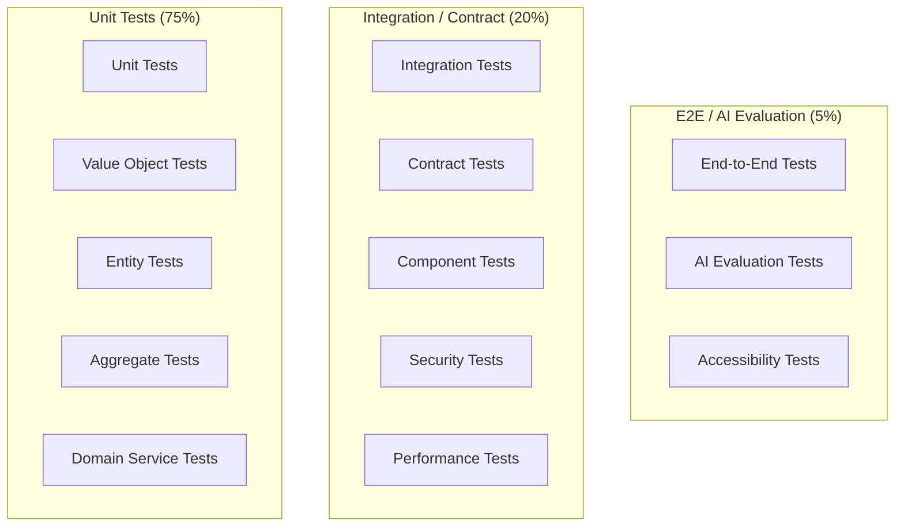

### 15.2 Distribution

| Layer | Percentage | Target | Examples |
| --- | --- | --- | --- |
| Unit | 75% | 80% | Entity validation, VO equality, service logic |
| Integration | 15% | 12% | Repository CRUD, messaging, API client |
| Contract | 5% | 5% | API schema validation, event schema validation |
| Component | 3% | 2% | Bounded context integration (in-process) |
| E2E | 1% | 1% | Critical user journeys |
| AI Evaluation | 1% | 1% | Prompt accuracy, grounding, hallucination |

### 15.3 Testing by Layer

| Layer | Tests | Speed | Frequency |
| --- | --- | --- | --- |
| Unit | Pure logic tests | Milliseconds | Every commit |
| Integration | Infrastructure tests | Seconds | Every commit |
| Contract | API contract tests | Seconds | Every commit |
| Component | Multi-service tests | Minutes | Every sprint |
| E2E | Browser/journey tests | Minutes | Every sprint |
| AI Evaluation | AI quality tests | Minutes | Every sprint |
| Manual QA | Human verification | Hours | Every phase |

### 15.4 Testing Tools by Stack

| Stack | Unit | Integration | E2E | Coverage |
| --- | --- | --- | --- | --- |
| Java/Spring | JUnit 5, Mockito | Testcontainers | Selenium | Jacoco |
| TypeScript/React | Jest, Vitest | MSW, Testing Library | Playwright | Istanbul |
| Mobile/RN | Jest | Detox | Detox | Istanbul |
| AI/ML | Custom eval framework | Custom integration | Custom E2E | N/A |

---
## 16. AI Testing Standards

### 16.1 AI Test Categories

| Category | What We Test | Frequency | Tooling |
| --- | --- | --- | --- |
| Prompt Testing | Prompt template validity, variable injection | Every prompt change | custom-eval |
| Grounding | Response claims supported by sources | Every sprint | custom-eval + LLM-judge |
| Hallucination | Unsupported claims in responses | Every sprint | custom-eval + NLI |
| Latency | End-to-end AI response time | Every commit | k6 + custom |
| Provider Comparison | Quality and cost across providers | Every release | custom-eval |
| Knowledge Retrieval | Relevance and ranking quality | Every sprint | custom-eval |
| Conversation Testing | Multi-turn conversation quality | Every sprint | custom-eval |
| Evaluation Metrics | Metric reliability and calibration | Every phase | custom-eval |
| Golden Dataset | Regression detection against known cases | Every commit | custom-eval |
| Benchmarking | Performance against industry baselines | Quarterly | various |

### 16.2 Prompt Testing

Every prompt must be tested before deployment:
- **Template validation.** All variables are present and correctly typed.
- **Output format.** Response matches expected format (JSON, markdown, etc.).
- **Edge cases.** Empty inputs, very long inputs, special characters.
- **Injection testing.** Prompt injection attempts are neutralized.
- **A/B testing.** New prompts compared against current production prompts.

### 16.3 Grounding Verification

Grounding checks verify that AI responses are supported by source documents:
- Every factual claim in the response is traced to a source chunk
- Citation accuracy is verified
- Source relevance is scored
- Unsupported claims are flagged as potential hallucinations

```bash
# Run grounding verification
./scripts/eval grounding --prompt-id=42 --dataset=golden-v3
```

### 16.4 Hallucination Detection

Hallucination detection uses multiple techniques:
- **NLI-based.** Natural Language Inference model checks claim against source.
- **LLM-judge.** A separate LLM evaluates response for unsupported claims.
- **Consistency check.** Response is consistent with conversation history.
- **Cross-reference.** Multiple sources checked for fact verification.

### 16.5 Latency Testing

AI latency is measured and tracked:
- P50, P95, P99 response times by model and provider
- Token generation speed (tokens/second)
- Time to first token (TTFT)
- End-to-end latency including knowledge retrieval

### 16.6 Provider Comparison

Each release compares providers on:
- Response quality (grounding score, hallucination rate)
- Latency (P50, P95, P99)
- Cost per request and per token
- Availability and error rates

### 16.7 Golden Dataset

The golden dataset is the authoritative test set for AI quality:
- Curated manually by AI engineers and domain experts
- Contains 500-1000 test cases covering all domains
- Updated every phase with new edge cases
- Versioned and stored in evaluation-service
- Used for regression detection

### 16.8 Evaluation Metrics

| Metric | Description | Target | Acceptable |
| --- | --- | --- | --- |
| Grounding Score | % claims supported by sources | > 95% | > 90% |
| Hallucination Rate | % responses with unsupported claims | < 2% | < 5% |
| Relevance Score | Response relevance to query | > 0.9 | > 0.8 |
| Accuracy Score | Factual correctness | > 95% | > 90% |
| User Satisfaction | Post-interaction rating (1-5) | > 4.5 | > 4.0 |
| Latency P50 | Median response time | < 2s | < 5s |
| Latency P95 | 95th percentile response time | < 5s | < 10s |
| Cost per Query | Average cost per AI interaction | < $0.01 | < $0.05 |
---
## 17. CI/CD Governance

### 17.1 CI/CD Pipeline Architecture

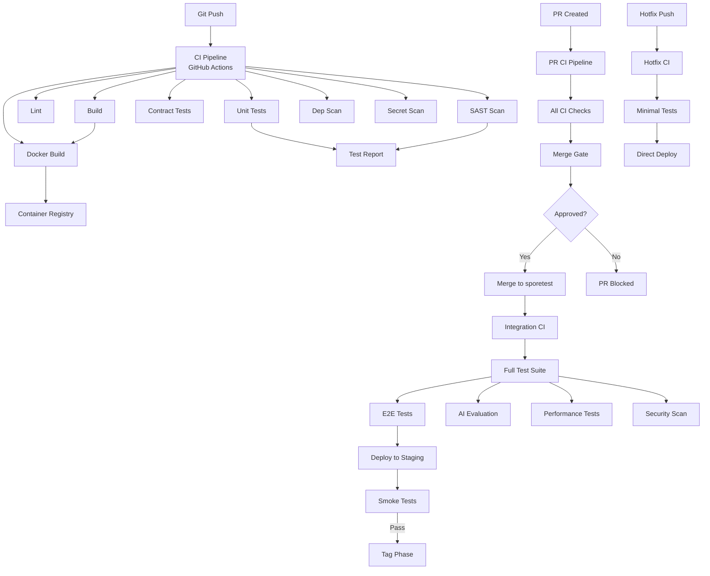

### 17.2 CI Gates

| Gate | Checks | Required | Blocking |
| --- | --- | --- | --- |
| Build | Compilation, Docker build | Yes | Yes |
| Lint | ESLint, Checkstyle, Prettier | Yes | Yes |
| Unit Tests | All unit tests pass | Yes | Yes |
| Integration Tests | All integration tests pass | Yes | Yes |
| Contract Tests | API schema validation | Yes | Yes |
| SAST | SonarQube quality gate | Yes | Yes |
| Dependency Scan | OWASP Dependency Check | Yes | Yes |
| Secret Scan | GitLeaks | Yes | Yes |
| Coverage | Minimum coverage thresholds | Yes | Yes |
| AI Evaluation | Golden dataset pass rate > 90% | For AI PRs | Yes |
| Performance | No regression in key metrics | For perf PRs | Yes |

### 17.3 Release Gates

| Gate | Checks | Required | Owner |
| --- | --- | --- | --- |
| Functional | All acceptance criteria met | Yes | QA |
| Regression | Full test suite passes | Yes | QA |
| Security | SAST, DAST, dependency scan pass | Yes | Security |
| Performance | Latency and throughput targets met | Yes | Performance |
| AI Quality | AI evaluation metrics above thresholds | Yes | AI Engineering |
| Documentation | All docs updated | Yes | Engineering |
| Compliance | Regulatory requirements met | Yes | Compliance |
| Approval | Engineering Lead sign-off | Yes | Engineering Lead |

### 17.4 Failure Handling

| Failure | Action | Notification |
| --- | --- | --- |
| Build failure | Block PR, notify author | GitHub status, Slack |
| Test failure | Block PR, notify author | GitHub status, Slack |
| Coverage drop | Block PR, notify author | GitHub status, Slack |
| Security vulnerability | Block PR, notify security team | GitHub, Slack, PagerDuty |
| Performance regression | Block PR, notify performance team | GitHub, Slack |
| AI quality drop | Block PR, notify AI team | GitHub, Slack |

### 17.5 Rollback Automation

Rollback is automated in the CI/CD pipeline:
```bash
# Automated rollback script
./scripts/rollback.sh v1.2.0
```

Rollback triggers:
- Error rate exceeds 1% for 5 minutes
- P50 latency exceeds 2x baseline for 10 minutes
- P99 latency exceeds 3x baseline for 5 minutes
- Critical security vulnerability detected
- Data integrity issue detected

### 17.6 CI/CD Configuration

All CI/CD configuration is stored in:
- `.github/workflows/` for GitHub Actions
- `Dockerfile` for container builds
- `docker-compose.yml` for local development
- `k8s/` for Kubernetes deployment manifests

---
## 18. Code Quality Standards

### 18.1 Project Structure

```
{service-name}/
  src/
    main/
      java/com/sporekart/{domain}/
        application/
          config/
          controller/
          dto/
          mapper/
          usecase/
        domain/
          model/
            aggregate/
            entity/
            valueobject/
          service/
          repository/
          event/
        infrastructure/
          persistence/
            repository/
            entity/
            mapper/
          messaging/
            producer/
            consumer/
          client/
          config/
    test/
      java/com/sporekart/{domain}/
        unit/
        integration/
        contract/
        component/
  Dockerfile
  pom.xml
  README.md
  docs/
  k8s/
```

### 18.2 Naming Conventions

| Artifact | Convention | Example |
| --- | --- | --- |
| Package | com.sporekart.{domain} | com.sporekart.knowledge |
| Class | UpperCamelCase | KnowledgeDocument |
| Interface | UpperCamelCase | DocumentRepository |
| Method | lowerCamelCase | findById() |
| Variable | lowerCamelCase | documentContent |
| Constant | UPPER_SNAKE_CASE | MAX_CHUNK_SIZE |
| Enum | UpperCamelCase | SourceType.PRODUCT |
| Database Table | snake_case | knowledge_documents |
| Database Column | snake_case | document_hash |
| REST Endpoint | kebab-case | /api/knowledge-service/v1/knowledge-sources |
| Kafka Topic | dot.case | ai.knowledge.document-ingested.v1 |
| JSON Field | camelCase | sourceType |

### 18.3 Class Naming

| Type | Suffix | Example |
| --- | --- | --- |
| Entity | (Domain name) | Order, Product, User |
| Value Object | (Descriptive) | Money, Email, Address |
| Aggregate Root | (Domain name) | Order, Course, KnowledgeDocument |
| Repository | {Entity}Repository | OrderRepository |
| Domain Service | {Domain}{Service} | PricingService |
| Application Service | {UseCase}UseCase | CreateOrderUseCase |
| Controller | {Resource}Controller | OrderController |
| DTO | {Action}{Resource}Request/Response | CreateOrderRequest |
| Mapper | {Source}To{Target}Mapper | OrderToDtoMapper |
| Event | {Entity}{Event}Event | OrderCreatedEvent |
| Factory | {Entity}Factory | OrderFactory |
| Config | {Domain}Config | KnowledgeServiceConfig |

### 18.4 Method Naming

| Operation | Prefix | Example |
| --- | --- | --- |
| Query | find/get/list/search | findById(), getTotal(), listActive(), searchByName() |
| Command | create/update/delete/archive | createOrder(), updateProfile(), deleteItem() |
| Validation | validate/assert/is | validateEmail(), assertPositive(), isActive() |
| Conversion | to/from/as | toDto(), fromDto(), asEntity() |
| Event | handle/on/after | handleOrderCreated(), onPaymentFailed() |

### 18.5 Code Style

| Language | Style Guide | Tool |
| --- | --- | --- |
| Java | Google Java Style | Checkstyle + Spotless |
| TypeScript | ESLint recommended + Prettier | ESLint + Prettier |
| SQL | PG Style Guide | sqlfluff |
| YAML | yamllint | yamllint |
| Markdown | markdownlint | markdownlint |

### 18.6 Code Complexity Limits

| Metric | Limit | Tool |
| --- | --- | --- |
| Method length | 30 lines | SonarQube |
| Class length | 500 lines | SonarQube |
| Cyclomatic complexity | 10 per method | SonarQube |
| Parameter count | 5 per method | Checkstyle |
| Nested depth | 4 levels | SonarQube |
| File size | 1000 lines | SonarQube |
| Dependency count | 20 per class | SonarQube |

---
## 19. Documentation Standards

### 19.1 Required Documentation

Every feature requires the following documentation, depending on the type of change:

| Change Type | ADR | API Docs | Architecture Diagram | README | Migration Notes | Release Notes | Test Notes |
| --- | --- | --- | --- | --- | --- | --- | --- |
| New service | Required | Required | Required | Required | N/A | Required | Required |
| New API endpoint | Optional | Required | Optional | Optional | N/A | Required | Required |
| Database change | Required | N/A | Required | Optional | Required | Optional | Required |
| Event change | Required | Required | Required | Optional | Required | Required | Required |
| Architecture change | Required | N/A | Required | Optional | N/A | Required | Optional |
| Bug fix | Optional | Optional | Optional | Optional | Optional | Optional | Required |
| AI model change | Required | Required | Required | Required | Required | Required | Required |
| Dependency upgrade | Optional | Optional | Optional | Optional | Required | Optional | Optional |

### 19.2 Documentation File Map

| File | Location | Purpose |
| --- | --- | --- |
| ADR | docs/adr/adr-{NNN}-*.md | Architecture decisions |
| API Docs | docs/api/{service}/v{version}/openapi.yaml | API contract specification |
| Architecture Diagram | docs/diagrams/{service}/ | Mermaid or PNG diagrams |
| README | {service}/README.md | Service overview and setup |
| Migration Notes | docs/migrations/{phase}/ | Breaking change migration guides |
| Release Notes | docs/releases/v{version}.md | Release changelog |
| Runbook | docs/runbooks/{service}.md | Operational procedures |
| Test Plan | docs/tests/{phase}/ | QA test plans and results |

### 19.3 ADR Template

```markdown
# ADR-{NNN}: {Title}

| Attribute | Value |
| --- | --- |
| ID | ADR-{NNN} |
| Title | {Title} |
| Status | {Proposed | Accepted | Deprecated | Superseded} |
| Context | {Problem context and background} |
| Problem | {Specific problem being solved} |
| Decision | {Decision made and rationale} |
| Alternatives | {Alternatives considered and why rejected} |
| Consequences | {Resulting consequences of the decision} |
| Tradeoffs | {Tradeoffs and compromises} |
```

### 19.4 README Template

Every service must have a README.md covering:
1. Service name and purpose
2. Architecture overview (with Mermaid diagram)
3. Tech stack
4. Prerequisites
5. Local development setup
6. Running tests
7. API documentation link
8. Environment variables
9. Deployment
10. Monitoring and alerts
11. Ownership and contacts

### 19.5 Documentation Best Practices

1. **Document WHY, not WHAT.** Code expresses WHAT. Documentation explains WHY.
2. **Keep docs close to code.** README in each service. OpenAPI alongside controllers.
3. **Use Mermaid for diagrams.** Stick to Mermaid syntax. Avoid images.
4. **Keep ADRs focused.** One ADR per decision. No omnibus ADRs.
5. **Update documentation concurrently.** Documentation changes are part of the same PR as code changes.
6. **Review documentation.** Documentation is reviewed as part of code review.
7. **Version documentation.** API docs are versioned alongside the API.
---
## 20. Security Standards

### 20.1 Security Principles

1. **Defense in depth.** Multiple security layers protect every component.
2. **Least privilege.** Every user and service has minimum required permissions.
3. **Secure by default.** Default configurations are secure. Insecure options are opt-in.
4. **Fail secure.** Failures default to denied access, not granted.
5. **Never trust user input.** All input is validated, sanitized, and escaped.
6. **Never trust other services.** Service-to-service calls are authenticated and authorized.
7. **Encrypt everything.** Data encrypted at rest and in transit.
8. **Audit everything.** All security-relevant events are logged.
9. **Secrets are not code.** Secrets never appear in source code, config files, or logs.
10. **AI safety.** AI prompts and outputs are filtered, monitored, and audited.

### 20.2 Secrets Management

| Secret Type | Storage | Access | Rotation |
| --- | --- | --- | --- |
| Database passwords | Vault / Kubernetes Secrets | Service runtime only | 90 days |
| API keys | Vault / Provider Service (encrypted) | Provider Service only | 30 days |
| JWT signing keys | Vault | Identity Service only | 30 days |
| Encryption keys | KMS / Vault | Key management service | 1 year |
| OAuth client secrets | Vault | Identity Service only | 90 days |
| LLM provider keys | Vault / Provider Service (encrypted) | Provider Service only | 30 days |

### 20.3 Environment Variables

- All environment variables are documented in `.env.example`
- Sensitive variables use `_{VAR_NAME}` convention (e.g., `_DB_PASSWORD`)
- No default values for secrets in `.env.example`
- `.env` files are in `.gitignore`
- Environment-specific configs use `.env.{environment}` pattern

### 20.4 JWT Standards

| Claim | Description | Required |
| --- | --- | --- |
| sub | Subject (user ID) | Yes |
| iss | Issuer (service name) | Yes |
| aud | Audience (target service) | Yes |
| exp | Expiration time | Yes |
| iat | Issued at time | Yes |
| jti | JWT ID (unique) | Yes |
| roles | User roles | Yes |
| permissions | User permissions | Optional |
| tenant | Tenant ID | Multi-tenant |

### 20.5 RBAC Architecture

| Role | Access Level | Scope |
| --- | --- | --- |
| SUPER_ADMIN | Full system access | All services |
| ADMIN | Administrative access | Assigned services |
| MANAGER | Management access | Assigned domain |
| OPERATOR | Operational access | Assigned functions |
| USER | Standard user access | Own data only |
| GUEST | Read-only public access | Public data |

### 20.6 Prompt Security

| Measure | Description | Implementation |
| --- | --- | --- |
| Input sanitization | Strip malicious content from user prompts | Policy Engine |
| Output filtering | Remove PII and sensitive data from responses | Policy Engine |
| Prompt injection detection | Detect and block prompt injection attacks | AI Gateway |
| Rate limiting | Limit requests per user and API key | AI Gateway |
| Content filtering | Block harmful or prohibited content | Policy Engine |
| Audit logging | Log all prompt inputs and outputs | AI Gateway |
| PII redaction | Automatically detect and redact PII | Policy Engine |
| Human review | Flag risky interactions for human review | Policy Engine |

### 20.7 PII Handling

| Data Type | Classification | Storage | Retention |
| --- | --- | --- | --- |
| Email | PII | Encrypted at rest | Account lifetime |
| Phone | PII | Encrypted at rest | Account lifetime |
| Address | PII | Encrypted at rest | Account lifetime |
| Payment info | PCI | Tokenized, never stored raw | Transaction + 90 days |
| Password | Secret | BCrypt hash | Account lifetime |
| Session token | Secret | JWT (signed) | Session duration |
| API key | Secret | Encrypted at rest | Key lifetime |

### 20.8 Audit Logging

| Event | Audit | Retention |
| --- | --- | --- |
| User login | Logged | 7 years |
| User logout | Logged | 7 years |
| Role change | Logged | 7 years |
| Data access (PII) | Logged | 7 years |
| API key creation | Logged | 7 years |
| Configuration change | Logged | 7 years |
| AI prompt/response | Logged | 90 days |
| Security event | Logged + Alerted | 7 years |
| Deployment | Logged | 2 years |

### 20.9 Encryption Standards

| Layer | Standard | Key Length |
| --- | --- | --- |
| Transport (TLS) | TLS 1.3 | 256-bit |
| Database | AES-256 | 256-bit |
| Secrets at rest | AES-256-GCM | 256-bit |
| JWT signing | RS256 | 2048-bit RSA |
| Password hashing | BCrypt | Cost factor 12 |
| API key storage | AES-256-GCM | 256-bit |
| File encryption | AES-256 | 256-bit |

### 20.10 Rate Limiting

| Endpoint Type | Default Limit | Burst | Window |
| --- | --- | --- | --- |
| Public API | 100 RPM | 150 | 1 minute |
| Authenticated API | 1000 RPM | 1500 | 1 minute |
| AI Gateway | 100 RPM per key | 200 | 1 minute |
| Login endpoint | 10 RPM per IP | 20 | 1 minute |
| Registration | 5 RPM per IP | 10 | 1 minute |
| Webhook | 500 RPM | 1000 | 1 minute |

### 20.11 Dependency Scanning

| Scan Type | Tool | Schedule | Action |
| --- | --- | --- | --- |
| Known vulnerabilities | OWASP Dependency Check | Every commit | Block on critical |
| License compliance | FOSSA | Every commit | Block on non-approved |
| Container scan | Trivy | Every build | Block on critical |
| Infrastructure as Code | Checkov | Every commit | Block on critical |
| Secret detection | GitLeaks | Every commit | Block any secret |
| Code quality | SonarQube | Every commit | Block on quality gate |

---
## 21. Performance Standards

### 21.1 Response Time Targets

| Service | P50 | P95 | P99 | Measurement |
| --- | --- | --- | --- | --- |
| Identity Service | < 100ms | < 300ms | < 500ms | API response time |
| Catalog Service | < 100ms | < 300ms | < 500ms | API response time |
| Order Service | < 200ms | < 500ms | < 1000ms | API response time |
| Cart Service | < 50ms | < 100ms | < 200ms | API response time |
| Payment Service | < 500ms | < 2000ms | < 5000ms | API response time |
| Training Service | < 200ms | < 500ms | < 1000ms | API response time |
| Search Service | < 100ms | < 300ms | < 500ms | Query response time |
| Notification Service | < 500ms | < 2000ms | < 5000ms | Delivery time |
| AI Gateway | < 200ms | < 500ms | < 1000ms | Proxy latency |
| Prompt Service | < 50ms | < 100ms | < 200ms | Template resolution |
| Knowledge Service | < 200ms | < 500ms | < 1000ms | Retrieval time |
| Embedding Service | < 500ms | < 2000ms | < 5000ms | Embedding generation |
| Vector Service | < 50ms | < 100ms | < 200ms | Similarity search |
| Conversation Service | < 100ms | < 300ms | < 500ms | Message processing |
| Agent Service | < 200ms | < 1000ms | < 5000ms | Step execution |
| Copilot Service | < 2000ms | < 5000ms | < 10000ms | End-to-end response |

### 21.2 AI Inference Targets

| Metric | Target | Alert |
| --- | --- | --- |
| Time to first token (TTFT) | < 500ms | > 1000ms |
| Tokens per second | > 50 | < 20 |
| End-to-end latency (simple) | < 2s | > 5s |
| End-to-end latency (complex) | < 5s | > 10s |
| Streaming latency | < 100ms per chunk | > 500ms per chunk |

### 21.3 Page Load Targets

| Metric | Target | Alert |
| --- | --- | --- |
| First Contentful Paint (FCP) | < 1.5s | > 3s |
| Largest Contentful Paint (LCP) | < 2.5s | > 4s |
| First Input Delay (FID) | < 100ms | > 300ms |
| Cumulative Layout Shift (CLS) | < 0.1 | > 0.25 |
| Time to Interactive (TTI) | < 3.5s | > 5s |
| Bundle size (initial) | < 200KB | > 500KB |

### 21.4 Caching Strategy

| Cache Layer | Technology | TTL | Invalidation |
| --- | --- | --- | --- |
| Browser cache | Cache-Control headers | 1 hour | ETag |
| CDN cache | CloudFront/CloudFlare | 1 hour | Cache purge |
| Application cache | Redis | 5-60 minutes | TTL + event-driven |
| Database cache | PostgreSQL shared buffers | Session | LRU |
| AI response cache | Redis | 5 minutes | TTL + manual |
| Embedding cache | Redis (LRU) | 1 GB limit | LRU eviction |
| Session cache | Redis | 15 minutes | TTL |

### 21.5 Memory and Resource Targets

| Resource | Target | Alert |
| --- | --- | --- |
| Java heap usage | < 70% | > 85% |
| CPU utilization | < 60% | > 80% |
| Memory utilization | < 70% | > 85% |
| Disk utilization | < 60% | > 80% |
| Database connections | < 60% of max | > 80% of max |
| Redis memory | < 70% | > 85% |
| Kafka disk usage | < 60% | > 80% |

---
## 22. Engineering Metrics

### 22.1 Velocity Metrics

| Metric | Definition | Target | Tracking |
| --- | --- | --- | --- |
| Sprint velocity | Story points completed per sprint | Stable or increasing | Per team |
| Cycle time | Time from start to merge | < 3 days | Per story |
| Lead time | Time from request to production | < 2 weeks | Per feature |
| Throughput | Stories delivered per sprint | 10-15 per team | Per team |
| WIP limit | Work in progress per engineer | 2 stories | Per engineer |

### 22.2 Quality Metrics

| Metric | Definition | Target | Tracking |
| --- | --- | --- | --- |
| Test coverage | Line coverage percentage | > 80% | Per service |
| Bug escape rate | Bugs found in production vs QA | < 5% | Per phase |
| Bug reopen rate | Bugs reopened after fix | < 2% | Per sprint |
| Flaky test rate | Tests failing intermittently | < 1% | Per suite |
| Code review time | Time to first review | < 4 hours | Per PR |
| Documentation coverage | Required docs present | 100% | Per service |

### 22.3 Deployment Metrics

| Metric | Definition | Target | Tracking |
| --- | --- | --- | --- |
| Deployment frequency | Deployments per week | > 5 | Per service |
| Deployment success rate | Successful vs failed deploys | > 99% | Per environment |
| Rollback rate | Deployments rolled back | < 1% | Per release |
| MTTR | Mean time to recovery | < 1 hour | Per incident |
| Change failure rate | Deployments causing incidents | < 5% | Per release |

### 22.4 AI Quality Metrics

| Metric | Definition | Target | Tracking |
| --- | --- | --- | --- |
| Grounding score | % claims supported by sources | > 95% | Per prompt |
| Hallucination rate | % responses with unsupported claims | < 2% | Per model |
| User satisfaction | Post-interaction rating | > 4.5 / 5 | Per copilot |
| Prompt accuracy | Response matches expected output | > 90% | Per dataset |
| Knowledge freshness | Days since last knowledge update | < 7 days | Per source |
| Provider availability | % successful provider calls | > 99.5% | Per provider |
| Cost per query | Average cost per AI interaction | < $0.01 | Per model |

### 22.5 Availability Metrics

| Metric | Target | SLO | SLA |
| --- | --- | --- | --- |
| API availability | 99.9% | 99.95% | 99.9% |
| AI Gateway availability | 99.95% | 99.99% | 99.95% |
| Database availability | 99.99% | 99.995% | 99.99% |
| Kafka availability | 99.99% | 99.995% | 99.99% |
| Overall platform availability | 99.9% | 99.95% | 99.9% |

---
## 23. Risk Management

### 23.1 Engineering Risks

| Risk | Probability | Impact | Mitigation |
| --- | --- | --- | --- |
| Technical debt accumulation | Medium | High | Documented debt register, dedicated refactoring sprints |
| Knowledge loss from turnover | Low | High | Documentation culture, pair programming, ADRs |
| Architecture erosion | Medium | High | Architecture reviews, ADRs, bounded context enforcement |
| Dependency conflicts | Medium | Medium | Maven/Gradle BOM, dependency lock files |
| Flaky tests reducing confidence | Medium | Medium | Flaky test detection, quarantine, root cause analysis |

### 23.2 Architecture Risks

| Risk | Probability | Impact | Mitigation |
| --- | --- | --- | --- |
| Inconsistent service boundaries | Medium | High | DDD enforcement, architecture reviews, Chapter 4 compliance |
| Overlapping service ownership | Low | High | Ownership matrix, single owner per artifact |
| Cross-service coupling | Medium | High | Event-driven design, anti-corruption layers |
| Missing service contracts | Low | Medium | Contract-first development, OpenAPI enforcement |
| Inconsistent API versioning | Low | Medium | API standards, versioning conventions |

### 23.3 AI Risks

| Risk | Probability | Impact | Mitigation |
| --- | --- | --- | --- |
| Hallucination in production | Medium | High | Grounding checks, evaluation pipeline, human review |
| Provider dependency | High | High | Multi-provider strategy, fallback chains, provider abstraction |
| Prompt injection | Medium | High | Input sanitization, policy engine, prompt security |
| Data leakage via prompts | Medium | Critical | PII redaction, audit logging, content filtering |
| Model drift | Medium | Medium | Continuous evaluation, golden dataset, regression detection |
| Cost overrun | High | Medium | Cost tracking, budget alerts, provider optimization |
| AI bias | Low | High | Bias testing, diverse datasets, fairness evaluation |
| Regulatory compliance | Medium | High | Policy engine, audit trails, compliance automation |

### 23.4 Security Risks

| Risk | Probability | Impact | Mitigation |
| --- | --- | --- | --- |
| Data breach | Low | Critical | Encryption, access control, audit, incident response |
| API abuse | Medium | High | Rate limiting, API keys, anomaly detection |
| Supply chain attack | Low | High | Dependency scanning, signed commits, SBOM |
| Insider threat | Low | High | Least privilege, audit logging, separation of duties |
| Zero-day vulnerability | Medium | High | Rapid patch process, WAF, defense in depth |

### 23.5 Operational Risks

| Risk | Probability | Impact | Mitigation |
| --- | --- | --- | --- |
| Production outage | Medium | High | HA architecture, runbooks, on-call rotation |
| Data loss | Low | Critical | Backups, replication, disaster recovery |
| Performance degradation | Medium | Medium | Monitoring, auto-scaling, capacity planning |
| Deployment failure | Medium | Medium | Canary deploys, automated rollback, feature flags |
| Cascade failure | Low | High | Circuit breakers, bulkheads, load shedding |

### 23.6 Release Risks

| Risk | Probability | Impact | Mitigation |
| --- | --- | --- | --- |
| Breaking change in production | Medium | High | Backward compatibility, feature flags, phased rollout |
| Regression in critical path | Medium | High | Full regression suite, E2E tests, smoke tests |
| Database migration failure | Medium | High | Reversible migrations, migration testing, rollback plan |
| Configuration error | Medium | Medium | Config validation, staged rollout, canary testing |
| Incomplete rollback | Low | High | Automated rollback, rollback testing, runbook |
---
## 24. Future Engineering Evolution

### 24.1 Sprint 29: Foundation

Engineering focus for Sprint 29:
- Establish CI/CD pipelines for AI Gateway, Provider Service, Prompt Service
- Implement contract-first development for all new APIs
- Establish AI evaluation framework with golden dataset v1
- Set up monitoring and alerting for new services
- Train teams on DDD and Clean Architecture standards

### 24.2 Sprint 30: Knowledge Platform

Engineering focus for Sprint 30:
- Scale testing for ingestion pipeline (1000+ documents/hour)
- Implement performance benchmarks for vector search
- Establish data quality metrics for knowledge documents
- Create service-level documentation standards
- Implement integration test suites for knowledge + embedding + vector chain

### 24.3 Sprint 31: Conversation Platform

Engineering focus for Sprint 31:
- Real-time WebSocket testing standards
- Context window performance optimization
- Conversation load testing (10,000+ concurrent conversations)
- Memory service SLA establishment
- Multi-turn conversation evaluation metrics

### 24.4 Sprint 32: Agent and Copilot

Engineering focus for Sprint 32:
- Agent execution sandbox testing
- Tool execution reliability testing
- Copilot response quality benchmarks
- Human-in-the-loop approval workflow testing
- Agent recovery and failover testing

### 24.5 Sprint 33: Evaluation and Analytics

Engineering focus for Sprint 33:
- Continuous evaluation pipeline
- Automated regression detection for AI quality
- Cost tracking and optimization dashboards
- Production monitoring for AI services
- AI incident response runbooks

### 24.6 Phase 14: Advanced AI

Engineering focus:
- Multi-modal testing (images, audio, video)
- Semantic search quality benchmarks
- Document intelligence accuracy metrics
- Cross-service latency optimization
- Advanced caching strategies

### 24.7 Phase 15: Governance

Engineering focus:
- Policy engine testing automation
- Compliance audit automation
- Agent marketplace quality standards
- Copilot template certification process
- Security automation expansion

### 24.8 Phase 16: Autonomy

Engineering focus:
- Multi-agent coordination testing
- Autonomous decision boundary testing
- Self-healing infrastructure
- AI incident prediction
- Automated root cause analysis

### 24.9 Phase 17: Optimization

Engineering focus:
- Model distillation quality validation
- Cost optimization automation
- Performance regression prevention
- Intelligent resource allocation
- Automated capacity planning

### 24.10 Phase 18-20: Full Autonomy

Engineering evolution:
- Self-documenting systems
- Automated architecture validation
- AI-assisted code review
- Autonomous testing and QA
- Zero-touch deployments
- Predictive engineering analytics

---
## 25. Engineering Handbook Summary

### 25.1 Development Summary

SporeKart engineering follows Clean Architecture, Domain-Driven Design, and event-driven microservices. Every service has a single owner, a single database, a single bounded context, and a single responsibility. Code is written with testing, documentation, and security as first-class concerns from day one.

### 25.2 Git Summary

The SporeKart git workflow uses permanent branches (main, sporetest) and temporary branches (feature/, bugfix/, qa/, release/, hotfix/, docs/, research/, prototype/). main is protected with 2 approvals and signed commits. sporetest is protected with 1 approval. Feature branches are deleted after merge.

### 25.3 Testing Summary

Testing follows the pyramid pattern: 75% unit, 20% integration/contract, 5% E2E/AI evaluation. Every commit requires compilation, linting, unit tests, and security scanning. Every sprint requires integration tests, E2E tests, and AI evaluation. Every phase requires full regression and performance testing.

### 25.4 CI/CD Summary

CI/CD is fully automated through GitHub Actions. Every commit triggers build, lint, unit tests, contract tests, SAST, dependency scan, and secret scan. Every release requires passing all gates including security, performance, AI quality, and compliance. Automated rollback is triggered by error rate, latency, or security threshold breaches.

### 25.5 Quality Summary

Quality is enforced at every stage: developer self-testing before commit, code review before merge, QA after merge, security scanning on every build, performance testing every sprint, and AI evaluation every sprint. The Definition of Done matrix ensures consistent quality across feature, sprint, phase, release, and production levels.

### 25.6 Reviews Summary

Code review is mandatory for every change. Reviews follow severity levels (P0-P3) with SLAs for each PR type. The reviewer checklist covers architecture, naming, DDD, security, performance, testing, documentation, backward compatibility, and future scalability.

### 25.7 Release Summary

Releases follow the release branch strategy with multiple release candidates. Production deployment uses phased rollout (canary, staged, full). Rollback is automated. Hotfixes bypass the normal cycle for emergency fixes. Every release is tagged and merged to main.

### 25.8 AI Governance Summary

AI development follows the same engineering standards plus AI-specific quality gates. Prompt testing, grounding verification, hallucination detection, latency measurement, and provider comparison are mandatory for every AI change. The golden dataset ensures regression detection. AI evaluation metrics (grounding score, hallucination rate, relevance, accuracy, latency, cost) are tracked and gated.
---
## 26. Architecture Decision Records

### ADR-024: Engineering Governance

| Attribute | Value |
| --- | --- |
| ID | ADR-024 |
| Title | Enterprise Engineering Governance Standards |
| Status | Accepted |
| Context | The SporeKart engineering organization spans 30+ services, 8 teams, and 4 years of development. Without consistent engineering standards, code quality, architecture, and processes will diverge across teams. |
| Problem | How to ensure consistent engineering practices across all teams and services for the duration of the project. |
| Decision | Adopt this document (Chapter 5) as the official Engineering Handbook. All teams must follow the standards defined herein. Standards are updated through ADRs only. |
| Alternatives | No formal standards (chaos), per-team standards (inconsistent), external playbook (not specific to SporeKart). |
| Consequences | Standards create overhead. Teams must invest time in compliance. Long-term consistency outweighs short-term flexibility. |
| Tradeoffs | Standardization overhead vs. engineering consistency. Reduced flexibility vs. predictable quality. |

### ADR-025: Git Strategy

| Attribute | Value |
| --- | --- |
| ID | ADR-025 |
| Title | Git Branching and Merge Strategy |
| Status | Accepted |
| Context | Multiple teams develop concurrently on the same codebase. A consistent git workflow is required to prevent conflicts, enable parallel development, and support multiple release tracks. |
| Problem | What git branching strategy supports concurrent feature development, phase testing, release management, and hotfixes without conflicts. |
| Decision | Adopt the SporeKart workflow with permanent branches (main, sporetest) and temporary branches (feature, bugfix, qa, release, hotfix, docs, research, prototype). Use squash-merge for feature branches and fast-forward for main-to-sporetest. |
| Alternatives | GitFlow (too complex for continuous delivery), GitHub Flow (no integration branch), trunk-based (too risky for enterprise). |
| Consequences | Multiple branch types create process overhead. Clear separation of concerns. Hotfix flow is well-defined. |
| Tradeoffs | Branch management overhead vs. clear isolation. More branches vs. safer releases. |

### ADR-026: Testing Strategy

| Attribute | Value |
| --- | --- |
| ID | ADR-026 |
| Title | Testing Strategy and Quality Gates |
| Status | Accepted |
| Context | Testing is critical for a multi-service platform with AI components. Inconsistent testing leads to undetected regressions and production incidents. |
| Problem | How to ensure comprehensive testing across all services and AI components while maintaining developer productivity. |
| Decision | Adopt the testing pyramid (75% unit, 20% integration/contract, 5% E2E/AI evaluation). Mandatory testing gates at every stage from commit to production. AI-specific testing for prompts, grounding, hallucinations, and latency. |
| Alternatives | Manual testing only (slow, unreliable), full E2E only (brittle, slow), no AI testing (dangerous). |
| Consequences | Testing investment is significant. Regression detection is automated. AI quality is measurable. |
| Tradeoffs | Testing effort vs. production confidence. Slower initial development vs. faster long-term delivery. |

### ADR-027: Definition of Done

| Attribute | Value |
| --- | --- |
| ID | ADR-027 |
| Title | Multi-Level Definition of Done |
| Status | Accepted |
| Context | Different levels of delivery (feature, sprint, phase, release, production) require different completion criteria. A single DoD is insufficient. |
| Problem | How to define completion criteria that are appropriate for each delivery level without being overly burdensome or insufficient. |
| Decision | Adopt five levels of DoD: Feature, Sprint, Phase, Release, Production. Each level has specific completion criteria. Lower levels must be complete before progressing to higher levels. |
| Alternatives | Single DoD (too vague or too strict), no DoD (quality varies), per-team DoD (inconsistent). |
| Consequences | More process to track. Clear quality expectations at every level. Consistent delivery quality. |
| Tradeoffs | Process overhead vs. quality assurance. More checklists vs. fewer escapes. |

### ADR-028: Release Management

| Attribute | Value |
| --- | --- |
| ID | ADR-028 |
| Title | Release Branch Strategy and Rollback Automation |
| Status | Accepted |
| Context | Production releases must be reliable, repeatable, and reversible. Ad-hoc releases lead to incidents and downtime. |
| Problem | How to manage releases with validation gates, phased rollout, and automated rollback. |
| Decision | Adopt release branch strategy with release candidates (RC1, RC2, RC3). Phased rollout: canary (5%), staged (25%), full (100%). Automated rollback on error rate, latency, or security threshold breaches. Hotfix bypass for emergency fixes. |
| Alternatives | Direct-to-production (risky), monthly releases (slow), blue-green only (infra-heavy). |
| Consequences | Release process takes 2-3 days for full rollout. Rollback is automated for common failure modes. |
| Tradeoffs | Release cycle time vs. deployment safety. Process overhead vs. incident prevention. |

### ADR-029: AI Quality Standards

| Attribute | Value |
| --- | --- |
| ID | ADR-029 |
| Title | AI Quality Evaluation and Gating |
| Status | Accepted |
| Context | AI components introduce new failure modes not present in traditional software: hallucination, grounding errors, prompt injection, model drift. Traditional testing is insufficient. |
| Problem | How to ensure AI quality is measurable, gateable, and continuously monitored. |
| Decision | Adopt AI-specific testing categories: prompt testing, grounding verification, hallucination detection, latency measurement, provider comparison, golden dataset evaluation. AI evaluation gates are mandatory for all AI PRs and releases. |
| Alternatives | No AI testing (dangerous), manual AI evaluation only (slow, inconsistent), relying on providers (insufficient). |
| Consequences | AI evaluation adds time to every AI change. Quality is measurable and tracked over time. |
| Tradeoffs | Evaluation overhead vs. AI safety. Slower AI development vs. production confidence. |

### ADR-030: Documentation Governance

| Attribute | Value |
| --- | --- |
| ID | ADR-030 |
| Title | Documentation Standards and Governance |
| Status | Accepted |
| Context | Documentation is critical for onboarding, operations, and long-term maintainability. Without standards, documentation becomes outdated, incomplete, or inconsistent. |
| Problem | How to ensure documentation is complete, accurate, and maintained alongside code. |
| Decision | Adopt documentation-first development. Every feature requires documentation updated in the same PR. ADRs for architecture decisions. OpenAPI 3.1 for APIs. Mermaid diagrams for architecture. README for every service. Release notes for every release. |
| Alternatives | Documentation after development (outdated), no documentation (knowledge loss), wiki-only (divorced from code). |
| Consequences | Documentation-first adds development time. Documentation quality is verifiable in CI. |
| Tradeoffs | Documentation effort vs. maintainability. Slower feature delivery vs. faster onboarding. |
---
## 27. Mermaid Diagrams

### 27.1 Engineering Workflow

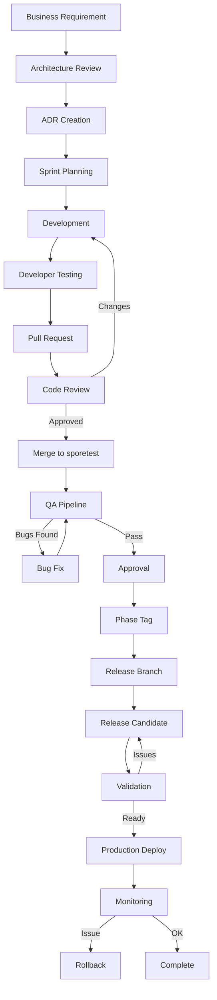

### 27.2 Git Branch Strategy

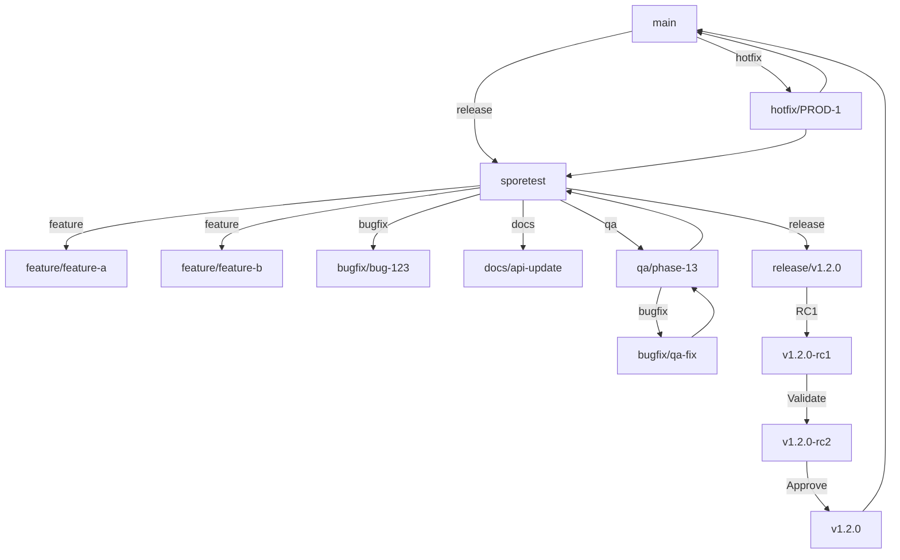

### 27.3 Testing Pyramid

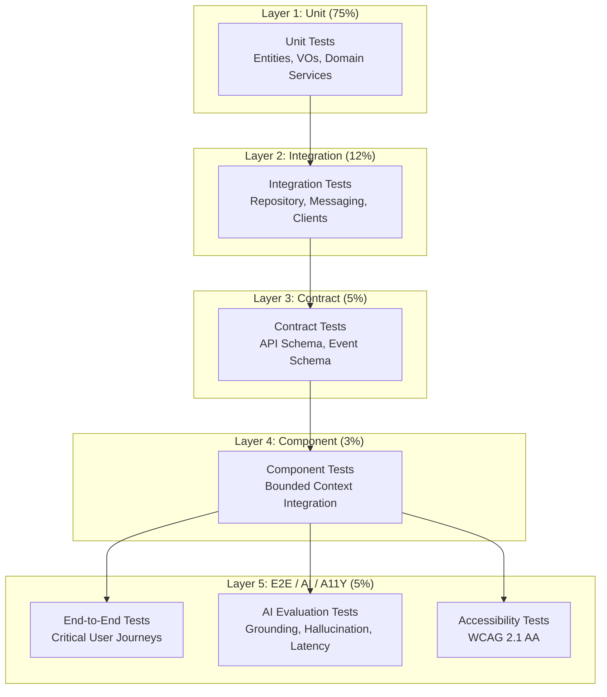

### 27.4 CI/CD Pipeline

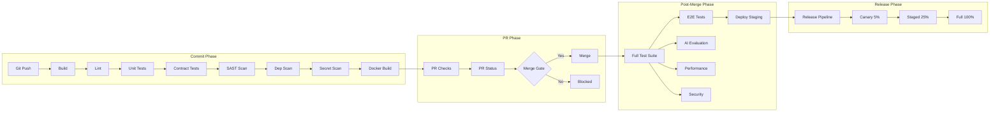

### 27.5 Review Pipeline

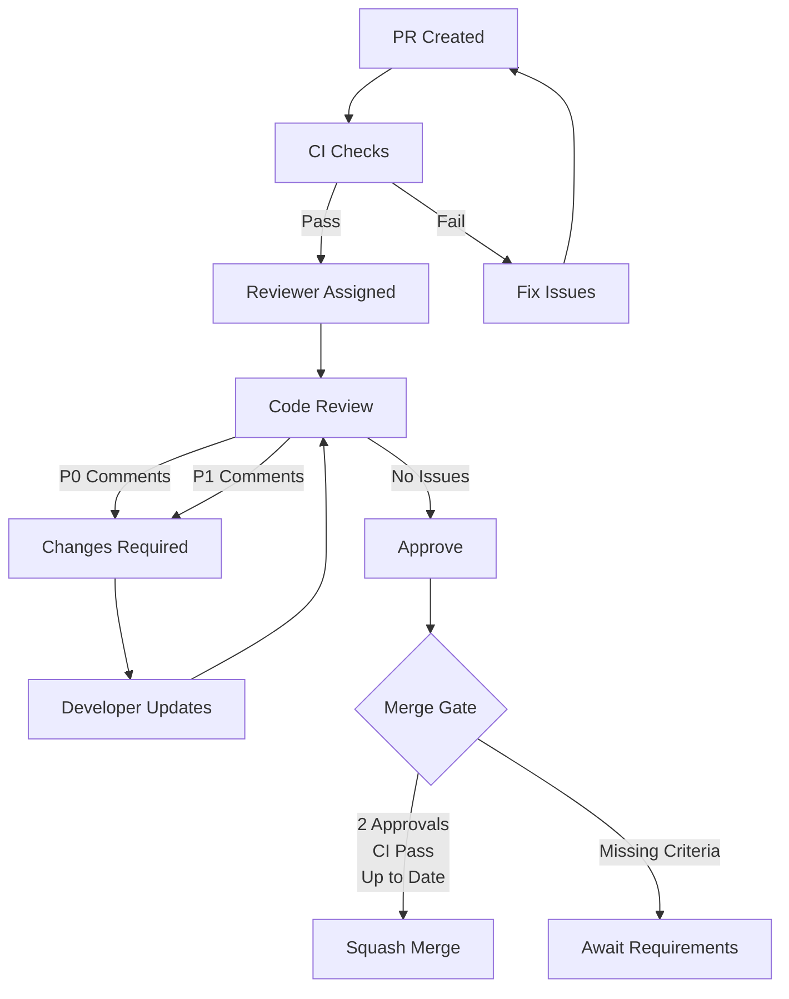

### 27.6 Definition of Done Flow

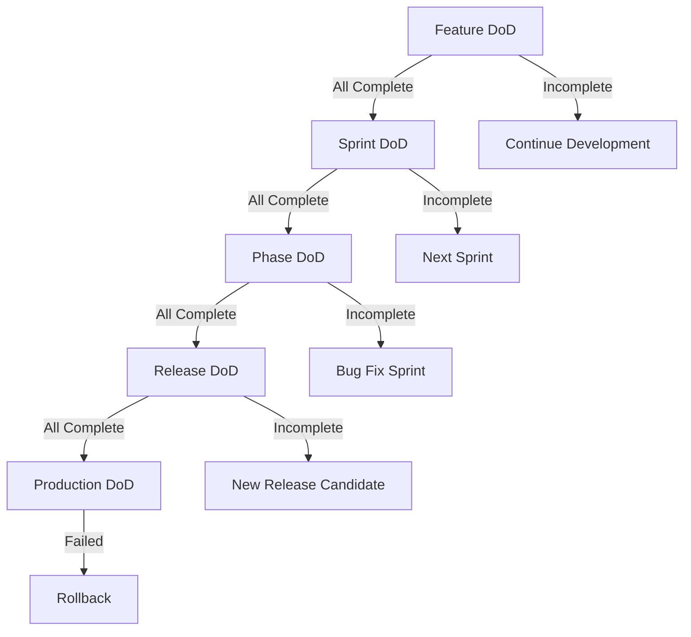

### 27.7 Production Deployment

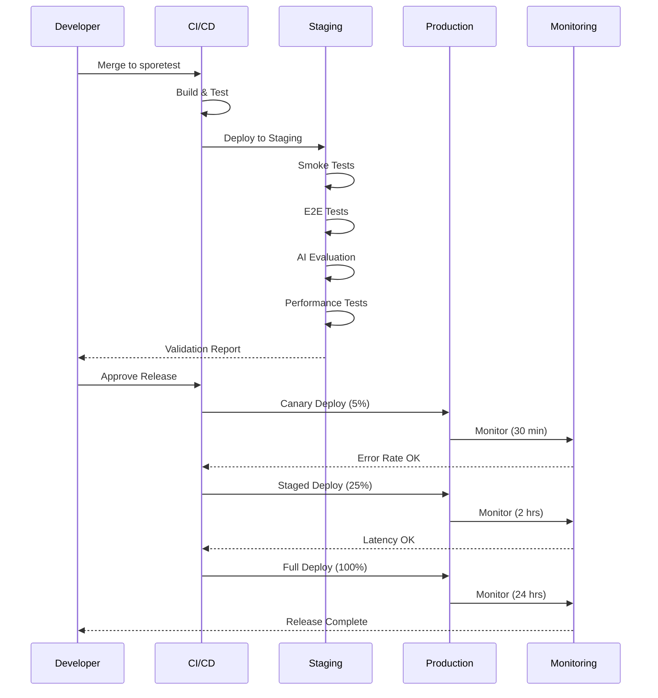

### 27.8 Rollback Strategy

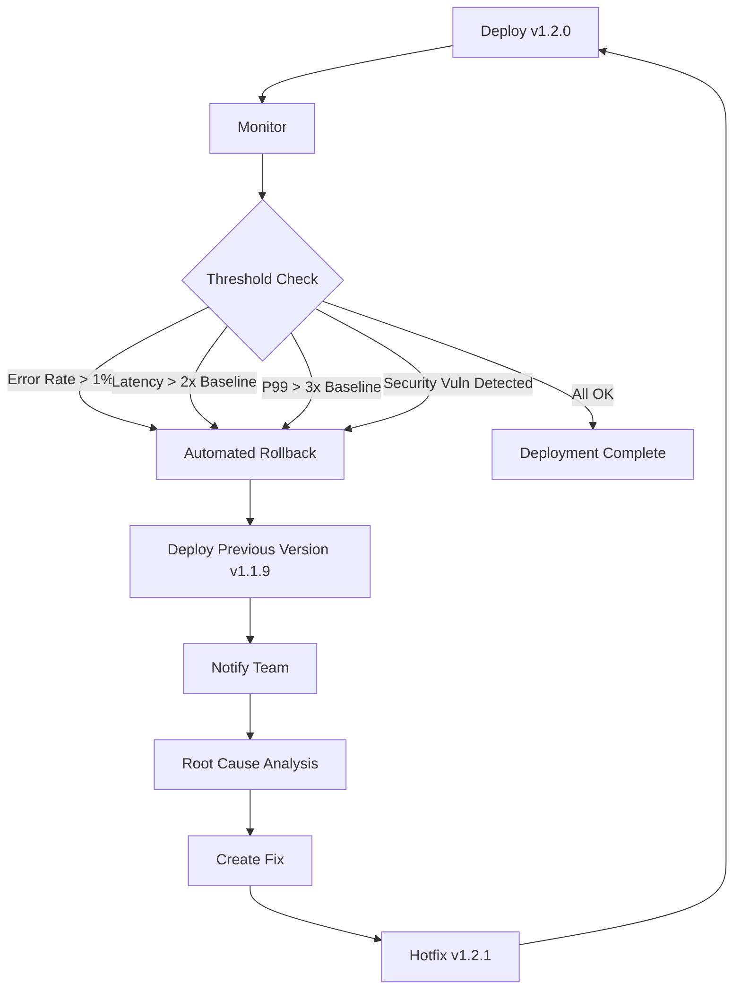

### 27.9 Documentation Flow

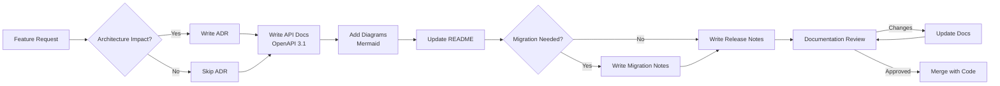

### 27.10 Hotfix Workflow

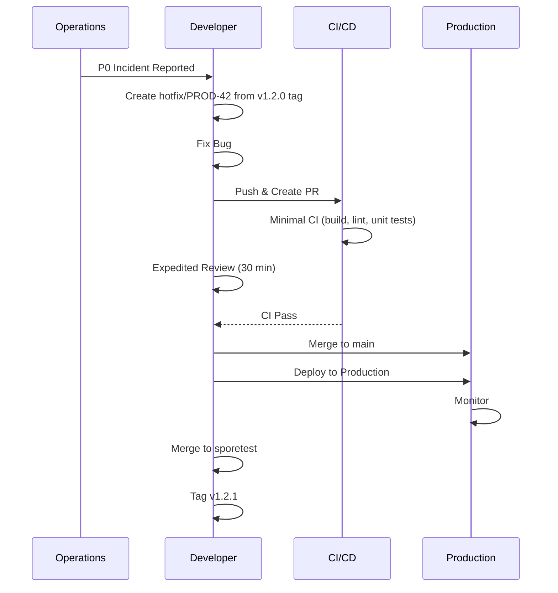
---
## 28. Detailed Standards and Checklists

### 28.1 Engineering Standards Matrix

| Standard | Backend (Java) | Frontend (TypeScript) | Mobile (RN) | AI (Python) |
| --- | --- | --- | --- | --- |
| Language version | Java 21 | TypeScript 5.x | TypeScript 5.x | Python 3.12 |
| Framework | Spring Boot 3.x | React 18.x | React Native 0.76 | FastAPI |
| Build tool | Maven | npm/yarn | npm/yarn | pip/poetry |
| Testing | JUnit 5, Mockito | Jest, Vitest | Jest, Detox | pytest |
| Code quality | Checkstyle, Spotless | ESLint, Prettier | ESLint, Prettier | Ruff, Black |
| Coverage | JaCoCo | Istanbul | Istanbul | pytest-cov |
| CI | GitHub Actions | GitHub Actions | GitHub Actions | GitHub Actions |
| Package structure | Maven modules | npm workspaces | npm workspaces | pip packages |
| API format | REST/gRPC | REST/GraphQL | REST/GraphQL | REST |
| Logging | SLF4J/Logback | console/loglevel | console/loglevel | structlog |
| Metrics | Micrometer | Sentry | Sentry | Prometheus |
| Container | Docker (JRE) | Docker (nginx) | N/A | Docker (Python) |

### 28.2 Branch Matrix

| Branch | Source | Target | Lifecycle | Protection | CI Required | Reviewers |
| --- | --- | --- | --- | --- | --- | --- |
| main | release/*, hotfix/* | N/A | Permanent | Protected (2 approvals) | Yes | 2 |
| sporetest | feature/*, bugfix/*, docs/* | N/A | Permanent | Protected (1 approval) | Yes | 1 |
| feature/* | sporetest | sporetest | Temporary | Unprotected | Yes | 1+ |
| bugfix/* | sporetest | sporetest | Temporary | Unprotected | Yes | 1+ |
| docs/* | sporetest | sporetest | Temporary | Unprotected | Yes | 1 |
| qa/* | sporetest | sporetest | Temporary | Unprotected | Yes | 1 |
| release/* | sporetest | main | Temporary (90d) | Unprotected | Yes | 2 |
| hotfix/* | main | main + sporetest | Temporary | Unprotected | Yes (minimal) | 1 |

### 28.3 Testing Matrix

| Test Type | Backend | Frontend | Mobile | AI | CI Stage | Frequency |
| --- | --- | --- | --- | --- | --- | --- |
| Unit | JUnit 5 | Jest | Jest | pytest | Commit | Every commit |
| Integration | Testcontainers | MSW | Detox | pytest-docker | Commit | Every commit |
| Contract | Spring Cloud Contract | Pact | N/A | OpenAPI Assert | PR | Every PR |
| Component | Spring Boot Test | Cypress | Detox | Custom | Sprint | Every sprint |
| E2E | Selenium | Playwright | Detox | Custom | Sprint | Every sprint |
| Security | OWASP ZAP | OWASP ZAP | MobSF | Bandit | Phase | Every phase |
| Performance | k6 | Lighthouse | Metro | Custom | Phase | Every phase |
| AI Eval | N/A | N/A | N/A | Custom eval | Sprint | Every sprint |
| Accessibility | axe-core | axe-core | axe-core | N/A | Phase | Every phase |
| Load | k6 | k6 | N/A | Custom | Release | Every release |
| Disaster | Chaos Mesh | N/A | N/A | N/A | Quarterly | Quarterly |

### 28.4 Review Severity Matrix

| Severity | Label | Description | SLA (Feature) | SLA (Bugfix) | SLA (Hotfix) |
| --- | --- | --- | --- | --- | --- |
| P0 | blocking | Bug, security issue, architecture violation | Fix before merge | Fix before merge | Fix immediately |
| P1 | required | Missing test, doc, naming violation | Should fix before merge | Should fix before merge | Fix before merge |
| P2 | recommended | Improvement, minor cleanup | Follow-up PR | Follow-up PR | Log for later |
| P3 | optional | Style preference | Can ignore | Can ignore | Can ignore |

### 28.5 Definition of Done Matrix

| Criterion | Feature | Sprint | Phase | Release | Production |
| --- | --- | --- | --- | --- | --- |
| Acceptance criteria met | Required | Required | Required | Required | Required |
| Code compiles and builds | Required | Required | Required | Required | Verified |
| Lint passes | Required | Required | Required | Required | Verified |
| Unit tests pass | Required | Required | Required | Required | Verified |
| Integration tests pass | Required | Required | Required | Required | Verified |
| E2E tests pass | Optional | Required | Required | Required | Verified |
| AI evaluation pass | Optional | Required | Required | Required | Verified |
| Security scan pass | Required | Required | Required | Required | Verified |
| Performance benchmark | Optional | Required | Required | Required | Verified |
| API documentation | Required | Required | Required | Required | Verified |
| ADR created | Optional | Required | Required | Required | Verified |
| README updated | Required | Required | Required | Required | Verified |
| Migration notes | Optional | Optional | Required | Required | Verified |
| Release notes | N/A | N/A | Required | Required | Published |
| Code review completed | Required | Required | Required | Required | Verified |
| Feature flags added | Optional | Required | Required | Required | Verified |
| Rollback plan | N/A | N/A | Required | Required | Verified |
| Monitoring configured | N/A | N/A | Required | Required | Verified |
| On-call notified | N/A | N/A | N/A | Optional | Required |

### 28.6 Security Checklist

| Check | Description | Tool | Owner | Frequency |
| --- | --- | --- | --- | --- |
| SAST | Static application security testing | SonarQube | Developer | Every commit |
| DAST | Dynamic application security testing | OWASP ZAP | Security | Every phase |
| Dependency scan | Known vulnerability check | OWASP Dependency Check | Developer | Every commit |
| Container scan | Docker image vulnerability scan | Trivy | DevOps | Every build |
| Secret scan | Hardcoded secrets detection | GitLeaks | Developer | Every commit |
| License scan | Dependency license compliance | FOSSA | Developer | Every commit |
| IaC scan | Infrastructure as code security | Checkov | DevOps | Every commit |
| Penetration test | Manual security assessment | External vendor | Security | Quarterly |
| AI red team | AI-specific security testing | Internal + external | AI Team | Every phase |
| Access review | User and service access audit | Manual | Security | Quarterly |
| PII audit | Personal data handling review | Manual | Privacy | Quarterly |
| Incident response | Security incident drill | Manual | Security | Quarterly |

### 28.7 Performance Targets

| Service | P50 | P95 | P99 | Throughput | Instance Count |
| --- | --- | --- | --- | --- | --- |
| identity-service | < 100ms | < 300ms | < 500ms | 2000 req/s | 3 |
| order-service | < 200ms | < 500ms | < 1000ms | 1000 req/s | 3 |
| catalog-service | < 100ms | < 300ms | < 500ms | 3000 req/s | 3 |
| cart-service | < 50ms | < 100ms | < 200ms | 3000 req/s | 2 |
| inventory-service | < 100ms | < 300ms | < 500ms | 2000 req/s | 3 |
| fulfillment-service | < 500ms | < 2000ms | < 5000ms | 500 req/s | 3 |
| training-service | < 200ms | < 500ms | < 1000ms | 1000 req/s | 3 |
| payment-service | < 500ms | < 2000ms | < 5000ms | 500 req/s | 3 |
| ai-gateway-service | < 200ms | < 500ms | < 1000ms | 2000 req/s | 5 |
| prompt-service | < 50ms | < 100ms | < 200ms | 5000 req/s | 2 |
| knowledge-service | < 200ms | < 500ms | < 1000ms | 1000 req/s | 5 |
| conversation-service | < 100ms | < 300ms | < 500ms | 2000 req/s | 5 |
| agent-service | < 200ms | < 1000ms | < 5000ms | 200 req/s | 5 |
| copilot-service | < 2000ms | < 5000ms | < 10000ms | 200 req/s | 5 |
| vector-service | < 50ms | < 100ms | < 200ms | 5000 req/s | 3 |
| evaluation-service | < 1000ms | < 5000ms | < 10000ms | 100 req/s | 2 |

### 28.8 CI Gates Summary

| Gate | Phase | Breaking | Auto-Fix | Tool |
| --- | --- | --- | --- | --- |
| Compile | Build | Yes | No | javac/tsc |
| Lint | Build | Yes | Partial | ESLint/Checkstyle |
| Format | Build | Yes | Yes | Prettier/Spotless |
| Unit Tests | Test | Yes | No | JUnit/Jest |
| Integration Tests | Test | Yes | No | Testcontainers |
| Contract Tests | Test | Yes | No | Spring Cloud Contract |
| SAST | Security | Yes | No | SonarQube |
| Dep Scan | Security | Yes | No | OWASP DC |
| Secret Scan | Security | Yes | No | GitLeaks |
| Coverage | Quality | Yes | No | JaCoCo/Istanbul |
| AI Eval | AI Quality | Yes | No | Custom eval |
| Performance | Performance | Warning | No | k6 |

### 28.9 Release Gates Summary

| Gate | Owner | Input | Output | Duration |
| --- | --- | --- | --- | --- |
| Feature Complete | Engineering | All stories closed | Feature complete report | 1 day |
| QA Complete | QA | Test results | QA sign-off | 3 days |
| Security Audit | Security | Scan reports | Security sign-off | 2 days |
| Performance Review | Performance | Benchmarks | Performance sign-off | 1 day |
| AI Quality Review | AI Engineering | Eval scores | AI quality sign-off | 1 day |
| Documentation Review | Engineering | Doc audit | Documentation sign-off | 1 day |
| Compliance Review | Compliance | Compliance check | Compliance sign-off | 1 day |
| Architecture Review | Architecture | Architecture audit | Architecture sign-off | 1 day |
| Final Approval | Eng Lead | All sign-offs | Release approval | 1 day |

### 28.10 Environment Configuration Standards

| Environment | Purpose | Deploy Trigger | Scaling | Monitoring | Database |
| --- | --- | --- | --- | --- | --- |
| local | Developer machine | Manual | N/A | N/A | Local/Docker |
| dev | Development testing | Push to sporetest | Single instance | Basic | Shared dev |
| staging | Integration testing | PR merge | 2 instances | Standard | Staging replica |
| qa | QA testing | QA branch | 2 instances | Standard | QA replica |
| perf | Performance testing | Manual | 5 instances | Full | Perf replica |
| prod | Production | Release pipeline | Auto-scaled | Full + PagerDuty | Production cluster |
| dr | Disaster recovery | Manual failover | Pre-warmed | Full | DR replica |
