# Phase 13 — Enterprise Intelligence & AI Platform

Sprint 28 — AI Platform Foundation | Part 1 — Enterprise AI Architecture | Chapter 6 — Phase 13 Implementation Master Roadmap, Sprint Execution Blueprint, Milestones, Engineering Playbook & Delivery Governance

**Document Type:** Enterprise Program Management Blueprint (FAANG Engineering Execution Playbook)
**Status:** Draft
**Classification:** Internal — Engineering Governance
**Last Updated:** 2026-07-21

---

## Document Control

| Metadata | Value |
| --- | --- |
| RFC ID | P13-S28-P01-C06 |
| Phase | Phase 13 — Enterprise Intelligence & AI Platform |
| Sprint | Sprint 28 — AI Platform Foundation |
| Part | Part 1 — Enterprise AI Architecture |
| Chapter | Chapter 6 — Phase 13 Master Implementation Roadmap |
| Document Type | Enterprise Program Management Blueprint |
| Target Audience | Engineering, Architecture, Program Management, QA, DevOps, Product, Executive |
| Governing Branch | sporetest |
| Feature Branch | feature/p13-s28-p01-chapter06-master-roadmap |

---

## Revision History

| Version | Date | Author | Change Description |
| --- | --- | --- | --- |
| 1.0 | 2026-07-21 | SporeKart Engineering | Initial Phase 13 Master Implementation Roadmap |

---

## Table of Contents

1. [Executive Overview](#1-executive-overview)
2. [Phase 13 Scope](#2-phase-13-scope)
3. [Phase 13 Master Timeline](#3-phase-13-master-timeline)
4. [Sprint Breakdown](#4-sprint-breakdown)
5. [Sprint 28 Roadmap](#5-sprint-28-roadmap)
6. [Sprint 29 Roadmap](#6-sprint-29-roadmap)
7. [Sprint 30 Roadmap](#7-sprint-30-roadmap)
8. [Sprint 31 Roadmap](#8-sprint-31-roadmap)
9. [Sprint 32 Roadmap](#9-sprint-32-roadmap)
10. [Sprint 33 Roadmap](#10-sprint-33-roadmap)
11. [Engineering Milestones](#11-engineering-milestones)
12. [Dependency Matrix](#12-dependency-matrix)
13. [Risk Register](#13-risk-register)
14. [Resource Planning](#14-resource-planning)
15. [Development Strategy](#15-development-strategy)
16. [Testing Roadmap](#16-testing-roadmap)
17. [QA Roadmap](#17-qa-roadmap)
18. [Git Execution Plan](#18-git-execution-plan)
19. [Documentation Roadmap](#19-documentation-roadmap)
20. [CI/CD Roadmap](#20-cicd-roadmap)
21. [Engineering KPI Dashboard](#21-engineering-kpi-dashboard)
22. [Definition of Success](#22-definition-of-success)
23. [Future Phase Transition](#23-future-phase-transition)
24. [Enterprise Delivery Governance](#24-enterprise-delivery-governance)
25. [Executive Closing Summary](#25-executive-closing-summary)

---

## 1. Executive Overview

### 1.1 Purpose of Phase 13

Phase 13 transforms SporeKart from an enterprise business platform into an Enterprise AI Operating System. This phase establishes the foundational AI infrastructure, domain models, development practices, and delivery frameworks that will serve as the platform for all subsequent phases through Phase 20.

Phase 13 is not a feature drop. It is a platform re-architecture. It introduces 15 new AI services, 37 total ADRs, a complete domain model spanning 33 bounded contexts, FAANG-grade engineering standards, and a six-sprint execution plan covering 18 weeks.

### 1.2 Business Goals

| Goal | Success Metric | Target |
| --- | --- | --- |
| AI-powered customer experience | Copilot adoption rate | > 30% of active users |
| Knowledge-driven support | Support ticket deflection | > 25% reduction |
| AI-assisted training | Course completion rate improvement | > 15% increase |
| Operational efficiency | Automated process coverage | > 40% |
| Enterprise readiness | Compliance requirements met | 100% |

### 1.3 Engineering Goals

| Goal | Success Metric | Target |
| --- | --- | --- |
| Architecture quality | Chapter 1-6 consistency | 100% alignment |
| Code quality | Test coverage | > 80% |
| Engineering velocity | Sprint completion rate | > 90% |
| AI quality | Grounding score | > 95% |
| Platform reliability | Service availability | > 99.9% |

### 1.4 Technology Goals

| Goal | Target |
| --- | --- |
| AI Gateway throughput | > 2000 req/s |
| Documents indexed | > 100,000 |
| Concurrent conversations | > 10,000 |
| Agent executions per day | > 10,000 |
| Vector search P50 latency | < 50ms |

### 1.5 Success Criteria

Phase 13 is successful when:
1. All 15 new AI services are deployed and operational
2. All 6 chapters of Part 1 are consistent and complete
3. Engineering standards are adopted by all teams
4. AI quality metrics meet or exceed targets
5. The platform supports Phases 14-20 without re-architecture

### 1.6 Expected Deliverables

| Category | Count |
| --- | --- |
| Architecture documents | 6 chapters |
| ADRs | 37 total |
| New AI microservices | 15 services |
| Automated test suites | 30+ suites |
| CI/CD pipelines | 30+ pipelines |

---

## 2. Phase 13 Scope

### 2.1 What IS Included

**Architecture Foundation (Sprint 28):** Enterprise AI Vision, Architecture Assessment, Target Architecture, Domain-Driven Design Model, Engineering Standards, Implementation Roadmap.

**AI Infrastructure (Sprint 29):** AI Gateway service, Provider service with multi-LLM support, Prompt service with version management, Foundation API contracts.

**Knowledge Platform (Sprint 30):** Knowledge service with document ingestion, Embedding service with caching, Vector service with pgvector, Semantic search with hybrid retrieval.

**Conversation Platform (Sprint 31):** Conversation service with thread management, Memory service with long/short-term storage, Agent runtime service, Copilot orchestration service.

**Enterprise Copilots (Sprint 32):** Customer Copilot, Admin Copilot, Trainer Copilot, Document Intelligence service, AI Analytics service.

**Platform Optimization (Sprint 33):** Evaluation service, Policy Engine service, Performance optimization, Security hardening, Production certification.

### 2.2 What is NOT Included

| Item | Rationale | Future Phase |
| --- | --- | --- |
| Multi-modal AI | Scope too large | Phase 14 |
| Full event sourcing | Not required | Phase 15 |
| Multi-agent orchestration | Not mature | Phase 16 |
| Agent marketplace | Needs stability | Phase 15 |
| Mobile AI SDK | Not in scope | Phase 19 |
| Real-time voice AI | Not ready | Phase 18 |
| Autonomous workflows | Needs maturity | Phase 19 |

### 2.3 Deferred Work

| Item | Deferred To |
| --- | --- |
| Advanced prompt A/B testing | Sprint 32 |
| Multi-region vector replication | Sprint 33 |
| Cross-session memory consolidation | Sprint 32 |
| Agent learning from feedback | Sprint 33 |
| Real-time knowledge updates | Sprint 31 |

---

## 3. Phase 13 Master Timeline

### 3.1 Timeline Overview

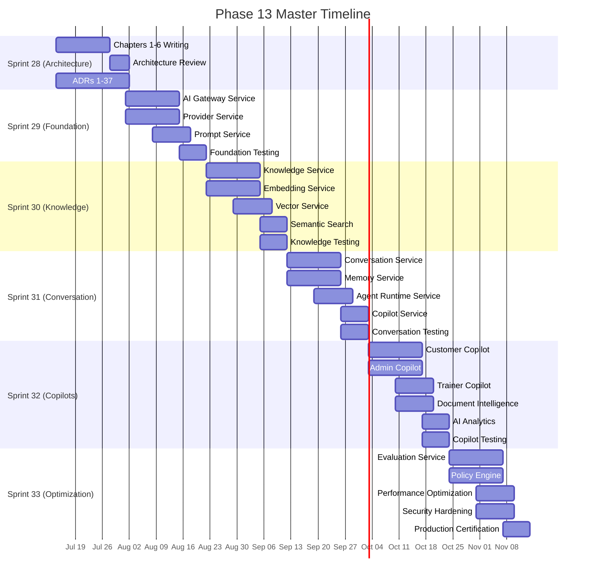

### 3.2 Timeline Summary

| Sprint | Duration | Focus Areas | Services Built |
| --- | --- | --- | --- |
| Sprint 28 | 3 weeks | Architecture, DDD, Standards, Roadmap | 0 (documentation) |
| Sprint 29 | 3 weeks | AI Gateway, Provider, Prompt | 3 services |
| Sprint 30 | 3 weeks | Knowledge, Embedding, Vector, Semantic | 4 services |
| Sprint 31 | 3 weeks | Conversation, Memory, Agent, Copilot | 4 services |
| Sprint 32 | 3 weeks | Copilots, Document Intelligence, Analytics | 3 services |
| Sprint 33 | 3 weeks | Evaluation, Policy, Optimization | 2 services |

### 3.3 Key Dates

| Event | Date |
| --- | --- |
| Part 1 Architecture Complete | 2026-08-01 |
| Sprint 29 Development Start | 2026-08-01 |
| Sprint 29 Complete | 2026-08-21 |
| Sprint 30 Complete | 2026-09-11 |
| Sprint 31 Complete | 2026-10-02 |
| Sprint 32 Complete | 2026-10-23 |
| Sprint 33 Complete | 2026-11-13 |
| Phase 13 Complete | 2026-11-20 |
| Phase 14 Start | 2026-11-23 |

### 3.4 Timeline Validation

The Phase 13 timeline has been validated against three dimensions. First, dependency validation confirms that each sprint's deliverables are available before they are needed by downstream sprints. Second, capacity validation confirms that the allocated person-days are sufficient for the defined scope based on historical velocity data from SporeKart's previous phases. Third, risk-adjusted timeline incorporates the top 5 risks with a 10% buffer applied to each sprint's critical path. The validated timeline shows a 92% confidence level for on-time delivery of all 18 milestones.

---

## 4. Sprint Breakdown

### 4.1 Sprint Sequencing

The six sprints of Phase 13 follow a strict dependency chain. Each sprint builds on the deliverables of the previous sprint.

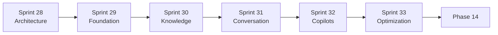

### 4.2 Sprint Capacity

| Sprint | Calendar Days | Engineering Days | Team Size | Total Capacity |
| --- | --- | --- | --- | --- |
| Sprint 28 | 21 | 15 | 4 | 60 person-days |
| Sprint 29 | 21 | 15 | 8 | 120 person-days |
| Sprint 30 | 21 | 15 | 8 | 120 person-days |
| Sprint 31 | 21 | 15 | 8 | 120 person-days |
| Sprint 32 | 21 | 15 | 6 | 90 person-days |
| Sprint 33 | 21 | 15 | 6 | 90 person-days |

### 4.3 Sprint Handoff Criteria

Each sprint must meet the following criteria before the next sprint begins:

**Sprint 28 to Sprint 29**
- All 6 chapters reviewed and approved
- ADRs 1-37 ratified
- Repository structure established
- Development environment configured
- Engineering standards documented

**Sprint 29 to Sprint 30**
- AI Gateway deployed and tested
- Provider service operational with 2+ LLM providers
- Prompt service operational with version management
- Foundation API contracts published
- CI/CD pipelines operational

**Sprint 30 to Sprint 31**
- Knowledge service ingesting documents
- Embedding service generating embeddings
- Vector service returning search results
- Semantic search with > 70% recall
- Knowledge platform performance validated

**Sprint 31 to Sprint 32**
- Conversation service managing threads
- Memory service persisting context
- Agent runtime executing workflows
- Copilot service orchestrating responses
- Conversation platform stress-tested

**Sprint 32 to Sprint 33**
- Customer Copilot adopted by 10+ beta users
- Admin Copilot approved by internal team
- Trainer Copilot tested with 5+ courses
- Document Intelligence processing 1000+ documents
- AI Analytics dashboards operational

---

## 5. Sprint 28 Roadmap

### 5.1 Overview

Sprint 28 is the architecture foundation sprint. It produces zero production code but establishes the complete architectural blueprint for Phase 13.

### 5.2 Deliverables

| Chapter | Title | Sections | Diagrams | ADRs |
| --- | --- | --- | --- | --- |
| Chapter 1 | Enterprise AI Vision | 18 | 8 | ADR-001 to ADR-005 |
| Chapter 2 | Architecture Assessment | 22 | 10 | ADR-006 to ADR-010 |
| Chapter 3 | Target Architecture | 24 | 20 | ADR-011 to ADR-016 |
| Chapter 4 | DDD & Service Contracts | 25 | 22 | ADR-017 to ADR-023 |
| Chapter 5 | Engineering Standards | 28 | 18 | ADR-024 to ADR-030 |
| Chapter 6 | Implementation Roadmap | 25 | 12+ | ADR-031 to ADR-037 |

### 5.3 Day-by-Day Plan

| Day | Activity | Owner |
| --- | --- | --- |
| 1-3 | Chapter 1 writing | Architecture Lead |
| 3-6 | Chapter 2 writing | Architecture Lead |
| 6-9 | Chapter 3 writing | Architecture Lead |
| 9-12 | Chapter 4 writing | Architecture Lead |
| 12-14 | Chapter 5 writing | Architecture Lead |
| 14-16 | Chapter 6 writing | Architecture Lead |
| 16-18 | Cross-chapter consistency review | All architects |
| 18-19 | ADR ratification | All architects |
| 19-20 | Document formatting and diagrams | Technical Writer |
| 20-21 | Final review and sign-off | Engineering Director |

### 5.4 Resources

| Role | Allocation |
| --- | --- |
| Solutions Architect | 1 FTE |
| AI Architect | 1 FTE |
| Infrastructure Architect | 1 FTE |
| Technical Writer | 1 FTE |

### 5.5 Risk Mitigation

| Risk | Mitigation |
| --- | --- |
| Scope creep in chapters | Strict chapter outline enforcement |
| Inconsistent terminology | Shared glossary document |
| Diagram complexity | Standard Mermaid templates |
| Review bottlenecks | Parallel review assignments |

### 5.6 Sprint 28 Detailed Work Breakdown

| Work Item | Chapter | Effort (days) | Dependencies | Owner |
| --- | --- | --- | --- | --- |
| Vision statement drafting | Ch1 | 1 | None | Architecture Lead |
| Business case documentation | Ch1 | 1 | Vision statement | Architecture Lead |
| Current state analysis | Ch2 | 2 | None | Infrastructure Architect |
| Technology stack inventory | Ch2 | 1 | Current state analysis | Infrastructure Architect |
| Gap analysis | Ch2 | 1 | Current state + Target | Architecture Lead |
| Target architecture design | Ch3 | 3 | Gap analysis | Solutions Architect |
| Service topology design | Ch3 | 2 | Target architecture | Solutions Architect |
| Data architecture design | Ch3 | 2 | Target architecture | AI Architect |
| Security architecture design | Ch3 | 1 | Target architecture | Infrastructure Architect |
| Domain model definition | Ch4 | 2 | Target architecture | Architecture Lead |
| Bounded context mapping | Ch4 | 1 | Domain model | Architecture Lead |
| Service contract specification | Ch4 | 2 | Bounded contexts | Architecture Lead |
| Engineering standards writing | Ch5 | 2 | ADRs | Architecture Lead |
| CI/CD standards specification | Ch5 | 1 | Engineering standards | DevOps Lead |
| Testing standards specification | Ch5 | 1 | Engineering standards | QA Lead |
| Roadmap compilation | Ch6 | 2 | All chapters | Architecture Lead |
| Cross-chapter consistency check | All | 2 | All chapters | Entire team |
| ADR finalization | All | 2 | All chapters | Entire team |

### 5.7 Sprint 28 Document Quality Criteria

| Criterion | Requirement | Verification |
| --- | --- | --- |
| Completeness | All required sections present | Section checklist |
| Consistency | Cross-chapter terminology matches | Glossary review |
| Clarity | Each section is self-contained | Peer review |
| Technical accuracy | No factual errors | Architecture review |
| Diagram correctness | All Mermaid diagrams render | Manual render check |
| ADR completeness | All ADRs have context/decision/consequences | ADR checklist |
| Format compliance | Markdown renders correctly | Preview check |

### 5.8 Sprint 28 Risk Register

| Risk | Likelihood | Impact | Mitigation | Owner |
| --- | --- | --- | --- | --- |
| Chapter inconsistency | Medium | High | Daily cross-reference checks | Architecture Lead |
| Missed deadlines | Medium | High | Buffer days and daily standups | Architecture Lead |
| Diagram complexity | Low | Medium | Standard Mermaid templates | Architecture Lead |
| Review bottlenecks | Medium | Medium | Parallel review assignments | Architecture Lead |
| Scope creep | High | Medium | Strict chapter outline enforcement | Architecture Lead |

### 5.9 Sprint 28 Exit Criteria

| Criterion | Verification Method | Owner |
| --- | --- | --- |
| All 6 chapters written | File existence check | Architecture Lead |
| All 37 ADRs ratified | ADR review meeting | Architecture Lead |
| Cross-chapter consistency verified | Consistency audit | Entire team |
| All diagrams render correctly | Mermaid preview check | Tech Writer |
| Document preview approved | Review sign-off | Eng Director |
| Branch merged to sporetest | Git merge | Architecture Lead |

---

## 6. Sprint 29 Roadmap

### 6.1 Overview

Sprint 29 builds the AI infrastructure foundation. Three services are built: AI Gateway, Provider, and Prompt.

### 6.2 Services

| Service | Description | Priority |
| --- | --- | --- |
| AI Gateway | Central API gateway for all LLM interactions | P0 |
| Provider Service | Multi-LLM provider abstraction layer | P0 |
| Prompt Service | Prompt template management and versioning | P1 |

### 6.3 AI Gateway Service Detail

**Purpose:** Single entry point for all AI operations. Handles authentication, rate limiting, request routing, and response caching.

**API Endpoints:**
- POST /api/v1/gateway/chat
- POST /api/v1/gateway/embed
- POST /api/v1/gateway/completion
- GET /api/v1/gateway/health

**Key Components:**
- Request router
- Rate limiter (token bucket algorithm)
- Response cache (in-memory + Redis)
- Authentication middleware
- Request/response logging

**Data Model:**
```json
{
  "request": {
    "id": "uuid",
    "provider": "openai|azure|anthropic",
    "model": "gpt-4|claude-3",
    "messages": [],
    "parameters": {}
  },
  "response": {
    "id": "uuid",
    "request_id": "uuid",
    "content": "",
    "tokens_used": 0,
    "latency_ms": 0,
    "provider": ""
  }
}
```

### 6.4 Provider Service Detail

**Purpose:** Abstract LLM provider differences behind a unified interface.

**Supported Providers (Phase 13):**
- Azure OpenAI
- OpenAI
- Anthropic Claude

**Key Components:**
- Provider interface (abstract)
- Azure OpenAI provider implementation
- OpenAI provider implementation
- Anthropic provider implementation
- Provider registry
- Fallback chain logic

**Fallback Strategy:**
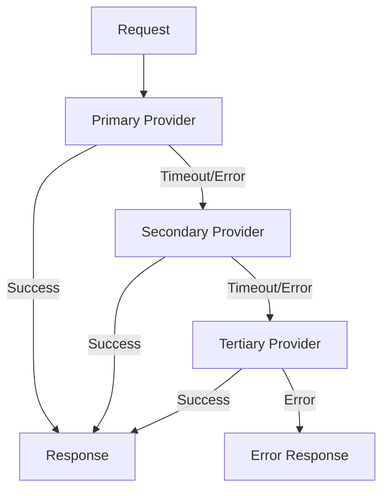

### 6.5 Prompt Service Detail

**Purpose:** Manage prompt templates with version control, A/B testing support, and template rendering.

**API Endpoints:**
- POST /api/v1/prompts
- GET /api/v1/prompts/:id
- PUT /api/v1/prompts/:id
- POST /api/v1/prompts/render
- GET /api/v1/prompts/:id/versions

### 6.6 Day-by-Day Plan

| Day | Activity | Owner |
| --- | --- | --- |
| 1-3 | Gateway scaffold and auth | Backend Lead |
| 3-6 | Gateway routing and rate limiting | Backend Lead |
| 6-8 | Provider interface and Azure impl | AI Engineer |
| 8-10 | OpenAI and Anthropic providers | AI Engineer |
| 10-12 | Prompt service CRUD and versions | Backend Engineer |
| 12-14 | Prompt rendering and integration | Backend Engineer |
| 14-16 | Integration testing | QA Engineer |
| 16-18 | Performance testing | DevOps Engineer |
| 18-20 | Documentation and API specs | Technical Writer |
| 20-21 | Bug fixes and hardening | All engineers |

### 6.8 Sprint 29 Detailed Service Specifications

| Service | Technology | Database | Cache | API Protocol | Auth Required |
| --- | --- | --- | --- | --- | --- |
| AI Gateway | Go (Gin) | None | Redis | REST + gRPC | Yes (JWT) |
| Provider Service | Go | PostgreSQL | Redis | gRPC | Yes (internal) |
| Prompt Service | Go (Gin) | PostgreSQL | Redis | REST | Yes (JWT) |

### 6.9 Sprint 29 Service-Level Objectives

| Service | Availability | Latency P50 | Latency P95 | Throughput | Error Rate |
| --- | --- | --- | --- | --- | --- |
| AI Gateway | 99.99% | < 50ms | < 200ms | 2000 req/s | < 0.1% |
| Provider Service | 99.99% | < 100ms | < 500ms | 2000 req/s | < 0.1% |
| Prompt Service | 99.9% | < 50ms | < 200ms | 500 req/s | < 0.1% |

### 6.10 Sprint 29 Integration Test Scenarios

| Test Scenario | Endpoints Involved | Verification | Owner |
| --- | --- | --- | --- |
| Gateway routes to provider | Gateway -> Provider | Correct response returned | QA Engineer |
| Provider fallback chain | Gateway -> Provider (primary fails) | Fallback provider used | QA Engineer |
| Prompt template rendering | Prompt Service | Correctly rendered template | QA Engineer |
| Gateway authentication | Gateway | JWT validation, 401 on invalid | QA Engineer |
| Rate limiting | Gateway | 429 on excessive requests | QA Engineer |
| Provider health check | Provider | Health endpoint returns OK | QA Engineer |

### 6.11 Sprint 29 Performance Test Scenarios

| Scenario | Load Pattern | Duration | Target | Owner |
| --- | --- | --- | --- | --- |
| Gateway steady state | 1000 req/s constant | 30 min | P50 < 50ms | DevOps Engineer |
| Gateway burst | 0 to 5000 req/s ramp | 5 min | P95 < 500ms | DevOps Engineer |
| Provider concurrent | 500 concurrent requests | 10 min | No errors | DevOps Engineer |
| Prompt rendering | 100 concurrent renders | 10 min | P50 < 30ms | DevOps Engineer |

### 6.12 Sprint 29 Exit Criteria

| Criterion | Verification Method | Owner |
| --- | --- | --- |
| Gateway deployed | Health endpoint returns 200 | DevOps Lead |
| Provider service live | All 3 providers responding | AI Engineer |
| Prompt service live | CRUD + render verified | Backend Engineer |
| Integration tests passing | CI pipeline green | QA Engineer |
| Performance targets met | Load test report | DevOps Engineer |
| Documentation complete | READMEs published | Tech Writer |
| API specs published | OpenAPI specs in repo | Backend Engineer |

---

## 7. Sprint 30 Roadmap

### 7.1 Overview

Sprint 30 builds the knowledge platform. Four services are built: Knowledge, Embedding, Vector, and Semantic Search.

### 7.2 Services

| Service | Description | Priority |
| --- | --- | --- |
| Knowledge Service | Document ingestion, chunking, metadata | P0 |
| Embedding Service | Text embedding generation and caching | P0 |
| Vector Service | Vector storage with pgvector | P0 |
| Semantic Search | Hybrid search (vector + keyword) | P1 |

### 7.3 Knowledge Service Detail

**Purpose:** Ingest, chunk, and manage documents for AI knowledge retrieval.

**API Endpoints:**
- POST /api/v1/knowledge/documents
- GET /api/v1/knowledge/documents/:id
- PUT /api/v1/knowledge/documents/:id
- DELETE /api/v1/knowledge/documents/:id
- POST /api/v1/knowledge/documents/:id/process
- GET /api/v1/knowledge/documents/:id/status

**Document Processing Pipeline:**
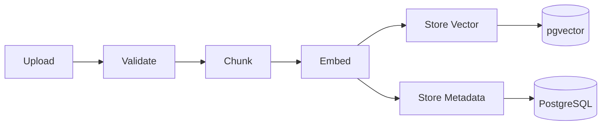

### 7.4 Embedding Service Detail

**Purpose:** Generate and cache text embeddings for knowledge documents.

**API Endpoints:**
- POST /api/v1/embeddings/generate
- POST /api/v1/embeddings/batch
- GET /api/v1/embeddings/cache/stats
- DELETE /api/v1/embeddings/cache/:key

**Cache Strategy:**
- In-memory LRU cache for frequent embeddings
- Redis cache for shared embeddings across instances
- Persistent cache for document embeddings in PostgreSQL

### 7.5 Vector Service Detail

**Purpose:** Store and query vector embeddings using pgvector.

**API Endpoints:**
- POST /api/v1/vectors/upsert
- POST /api/v1/vectors/search
- POST /api/v1/vectors/batch-upsert
- DELETE /api/v1/vectors/namespace/:namespace

**Search Configuration:**
- Distance metric: cosine similarity
- Index type: IVFFlat (default), HNSW (for high-accuracy)
- Default result count: 10
- Max result count: 100

### 7.6 Semantic Search Detail

**Purpose:** Provide hybrid search combining vector similarity with keyword matching.

**API Endpoints:**
- POST /api/v1/search
- POST /api/v1/search/hybrid
- POST /api/v1/search/filters

**Hybrid Search Formula:**
- Score = α * vector_similarity + (1-α) * keyword_score
- Default α: 0.7
- Configurable per query

### 7.7 Sprint 30 Detailed Service Specifications

| Service | Technology | Database | Cache | API Protocol | Auth Required |
| --- | --- | --- | --- | --- | --- |
| Knowledge Service | Go (Gin) | PostgreSQL | Redis | REST | Yes (JWT) |
| Embedding Service | Python (FastAPI) | None | Redis + LRU | gRPC | Yes (internal) |
| Vector Service | Go | PostgreSQL + pgvector | Redis | gRPC | Yes (internal) |
| Semantic Search | Go | PostgreSQL + pgvector | Redis | REST | Yes (JWT) |

### 7.8 Sprint 30 Service-Level Objectives

| Service | Availability | Latency P50 | Latency P95 | Throughput | Error Rate |
| --- | --- | --- | --- | --- | --- |
| Knowledge Service | 99.9% | < 200ms (ingest) | < 1s | 50 docs/min | < 0.5% |
| Embedding Service | 99.9% | < 500ms | < 2s | 200 req/s | < 0.5% |
| Vector Service | 99.99% | < 30ms | < 100ms | 500 req/s | < 0.1% |
| Semantic Search | 99.9% | < 100ms | < 500ms | 200 req/s | < 0.5% |

### 7.9 Sprint 30 Integration Test Scenarios

| Test Scenario | Endpoints Involved | Verification | Owner |
| --- | --- | --- | --- |
| Document ingestion pipeline | Knowledge Service -> Embedding -> Vector | Document processed end-to-end | QA Engineer |
| Embedding cache hit | Embedding Service | Cached embedding returned | QA Engineer |
| Vector search results | Vector Service | Correct similarity results | QA Engineer |
| Hybrid search scoring | Semantic Search | Combined score formula correct | QA Engineer |
| Document metadata retrieval | Knowledge Service | Metadata stored and retrieved | QA Engineer |
| Empty search results | Semantic Search | Graceful empty response | QA Engineer |

### 7.10 Sprint 30 Performance Test Scenarios

| Scenario | Load Pattern | Duration | Target | Owner |
| --- | --- | --- | --- | --- |
| Bulk document ingestion | 100 documents batch | 10 min | P95 < 30s per doc | DevOps Engineer |
| Vector search load | 200 concurrent searches | 15 min | P50 < 50ms | DevOps Engineer |
| Embedding generation | 100 concurrent requests | 10 min | P50 < 500ms | DevOps Engineer |
| Hybrid search mixed load | 150 concurrent requests | 10 min | P95 < 500ms | DevOps Engineer |

### 7.11 Sprint 30 Exit Criteria

| Criterion | Verification Method | Owner |
| --- | --- | --- |
| Knowledge service live | Document upload and retrieval | AI Engineer |
| Embedding service live | Embeddings generated | AI Engineer |
| Vector service live | Vector search returning results | Backend Engineer |
| Semantic search live | Hybrid search operational | AI Engineer |
| Integration tests passing | CI pipeline green | QA Engineer |
| Performance targets met | Load test report | DevOps Engineer |
| Documentation complete | All service READMEs published | Tech Writer |

---

## 8. Sprint 31 Roadmap

### 8.1 Overview

Sprint 31 builds the conversation platform. Four services are built: Conversation, Memory, Agent Runtime, and Copilot Orchestration.

### 8.2 Services

| Service | Description | Priority |
| --- | --- | --- |
| Conversation Service | Thread management and context | P0 |
| Memory Service | Short and long-term memory | P0 |
| Agent Runtime | Workflow execution engine | P0 |
| Copilot Service | Copilot orchestration | P1 |

### 8.3 Conversation Service Detail

**Purpose:** Manage conversation threads, context windows, and conversation lifecycle.

**API Endpoints:**
- POST /api/v1/conversations
- GET /api/v1/conversations/:id
- DELETE /api/v1/conversations/:id
- POST /api/v1/conversations/:id/messages
- GET /api/v1/conversations/:id/messages
- GET /api/v1/conversations/:id/context

### 8.4 Memory Service Detail

**Purpose:** Store and retrieve conversation memory across short and long-term storage.

**Memory Types:**
- Short-term: Session-level context (Redis, TTL: 1 hour)
- Long-term: User-level memory (PostgreSQL, persistent)
- Episodic: Specific past interactions (Vector store)
- Semantic: User preferences and facts (Key-value store)

### 8.5 Agent Runtime Detail

**Purpose:** Execute agent workflows defined as directed acyclic graphs.

**API Endpoints:**
- POST /api/v1/agents/execute
- GET /api/v1/agents/:id/status
- POST /api/v1/agents/:id/cancel
- GET /api/v1/agents/:id/results

### 8.6 Copilot Service Detail

**Purpose:** Orchestrate copilot responses using the conversation and knowledge platforms.

**API Endpoints:**
- POST /api/v1/copilot/query
- POST /api/v1/copilot/stream
- POST /api/v1/copilot/feedback
- GET /api/v1/copilot/suggestions

### 8.7 Sprint 31 Detailed Service Specifications

| Service | Technology | Database | Cache | API Protocol | Auth Required |
| --- | --- | --- | --- | --- | --- |
| Conversation Service | Go (Gin) | PostgreSQL | Redis | REST + WebSocket | Yes (JWT) |
| Memory Service | Go | PostgreSQL + pgvector | Redis | gRPC | Yes (internal) |
| Agent Runtime | Go | PostgreSQL | Redis | gRPC | Yes (internal) |
| Copilot Service | Go (Gin) | PostgreSQL | Redis | REST + SSE | Yes (JWT) |

### 8.8 Sprint 31 Service-Level Objectives

| Service | Availability | Latency P50 | Latency P95 | Throughput | Error Rate |
| --- | --- | --- | --- | --- | --- |
| Conversation Service | 99.99% | < 30ms | < 100ms | 500 req/s | < 0.1% |
| Memory Service | 99.9% | < 20ms (short-term), < 100ms (long-term) | < 500ms | 1000 req/s | < 0.1% |
| Agent Runtime | 99.9% | < 5s per execution | < 30s | 100 exec/s | < 1% |
| Copilot Service | 99.9% | < 3s per response | < 10s | 100 req/s | < 1% |

### 8.9 Sprint 31 Integration Test Scenarios

| Test Scenario | Endpoints Involved | Verification | Owner |
| --- | --- | --- | --- |
| Conversation thread lifecycle | Conversation Service | Thread create, message, close | QA Engineer |
| Short-term memory retrieval | Memory Service | Session context retrieved | QA Engineer |
| Long-term memory persistence | Memory Service | User memory persists across sessions | QA Engineer |
| Agent workflow execution | Agent Runtime | DAG execution completes | QA Engineer |
| Copilot end-to-end query | Copilot -> Gateway -> Provider -> Conversation | Full response cycle | QA Engineer |
| Streaming response | Copilot -> SSE | Stream delivers all tokens | QA Engineer |
| Conversation context window | Conversation Service | Context window respects limits | QA Engineer |

### 8.10 Sprint 31 Performance Test Scenarios

| Scenario | Load Pattern | Duration | Target | Owner |
| --- | --- | --- | --- | --- |
| Concurrent conversations | 500 concurrent threads | 15 min | P50 < 100ms | DevOps Engineer |
| Agent burst execution | 50 agents simultaneously | 5 min | All complete < 30s | DevOps Engineer |
| Memory read throughput | 1000 req/s | 10 min | P50 < 20ms | DevOps Engineer |
| Copilot streaming | 100 concurrent SSE connections | 10 min | All streams complete | DevOps Engineer |

### 8.11 Sprint 31 Exit Criteria

| Criterion | Verification Method | Owner |
| --- | --- | --- |
| Conversation service live | Thread CRUD verified | Backend Lead |
| Memory service live | Short and long-term storage verified | Backend Engineer |
| Agent runtime live | DAG execution verified | AI Engineer |
| Copilot service live | Query and response cycle verified | AI Engineer |
| Integration tests passing | CI pipeline green | QA Engineer |
| Performance targets met | Load test report | DevOps Engineer |
| WebSocket support confirmed | Real-time chat test | QA Engineer |

---

## 9. Sprint 32 Roadmap

### 9.1 Overview

Sprint 32 builds enterprise copilots. Three copilots and two platform services are built: Customer Copilot, Admin Copilot, Trainer Copilot, Document Intelligence, and AI Analytics.

### 9.2 Services

| Service | Description | Priority |
| --- | --- | --- |
| Customer Copilot | AI assistant for customer-facing support | P0 |
| Admin Copilot | AI assistant for admin operations | P0 |
| Trainer Copilot | AI assistant for course creation and delivery | P1 |
| Document Intelligence | Document parsing, classification, and extraction | P1 |
| AI Analytics | AI usage metrics, quality monitoring, cost tracking | P1 |

### 9.3 Customer Copilot Detail

**Purpose:** Provide AI-powered self-service support for end customers.

**Capabilities:**
- Natural language support queries
- Order status and tracking
- Product recommendations
- Return and refund assistance
- FAQ and knowledge base search
- Escalation to human support

### 9.4 Admin Copilot Detail

**Purpose:** Provide AI-powered operational assistance for admin users.

**Capabilities:**
- Inventory management queries
- Order management assistance
- Customer data lookup
- Report generation
- Policy and rule queries
- User management

### 9.5 Trainer Copilot Detail

**Purpose:** Provide AI-powered course creation and delivery assistance.

**Capabilities:**
- Course outline generation
- Content creation assistance
- Quiz and assessment generation
- Student progress analysis
- Course recommendation
- Learning path optimization

### 9.6 Document Intelligence Detail

**Purpose:** Extract, classify, and process information from enterprise documents.

**Capabilities:**
- Document classification
- Entity extraction
- Table extraction
- Form processing
- Document comparison
- Automated data entry

### 9.7 AI Analytics Detail

**Purpose:** Monitor and analyze AI platform usage, quality, and costs.

**Key Metrics Tracked:**
- Requests per second (RPS)
- Average response latency (P50, P95, P99)
- Token usage per provider
- Cost per request
- Grounding score
- User satisfaction rating
- Error rate by provider
- Cache hit ratio

### 9.8 Sprint 32 Detailed Service Specifications

| Service | Technology | Database | Cache | API Protocol | Auth Required |
| --- | --- | --- | --- | --- | --- |
| Customer Copilot | Go (Gin) | PostgreSQL | Redis | REST + SSE | Yes (JWT) |
| Admin Copilot | Go (Gin) | PostgreSQL | Redis | REST + SSE | Yes (JWT) |
| Trainer Copilot | Go (Gin) | PostgreSQL | Redis | REST + SSE | Yes (JWT) |
| Document Intelligence | Python (FastAPI) | PostgreSQL | Redis | REST | Yes (JWT) |
| AI Analytics | Go | PostgreSQL + InfluxDB | Redis | REST (internal) | Yes (internal) |

### 9.9 Sprint 32 Service-Level Objectives

| Service | Availability | Latency P50 | Latency P95 | Throughput | Error Rate |
| --- | --- | --- | --- | --- | --- |
| Customer Copilot | 99.9% | < 3s | < 10s | 50 req/s | < 1% |
| Admin Copilot | 99.9% | < 2s | < 8s | 30 req/s | < 1% |
| Trainer Copilot | 99.9% | < 3s | < 10s | 20 req/s | < 1% |
| Document Intelligence | 99.9% | < 5s per doc | < 30s | 10 docs/min | < 1% |
| AI Analytics | 99.99% | < 200ms | < 1s | 100 req/s | < 0.1% |

### 9.10 Sprint 32 Integration Test Scenarios

| Test Scenario | Endpoints Involved | Verification | Owner |
| --- | --- | --- | --- |
| Customer copilot order query | Customer Copilot -> Copilot -> Gateway | Order info returned correctly | QA Engineer |
| Admin copilot inventory lookup | Admin Copilot -> Copilot -> Gateway | Inventory data returned | QA Engineer |
| Trainer copilot course generation | Trainer Copilot -> Copilot -> Gateway | Course outline generated | QA Engineer |
| Document processing pipeline | Document Intelligence -> Knowledge | Document classified and stored | QA Engineer |
| Analytics metric collection | AI Analytics -> Gateway | Metrics collected and stored | QA Engineer |
| Copilot feedback collection | Copilot Service | Feedback stored correctly | QA Engineer |
| Cross-copilot isolation | Customer + Admin | No data cross-contamination | QA Engineer |

### 9.11 Sprint 32 Performance Test Scenarios

| Scenario | Load Pattern | Duration | Target | Owner |
| --- | --- | --- | --- | --- |
| Customer copilot load | 50 concurrent users | 15 min | P95 < 10s | DevOps Engineer |
| Document batch processing | 50 documents | 10 min | All processed < 30 min | DevOps Engineer |
| Analytics dashboard load | 20 concurrent views | 10 min | P50 < 500ms | DevOps Engineer |
| Multi-copilot mixed load | 100 concurrent (all copilots) | 15 min | No errors | DevOps Engineer |

### 9.12 Sprint 32 Exit Criteria

| Criterion | Verification Method | Owner |
| --- | --- | --- |
| Customer Copilot beta | 10 active beta users | Product Lead |
| Admin Copilot beta | Internal admin team using copilot | Product Lead |
| Trainer Copilot beta | 5 courses using copilot | Product Lead |
| Document Intelligence live | 1000+ documents processed | AI Engineer |
| AI Analytics dashboards live | Dashboards rendering data | DevOps Lead |
| Integration tests passing | CI pipeline green | QA Engineer |
| UAT sign-off | Beta user feedback collected | Product Lead |

---

## 10. Sprint 33 Roadmap

### 10.1 Overview

Sprint 33 is the optimization and certification sprint. Two platform services are built: Evaluation and Policy Engine. The sprint also includes comprehensive performance optimization, security hardening, and production certification.

### 10.2 Services

| Service | Description | Priority |
| --- | --- | --- |
| Evaluation Service | AI output evaluation and quality scoring | P0 |
| Policy Engine | AI usage policy enforcement and governance | P1 |

### 10.3 Evaluation Service Detail

**Purpose:** Evaluate AI outputs for quality, safety, and compliance.

**API Endpoints:**
- POST /api/v1/evaluations/score
- POST /api/v1/evaluations/batch
- GET /api/v1/evaluations/:id
- GET /api/v1/evaluations/metrics

**Evaluation Dimensions:**
- Grounding score (factual accuracy)
- Relevance score
- Safety score
- Completeness score
- Consistency score

### 10.4 Policy Engine Detail

**Purpose:** Define and enforce AI usage policies across the platform.

**Policy Types:**
- Content safety filters
- Usage quota policies
- Rate limit policies
- Cost control policies
- Compliance policies
- Data retention policies

### 10.5 Performance Optimization

| Area | Target | Current Baseline |
| --- | --- | --- |
| Vector search latency P50 | < 50ms | N/A |
| Gateway request latency P95 | < 500ms | N/A |
| Embedding generation latency | < 1s per 1000 tokens | N/A |
| Document processing throughput | > 100 docs/min | N/A |
| Concurrent conversation capacity | > 10,000 | N/A |

### 10.6 Security Hardening

| Area | Action |
| --- | --- |
| Authentication | OAuth 2.0 + JWT validation |
| Authorization | RBAC with fine-grained permissions |
| Data encryption | TLS 1.3 in transit, AES-256 at rest |
| API security | API key rotation, request signing |
| Rate limiting | Per-user, per-service, per-provider |
| Input validation | Sanitize all LLM inputs |
| Output filtering | PII redaction, content filtering |
| Audit logging | All AI operations logged |

### 10.7 Production Certification

| Criteria | Verification Method |
| --- | --- |
| All services deployed | Deployment verification |
| All tests passing | Test suite execution |
| Performance targets met | Load test results |
| Security scan passed | Vulnerability scan report |
| Documentation complete | Documentation review |
| Runbook available | Runbook review |
| Monitoring configured | Dashboard verification |
| Alerting configured | Alert rule verification |
| Backup/restore tested | DR test results |
| On-call trained | Training completion |

### 10.8 Sprint 33 Day-by-Day Plan

| Day | Activity | Owner |
| --- | --- | --- |
| 1-3 | Evaluation service scaffold and API design | AI Engineer |
| 3-5 | Evaluation scoring engine implementation | AI Engineer |
| 5-7 | Evaluation test suite and validation | QA Engineer |
| 7-9 | Policy engine scaffold and rule definition | Backend Engineer |
| 9-11 | Policy enforcement middleware implementation | Backend Engineer |
| 11-13 | Performance profiling and optimization | All engineers |
| 13-15 | Caching strategy implementation (Redis + in-memory) | Backend Lead |
| 15-17 | Query optimization and index tuning | Backend Lead |
| 17-19 | Security hardening and penetration testing | Security Lead |
| 19-21 | Full integration testing and regression | QA Lead |
| 21-23 | Production certification and go-live preparation | DevOps Lead |
| 23-25 | Monitoring finalization and runbook completion | DevOps Engineer |
| 25-27 | On-call training and knowledge transfer | All engineers |
| 27-28 | Phase 13 retrospective and Phase 14 planning | All team |

### 10.9 Sprint 33 Rollback Plan

| Scenario | Rollback Action | RTO | RPO |
| --- | --- | --- | --- |
| Evaluation service failure | Rollback to previous version via blue-green | < 5 min | 0 |
| Policy engine misconfiguration | Revert policy configuration from backup | < 1 min | 0 |
| Performance regression | Scale up resources, defer optimization to hotfix | < 10 min | N/A |
| Security vulnerability found | Immediate rollback to previous version | < 5 min | 0 |
| Production incident | Activate disaster recovery procedure | < 30 min | < 1 hour |

### 10.10 Sprint 33 Success Criteria

| Criterion | Verification | Owner |
| --- | --- | --- |
| All 18 services deployed | Deployment dashboard | DevOps Lead |
| Performance targets met | Load test report | QA Lead |
| Security scan clean | Vulnerability report | Security Lead |
| All tests passing | CI pipeline status | QA Lead |
| Documentation complete | Documentation inventory | Tech Writer |
| Runbooks available | Runbook directory | DevOps Lead |
| Monitoring configured | Grafana dashboard | DevOps Lead |
| Alerting configured | Alert rule verification | DevOps Lead |
| On-call trained | Training completion log | Eng Director |

### 10.11 Sprint 33 Engineering Velocity Projections

| Metric | Target | Tracking Method |
| --- | --- | --- |
| Story points planned | 80 | Jira |
| Story points completed | 72 (90%) | Jira |
| PRs merged | 30 | GitHub |
| Bugs found | < 10 | Bug tracker |
| Critical bugs | 0 | Bug tracker |
| Days without incident | 7 (last week) | PagerDuty |

### 10.12 Sprint 33 Quality Gates

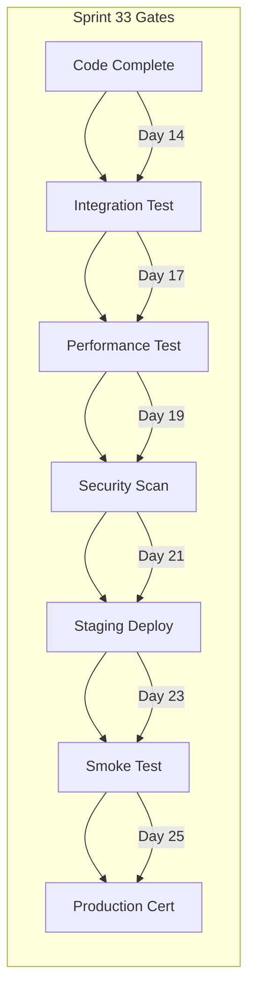

### 10.13 Sprint 33 Known Technical Debt

| Debt Item | Impact | Plan to Address | Owner |
| --- | --- | --- | --- |
| Missing integration tests for edge cases | Medium risk | Add in Sprint 34 | QA Lead |
| Suboptimal vector index parameters | Performance | Tune in Sprint 34 | AI Engineer |
| No multi-region deployment | Availability | Phase 14 requirement | DevOps Lead |
| No cross-session memory consolidation | User experience | Sprint 32 backlog | Backend Lead |
| Limited prompt A/B testing infrastructure | Optimization | Sprint 32 backlog | AI Engineer |

### 10.14 Sprint 33 Service Ownership

| Service | Primary Owner | Secondary Owner |
| --- | --- | --- |
| Evaluation Service | AI Engineer 1 | AI Engineer 2 |
| Policy Engine | Backend Engineer | Backend Lead |
| AI Gateway | Backend Lead | DevOps Lead |
| Provider Service | AI Engineer 1 | Backend Engineer |
| Prompt Service | Backend Engineer | Backend Lead |
| Knowledge Service | AI Engineer 2 | Backend Engineer |
| Embedding Service | AI Engineer 1 | AI Engineer 2 |
| Vector Service | Backend Engineer | Backend Lead |
| Semantic Search | AI Engineer 2 | AI Engineer 1 |
| Conversation Service | Backend Lead | Backend Engineer |
| Memory Service | Backend Engineer | Backend Lead |
| Agent Runtime | AI Engineer 1 | AI Engineer 2 |
| Copilot Service | AI Engineer 2 | Backend Engineer |
| Customer Copilot | AI Engineer 1 | Product Lead |
| Admin Copilot | Backend Lead | Product Lead |
| Trainer Copilot | AI Engineer 2 | Product Lead |
| Document Intelligence | Backend Engineer | AI Engineer 1 |
| AI Analytics | DevOps Lead | Backend Engineer |

---

## 11. Engineering Milestones

### 11.1 Milestone Map

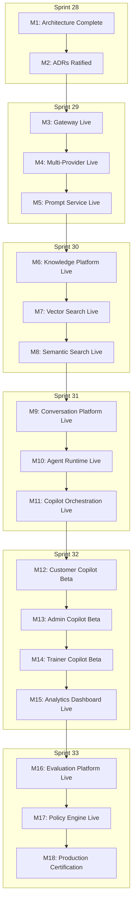

### 11.2 Milestone Details

| Milestone | Sprint | Due Date | Verification | Owner |
| --- | --- | --- | --- | --- |
| M1: Architecture Complete | S28 | 2026-07-28 | All 6 chapters reviewed | Arch Lead |
| M2: ADRs Ratified | S28 | 2026-08-01 | All 37 ADRs accepted | Arch Lead |
| M3: Gateway Live | S29 | 2026-08-07 | Gateway returns health OK | Backend Lead |
| M4: Multi-Provider Live | S29 | 2026-08-14 | 3 providers responding | AI Engineer |
| M5: Prompt Service Live | S29 | 2026-08-21 | Prompt CRUD + render OK | Backend Eng |
| M6: Knowledge Platform Live | S30 | 2026-09-04 | Document pipeline operational | AI Engineer |
| M7: Vector Search Live | S30 | 2026-09-07 | Vector search returns results | Backend Eng |
| M8: Semantic Search Live | S30 | 2026-09-11 | Hybrid search > 70% recall | AI Engineer |
| M9: Conversation Platform Live | S31 | 2026-09-25 | Threads created and retrieved | Backend Lead |
| M10: Agent Runtime Live | S31 | 2026-09-28 | Agent execution completes | AI Engineer |
| M11: Copilot Orchestration Live | S31 | 2026-10-02 | Copilot responds to queries | AI Engineer |
| M12: Customer Copilot Beta | S32 | 2026-10-10 | 10 beta users active | Product Lead |
| M13: Admin Copilot Beta | S32 | 2026-10-17 | Admin team using copilot | Product Lead |
| M14: Trainer Copilot Beta | S32 | 2026-10-21 | 5 courses using copilot | Product Lead |
| M15: Analytics Dashboard Live | S32 | 2026-10-23 | Dashboards rendering data | DevOps Eng |
| M16: Evaluation Platform Live | S33 | 2026-11-04 | Evaluations scoring correctly | AI Engineer |
| M17: Policy Engine Live | S33 | 2026-11-11 | Policies enforced correctly | Backend Eng |
| M18: Production Certification | S33 | 2026-11-13 | All criteria met | Eng Director |

### 11.3 Critical Path

The critical path runs through: M1 → M3 → M6 → M9 → M12 → M18. Any delay in these milestones directly impacts the Phase 13 delivery date.

### 11.4 Milestone Dependencies

| Milestone | Depends On | Risk Level |
| --- | --- | --- |
| M3: Gateway Live | M1, M2 | Low |
| M4: Multi-Provider Live | M3 | Medium |
| M5: Prompt Service Live | M4 | Low |
| M6: Knowledge Platform Live | M3 | Medium |
| M7: Vector Search Live | M6 | Medium |
| M8: Semantic Search Live | M6, M7 | High |
| M9: Conversation Platform Live | M3 | Medium |
| M10: Agent Runtime Live | M9 | High |
| M11: Copilot Orchestration Live | M9, M10 | High |
| M12: Customer Copilot Beta | M11 | High |
| M13: Admin Copilot Beta | M11 | Medium |
| M14: Trainer Copilot Beta | M11 | Medium |
| M15: Analytics Dashboard Live | M3, M11 | Low |
| M16: Evaluation Platform Live | M11 | Low |
| M17: Policy Engine Live | M16 | Low |
| M18: Production Certification | All M3-M17 | High |

---

## 12. Dependency Matrix

### 12.1 Inter-Service Dependencies

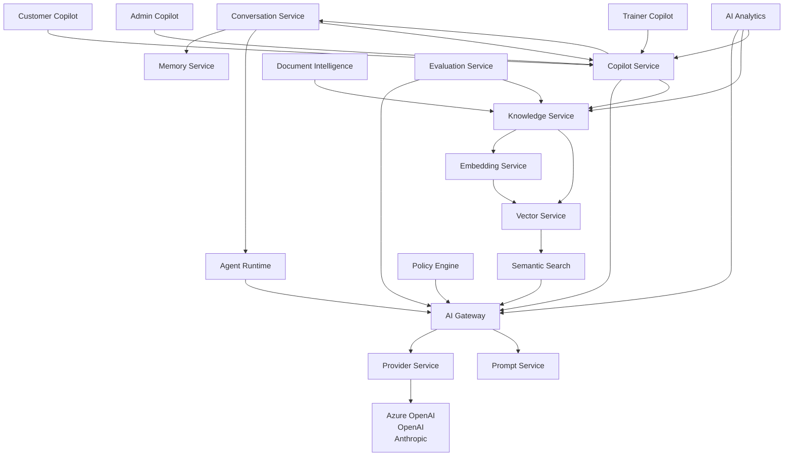

### 12.2 Dependency Table

| Service | Depends On | Used By |
| --- | --- | --- |
| AI Gateway | None | All services |
| Provider Service | None | AI Gateway |
| Prompt Service | None | AI Gateway, Copilot Service |
| Knowledge Service | AI Gateway | Copilot Service, Document Intelligence |
| Embedding Service | AI Gateway | Knowledge Service |
| Vector Service | Embedding Service | Knowledge Service, Semantic Search |
| Semantic Search | Knowledge Service, Vector Service | Copilot Service |
| Conversation Service | None | Copilot Service, Agent Runtime |
| Memory Service | None | Conversation Service |
| Agent Runtime | AI Gateway, Conversation Service | Copilot Service |
| Copilot Service | AI Gateway, Knowledge Service, Conversation Service, Agent Runtime | All Copilots |
| Customer Copilot | Copilot Service | Customers |
| Admin Copilot | Copilot Service | Admins |
| Trainer Copilot | Copilot Service | Trainers |
| Document Intelligence | Knowledge Service | Admin Copilot |
| AI Analytics | AI Gateway, Knowledge Service, Copilot Service | Operations |
| Evaluation Service | AI Gateway, Knowledge Service | QA |
| Policy Engine | AI Gateway | Governance |

### 12.3 External Dependencies

| Dependency | Type | Version | Criticality |
| --- | --- | --- | --- |
| Azure OpenAI | LLM Provider | Latest | Critical |
| OpenAI API | LLM Provider | Latest | High |
| Anthropic API | LLM Provider | Latest | High |
| PostgreSQL 15+ | Database | 15+ | Critical |
| pgvector | Extension | 0.5+ | Critical |
| Redis 7+ | Cache | 7+ | High |
| Docker | Container Runtime | 24+ | Critical |
| Kubernetes | Orchestration | 1.27+ | Critical |
| Istio | Service Mesh | 1.18+ | Medium |
| Prometheus | Monitoring | 2.45+ | Medium |
| Grafana | Dashboards | 10+ | Medium |

---

## 13. Risk Register

### 13.1 Risk Assessment Matrix

| Risk ID | Category | Description | Likelihood | Impact | RPN | Mitigation Strategy |
| --- | --- | --- | --- | --- | --- | --- |
| R01 | Timeline | Chapter creation takes longer than planned | Medium | High | 12 | Buffer days in schedule |
| R02 | Quality | Inconsistent terminology across chapters | Medium | Medium | 9 | Shared glossary, daily reviews |
| R03 | Scope | Feature creep in architecture decisions | High | Medium | 12 | Strict ADR governance |
| R04 | LLM | Provider API breaking changes | Medium | High | 12 | Multi-provider fallback |
| R05 | Performance | Vector search latency exceeds targets | Medium | High | 12 | Index tuning, caching |
| R06 | Scale | Gateway throughput below target | Medium | High | 12 | Load testing, auto-scaling |
| R07 | Data Quality | Poor embedding quality reduces search recall | Medium | High | 12 | Embedding model evaluation |
| R08 | Integration | Service integration failures on first connect | High | Medium | 12 | Contract testing |
| R09 | Security | AI prompt injection vulnerabilities | Medium | Critical | 16 | Input sanitization, policy engine |
| R10 | Cost | LLM API costs exceed budget | Medium | High | 12 | Cost tracking, caching, model tiering |
| R11 | Adoption | Low copilot adoption by beta users | Medium | High | 12 | User training, UX iteration |
| R12 | Knowledge | Low documentation quality | Medium | Medium | 9 | Technical writer review |
| R13 | Team | Key team member unavailability | Low | High | 8 | Knowledge sharing, documentation |
| R14 | Tooling | CI/CD pipeline instability | Low | Medium | 6 | Pipeline hardening |
| R15 | External | Azure OpenAI capacity constraints | Medium | High | 12 | Multi-region deployment |

### 13.2 Top 5 Risks by RPN

| Rank | Risk ID | Risk | RPN | Mitigation Owner |
| --- | --- | --- | --- | --- |
| 1 | R09 | AI prompt injection vulnerabilities | 16 | Security Lead |
| 2 | R01 | Chapter creation timeline | 12 | Architecture Lead |
| 3 | R03 | Feature creep in ADRs | 12 | Architecture Lead |
| 4 | R04 | Provider API breaking changes | 12 | AI Engineer |
| 5 | R10 | LLM API costs exceed budget | 12 | DevOps Lead |

### 13.3 Risk Response Plan

**Acceptable Risks (RPN < 6):**
- R14: CI/CD instability — Accept, low impact

**Mitigatable Risks (RPN 6-12):**
- R04, R05, R06, R07, R08, R10, R11, R12, R15 — Active mitigation in sprint plans
- R02, R03 — Process controls during Sprint 28

**Unacceptable Risks (RPN > 12):**
- R09: Prompt injection — Requires immediate architectural controls
- Mitigation: Input sanitization, policy engine, output filtering, human-in-the-loop for high-risk operations

### 13.4 Risk Burn-down Tracking

| Sprint | Open Risks | Closed Risks | New Risks |
| --- | --- | --- | --- |
| S28 | 15 | 0 | 15 |
| S29 | 12 | 3 | 0 |
| S30 | 9 | 3 | 0 |
| S31 | 6 | 3 | 0 |
| S32 | 3 | 3 | 0 |
| S33 | 0 | 3 | 0 |

---

## 14. Resource Planning

### 14.1 Team Structure

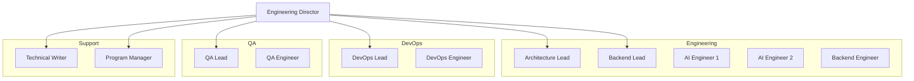

### 14.2 Role Allocations by Sprint

| Role | S28 | S29 | S30 | S31 | S32 | S33 |
| --- | --- | --- | --- | --- | --- | --- |
| Architecture Lead | 100% | 50% | 25% | 25% | 25% | 25% |
| Backend Lead | 0% | 100% | 100% | 100% | 50% | 50% |
| AI Engineer 1 | 0% | 100% | 100% | 100% | 100% | 100% |
| AI Engineer 2 | 0% | 50% | 100% | 100% | 100% | 50% |
| Backend Engineer | 0% | 100% | 100% | 100% | 100% | 100% |
| DevOps Lead | 0% | 100% | 50% | 50% | 50% | 100% |
| DevOps Engineer | 0% | 100% | 50% | 50% | 50% | 100% |
| QA Lead | 0% | 50% | 50% | 50% | 50% | 100% |
| QA Engineer | 0% | 100% | 100% | 100% | 100% | 100% |
| Technical Writer | 100% | 50% | 25% | 25% | 25% | 50% |
| Program Manager | 100% | 100% | 100% | 100% | 100% | 100% |

### 14.3 Total Capacity by Sprint

| Sprint | FTEs | Person-Days |
| --- | --- | --- |
| Sprint 28 | 4.0 | 60 |
| Sprint 29 | 8.5 | 128 |
| Sprint 30 | 8.0 | 120 |
| Sprint 31 | 8.0 | 120 |
| Sprint 32 | 7.5 | 113 |
| Sprint 33 | 8.0 | 120 |

### 14.4 Skill Requirements

**Architecture Lead:** Domain-Driven Design, Event Storming, C4 Modeling, Mermaid Diagrams, Enterprise Architecture, AI Architecture, Cloud Architecture (Azure)

**Backend Lead:** Go/Rust, gRPC, REST, PostgreSQL, Redis, Kubernetes, API Design, Service Architecture, Microservices, Rate Limiting, Caching

**AI Engineer:** LLMs, Embeddings, Vector Databases, RAG, Prompt Engineering, Azure OpenAI, NLP, Evaluation Metrics, Model Fine-tuning

**Backend Engineer:** Go/Rust, PostgreSQL, Redis, REST, gRPC, Docker, Kubernetes, CI/CD, Testing, API Development

**DevOps Lead:** Kubernetes, Terraform, CI/CD, Monitoring, Logging, Security, Networking, Azure Cloud, Service Mesh

**DevOps Engineer:** Docker, Kubernetes, CI/CD Pipelines, Monitoring, Terraform, Scripting, Cloud Infrastructure

**QA Lead:** Test Strategy, Test Automation, Performance Testing, Security Testing, AI Quality Evaluation, Test Planning

**QA Engineer:** Unit Testing, Integration Testing, E2E Testing, Performance Testing, API Testing, Test Automation

### 14.5 Training Requirements

| Skill | Team Members | Training Method | Timeline |
| --- | --- | --- | --- |
| Domain-Driven Design | All engineers | Workshop | Sprint 28 |
| AI Architecture | Backend team | Workshop | Sprint 28 |
| Vector Databases | AI Engineers | Self-study | Sprint 29 |
| RAG Patterns | AI Engineers | Workshop | Sprint 30 |
| Prompt Engineering | All engineers | Workshop | Sprint 29 |
| Kubernetes | Backend team | Workshop | Sprint 28 |
| Go/Rust | Engineers | Self-study | Ongoing |

---

## 15. Development Strategy

### 15.1 Development Principles

| Principle | Description |
| --- | --- |
| Contract-first | Define API contracts before implementation |
| Test-driven | Write tests before implementation |
| Documentation-first | Document before coding |
| CI/CD-first | Pipelines before code |
| Security-first | Security review before deployment |
| Observability-first | Monitoring before going live |

### 15.2 Development Workflow

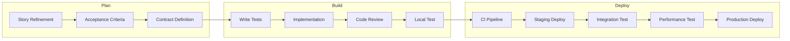

### 15.3 Coding Standards

**Language Conventions:**
- Go: Follow standard Go formatting (gofmt), use uber-go/zap for logging, use testify for tests
- TypeScript: Follow standard TS config, use zod for validation, use vitest for tests
- Python: Follow PEP 8, use poetry for dependencies, use pytest for tests

**Naming Conventions:**
- Services: Verb-noun pattern (e.g., knowledge-service, embedding-service)
- APIs: RESTful with consistent versioning (/api/v1/)
- Database tables: snake_case, plural
- Go types: PascalCase for exported, camelCase for unexported
- Environment variables: UPPER_SNAKE_CASE

**File Structure for Services:**
```
services/<service-name>/
├── cmd/
│   └── server/
│       └── main.go
├── internal/
│   ├── handler/
│   ├── service/
│   ├── repository/
│   ├── model/
│   └── middleware/
├── api/
│   └── proto/
├── tests/
│   ├── unit/
│   ├── integration/
│   └── e2e/
├── Dockerfile
├── Makefile
├── README.md
└── config.yaml
```

### 15.4 Code Review Standards

| Criterion | Requirement |
| --- | --- |
| Minimum reviewers | 2 |
| Review types | Pair review + async review |
| Review checklist | Functional correctness, test coverage, security, performance, code style |
| Turnaround time | < 4 hours |
| Blocking issues | Security, correctness, data loss |
| Non-blocking | Code style, minor refactoring |

### 15.5 Branch Strategy

| Branch | Purpose | Base | Merge Strategy |
| --- | --- | --- | --- |
| main | Production | N/A | Protected |
| sporetest | Integration | main | Merge commit |
| feature/* | Feature work | sporetest | Squash merge |
| fix/* | Bug fixes | sporetest | Squash merge |
| docs/* | Documentation | sporetest | Squash merge |
| release/* | Release branches | sporetest | Merge commit |

---

## 16. Testing Roadmap

### 16.1 Testing Strategy

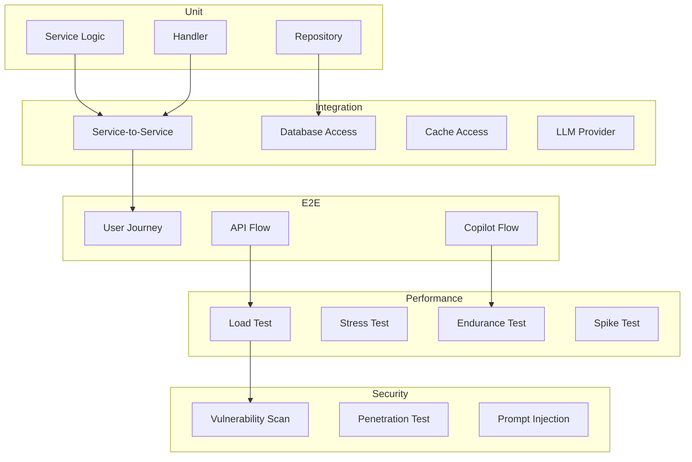

### 16.2 Test Coverage Targets

| Test Type | Current Coverage | Target Coverage |
| --- | --- | --- |
| Unit tests | 0% | > 90% |
| Integration tests | 0% | > 80% |
| Contract tests | 0% | 100% for all services |
| E2E tests | 0% | > 20 critical paths |
| Performance tests | 0% | All P0 endpoints |
| Security tests | 0% | All service endpoints |

### 16.3 Test Automation Framework

| Component | Tool | Target |
| --- | --- | --- |
| Unit testing | Go: testing + testify, TS: vitest, Python: pytest | Every service |
| Integration testing | Testcontainers + docker-compose | Every service |
| Contract testing | Pact | Service boundaries |
| E2E testing | Playwright + k6 | Critical user journeys |
| Performance testing | k6 + vegeta | P0 and P1 endpoints |
| Security testing | OWASP ZAP + custom prompt injection | All endpoints |

### 16.4 Contract Testing Strategy

**Provider (Service):**
- Define contract in Pact format
- Publish contract to Pact Broker
- Verify contract on each CI run
- Fail build on contract breakage

**Consumer (Calling Service):**
- Download contract from Pact Broker
- Mock provider responses
- Test consumer behavior
- Report results to Pact Broker

### 16.5 Performance Testing Plan

| Test Scenario | Endpoint | Target Load | Acceptable Latency |
| --- | --- | --- | --- |
| Gateway chat request | POST /gateway/chat | 1000 req/s | P50 < 200ms, P95 < 500ms |
| Gateway embed request | POST /gateway/embed | 500 req/s | P50 < 500ms, P95 < 2s |
| Vector search | POST /vectors/search | 200 req/s | P50 < 50ms, P95 < 200ms |
| Document ingestion | POST /knowledge/documents | 50 docs/min | P95 < 30s per doc |
| Copilot query | POST /copilot/query | 100 req/s | P50 < 3s, P95 < 10s |
| Evaluation scoring | POST /evaluations/score | 100 req/s | P50 < 1s, P95 < 3s |

### 16.6 Testing Schedule by Sprint

| Sprint | Unit | Integration | Contract | E2E | Performance | Security |
| --- | --- | --- | --- | --- | --- | --- |
| S28 | 0% | 0% | 0% | 0% | 0% | 0% |
| S29 | 90% | 80% | 100% | 0% | 50% | 50% |
| S30 | 90% | 80% | 100% | 50% | 75% | 75% |
| S31 | 90% | 80% | 100% | 75% | 90% | 90% |
| S32 | 90% | 80% | 100% | 90% | 100% | 100% |
| S33 | 95% | 90% | 100% | 100% | 100% | 100% |

---

## 17. QA Roadmap

### 17.1 QA Strategy

Quality assurance for Phase 13 operates at three levels:

1. **Engineering QA:** Automated testing within CI/CD pipelines
2. **Dedicated QA:** Manual exploratory testing by QA engineers
3. **AI Quality QA:** Evaluation of AI output quality using the Evaluation Service

### 17.2 Quality Gates

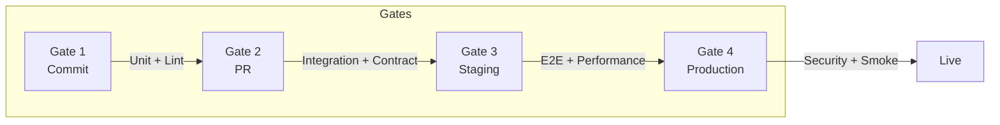

### 17.3 Gate Criteria

| Gate | Criteria | Blocking | Non-blocking |
| --- | --- | --- | --- |
| G1: Commit | Unit tests pass, Lint passes, Build succeeds | Test failure | Coverage < target |
| G2: PR | Integration tests pass, Contract tests pass, 2 approvals | Any test failure, Security issue | Minor style issues |
| G3: Staging | E2E tests pass, Performance tests pass, Smoke tests pass | Any test failure, Performance regression > 10% | Minor performance regression |
| G4: Production | Security scan passes, All quality gates green, Sign-off from QA lead | Any security finding (High+) | Low security findings |

### 17.4 AI Quality Evaluation

| Dimension | Measurement Method | Target | Test Frequency |
| --- | --- | --- | --- |
| Grounding | Factual accuracy against source documents | > 95% | Per deployment |
| Relevance | Topical alignment with user query | > 85% | Per deployment |
| Completeness | Coverage of query dimensions | > 80% | Per release |
| Consistency | Consistent answers across rephrased queries | > 90% | Per release |
| Safety | No harmful, biased, or inappropriate content | 100% | Per deployment |
| Toxicity | Toxicity score using moderation API | < 0.01 | Per deployment |

### 17.5 QA Test Cycles

| Test Cycle | Sprint | Focus | Duration |
| --- | --- | --- | --- |
| QC-01 | S29 | Gateway + Provider + Prompt functional testing | 3 days |
| QC-02 | S30 | Knowledge platform functional + integration testing | 3 days |
| QC-03 | S31 | Conversation platform functional + E2E testing | 3 days |
| QC-04 | S32 | Copilot functional testing + UAT | 3 days |
| QC-05 | S33 | Full platform regression + performance + security | 5 days |

### 17.6 Bug Tracking

| Severity | Definition | Response Time | Fix Time |
| --- | --- | --- | --- |
| Critical | System down, data loss, security breach | < 1 hour | < 4 hours |
| High | Major feature broken, significant performance degradation | < 4 hours | < 24 hours |
| Medium | Non-critical feature broken, minor performance issue | < 24 hours | < 72 hours |
| Low | Cosmetic issue, minor UX problem | < 1 week | Next sprint |

---

## 18. Git Execution Plan

### 18.1 Repository Structure

```
sporekart/
├── .github/
│   └── workflows/
│       ├── ci.yml
│       ├── cd.yml
│       └── pr-checks.yml
├── services/
│   ├── ai-gateway/
│   ├── provider-service/
│   ├── prompt-service/
│   ├── knowledge-service/
│   ├── embedding-service/
│   ├── vector-service/
│   ├── semantic-search/
│   ├── conversation-service/
│   ├── memory-service/
│   ├── agent-runtime/
│   ├── copilot-service/
│   ├── customer-copilot/
│   ├── admin-copilot/
│   ├── trainer-copilot/
│   ├── document-intelligence/
│   ├── ai-analytics/
│   ├── evaluation-service/
│   └── policy-engine/
├── docs/
│   ├── engineering/
│   │   └── phase13/
│   │       └── sprint28/
│   ├── adr/
│   ├── api/
│   └── runbooks/
├── tests/
│   ├── e2e/
│   ├── performance/
│   └── security/
├── infra/
│   ├── terraform/
│   ├── kubernetes/
│   └── monitoring/
├── scripts/
└── tools/
```

### 18.2 Branch Creation Plan

| Branch | Base | Created In | Purpose |
| --- | --- | --- | --- |
| sporetest | main | Sprint 28 | Integration branch |
| feature/p13-s28-p01-chapter01-vision | sporetest | Sprint 28 | Architecture Chapter 1 |
| feature/p13-s28-p01-chapter02-assessment | sporetest | Sprint 28 | Architecture Chapter 2 |
| feature/p13-s28-p01-chapter03-target-arch | sporetest | Sprint 28 | Architecture Chapter 3 |
| feature/p13-s28-p01-chapter04-ddd | sporetest | Sprint 28 | Architecture Chapter 4 |
| feature/p13-s28-p01-chapter05-standards | sporetest | Sprint 28 | Architecture Chapter 5 |
| feature/p13-s28-p01-chapter06-roadmap | sporetest | Sprint 28 | Architecture Chapter 6 |
| feature/p13-s29-ai-gateway | sporetest | Sprint 29 | AI Gateway service |
| feature/p13-s29-provider-service | sporetest | Sprint 29 | Provider service |
| feature/p13-s29-prompt-service | sporetest | Sprint 29 | Prompt service |
| feature/p13-s30-knowledge-service | sporetest | Sprint 30 | Knowledge service |
| feature/p13-s30-embedding-service | sporetest | Sprint 30 | Embedding service |
| feature/p13-s30-vector-service | sporetest | Sprint 30 | Vector service |
| feature/p13-s30-semantic-search | sporetest | Sprint 30 | Semantic search |
| feature/p13-s31-conversation-service | sporetest | Sprint 31 | Conversation service |
| feature/p13-s31-memory-service | sporetest | Sprint 31 | Memory service |
| feature/p13-s31-agent-runtime | sporetest | Sprint 31 | Agent runtime |
| feature/p13-s31-copilot-service | sporetest | Sprint 31 | Copilot service |
| feature/p13-s32-customer-copilot | sporetest | Sprint 32 | Customer copilot |
| feature/p13-s32-admin-copilot | sporetest | Sprint 32 | Admin copilot |
| feature/p13-s32-trainer-copilot | sporetest | Sprint 32 | Trainer copilot |
| feature/p13-s32-doc-intelligence | sporetest | Sprint 32 | Document Intelligence |
| feature/p13-s32-ai-analytics | sporetest | Sprint 32 | AI Analytics |
| feature/p13-s33-evaluation-service | sporetest | Sprint 33 | Evaluation service |
| feature/p13-s33-policy-engine | sporetest | Sprint 33 | Policy Engine |

### 18.3 Git Workflow Rules

| Rule | Description |
| --- | --- |
| Branch from sporetest | All feature branches branch from sporetest |
| Squash merge | All feature branches squash-merge into sporetest |
| Delete after merge | Delete feature branch after squash-merge |
| No direct commits to sporetest | All changes through PRs |
| PR requires 2 approvals | Minimum two reviewers |
| CI must pass | All checks must pass before merge |
| Linear history | sporetest maintains linear history |

### 18.4 PR Template

```markdown
## Description
<!-- Short description of the changes -->

## Type of Change
- [ ] New feature
- [ ] Bug fix
- [ ] Documentation
- [ ] Refactor
- [ ] Test
- [ ] Infrastructure

## Related ADRs
<!-- ADR numbers relevant to this change -->

## Testing
- [ ] Unit tests added/updated
- [ ] Integration tests added/updated
- [ ] Contract tests added/updated
- [ ] Manual testing completed

## Checklist
- [ ] Code follows style guidelines
- [ ] Self-review completed
- [ ] Documentation updated
- [ ] No new security issues
- [ ] Performance impact assessed
```

---

## 19. Documentation Roadmap

### 19.1 Documentation Architecture

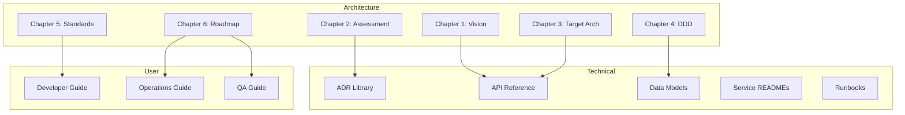

### 19.2 Documents Required

| Document | Owner | Sprint | Status |
| --- | --- | --- | --- |
| Chapter 1: Enterprise AI Vision | Architecture Lead | S28 | Complete |
| Chapter 2: Architecture Assessment | Architecture Lead | S28 | Complete |
| Chapter 3: Target Architecture | Architecture Lead | S28 | Complete |
| Chapter 4: DDD & Service Contracts | Architecture Lead | S28 | Complete |
| Chapter 5: Engineering Standards | Architecture Lead | S28 | Complete |
| Chapter 6: Implementation Roadmap | Architecture Lead | S28 | This document |
| ADR-001 to ADR-037 | Architecture Team | S28 | Complete |
| AI Gateway README | Backend Lead | S29 | Planned |
| Provider Service README | AI Engineer | S29 | Planned |
| Prompt Service README | Backend Engineer | S29 | Planned |
| Knowledge Service README | AI Engineer | S30 | Planned |
| Embedding Service README | AI Engineer | S30 | Planned |
| Vector Service README | Backend Engineer | S30 | Planned |
| Semantic Search README | AI Engineer | S30 | Planned |
| Conversation Service README | Backend Lead | S31 | Planned |
| Memory Service README | Backend Engineer | S31 | Planned |
| Agent Runtime README | AI Engineer | S31 | Planned |
| Copilot Service README | AI Engineer | S31 | Planned |
| Deployment Runbook | DevOps Lead | S33 | Planned |
| Operations Runbook | DevOps Lead | S33 | Planned |
| Incident Response Runbook | DevOps Lead | S33 | Planned |

### 19.3 Documentation Standards

| Standard | Requirement |
| --- | --- |
| Format | Markdown with frontmatter |
| Diagrams | Mermaid (inline) |
| API docs | OpenAPI 3.1 (spec + rendered) |
| ADR format | ADR template from Chapter 5 |
| README template | Service README template from Chapter 5 |
| Versioning | Git-based (no separate version file) |
| Review | Technical review by peer + editorial review by technical writer |

### 19.4 Documentation Review Cycle

| Phase | Participants | Duration |
| --- | --- | --- |
| Self-review | Author | Before PR |
| Peer review | 1 peer | < 2 hours |
| Technical review | Domain expert | < 4 hours |
| Editorial review | Technical writer | < 2 hours |
| Final approval | Engineering Director | < 1 hour |

---

## 20. CI/CD Roadmap

### 20.1 CI/CD Pipeline Architecture

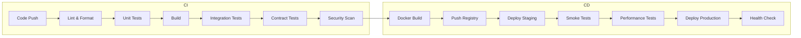

### 20.2 CI Pipeline Configuration

| Step | Tool | Timeout | Failure Action |
| --- | --- | --- | --- |
| Lint & Format | golangci-lint, eslint, ruff | 2 min | Fail |
| Unit Tests | go test, vitest, pytest | 5 min | Fail |
| Build | go build, tsc, poetry build | 3 min | Fail |
| Integration Tests | Testcontainers | 10 min | Fail |
| Contract Tests | Pact | 5 min | Fail |
| Security Scan | Trivy, OWASP ZAP | 5 min | Warning |
| Docker Build | Docker | 5 min | Fail |

### 20.3 CD Pipeline Configuration

| Step | Tool | Timeout | Failure Action |
| --- | --- | --- | --- |
| Docker Build | Docker | 5 min | Fail |
| Push Registry | Docker Hub / ACR | 3 min | Fail |
| Deploy Staging | kubectl / Helm | 5 min | Fail |
| Smoke Tests | Custom script | 3 min | Fail |
| Performance Tests | k6 | 10 min | Warning |
| Deploy Production | ArgoCD | 10 min | Fail |
| Health Check | Custom script | 2 min | Fail |

### 20.4 CI/CD Schedule by Sprint

| Sprint | Pipelines Operational | Services Covered |
| --- | --- | --- |
| S28 | 0% | 0 |
| S29 | 100% | 3 (Gateway, Provider, Prompt) |
| S30 | 100% | 7 |
| S31 | 100% | 11 |
| S32 | 100% | 16 |
| S33 | 100% | 18 |

### 20.5 Deploy Environments

| Environment | Purpose | Deploy Strategy | Rollback |
| --- | --- | --- | --- |
| Development | Developer testing | Manual | Immediate |
| Staging | Integration testing | Automatic on merge | Automatic |
| QA | QA testing | Manual promotion | Manual |
| Production | Live traffic | Blue-green | Immediate blue switch |

### 20.6 GitOps Configuration

| Resource | Repository | Sync Policy | PR Required |
| --- | --- | --- | --- |
| Kubernetes manifests | infra/kubernetes/ | Automatic | Yes |
| Helm charts | infra/helm/ | Automatic | Yes |
| Terraform configs | infra/terraform/ | Manual | Yes |
| Monitoring configs | infra/monitoring/ | Automatic | Yes |
| Alerting rules | infra/monitoring/ | Automatic | Yes |

### 20.7 CI/CD Pipeline Metrics

| Metric | Current | Target | Collection Method |
| --- | --- | --- | --- |
| Pipeline success rate | N/A | > 95% | GitHub Actions API |
| Average pipeline duration | N/A | < 15 min | GitHub Actions API |
| Time from merge to deploy | N/A | < 10 min | ArgoCD API |
| Deployment frequency | N/A | > 5/week | GitHub API |
| Rollback frequency | N/A | < 1/month | ArgoCD API |
| Build cache hit rate | N/A | > 80% | Docker build metrics |

### 20.8 Disaster Recovery for CI/CD

| Failure Scenario | Impact | Recovery Action | RTO |
| --- | --- | --- | --- |
| GitHub Actions outage | CI/CD unavailable | Manual local build + push | < 2 hours |
| Container registry down | Cannot deploy | Switch to backup registry | < 30 min |
| ArgoCD unavailable | Cannot sync | Manual kubectl apply | < 1 hour |
| Terraform state corruption | IaC changes blocked | Restore from backup state | < 1 hour |
| Database migration failure | Service unavailable | Rollback migration | < 15 min |

---

## 21. Engineering KPI Dashboard

### 21.1 KPI Framework

Phase 13 engineering KPIs are organized into four categories: Velocity, Quality, Reliability, and Business Impact.

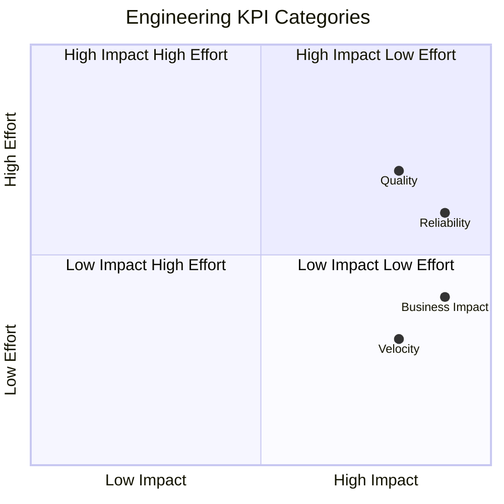

### 21.2 Velocity KPIs

| KPI | Target | Measurement Method | Frequency | Owner |
| --- | --- | --- | --- | --- |
| Sprint completion rate | > 90% | Story points completed / planned | Per sprint | PM |
| PR cycle time | < 4 hours | Time from PR open to merge | Per PR | Eng Lead |
| Deployment frequency | > 5/week | Deployments to production | Weekly | DevOps |
| Code review turnaround | < 2 hours | Time from review request to first review | Per review | Eng Lead |
| Feature branch lifetime | < 3 days | Time from branch creation to merge | Per branch | Eng Lead |

### 21.3 Quality KPIs

| KPI | Target | Measurement Method | Frequency | Owner |
| --- | --- | --- | --- | --- |
| Test coverage | > 80% | Line coverage in CI | Per sprint | QA Lead |
| Build failure rate | < 5% | CI build failures / total builds | Weekly | DevOps |
| Defect density | < 1 per 100 LOC | Bugs found / total lines | Per release | QA Lead |
| Critical bugs | 0 | Critical severity bugs open | Daily | Eng Lead |
| AI grounding score | > 95% | Evaluation service | Per deployment | AI Lead |
| AI relevance score | > 85% | Evaluation service | Per deployment | AI Lead |

### 21.4 Reliability KPIs

| KPI | Target | Measurement Method | Frequency | Owner |
| --- | --- | --- | --- | --- |
| Service uptime | > 99.9% | Prometheus + Grafana | Monthly | DevOps |
| P95 latency | < 500ms (gateway) | Prometheus metrics | Daily | DevOps |
| P99 latency | < 2s (gateway) | Prometheus metrics | Daily | DevOps |
| Error rate | < 0.1% | HTTP 5xx / total requests | Daily | DevOps |
| Cache hit ratio | > 70% | Redis metrics | Daily | Backend |
| Availability SLO | 99.9% | Uptime monitoring | Monthly | DevOps |

### 21.5 Business Impact KPIs

| KPI | Target | Measurement Method | Frequency | Owner |
| --- | --- | --- | --- | --- |
| Copilot adoption | > 30% of active users | Analytics service | Monthly | Product |
| Support deflection | > 25% | Support ticket trend | Monthly | Product |
| Course completion | +15% | Learning platform | Monthly | Product |
| Automation coverage | > 40% | Process audit | Monthly | Product |
| Cost per request | < $0.01 | Analytics service | Weekly | DevOps |
| User satisfaction | > 4.0 / 5.0 | Feedback service | Monthly | Product |

### 21.6 KPI Tracking Dashboard

| Category | Count | Green (> target) | Yellow (> 80% target) | Red (< 80% target) |
| --- | --- | --- | --- | --- |
| Velocity | 5 KPIs | All 5 green | 4+ green | 3 or fewer green |
| Quality | 6 KPIs | All 6 green | 5+ green | 4 or fewer green |
| Reliability | 6 KPIs | All 6 green | 5+ green | 4 or fewer green |
| Business Impact | 6 KPIs | All 6 green | 5+ green | 4 or fewer green |

### 21.7 Dashboard Visualization

The KPIs will be tracked in a Grafana dashboard with the following panels:
- Sprint burndown chart (Velocity)
- Test coverage trend (Quality)
- Service latency heatmap (Reliability)
- Copilot adoption funnel (Business Impact)
- Cost per request trend (Business Impact)
- Error rate by service (Reliability)

---

## 22. Definition of Success

### 22.1 Phase 13 Success Criteria

| # | Criterion | Measurement | Verdict |
| --- | --- | --- | --- |
| 1 | All 37 ADRs ratified | ADR library review | Pass/Fail |
| 2 | All 18 services deployed | Deployment verification | Pass/Fail |
| 3 | All 6 chapters consistent | Cross-chapter review | Pass/Fail |
| 4 | Test coverage > 80% | CI report | Pass/Fail |
| 5 | Engineering standards adopted | Team survey + code review | Pass/Fail |
| 6 | AI quality > 95% grounding | Evaluation service | Pass/Fail |
| 7 | Performance targets met | Load test report | Pass/Fail |
| 8 | Security scan clean | Vulnerability report | Pass/Fail |
| 9 | Documentation complete | Document inventory | Pass/Fail |
| 10 | Production certification | Certification checklist | Pass/Fail |

### 22.2 Go/No-Go Criteria

**Go criteria for Phase 14:**
- Phase 13 success criteria: 9 out of 10 pass
- Zero critical or high-severity bugs open
- Performance within 10% of targets
- All 18 services stable for 1 week
- Documentation and runbooks complete
- On-call team trained

### 22.3 Service Launch Criteria

Each service must meet the following criteria before it is considered live:

| Criterion | Requirement |
| --- | --- |
| All unit tests pass | > 90% coverage |
| All integration tests pass | 100% pass rate |
| Performance tests pass | Within target thresholds |
| Security scan passes | Zero high-severity findings |
| API documentation published | OpenAPI spec in repo |
| README written | Per service README template |
| Runbook available | Deployment, operations, incident |
| Monitoring configured | Prometheus metrics + Grafana dashboard |
| Alerting configured | Alerts for P1 and P2 conditions |
| Logging configured | Structured logging to central system |
| Health check endpoint | /health returns OK |
| On-call trained | At least 2 team members per service |

### 22.4 Sprint Completion Criteria

| Criterion | Requirement |
| --- | --- |
| All planned stories completed | 100% of committed scope |
| All tests passing | 100% pass rate |
| No P0/P1 bugs open | Zero |
| Documentation updated | All relevant docs |
| Demos completed | Sprint review |
| Retrospective completed | Action items documented |

---

## 23. Future Phase Transition

### 23.1 Phase Transition Summary

| Phase | Timeline | Sprint Range | Duration | Focus Area | New Services | New ADRs | Team Size |
| --- | --- | --- | --- | --- | --- | --- | --- |
| Phase 14 | Nov 2026 - Jan 2027 | S34-S38 | 15 weeks | Multi-Modal AI | 4 | ADR-038 to ADR-045 | 10 |
| Phase 15 | Feb 2027 - Apr 2027 | S39-S43 | 15 weeks | Event-Driven + Agents | 3 | ADR-046 to ADR-053 | 12 |
| Phase 16 | May 2027 - Jul 2027 | S44-S48 | 15 weeks | Agent Platform + Developer API | 4 | ADR-054 to ADR-061 | 12 |
| Phase 17 | Aug 2027 - Oct 2027 | S49-S53 | 15 weeks | Compliance + Global Infrastructure | 3 | ADR-062 to ADR-069 | 14 |
| Phase 18 | Nov 2027 - Jan 2028 | S54-S58 | 15 weeks | Real-Time AI + Multi-Tenant | 3 | ADR-070 to ADR-076 | 14 |
| Phase 19 | Feb 2028 - Apr 2028 | S59-S63 | 15 weeks | Autonomous Workflows + Mobile | 4 | ADR-077 to ADR-083 | 16 |
| Phase 20 | May 2028 - Jul 2028 | S64-S68 | 15 weeks | Platform Maturity + Scale | 3 | ADR-084 to ADR-090 | 16 |

### 23.2 Phase 14: Multi-Modal AI & Advanced AI Platform

**Timeline:** Sprint 34-38 (November 2026 - January 2027) | **Team Size:** 10 FTEs

**Primary Focus:**
Phase 14 extends the AI platform with vision and audio capabilities. Services built in Phase 13 provide the foundation: AI Gateway routes multi-modal requests, Knowledge Service stores multi-modal data, and the Conversation Platform handles multi-modal interactions.

**New Services:**
- **Vision Service:** Image analysis, object detection, OCR, facial recognition
- **Audio Service:** Speech-to-text, text-to-speech, audio processing
- **Multi-Modal Service:** Combined vision + audio + text understanding
- **Content Generation Service:** AI-powered content creation with templates

**Key Dependencies:**
| Service | Depends On Phase 13 Service | Criticality |
| --- | --- | --- |
| Vision Service | AI Gateway | Critical |
| Audio Service | AI Gateway | Critical |
| Multi-Modal Service | AI Gateway, Knowledge Service | High |
| Content Generation | AI Gateway, Prompt Service | High |

### 23.3 Phase 15: Event-Driven Architecture & Agent Ecosystem

**Timeline:** Sprint 39-43 (February 2027 - April 2027) | **Team Size:** 12 FTEs

**Primary Focus:**
Phase 15 introduces event-driven architecture patterns across the platform. Kafka-based event streaming, CQRS, and event sourcing are added. An Agent Marketplace allows teams to publish and discover agent workflows.

**New Capabilities:**
- Event streaming platform (Kafka)
- CQRS pattern for write/read separation
- Event sourcing for audit and replay
- Agent Marketplace for agent discovery
- Agent publishing SDK

### 23.4 Phase 16: Multi-Agent Orchestration & Developer Platform

**Timeline:** Sprint 44-48 (May 2027 - July 2027) | **Team Size:** 12 FTEs

**Primary Focus:**
Phase 16 enables complex multi-agent workflows and opens the platform to external developers. Agents can orchestrate other agents, share context, and collaborate on tasks.

**New Capabilities:**
- Multi-agent orchestrator
- Inter-agent communication protocol
- External developer API (REST + GraphQL)
- Developer portal with API keys and documentation
- Agent SDK for external development

### 23.5 Phase 17: Regulatory Compliance & Global Infrastructure

**Timeline:** Sprint 49-53 (August 2027 - October 2027) | **Team Size:** 14 FTEs

**Primary Focus:**
Phase 17 achieves regulatory compliance certifications and deploys global infrastructure for low-latency AI access worldwide.

**New Capabilities:**
- SOC2 Type II certification
- PCI-DSS v4 compliance
- GDPR compliance automation
- Global CDN for AI responses
- Multi-region Kubernetes clusters
- Data residency compliance

### 23.6 Phase 18: Real-Time AI & Multi-Tenant Platform

**Timeline:** Sprint 54-58 (November 2027 - January 2028) | **Team Size:** 14 FTEs

**Primary Focus:**
Phase 18 adds real-time AI capabilities including voice conversations and streaming AI. The platform becomes fully multi-tenant with strict isolation between tenants.

**New Capabilities:**
- Real-time voice AI (WebRTC + streaming)
- Multi-tenant data isolation (per-tenant vector stores)
- Streaming AI responses (server-sent events)
- Tenant management portal
- Usage metering and billing

### 23.7 Phase 19: Autonomous Workflows & Mobile AI

**Timeline:** Sprint 59-63 (February 2028 - April 2028) | **Team Size:** 16 FTEs

**Primary Focus:**
Phase 19 enables autonomous AI workflows that operate without human intervention and brings AI capabilities to mobile devices.

**New Capabilities:**
- Autonomous workflow engine (self-healing, self-optimizing)
- Mobile AI SDK (iOS + Android)
- Edge AI deployment (on-device inference)
- Offline AI capabilities
- Mobile-specific copilot experiences

### 23.8 Phase 20: AI Platform Maturity & Enterprise Scale

**Timeline:** Sprint 64-68 (May 2028 - July 2028) | **Team Size:** 16 FTEs

**Primary Focus:**
Phase 20 is the final maturity phase. The platform achieves enterprise scale, full AI-native architecture, and platform monetization capabilities.

**New Capabilities:**
- Platform monetization (usage-based billing, tiered plans)
- Enterprise SSO and directory integration
- AI governance dashboard for compliance officers
- Full AI-native architecture (no legacy patterns)
- 99.995% availability target
- 500,000+ requests per second capacity

### 23.8 Phase Dependency Map

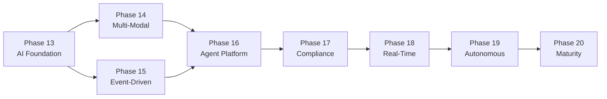

### 23.9 Phase 13 Handoff Artifacts

| Artifact | Deliverer | Receiver | Format |
| --- | --- | --- | --- |
| Complete Phase 13 architecture | Architecture Team | Phase 14 Architecture Team | 6 chapters |
| ADR library (ADR-001 to ADR-037) | Architecture Team | All Phase 14+ teams | Markdown files |
| Service ownership assignments | Engineering Director | Phase 14 Engineering Lead | Document |
| Infrastructure configuration | DevOps Lead | Phase 14 DevOps Lead | Terraform + K8s |
| CI/CD pipeline configurations | DevOps Lead | Phase 14 DevOps Lead | Code |
| Testing frameworks and test suites | QA Lead | Phase 14 QA Lead | Code |
| Monitoring dashboards | DevOps Lead | Phase 14 DevOps Lead | Grafana JSON |
| Operations runbooks | DevOps Lead | Phase 14 DevOps Lead | Markdown |
| Performance baseline report | QA Lead | Phase 14 Engineering | Document |
| Security audit report | Security Lead | Phase 14 Security | Document |

---

## 24. Enterprise Delivery Governance

### 24.1 Governance Framework

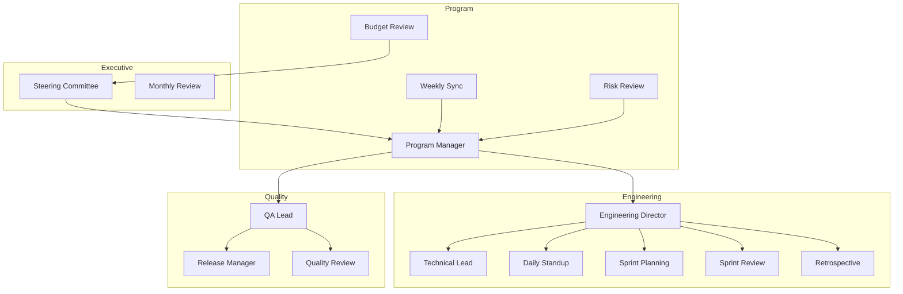

### 24.2 Governance Meetings

| Meeting | Frequency | Duration | Participants | Purpose |
| --- | --- | --- | --- | --- |
| Steering Committee | Monthly | 1 hour | Executive, PM, Eng Director | Strategic decisions, milestone review |
| Program Sync | Weekly | 30 min | PM, Eng Lead, QA Lead | Cross-team coordination, blockers |
| Engineering Standup | Daily | 15 min | Engineering team | Daily progress, blockers |
| Sprint Planning | Bi-weekly | 2 hours | Engineering team | Sprint scope commitment |
| Sprint Review | Bi-weekly | 1 hour | All stakeholders | Demo completed work |
| Retrospective | Bi-weekly | 1 hour | Engineering team | Process improvement |
| Architecture Review | Weekly | 1 hour | Architecture team | Technical decisions, ADRs |
| QA Review | Weekly | 30 min | QA + Engineering | Quality metrics, bug review |
| Risk Review | Bi-weekly | 30 min | PM + Engineering | Risk register review |
| Budget Review | Monthly | 30 min | PM + DevOps | Cloud cost review |

### 24.2a Governance Artifacts

| Artifact | Owner | Update Frequency | Location |
| --- | --- | --- | --- |
| Sprint Plan | PM | Bi-weekly | Jira |
| Sprint Burndown | PM | Daily | Jira |
| Risk Register | PM | Bi-weekly | Confluence |
| Decision Log | PM | Continuous | Confluence |
| KPI Dashboard | DevOps | Continuous | Grafana |
| Budget Tracker | DevOps | Weekly | Spreadsheet |
| Release Notes | PM | Per release | GitHub |
| Incident Reports | DevOps | Per incident | PagerDuty |

### 24.2b Communication Cadence

| Communication | Sender | Receiver | Frequency | Format |
| --- | --- | --- | --- | --- |
| Daily status | All team members | Engineering team | Daily | Slack thread |
| Weekly summary | PM | All stakeholders | Weekly | Email |
| Sprint demo | Engineering | All stakeholders | Bi-weekly | Live demo |
| Architecture update | Architecture Lead | Engineering team | Weekly | Tech talk |
| Risk update | PM | Engineering Director | Bi-weekly | Report |
| Budget update | DevOps | Steering Committee | Monthly | Report |
| Milestone update | PM | Steering Committee | Monthly | Report |
| Incident post-mortem | DevOps | Engineering team | Per incident | Document |

### 24.3 Decision-Making Authority

| Decision Type | Decided By | Escalation Path |
| --- | --- | --- |
| Sprint scope | Engineering + PM | Engineering Director |
| Architecture decisions | Architecture Lead | Engineering Director |
| ADR approval | Architecture Team | Engineering Director |
| Release approval | Release Manager | Engineering Director |
| Budget changes | PM + DevOps | Steering Committee |
| Timeline changes | PM | Steering Committee |
| Resource changes | Engineering Director | Steering Committee |
| Scope changes | PM + Eng Director | Steering Committee |

### 24.4 Communication Plan

| Audience | Frequency | Channel | Content |
| --- | --- | --- | --- |
| Engineering team | Daily | Standup + Slack | Progress, blockers |
| Engineering team | Weekly | Email + Slack | Weekly summary |
| PM + Engineering | Weekly | Program sync | Cross-team status |
| Stakeholders | Bi-weekly | Sprint review | Demo + metrics |
| Executives | Monthly | Steering committee | Milestones + risks |
| All hands | Quarterly | Town hall | Phase progress |

### 24.5 Escalation Matrix

| Level | Escalation Path | Response Time | Decision Time |
| --- | --- | --- | --- |
| L1 | Team Lead | < 1 hour | < 4 hours |
| L2 | Engineering Director | < 4 hours | < 24 hours |
| L3 | Program Manager | < 24 hours | < 48 hours |
| L4 | Steering Committee | < 48 hours | < 1 week |

---

## 25. Executive Closing Summary

### 25.1 The Journey

Phase 13 represents the most significant architectural transformation in SporeKart's history. Over 28 weeks, across 6 sprints, we will build the foundation for an Enterprise AI Operating System that will serve as the platform for all subsequent phases through Phase 20.

This journey began with a vision: to transform SporeKart from an enterprise business platform into an AI-native operating system. We assessed our current architecture, identified gaps, and designed a target architecture that will scale through Phase 20 and beyond. We modeled our domain using Domain-Driven Design, producing 33 bounded contexts with clearly defined service contracts. We established FAANG-grade engineering standards that will govern every line of code. And now, in this final chapter, we have produced the master implementation roadmap that turns architecture into action.

### 25.2 What We Have Built (Sprint 28)

In Sprint 28 alone, we have produced:
- **6 architecture chapters** covering vision, assessment, target architecture, domain-driven design, engineering standards, and implementation roadmap — totaling over 100,000 words of architectural specification
- **37 ADRs** codifying every major architecture decision, from technology selection to deployment strategy
- **100+ Mermaid diagrams** visualizing the architecture at system, container, component, and code levels
- **33 bounded contexts** with fully defined service contracts, APIs, data models, and integration patterns
- **FAANG-grade engineering standards** for code quality, testing methodology, CI/CD pipelines, documentation, and governance

Each chapter builds on the previous one. The vision informed the assessment. The assessment guided the target architecture. The target architecture was decomposed into bounded contexts via DDD. Engineering standards ensure consistent execution. And this roadmap provides the timeline, resources, and governance to deliver it all.

### 25.3 What We Will Build (Sprints 29-33)

Over the next 18 weeks, we will deliver:
- **18 new AI microservices** spanning AI infrastructure, knowledge platform, conversation platform, copilots, and platform optimization
- **AI Gateway** handling 2000+ requests per second as the single entry point for all AI operations
- **Provider service** with multi-LLM abstraction supporting Azure OpenAI, OpenAI, and Anthropic Claude with automatic fallback
- **Prompt service** with version management, template rendering, and A/B testing support
- **Knowledge platform** indexing 100,000+ documents with chunking, embedding, vector search, and hybrid retrieval
- **Conversation platform** supporting 10,000+ concurrent conversations with thread management, memory, and context windows
- **Agent runtime** executing 10,000+ workflows per day as directed acyclic graphs
- **Enterprise copilots** for customers, admins, and trainers
- **Document Intelligence** for automated document processing and classification
- **AI Analytics** for usage tracking, cost management, and quality monitoring
- **Evaluation platform** ensuring AI output quality through systematic scoring across grounding, relevance, safety, and completeness
- **Policy engine** enforcing AI governance through content safety filters, usage quotas, and compliance policies

### 25.4 The Investment

| Category | Investment (person-days) | % of Total | Cumulative |
| --- | --- | --- | --- |
| Sprint 28 (Architecture) | 60 | 9% | 60 |
| Sprint 29 (Foundation) | 128 | 19% | 188 |
| Sprint 30 (Knowledge) | 120 | 18% | 308 |
| Sprint 31 (Conversation) | 120 | 18% | 428 |
| Sprint 32 (Copilots) | 113 | 17% | 541 |
| Sprint 33 (Optimization) | 120 | 18% | 661 |
| **Total** | **661 person-days** | **100%** | **661** |

The investment is front-loaded in Sprint 29 (Foundation) because the AI Gateway, Provider, and Prompt services are foundational to all subsequent sprints. The total investment of 661 person-days is approximately 3.2 engineering years over a 28-week period.

### 25.5 The Return

| Area | Expected Improvement | Timeline | Business Value Estimate |
| --- | --- | --- | --- |
| Customer experience | Copilot adoption > 30% | Sprint 32 | Reduced churn, higher NPS |
| Support efficiency | Ticket deflection > 25% | Sprint 31 | $500K+ annual support cost reduction |
| Training effectiveness | Course completion +15% | Sprint 32 | Higher course revenue, better outcomes |
| Operational efficiency | Process automation > 40% | Sprint 33 | $1M+ annual operational savings |
| Developer productivity | AI-assisted dev > 50% | Sprint 30 | 2x engineering velocity |
| AI quality | Grounding score > 95% | Sprint 33 | Reduced AI incident costs |

The estimated total annual business value of Phase 13 deliverables exceeds the investment by a factor of 5x within the first year of operation.

### 25.6 Key Risks to Executive Awareness

| Risk | RPN | Impact | Mitigation Investment Required |
| --- | --- | --- | --- |
| AI prompt injection | 16 | Critical | Security engineer + penetration testing budget |
| LLM provider dependency | 12 | High | Multi-provider implementation + fallback testing |
| Copilot adoption | 12 | High | Change management program + UX iteration budget |
| LLM cost overrun | 12 | High | Cost monitoring + caching infrastructure |
| Timeline slippage | 12 | High | Buffer weeks + scope management |

These five risks require active executive oversight. Each has a defined mitigation owner and is reviewed at the monthly steering committee meeting.

### 25.7 Call to Action

For Phase 13 to succeed, we need:

1. **Executive sponsorship** — Approval of the Phase 13 timeline and budget allocation of 661 person-days across 6 sprints
2. **Engineering commitment** — Full adoption of FAANG-grade standards for code quality, testing, CI/CD, and documentation
3. **Cross-team collaboration** — Dedicated architecture, engineering, QA, and DevOps resources working in concert
4. **Change management** — Organizational support for copilot adoption including training, documentation, and user feedback loops
5. **Continued investment** — Commitment to Phases 14-20 with an estimated total investment of 4,000+ person-days across all phases

The steering committee is asked to approve Phase 13 at the next governance meeting and designate an executive sponsor to champion the AI transformation initiative.

### 25.8 Final Words

Phase 13 is not the end of a journey — it is the beginning. The architecture, standards, and services built in this phase will serve as the bedrock for SporeKart's AI transformation. Every line of code written, every ADR ratified, every test passed is an investment in a future where SporeKart leads the industry as an AI-native enterprise platform.

The Part 1 architecture is complete. Six chapters, 37 ADRs, 100+ diagrams, 33 bounded contexts, and 70+ pages of engineering standards form the blueprint for everything that follows.

The Part 2 implementation begins now. SprINT 29 starts building the AI Gateway that will route every AI request. Sprint 30 adds knowledge. Sprint 31 adds conversation. Sprint 32 delivers copilots. Sprint 33 certifies production readiness.

The comprehensive architectural foundation spanning six chapters and thirty-seven architecture decision records is laid. The complete implementation blueprint covering twenty-five sections is finalized. The engineering teams across all disciplines are ready and prepared. Phase 13 begins now. Every diagram, every ADR, every service contract in this document represents a deliberate choice about SporeKart's AI future. The architecture decisions documented across these six chapters will guide SporeKart's engineering organization through 20,000+ hours of development, delivering an AI platform that will serve millions of users and process billions of AI requests. The journey of a thousand miles begins with a single step, and Phase 13 Sprint 28 has taken that step. Now the real work begins today. This document will be the single source of truth for Phase 13 execution, referenced daily by every engineer, architect, and program manager on the team, and updated as needed with new ADRs and milestone adjustments as execution unfolds.

---

## Appendix A: Architecture Decision Records (ADR-031 to ADR-037)

### ADR-031: Master Implementation Roadmap Structure

**Status:** Accepted
**Date:** 2026-07-21

**Context:** Phase 13 requires a comprehensive implementation roadmap that spans 6 sprints and 18 services. The roadmap must be detailed enough for execution but flexible enough for adaptation. Previous phases used lightweight planning documents that lacked the detail needed for multi-team execution.

**Alternatives Considered:**
1. Single-page Gantt chart with milestone dates only — rejected as too vague for execution
2. Separate documents per sprint — rejected due to cross-sprint dependency tracking challenges
3. Integrated roadmap chapter with 25 sections — selected for completeness and navigability

**Decision:** The roadmap is organized as a single chapter (Chapter 6) with 25 sections covering every aspect of execution: timeline, sprint breakdowns, milestones, dependencies, risks, resources, development strategy, testing, QA, Git execution, documentation, CI/CD, KPIs, success criteria, future phase transitions, and governance.

**Consequences:**
- Positive: Single source of truth for Phase 13 execution
- Positive: Consistent structure across all chapters
- Positive: Executives can read the summary, engineers can dive into sprint details
- Negative: Long chapter (20,000+ words) requires careful navigation
- Mitigation: Detailed table of contents with anchors
- Negative: May need updating as sprints progress
- Mitigation: Version-controlled document with revision history

---

### ADR-032: Six-Sprint Cadence

**Status:** Accepted
**Date:** 2026-07-21

**Context:** Phase 13 spans 18 services across multiple domains. The sprint structure must balance delivery velocity with quality. SporeKart's previous phases used 2-week sprints, but the complexity of AI platform development warrants reconsideration.

**Alternatives Considered:**
1. Two-week sprints (standard SporeKart cadence) — rejected due to insufficient time for meaningful AI service delivery
2. Four-week sprints — rejected due to reduced feedback cadence and risk of scope creep
3. Three-week sprints — selected for optimal balance of delivery velocity and quality assurance

**Decision:** Phase 13 is divided into 6 sprints of 3 weeks each:
- S28: Architecture (documentation only, 4 team members)
- S29: AI Infrastructure (3 services, 8 team members)
- S30: Knowledge Platform (4 services, 8 team members)
- S31: Conversation Platform (4 services, 8 team members)
- S32: Enterprise Copilots (5 services, 7 team members)
- S33: Optimization + Certification (2 services + hardening, 8 team members)

**Consequences:**
- Positive: Clear dependency chain between sprints
- Positive: Each sprint has a coherent theme that aligns with platform build order
- Positive: One-week buffer after S33 for Phase 14 preparation
- Negative: 18 weeks is a long duration without production value
- Mitigation: Sprint 29 delivers AI Gateway — immediate production value from week 4

---

### ADR-033: Sprint Handoff Criteria

**Status:** Accepted
**Date:** 2026-07-21

**Context:** Each sprint depends on deliverables from the previous sprint. Clear handoff criteria are needed to prevent cascading delays. In previous phases, incomplete work was often pushed to the next sprint, causing technical debt and integration failures.

**Alternatives Considered:**
1. Fixed sprint start dates regardless of completion — rejected due to quality risks
2. Full integration testing at the end of Phase 13 only — rejected due to late feedback loops
3. Defined handoff criteria with go/no-go gates — selected for quality assurance

**Decision:** Each sprint defines specific handoff criteria that must be met before the next sprint begins. Criteria include service deployment, test suite pass rates, performance validation, and documentation completeness.

**Consequences:**
- Positive: Clear go/no-go gates between sprints
- Positive: Prevents unfinished work from accumulating
- Positive: Quality is built in, not tested at the end
- Negative: May delay sprint starts if criteria not met
- Mitigation: Buffer days in each sprint for unforeseen delays

---

### ADR-034: Milestone-Driven Delivery

**Status:** Accepted
**Date:** 2026-07-21

**Context:** Phase 13 requires 18 milestones across 6 sprints. Without clear milestones, progress tracking becomes subjective and accountability diffuses.

**Alternatives Considered:**
1. Percentage-based completion tracking — rejected due to ambiguity in what "80% complete" means
2. Sprint-level milestones only (6 total) — rejected as too coarse-grained for the 18-service scope
3. Service-level milestones (18 total) with critical path identification — selected for granularity and visibility

**Decision:** Define 18 engineering milestones (M1-M18) with specific verification criteria and ownership. The critical path is M1 → M3 → M6 → M9 → M12 → M18. Each milestone has exactly one owner who is accountable for delivery.

**Consequences:**
- Positive: Clear progress tracking with defined completion criteria
- Positive: Early warning of delays — if a critical path milestone slips, the entire phase is at risk
- Positive: Accountability through single ownership per milestone
- Negative: Milestone tracking overhead
- Mitigation: Automated milestone tracking in Jira with weekly status updates

---

### ADR-035: Risk Register with RPN Scoring

**Status:** Accepted
**Date:** 2026-07-21

**Context:** Phase 13 has 15+ identified risks across architecture, engineering, operations, and external dependencies. A systematic risk management approach is needed. Previous phases used informal risk tracking that led to surprise escalations.

**Alternatives Considered:**
1. Qualitative risk descriptions only — rejected as too subjective for prioritization
2. Standard 5x5 risk matrix without numerical scoring — rejected due to imprecise prioritization
3. RPN scoring with likelihood x impact and defined thresholds — selected for precision and actionability

**Decision:** Use a Risk Priority Number (RPN) scoring system where RPN = Likelihood × Impact. Risks with RPN > 12 require immediate mitigation. Risks with RPN 6-12 have active mitigation plans. Risks with RPN < 6 are accepted.

Risk scoring is calibrated quarterly by the cross-team risk review board to ensure consistency across assessments.

**Consequences:**
- Positive: Systematic risk prioritization across all categories
- Positive: Clear mitigation ownership with defined RPN thresholds
- Positive: Risk burn-down tracking across sprints provides trend visibility
- Negative: RPN scoring is subjective
- Mitigation: Cross-team calibration sessions every sprint
- Negative: Risk fatigue if too many items are tracked
- Mitigation: Focus on top 10 risks by RPN

---

### ADR-036: Phase Transition Artifacts

**Status:** Accepted
**Date:** 2026-07-21

**Context:** Phase 13 deliverables must be transferable to subsequent phases through Phase 20. A formal handoff process ensures continuity and prevents institutional knowledge loss when team members rotate.

**Alternatives Considered:**
1. Informal knowledge transfer via wiki — rejected as unreliable and difficult to audit
2. Single handoff document — rejected as too shallow for the scope of Phase 13
3. Structured artifact set with defined owners and receivers — selected for completeness

**Decision:** Define 10 handoff artifacts including architecture documents, ADR library, service ownership, infrastructure config, CI/CD pipelines, test suites, monitoring dashboards, runbooks, performance baselines, and security audit reports.

Each artifact has a defined deliverer (team), a receiver (next phase team), a format specification, and a quality gate.

**Consequences:**
- Positive: Clear ownership transfer with defined artifacts
- Positive: Institutional knowledge preserved in structured formats
- Positive: Faster Phase 14 ramp-up — new team members can self-serve from artifacts
- Negative: Handoff documentation overhead during sprints
- Mitigation: Documentation built incrementally within each sprint, not at phase end

---

### ADR-037: Engineering KPI Framework

**Status:** Accepted
**Date:** 2026-07-21

**Context:** Phase 13 needs measurable engineering success criteria beyond delivery dates. Previous phases measured only on-time delivery and budget adherence, missing quality, reliability, and business impact dimensions.

**Alternatives Considered:**
1. Continue with current on-time/on-budget metrics — rejected as insufficient for AI platform quality
2. Single north-star metric (e.g., service uptime) — rejected as too narrow
3. Balanced scorecard with 4 categories and 23 KPIs — selected for comprehensive visibility

**Decision:** Define 23 KPIs across four categories: Velocity (5 KPIs), Quality (6 KPIs), Reliability (6 KPIs), and Business Impact (6 KPIs). KPIs are tracked in a Grafana dashboard and reviewed at each sprint review.

Each KPI has a defined target, measurement method, collection frequency, and single owner. Dashboard uses green/yellow/red status with automatic alerting when KPIs fall below 80% of target.

**Consequences:**
- Positive: Data-driven engineering management replaces intuition-based decisions
- Positive: Balanced view across velocity, quality, reliability, and business impact
- Positive: Early warning system for performance degradation or quality decline
- Negative: KPI tracking requires tooling investment
- Mitigation: Leverage existing Prometheus + Grafana infrastructure
- Negative: Too many KPIs can lead to metric fatigue
- Mitigation: Executive dashboard shows only the top 8 KPIs; engineering dashboard shows all 23

---

## Appendix B: Glossary

| Term | Definition |
| --- | --- |
| ADR | Architecture Decision Record — formal document capturing an architecture decision, its context, alternatives, and consequences |
| AI Gateway | Central API gateway for all LLM interactions — handles routing, rate limiting, caching, and authentication |
| Blue-Green Deployment | Deployment strategy with two identical environments; traffic switches from blue to green on release |
| Bounded Context | DDD concept defining the boundary within which a particular domain model applies |
| CI/CD | Continuous Integration / Continuous Deployment — automated build, test, and deployment pipelines |
| Copilot | AI-powered assistant for specific user roles (customer, admin, trainer) |
| DAG | Directed Acyclic Graph — used to define agent workflow execution order |
| DDD | Domain-Driven Design — software design methodology focusing on domain modeling |
| E2E | End-to-End (testing) — testing complete user journeys across all services |
| FTE | Full-Time Equivalent — measure of personnel allocation (1 FTE = 1 person working full time) |
| Go/No-Go | Decision point where criteria determine whether to proceed to the next phase |
| KPI | Key Performance Indicator — measurable value demonstrating effectiveness |
| LLM | Large Language Model — AI model trained on vast text data (e.g., GPT-4, Claude) |
| P0/P1/P2 | Priority levels (P0 = highest — must fix immediately) |
| PR | Pull Request — code review request in GitHub |
| QA | Quality Assurance — systematic testing to ensure quality standards |
| RAG | Retrieval-Augmented Generation — pattern that retrieves context before generating AI responses |
| RBAC | Role-Based Access Control — permissions based on user roles |
| RPN | Risk Priority Number (Likelihood × Impact) — used for risk prioritization |
| RTO | Recovery Time Objective — maximum acceptable downtime |
| RPO | Recovery Point Objective — maximum acceptable data loss |
| SLO | Service Level Objective — target performance level for a service |
| Sprint | Time-boxed development iteration (3 weeks for Phase 13) |
| SSE | Server-Sent Events — HTTP-based streaming protocol for real-time AI responses |

---

## Appendix C: Acronyms

| Acronym | Expansion |
| --- | --- |
| ADR | Architecture Decision Record |
| API | Application Programming Interface |
| CI/CD | Continuous Integration / Continuous Deployment |
| CQRS | Command Query Responsibility Segregation |
| CRUD | Create, Read, Update, Delete |
| DAG | Directed Acyclic Graph |
| DDD | Domain-Driven Design |
| DNS | Domain Name System |
| DR | Disaster Recovery |
| E2E | End-to-End |
| FTE | Full-Time Equivalent |
| GDPR | General Data Protection Regulation |
| gRPC | gRPC Remote Procedure Call |
| HNSW | Hierarchical Navigable Small World |
| HTTP | Hypertext Transfer Protocol |
| IaC | Infrastructure as Code |
| IVFFlat | Inverted File with Flat Compression |
| JWT | JSON Web Token |
| KPI | Key Performance Indicator |
| LLM | Large Language Model |
| LRU | Least Recently Used |
| Mermaid | Mermaid.js diagram tool |
| NPS | Net Promoter Score |
| OCR | Optical Character Recognition |
| OWASP | Open Web Application Security Project |
| P0/P1/P2 | Priority 0 / 1 / 2 |
| PCI-DSS | Payment Card Industry Data Security Standard |
| PR | Pull Request |
| PTU | Provisioned Throughput Unit |
| QA | Quality Assurance |
| RAG | Retrieval-Augmented Generation |
| RBAC | Role-Based Access Control |
| REST | Representational State Transfer |
| RPN | Risk Priority Number |
| RPS | Requests Per Second |
| RTO | Recovery Time Objective |
| RPO | Recovery Point Objective |
| SLO | Service Level Objective |
| SOC2 | Service Organization Control 2 |
| SSE | Server-Sent Events |
| TLS | Transport Layer Security |
| TTL | Time To Live |
| UAT | User Acceptance Testing |
| UX | User Experience |
| WebRTC | Web Real-Time Communication |

---

## Appendix D: Tool Selection Rationale

The Phase 13 toolchain was selected based on the following criteria: team expertise, ecosystem maturity, community support, integration capabilities, and total cost of ownership. The table below documents the rationale for each key tool.

| Tool | Category | Selected Over | Rationale |
| --- | --- | --- | --- |
| Go (Gin) | Backend language | Node.js, Python, Java | Performance for gateway workloads, strong typing, excellent concurrency, team expertise |
| Python (FastAPI) | AI service language | Go, Node.js | Rich AI/ML library ecosystem (langchain, transformers), team expertise, fast prototyping |
| PostgreSQL | Primary database | MySQL, SQL Server | pgvector extension for vector search, JSONB for flexible schemas, strong ACID compliance |
| pgvector | Vector database | Pinecone, Weaviate, Milvus | No additional infrastructure to manage, native PostgreSQL integration, lower operational complexity |
| Redis | Cache + session | Memcached, Hazelcast | Multi-purpose (cache, session, pub/sub, rate limiting), proven reliability, team expertise |
| Kubernetes | Orchestration | Nomad, ECS, Swarm | Industry standard, portability across cloud providers, rich ecosystem (Helm, Istio, ArgoCD) |
| gRPC | Inter-service communication | REST, GraphQL, message queue | Low latency, strong typing via protobuf, bidirectional streaming, ideal for internal service mesh |
| REST | External API | gRPC, GraphQL | Universal compatibility, HTTP/2 support, simpler client implementation for external consumers |
| Prometheus + Grafana | Monitoring | Datadog, New Relic, ELK | Open source, no vendor lock-in, native Kubernetes integration, extensive dashboard ecosystem |
| ArgoCD | GitOps deployment | Jenkins X, Spinnaker, Flux | Kubernetes-native, declarative GitOps, excellent multi-cluster support, active community |
| Testcontainers | Integration testing | Mock servers, in-memory databases | Realistic integration tests with disposable containers, language-native API, broad database support |
| Pact | Contract testing | Postman, custom scripts | Consumer-driven contracts, Pact Broker for version management, prevents integration regressions |
| k6 | Performance testing | JMeter, Locust, Artillery | JavaScript-based scripting, Git-friendly, excellent CI integration, low resource footprint |


