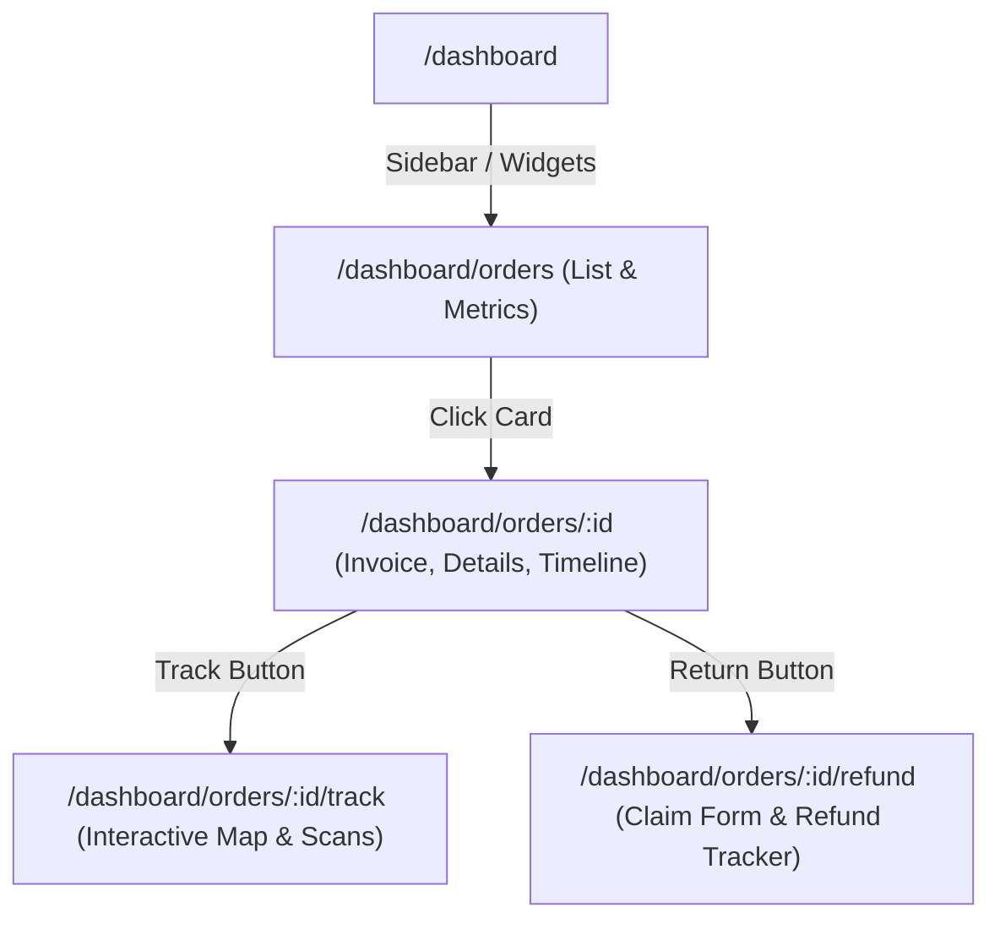

# Orders System Architecture

This document maps the Information Architecture and components structure for the Customer Order Experience.

## Information Architecture (IA)

## Component Overview

1. **OrdersDashboard**
   - High-level metric aggregation (spend, active counts).
   - Dynamic search query state.
   - Status filtering logic (All, Active, Completed, Returned/Refunded).
2. **EnterpriseOrderCard**
   - Renders thumbnails and basic status metadata.
   - Triggers routing or mock invoice download callback.
3. **OrderDetailsPage**
   - Fetches and displays detailed structures for a single order.
   - Renders billing, shipping, invoice math breakdown, and payment status.
4. **OrderTimeline**
   - Pure UI component taking scanning milestones array.
   - Renders state bubbles and dates.
5. **ShipmentTrackingPage**
   - Renders Delhivery / Shiprocket live milestone logs.
   - Renders inline SVG animated Indian shipping path.
6. **ReturnsRefundsPage**
   - Implements validation, checklist state, reason selects, and drag-and-drop.
   - Displays milestones for refund credit progression.
