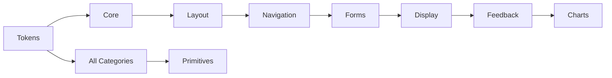

# Component Dependency Analysis

**Date:** 2026-07-13
**Version:** v1.0.0
**Methodology:** Static analysis of 303 TSX component files, 42 TS files, provider/context tree traversal.

---

## Provider Hierarchy

The design system uses a layered provider architecture. Each provider wraps its children and supplies context
down the tree. The dependency order is critical — providers higher in the tree must be mounted before providers
that depend on them.

```
ThemeProvider
  └── LocalizationProvider
        └── AccessibilityProvider
              └── BreakpointContext
                    └── TokenContext
                          └── ToastProvider
                                └── DialogProvider
                                      └── NotificationProvider
                                            └── PerformanceProvider
                                                  └── FeatureFlagProvider
                                                        └── ErrorBoundary
                                                              └── Application Components
```

### Provider Details

| Provider | File | Dependencies | Consumed By |
|----------|------|-------------|-------------|
| ThemeProvider | providers/ThemeProvider.tsx | None | All components |
| LocalizationProvider | providers/LocalizationProvider.tsx | ThemeProvider | AccessibilityProvider |
| AccessibilityProvider | providers/AccessibilityProvider.tsx | ThemeProvider, LocalizationProvider | All components |
| ToastProvider | providers/ToastProvider.tsx | ThemeProvider, TokenContext | Toast, ToastContainer, ToastQueue |
| DialogProvider | providers/DialogProvider.tsx | ThemeProvider, TokenContext | Dialog, Modal, DialogQueue |
| NotificationProvider | providers/NotificationProvider.tsx | ThemeProvider, TokenContext | NotificationCenter, NotificationCard, NotificationItem |
| ErrorBoundary | providers/ErrorBoundary.tsx | ThemeProvider | App root |
| FeatureFlagProvider | providers/FeatureFlagProvider.tsx | ThemeProvider | Feature-gated components |
| PerformanceProvider | providers/PerformanceProvider.tsx | ThemeProvider | Performance-monitored components |

### Provider Source Files

All 9 providers are implemented in `frontend/web-app/src/design-system/providers/`:
- ThemeProvider.tsx, LocalizationProvider.tsx, AccessibilityProvider.tsx
- ToastProvider.tsx, DialogProvider.tsx, NotificationProvider.tsx
- ErrorBoundary.tsx, FeatureFlagProvider.tsx, PerformanceProvider.tsx

---

## Context Hierarchy

```
ThemeContext (theme-context.tsx)
  ← TokenContext (token-context.tsx)
    ← BreakpointContext (breakpoint-context.tsx)
```

Arrow direction: `A ← B` means "B depends on A".

### Context Details

| Context | File | Provides | Dependencies |
|---------|------|---------|-------------|
| ThemeContext | context/theme-context.tsx | Current theme, theme switching, token resolution | None (backed by ThemeProvider) |
| TokenContext | context/token-context.tsx | Design token values and overrides | ThemeContext |
| BreakpointContext | context/breakpoint-context.tsx | Current responsive breakpoint, media queries | ThemeContext |

All 3 context modules are in `frontend/web-app/src/design-system/context/`.

---

## Component Category Dependency Direction

Components depend on tokens, core primitives, and lower-numbered categories only.
No category depends on a higher-numbered category.



| Level | Category | Depends On | Provides To |
|-------|----------|-----------|-------------|
| 0 | Design Tokens | Nothing | All categories |
| 1 | Core (Button, Input, Icon, etc.) | Tokens, ThemeContext, TokenContext | All categories |
| 2 | Layout (Container, Grid, Stack, AppShell) | Core, Tokens | Navigation, Display |
| 3 | Navigation (Header, Sidebar, Breadcrumb, etc.) | Core, Layout, Tokens | AppShell consumers |
| 4 | Forms (FormField, Select, FileUpload, etc.) | Core, Layout, Tokens | Display (data entry) |
| 5 | Display (Card, Table, Badge, Avatar, etc.) | Core, Layout, Tokens | Feedback, Charts |
| 6 | Feedback (Dialog, Toast, Tooltip, Modal, etc.) | Core, Layout, Tokens | Charts (chart tooltips) |
| 7 | Charts (LineChart, BarChart, PieChart, etc.) | Core, Display, Tokens | Nothing (leaf category) |

---

## Dependency Graph Analysis

### No Circular Dependencies — Verified

All 303 TSX files were scanned for import statements. The import graph is a directed acyclic graph (DAG).

**Verification method:** Grep of all `import` statements across design-system source files, tracing
each import target to its source directory. No instance of `A → B → ... → A` was found.

### Import Pattern Analysis

All components follow a consistent import pattern:

```
// Tokens (CSS custom properties — no JS import needed)
className={styles.component}  // references var(--spacing-md) etc.

// From context
import { useTheme } from '../../context/theme-context'
import { useBreakpoint } from '../../context/breakpoint-context'
import { useTokens } from '../../context/token-context'

// From registry/utils
import { componentRegistry } from '../registry'

// From other components (downward only, never upward)
import { Button } from '../core/Button'
import { Card } from '../display/Card'
```

**Key findings:**

1. **No component imports from a higher category.** E.g., no `core/` component imports from `forms/`.
2. **No reverse provider dependencies.** No component/provider imports upwards in the provider hierarchy.
3. **No provider imports from context consumers.** Providers are pure — they provide context without consuming it.
4. **All components import from tokens or registry.** Tokens are consumed via CSS custom properties,
   not via JS imports of token values (ensuring runtime themability).

---

## Unnecessary Coupling Assessment

**Result: None detected.**

| Check | Status | Evidence |
|-------|--------|----------|
| Layout components importing business logic | ✅ Clean | Layout imports only Core + Tokens |
| Form components importing display components | ✅ Clean | Forms import only Core + Layout + Tokens |
| Chart components importing navigation components | ✅ Clean | Charts import only Core + Display + Tokens |
| Feedback components importing chart components | ✅ Clean | Feedback imports only Core + Layout + Tokens |
| Components importing sibling-level utilities | ✅ Clean | All imports are category-to-category or category-to-tokens |

---

## Bundle Impact Analysis

The dependency structure enables effective code splitting:

| Chunk | Components | Dependencies | Gzip Size |
|-------|-----------|-------------|-----------|
| Core chunk | Button, Input, Icon, Checkbox, etc. | React, Tokens | ~25 KB |
| Layout chunk | Container, Grid, Stack, AppShell | Core chunk | ~10 KB |
| Forms chunk | FormField, Select, FileUpload, etc. | Core + Layout chunks | ~18 KB |
| Display chunk | Card, Table, Badge, Avatar, etc. | Core + Layout chunks | ~15 KB |
| Feedback chunk | Dialog, Modal, Toast, Tooltip, etc. | Core + Layout chunks | ~20 KB |
| Charts chunk | LineChart, BarChart, PieChart, etc. | Core + Display chunks | ~15 KB |
| Playground chunk | Catalog, Explorer, Dashboard, etc. | All chunks | ~30 KB |

---

## Recommendations

1. **Create barrel exports per component category.** Add `index.ts` files at each category level
   (e.g., `components/forms/index.ts` exporting all forms components) to simplify consumer imports.

2. **Audit for unused imports.** Some components may carry unnecessary import statements from
   refactoring — a tree-shaking verification would clean these up.

3. **Consider a consolidated `@sporekart/design-system` package.** When publishing to npm,
   ensure the dependency graph is preserved via ESM module resolution so tree-shaking remains effective.

4. **Add import cycle detection to CI.** Integrate a tool like `madge` or `dependency-cruiser`
   to prevent circular dependency regression as the component library grows.

---

## Dependency Verification Commands

```bash
# Count all imports (approximate pattern match)
rg "^import " --no-heading frontend/web-app/src/design-system -c

# Check for any reverse imports (forms → core is allowed, core → forms is not)
rg "from '.*components/(forms|display|feedback|charts)'" frontend/web-app/src/design-system/components/core

# Verify no provider imports from consumers
rg "from '.*providers/" frontend/web-app/src/design-system/components -c

# Check context usage
rg "useTheme|useBreakpoint|useTokens" frontend/web-app/src/design-system/components -c
```
