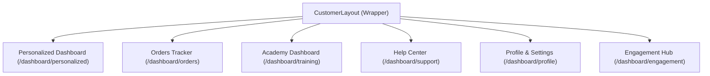

# Customer Platform Architecture

This document describes the information architecture and workspace topology of the integrated Customer Experience Platform.

## Core Navigation Map

## Route Index

- **Dashboard**: `/dashboard/personalized`, `/dashboard/insights`, `/dashboard/activity`, `/dashboard/analytics`, `/dashboard/progress`
- **Orders**: `/dashboard/orders`, `/dashboard/orders/:id`, `/dashboard/orders/:id/track`, `/dashboard/orders/:id/refund`
- **Wishlist**: `/dashboard/wishlist`, `/dashboard/saved-items`, `/dashboard/recently-viewed`
- **Training**: `/dashboard/training`, `/dashboard/training/courses`, `/dashboard/training/course/:id`, `/dashboard/training/classroom/:id`, `/dashboard/training/my-learning`, `/dashboard/training/certificates`, `/dashboard/training/schedule`
- **Support**: `/dashboard/support`, `/dashboard/support/tickets`, `/dashboard/support/tickets/:id`, `/dashboard/support/faq`, `/dashboard/support/help-center`, `/dashboard/support/contact`, `/dashboard/support/feedback`
- **Engagement**: `/dashboard/engagement`, `/dashboard/recommendations`
