# Sporekart — Microservices Database Schema Design
**Principle:** Polyglot persistence, one database per service, zero cross-service foreign keys
**Diagram format:** Mermaid `erDiagram` — renders natively on GitHub, GitLab, Obsidian, Notion, VS Code preview

---

## Table of contents
1. [Design principles](#1-design-principles)
2. [Database technology map](#2-database-technology-map)
3. [Identity Service schema](#3-identity-service-schema)
4. [Catalog Service schema](#4-catalog-service-schema)
5. [Inventory Service schema](#5-inventory-service-schema)
6. [Cart Service schema](#6-cart-service-schema)
7. [Order Service schema](#7-order-service-schema)
8. [Payment Service schema](#8-payment-service-schema)
9. [Fulfillment Service schema](#9-fulfillment-service-schema)
10. [Training Service schema](#10-training-service-schema)
11. [Content Service schema](#11-content-service-schema)
12. [Notification Service schema](#12-notification-service-schema)
13. [Search Service schema](#13-search-service-schema)
14. [Analytics Service schema](#14-analytics-service-schema)
15. [Risk Service schema](#15-risk-service-schema)
16. [Support Service schema](#16-support-service-schema)
17. [Cross-service reference diagram](#17-cross-service-reference-diagram)
18. [Outbox & idempotency pattern (applied to every service)](#18-outbox--idempotency-pattern-applied-to-every-service)

---

## 1. Design principles

1. **One database per service.** No service ever runs a JOIN across a service boundary. If Order Service needs a product name, it either calls Catalog Service's API or keeps a denormalized copy synced via events — it never queries Catalog's tables directly.
2. **Reference by ID, not by foreign key.** `order_items.product_id` is a plain UUID column, not a foreign key constraint — the referenced row lives in a different database entirely. Referential integrity across services is enforced by the event flow and application logic, not the database engine.
3. **Denormalize deliberately at the edge.** Order Service stores `product_name_snapshot` and `price_snapshot` at time of purchase — not because normalization doesn't matter, but because an order must show what the customer actually bought even if the product is later renamed or repriced.
4. **Every service that publishes events owns an outbox table.** This guarantees a state change and its corresponding event are written atomically in one local transaction (see §18) — the classic failure mode this prevents is "the order saved but the event never published because the process crashed in between."
5. **Every service that consumes events owns a processed-events table.** Kafka-style buses deliver at-least-once — consumers must deduplicate, not assume exactly-once delivery.

---

## 2. Database technology map

| Service | Database technology | Why |
|---|---|---|
| Identity | PostgreSQL | Relational, strong consistency for auth |
| Catalog | PostgreSQL + Redis cache | Relational source of truth, cached reads |
| Inventory | PostgreSQL | Needs row-level locking for reservations |
| Cart | Redis | Ephemeral, TTL-native, no need for durability |
| Order | PostgreSQL | Core consistency domain, needs transactions |
| Payment | PostgreSQL | Highest correctness bar, needs ACID |
| Fulfillment | PostgreSQL | Moderate volume, relational fits |
| Training | PostgreSQL | Relational, moderate volume |
| Content | PostgreSQL | Relational, low write volume |
| Notification | PostgreSQL + Redis queue | Durable logs + fast dispatch queue |
| Search | OpenSearch | Denormalized document store, not relational |
| Analytics | ClickHouse / BigQuery-style columnar store | Append-only, high-volume event stream |
| Risk | PostgreSQL + Redis | Rules/scores relational, velocity counters in Redis |
| Support | PostgreSQL | Relational, low volume |

---

## 3. Identity Service schema

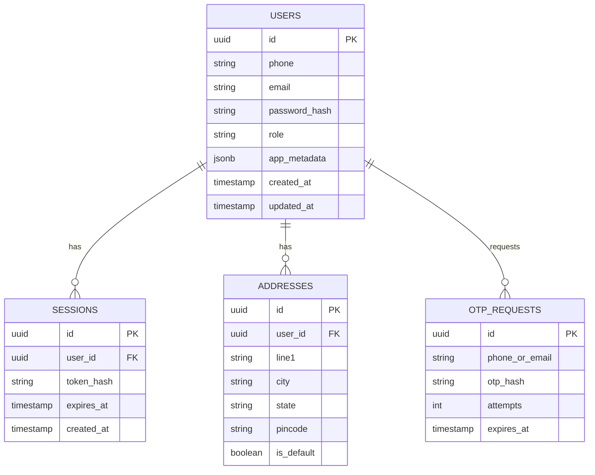
```mermaid
erDiagram
    USERS ||--o{ SESSIONS : has
    USERS ||--o{ ADDRESSES : has
    USERS ||--o{ OTP_REQUESTS : requests

    USERS {
        uuid id PK
        string phone
        string email
        string password_hash
        string role
        jsonb app_metadata
        timestamp created_at
        timestamp updated_at
    }
    SESSIONS {
        uuid id PK
        uuid user_id FK
        string token_hash
        timestamp expires_at
        timestamp created_at
    }
    ADDRESSES {
        uuid id PK
        uuid user_id FK
        string line1
        string city
        string state
        string pincode
        boolean is_default
    }
    OTP_REQUESTS {
        uuid id PK
        string phone_or_email
        string otp_hash
        int attempts
        timestamp expires_at
    }
```

**Publishes:** `user.registered`, `user.role_changed`, `user.profile_updated`
**Consumes:** `certificate.issued` (to flag grower-tier eligibility on the user record)

---

## 4. Catalog Service schema

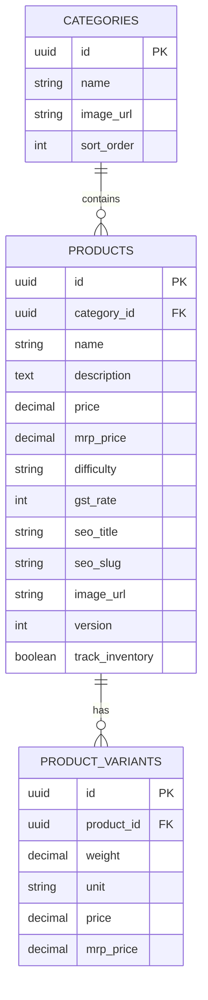
```mermaid
erDiagram
    CATEGORIES ||--o{ PRODUCTS : contains
    PRODUCTS ||--o{ PRODUCT_VARIANTS : has

    CATEGORIES {
        uuid id PK
        string name
        string image_url
        int sort_order
    }
    PRODUCTS {
        uuid id PK
        uuid category_id FK
        string name
        text description
        decimal price
        decimal mrp_price
        string difficulty
        int gst_rate
        string seo_title
        string seo_slug
        string image_url
        int version
        boolean track_inventory
    }
    PRODUCT_VARIANTS {
        uuid id PK
        uuid product_id FK
        decimal weight
        string unit
        decimal price
        decimal mrp_price
    }
```

**Publishes:** `product.created`, `product.updated`, `product.price_changed`
**Consumes:** none (source of truth for product data)

---

## 5. Inventory Service schema

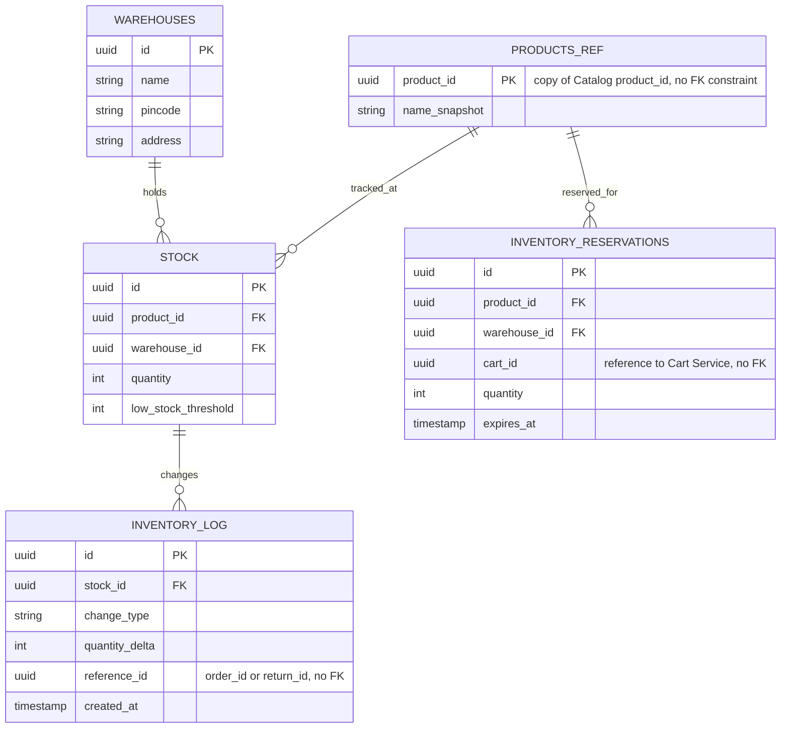
```mermaid
erDiagram
    WAREHOUSES ||--o{ STOCK : holds
    PRODUCTS_REF ||--o{ STOCK : tracked_at
    PRODUCTS_REF ||--o{ INVENTORY_RESERVATIONS : reserved_for
    STOCK ||--o{ INVENTORY_LOG : changes

    WAREHOUSES {
        uuid id PK
        string name
        string pincode
        string address
    }
    PRODUCTS_REF {
        uuid product_id PK "copy of Catalog product_id, no FK constraint"
        string name_snapshot
    }
    STOCK {
        uuid id PK
        uuid product_id FK
        uuid warehouse_id FK
        int quantity
        int low_stock_threshold
    }
    INVENTORY_RESERVATIONS {
        uuid id PK
        uuid product_id FK
        uuid warehouse_id FK
        uuid cart_id "reference to Cart Service, no FK"
        int quantity
        timestamp expires_at
    }
    INVENTORY_LOG {
        uuid id PK
        uuid stock_id FK
        string change_type
        int quantity_delta
        uuid reference_id "order_id or return_id, no FK"
        timestamp created_at
    }
```

**Publishes:** `inventory.reserved`, `inventory.committed`, `inventory.commit_failed`, `inventory.restocked`
**Consumes:** `product.created` (creates a stock row per warehouse), `order.payment_verified`, `refund.completed`

---

## 6. Cart Service schema

Cart Service is Redis-backed — schema shown as key structure, not a relational ERD.

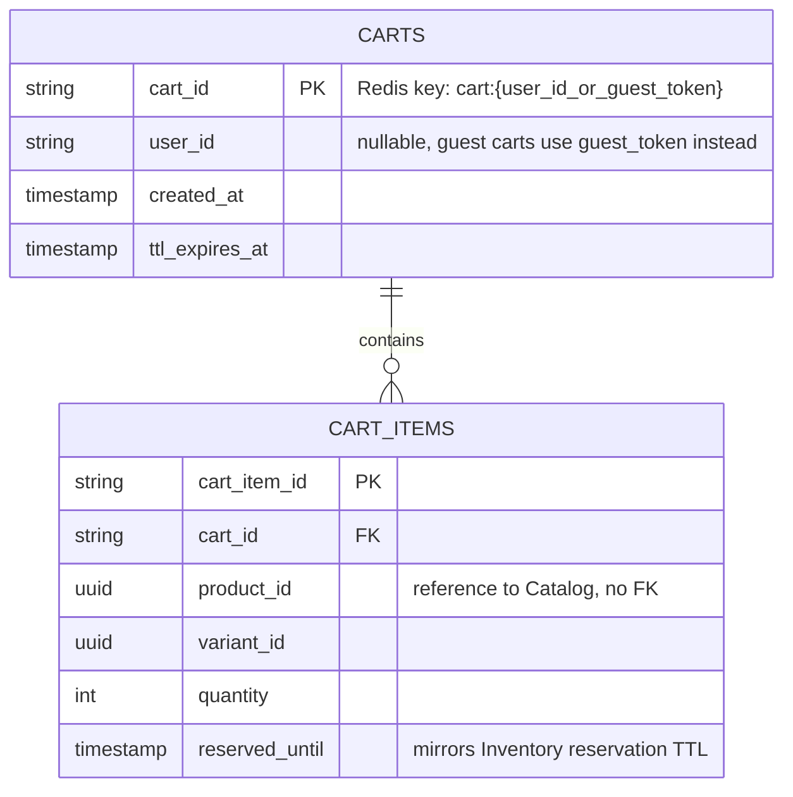
```mermaid
erDiagram
    CARTS ||--o{ CART_ITEMS : contains

    CARTS {
        string cart_id PK "Redis key: cart:{user_id_or_guest_token}"
        string user_id "nullable, guest carts use guest_token instead"
        timestamp created_at
        timestamp ttl_expires_at
    }
    CART_ITEMS {
        string cart_item_id PK
        string cart_id FK
        uuid product_id "reference to Catalog, no FK"
        uuid variant_id
        int quantity
        timestamp reserved_until "mirrors Inventory reservation TTL"
    }
```

**Publishes:** `cart.checkout_initiated`
**Consumes:** `product.price_changed` (to flag stale prices in an active cart)

---

## 7. Order Service schema

Order Service is the saga orchestrator — it also owns `saga_state`, tracking where each in-flight checkout or return is in its sequence.

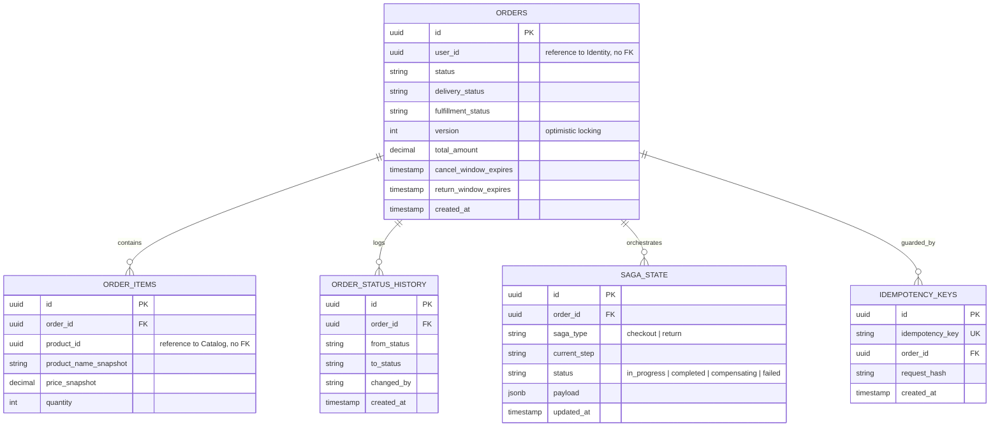
```mermaid
erDiagram
    ORDERS ||--o{ ORDER_ITEMS : contains
    ORDERS ||--o{ ORDER_STATUS_HISTORY : logs
    ORDERS ||--o{ SAGA_STATE : orchestrates
    ORDERS ||--o{ IDEMPOTENCY_KEYS : guarded_by

    ORDERS {
        uuid id PK
        uuid user_id "reference to Identity, no FK"
        string status
        string delivery_status
        string fulfillment_status
        int version "optimistic locking"
        decimal total_amount
        timestamp cancel_window_expires
        timestamp return_window_expires
        timestamp created_at
    }
    ORDER_ITEMS {
        uuid id PK
        uuid order_id FK
        uuid product_id "reference to Catalog, no FK"
        string product_name_snapshot
        decimal price_snapshot
        int quantity
    }
    ORDER_STATUS_HISTORY {
        uuid id PK
        uuid order_id FK
        string from_status
        string to_status
        string changed_by
        timestamp created_at
    }
    SAGA_STATE {
        uuid id PK
        uuid order_id FK
        string saga_type "checkout | return"
        string current_step
        string status "in_progress | completed | compensating | failed"
        jsonb payload
        timestamp updated_at
    }
    IDEMPOTENCY_KEYS {
        uuid id PK
        string idempotency_key UK
        uuid order_id FK
        string request_hash
        timestamp created_at
    }
```

**Publishes:** `order.created`, `order.payment_verified`, `order.approved`, `order.rejected`, `return.requested`, `return.approved`, `quality_check.requested`
**Consumes:** `inventory.reserved`, `payment.verified`, `inventory.commit_failed`, `pickup.completed`, `quality_check.passed`, `refund.completed`

---

## 8. Payment Service schema

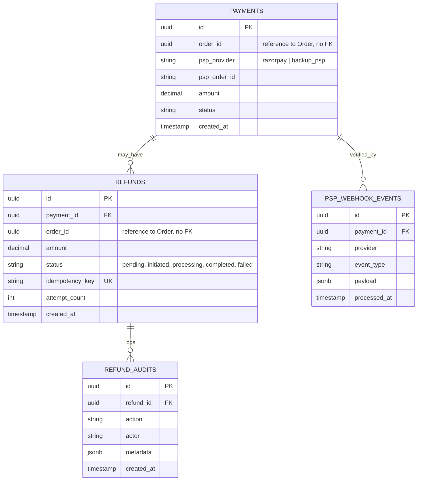
```mermaid
erDiagram
    PAYMENTS ||--o{ REFUNDS : may_have
    REFUNDS ||--o{ REFUND_AUDITS : logs
    PAYMENTS ||--o{ PSP_WEBHOOK_EVENTS : verified_by

    PAYMENTS {
        uuid id PK
        uuid order_id "reference to Order, no FK"
        string psp_provider "razorpay | backup_psp"
        string psp_order_id
        decimal amount
        string status
        timestamp created_at
    }
    REFUNDS {
        uuid id PK
        uuid payment_id FK
        uuid order_id "reference to Order, no FK"
        decimal amount
        string status "pending, initiated, processing, completed, failed"
        string idempotency_key UK
        int attempt_count
        timestamp created_at
    }
    REFUND_AUDITS {
        uuid id PK
        uuid refund_id FK
        string action
        string actor
        jsonb metadata
        timestamp created_at
    }
    PSP_WEBHOOK_EVENTS {
        uuid id PK
        uuid payment_id FK
        string provider
        string event_type
        jsonb payload
        timestamp processed_at
    }
```

**Publishes:** `payment.verified`, `payment.failed`, `refund.initiated`, `refund.completed`, `refund.failed`
**Consumes:** `order.created` (to create the PSP order), `quality_check.passed`, `inventory.commit_failed`

---

## 9. Fulfillment Service schema

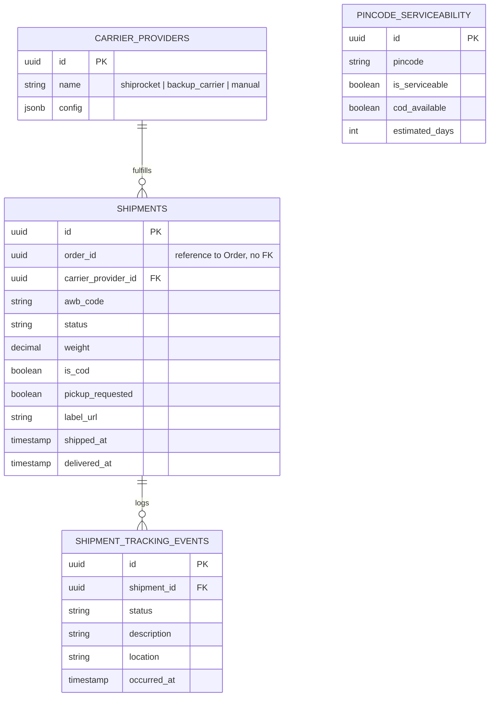
```mermaid
erDiagram
    SHIPMENTS ||--o{ SHIPMENT_TRACKING_EVENTS : logs
    CARRIER_PROVIDERS ||--o{ SHIPMENTS : fulfills

    SHIPMENTS {
        uuid id PK
        uuid order_id "reference to Order, no FK"
        uuid carrier_provider_id FK
        string awb_code
        string status
        decimal weight
        boolean is_cod
        boolean pickup_requested
        string label_url
        timestamp shipped_at
        timestamp delivered_at
    }
    SHIPMENT_TRACKING_EVENTS {
        uuid id PK
        uuid shipment_id FK
        string status
        string description
        string location
        timestamp occurred_at
    }
    CARRIER_PROVIDERS {
        uuid id PK
        string name "shiprocket | backup_carrier | manual"
        jsonb config
    }
    PINCODE_SERVICEABILITY {
        uuid id PK
        string pincode
        boolean is_serviceable
        boolean cod_available
        int estimated_days
    }
```

**Publishes:** `shipment.created`, `shipment.dispatched`, `shipment.delivered`, `pickup.completed`, `shipment.ndr`
**Consumes:** `order.approved` (create shipment), `return.approved` (schedule pickup)

---

## 10. Training Service schema

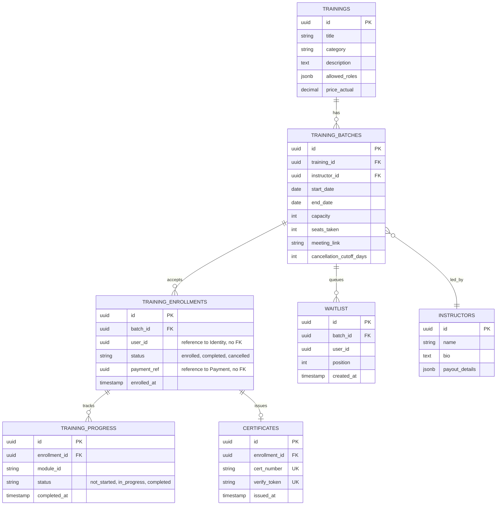
```mermaid
erDiagram
    TRAININGS ||--o{ TRAINING_BATCHES : has
    TRAINING_BATCHES ||--o{ TRAINING_ENROLLMENTS : accepts
    TRAINING_BATCHES ||--o{ WAITLIST : queues
    TRAINING_BATCHES }o--|| INSTRUCTORS : led_by
    TRAINING_ENROLLMENTS ||--o{ TRAINING_PROGRESS : tracks
    TRAINING_ENROLLMENTS ||--o| CERTIFICATES : issues

    TRAININGS {
        uuid id PK
        string title
        string category
        text description
        jsonb allowed_roles
        decimal price_actual
    }
    TRAINING_BATCHES {
        uuid id PK
        uuid training_id FK
        uuid instructor_id FK
        date start_date
        date end_date
        int capacity
        int seats_taken
        string meeting_link
        int cancellation_cutoff_days
    }
    INSTRUCTORS {
        uuid id PK
        string name
        text bio
        jsonb payout_details
    }
    TRAINING_ENROLLMENTS {
        uuid id PK
        uuid batch_id FK
        uuid user_id "reference to Identity, no FK"
        string status "enrolled, completed, cancelled"
        uuid payment_ref "reference to Payment, no FK"
        timestamp enrolled_at
    }
    WAITLIST {
        uuid id PK
        uuid batch_id FK
        uuid user_id
        int position
        timestamp created_at
    }
    TRAINING_PROGRESS {
        uuid id PK
        uuid enrollment_id FK
        string module_id
        string status "not_started, in_progress, completed"
        timestamp completed_at
    }
    CERTIFICATES {
        uuid id PK
        uuid enrollment_id FK
        string cert_number UK
        string verify_token UK
        timestamp issued_at
    }
```

**Publishes:** `enrollment.confirmed`, `enrollment.completed`, `certificate.issued`, `waitlist.promoted`
**Consumes:** `payment.verified` (confirms enrollment), `payment.failed` (releases seat)

---

## 11. Content Service schema

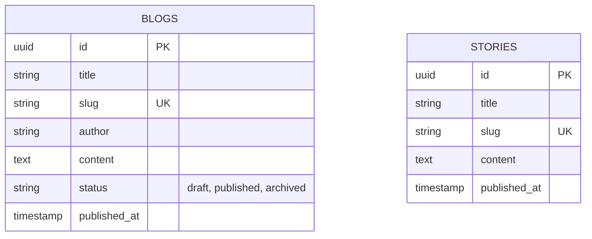
```mermaid
erDiagram
    BLOGS {
        uuid id PK
        string title
        string slug UK
        string author
        text content
        string status "draft, published, archived"
        timestamp published_at
    }
    STORIES {
        uuid id PK
        string title
        string slug UK
        text content
        timestamp published_at
    }
```

**Publishes:** `content.published`
**Consumes:** none

---

## 12. Notification Service schema

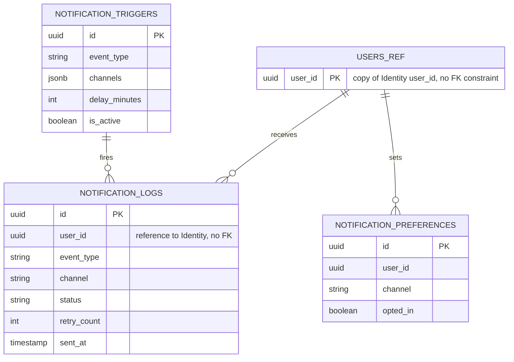
```mermaid
erDiagram
    NOTIFICATION_TRIGGERS ||--o{ NOTIFICATION_LOGS : fires
    USERS_REF ||--o{ NOTIFICATION_PREFERENCES : sets
    USERS_REF ||--o{ NOTIFICATION_LOGS : receives

    NOTIFICATION_TRIGGERS {
        uuid id PK
        string event_type
        jsonb channels
        int delay_minutes
        boolean is_active
    }
    NOTIFICATION_LOGS {
        uuid id PK
        uuid user_id "reference to Identity, no FK"
        string event_type
        string channel
        string status
        int retry_count
        timestamp sent_at
    }
    NOTIFICATION_PREFERENCES {
        uuid id PK
        uuid user_id
        string channel
        boolean opted_in
    }
    USERS_REF {
        uuid user_id PK "copy of Identity user_id, no FK constraint"
    }
```

**Publishes:** `notification.sent`, `notification.failed`
**Consumes:** every domain event listed in the trigger table — this service subscribes broadly by design

---

## 13. Search Service schema

OpenSearch document store, not relational — shown as a document schema rather than an ERD.

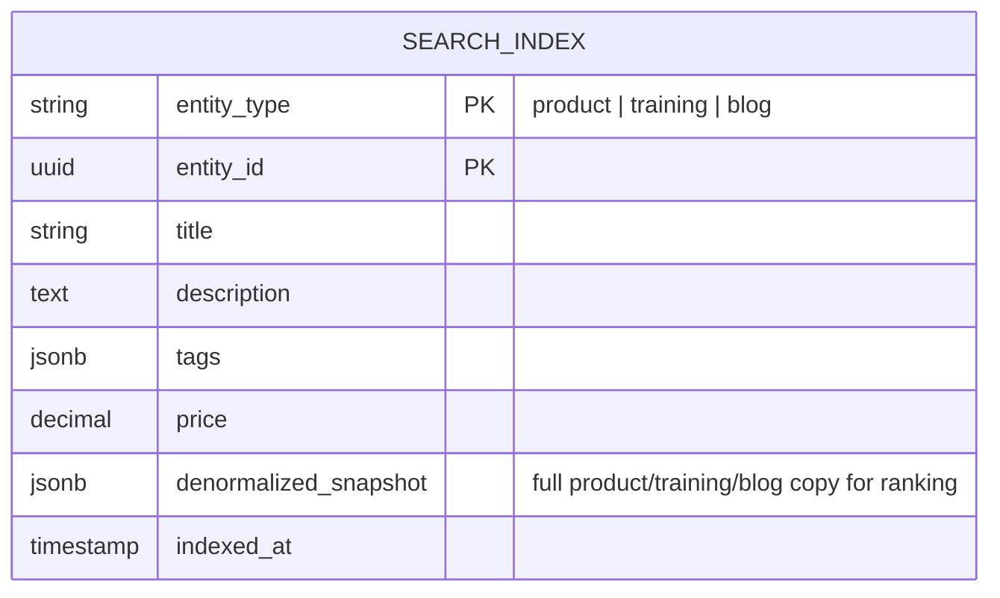
```mermaid
erDiagram
    SEARCH_INDEX {
        string entity_type PK "product | training | blog"
        uuid entity_id PK
        string title
        text description
        jsonb tags
        decimal price
        jsonb denormalized_snapshot "full product/training/blog copy for ranking"
        timestamp indexed_at
    }
```

**Publishes:** none
**Consumes:** `product.created`, `product.updated`, `content.published`, `enrollment.confirmed` (to boost popular trainings)

---

## 14. Analytics Service schema

Append-only columnar store — optimized for write-heavy ingestion and aggregate queries, not row updates.

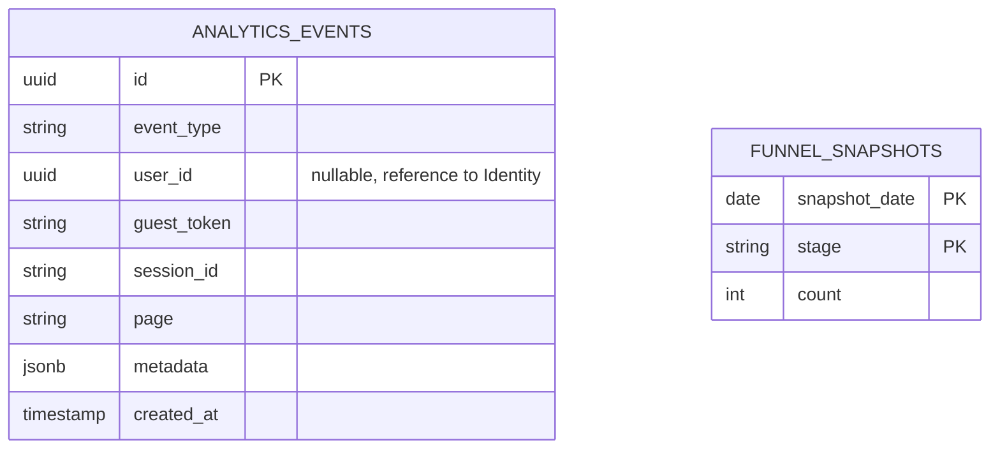
```mermaid
erDiagram
    ANALYTICS_EVENTS {
        uuid id PK
        string event_type
        uuid user_id "nullable, reference to Identity"
        string guest_token
        string session_id
        string page
        jsonb metadata
        timestamp created_at
    }
    FUNNEL_SNAPSHOTS {
        date snapshot_date PK
        string stage PK
        int count
    }
```

**Publishes:** none
**Consumes:** all domain events (fire-and-forget ingestion for dashboards)

---

## 15. Risk Service schema

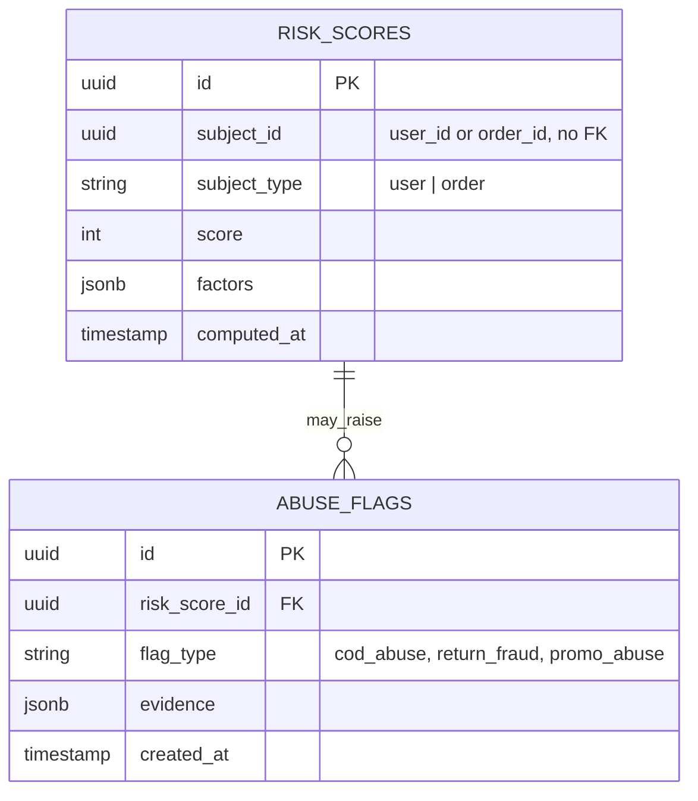
```mermaid
erDiagram
    RISK_SCORES ||--o{ ABUSE_FLAGS : may_raise

    RISK_SCORES {
        uuid id PK
        uuid subject_id "user_id or order_id, no FK"
        string subject_type "user | order"
        int score
        jsonb factors
        timestamp computed_at
    }
    ABUSE_FLAGS {
        uuid id PK
        uuid risk_score_id FK
        string flag_type "cod_abuse, return_fraud, promo_abuse"
        jsonb evidence
        timestamp created_at
    }
```

**Publishes:** `risk.flagged`
**Consumes:** `order.created` (sync scoring on hot path), `return.requested`, `refund.completed` (async pattern scoring)

---

## 16. Support Service schema

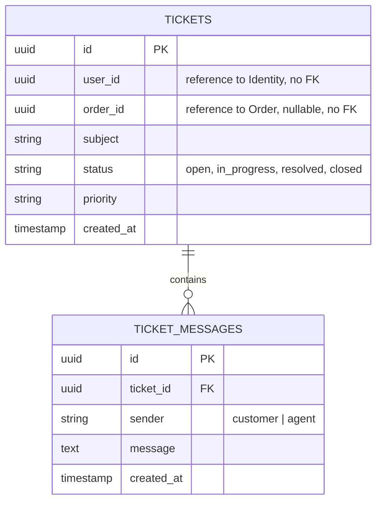
```mermaid
erDiagram
    TICKETS ||--o{ TICKET_MESSAGES : contains

    TICKETS {
        uuid id PK
        uuid user_id "reference to Identity, no FK"
        uuid order_id "reference to Order, nullable, no FK"
        string subject
        string status "open, in_progress, resolved, closed"
        string priority
        timestamp created_at
    }
    TICKET_MESSAGES {
        uuid id PK
        uuid ticket_id FK
        string sender "customer | agent"
        text message
        timestamp created_at
    }
```

**Publishes:** `ticket.created`, `ticket.resolved`
**Consumes:** `order.created`, `refund.failed`, `shipment.ndr` (auto-creates a ticket for known failure patterns)

---

## 17. Cross-service reference diagram

This shows how services reference each other's data **without foreign keys** — every arrow here is "stores a copy of this ID and optionally a denormalized snapshot," never a database-level constraint.

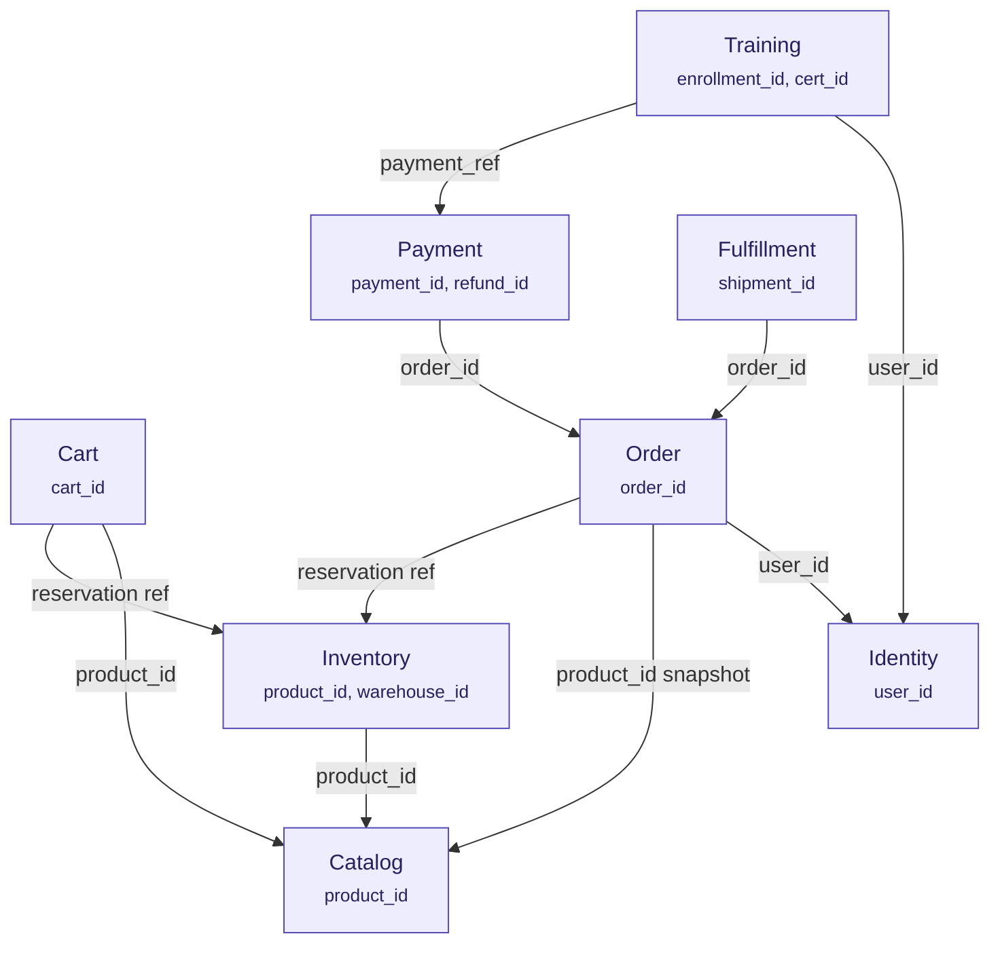
```mermaid
flowchart TD
    Identity["Identity<br/><small>user_id</small>"]
    Catalog["Catalog<br/><small>product_id</small>"]
    Inventory["Inventory<br/><small>product_id, warehouse_id</small>"]
    Cart["Cart<br/><small>cart_id</small>"]
    Order["Order<br/><small>order_id</small>"]
    Payment["Payment<br/><small>payment_id, refund_id</small>"]
    Fulfillment["Fulfillment<br/><small>shipment_id</small>"]
    Training["Training<br/><small>enrollment_id, cert_id</small>"]

    Order -->|user_id| Identity
    Order -->|product_id snapshot| Catalog
    Inventory -->|product_id| Catalog
    Cart -->|product_id| Catalog
    Cart -->|reservation ref| Inventory
    Order -->|reservation ref| Inventory
    Payment -->|order_id| Order
    Fulfillment -->|order_id| Order
    Training -->|user_id| Identity
    Training -->|payment_ref| Payment

    classDef svc fill:#EEEDFE,stroke:#534AB7,color:#26215C
    class Identity,Catalog,Inventory,Cart,Order,Payment,Fulfillment,Training svc
```

**Reading this diagram:** an arrow from Order to Identity means Order Service stores `user_id` as a plain column and calls Identity Service's API (or reads a cached/event-synced copy) whenever it needs the user's name or contact info — it never joins against Identity's `users` table.

---

## 18. Outbox & idempotency pattern (applied to every service)

Every service in §3–§16 that publishes events implements this same pair of tables. Shown once here as the canonical pattern rather than repeating it fourteen times above.

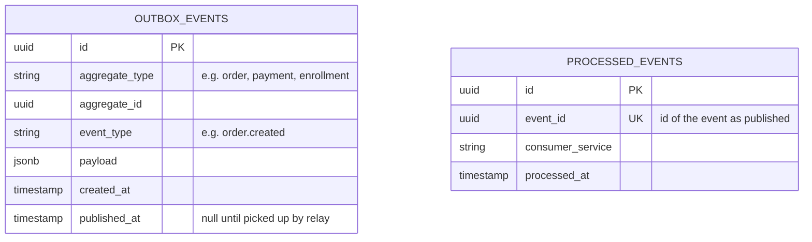
```mermaid
erDiagram
    OUTBOX_EVENTS {
        uuid id PK
        string aggregate_type "e.g. order, payment, enrollment"
        uuid aggregate_id
        string event_type "e.g. order.created"
        jsonb payload
        timestamp created_at
        timestamp published_at "null until picked up by relay"
    }
    PROCESSED_EVENTS {
        uuid id PK
        uuid event_id UK "id of the event as published"
        string consumer_service
        timestamp processed_at
    }
```

**How it works:**
1. A service writes its state change (e.g. `orders.status = 'ORDER_CREATED'`) and a row into `outbox_events` in the **same local transaction**. Either both happen or neither does — no risk of "order saved, event lost."
2. A background relay process polls `outbox_events` where `published_at IS NULL`, publishes to the event bus, then marks `published_at`.
3. Every consuming service checks `processed_events` before acting on a received event, and inserts a row after processing — this makes handling idempotent even though the bus delivers at-least-once (a redelivered `payment.verified` event won't double-deduct inventory).

This single pattern, applied uniformly, is what makes the saga flows in the companion flow-diagrams file reliable under partial failure — every step is either fully applied or safely retryable, never half-done.

---

*This file is the database companion to `sporekart-microservices-flow-diagrams.md` — read together, one shows how data moves between services, this one shows what each service actually stores.*
