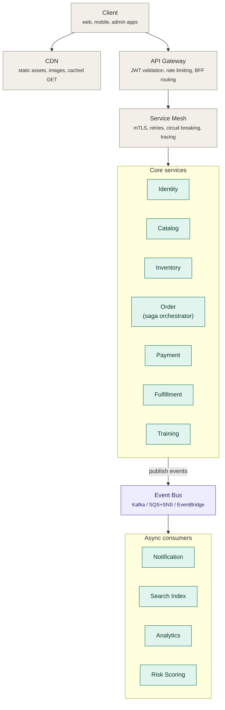
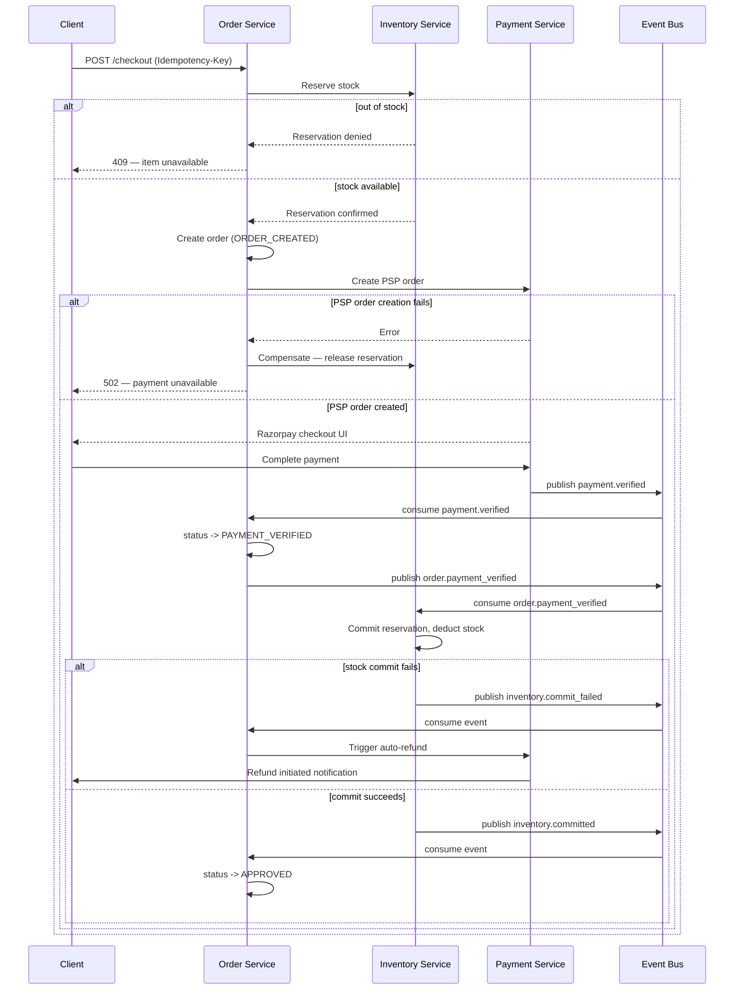
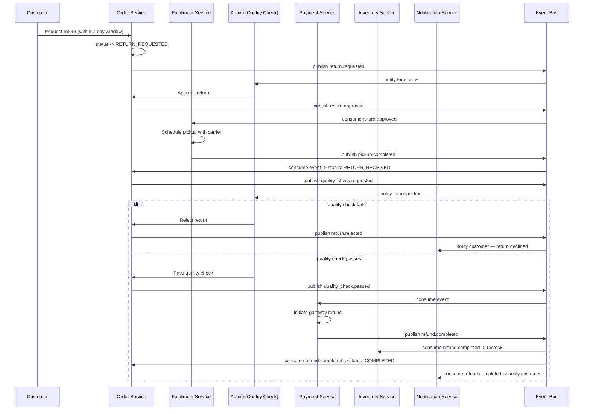
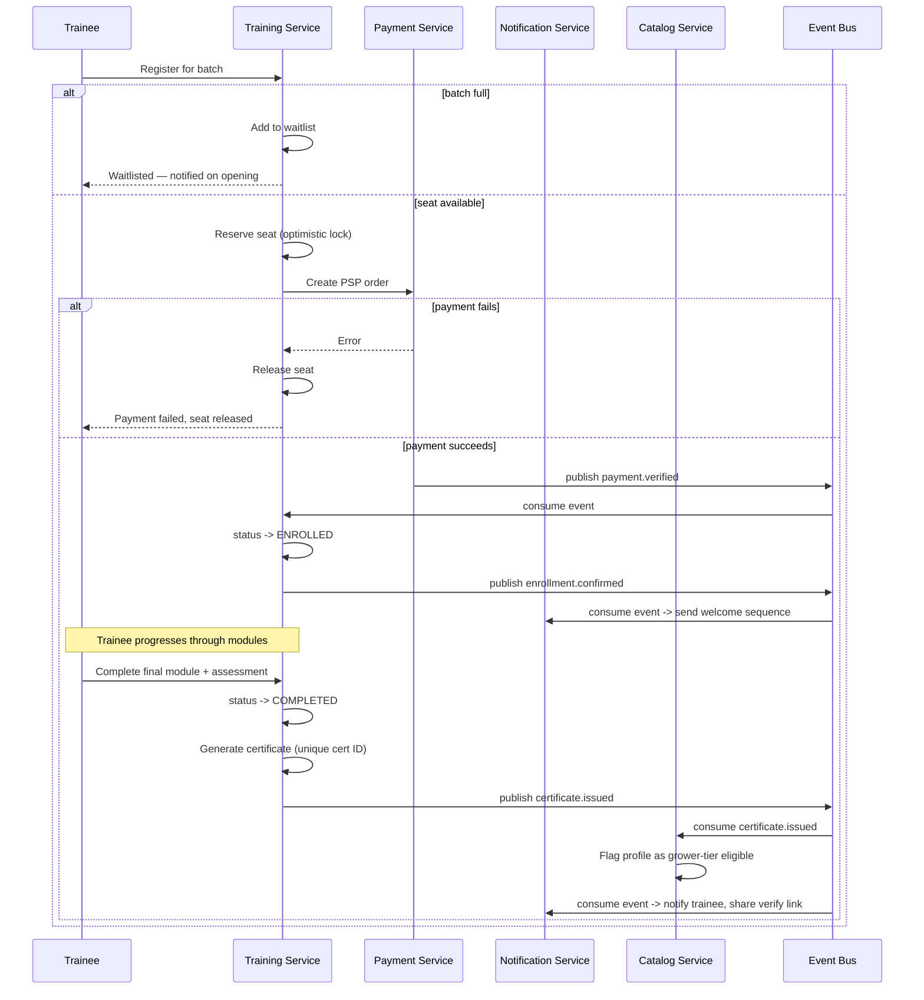
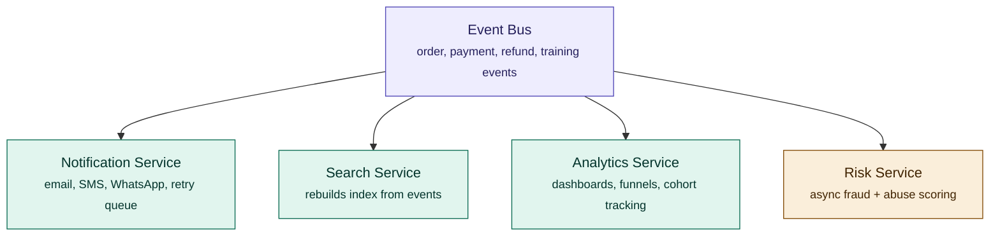

# Sporekart — Microservices Architecture & Flow Diagrams
**Consolidated reference:** architecture audit summary + microservices design + every flow diagram, in one file
**Diagram format:** Mermaid (renders natively on GitHub, GitLab, Notion, Obsidian, VS Code preview, and most markdown viewers)

This file merges and supersedes the two prior documents (`sporekart-PRD-audit-and-redesign.md` and `sporekart-microservices-architecture.md`) into a single reference, with every flow rendered as an actual diagram rather than ASCII art.

---

## Table of contents
1. [Audit summary](#1-audit-summary)
2. [Service catalog & data ownership](#2-service-catalog--data-ownership)
3. [System topology diagram](#3-system-topology-diagram)
4. [Checkout saga — full sequence diagram](#4-checkout-saga--full-sequence-diagram)
5. [Return & refund saga — full sequence diagram](#5-return--refund-saga--full-sequence-diagram)
6. [Training enrollment saga — full sequence diagram](#6-training-enrollment-saga--full-sequence-diagram)
7. [Event bus fan-out diagram](#7-event-bus-fan-out-diagram)
8. [Consistency model](#8-consistency-model)
9. [Migration roadmap (strangler fig)](#9-migration-roadmap-strangler-fig)

---

## 1. Audit summary

### Strongest links (kept and built on)
| # | Strength |
|---|---|
| 1 | V3 order state machine with 3-dimension model (`status` / `delivery_status` / `fulfillment_status`) |
| 2 | Row-Level Security as the primary authorization layer — defense-in-depth at the database itself |
| 3 | Idempotency keys + compensating transactions already designed into refunds |
| 4 | Feature flags as the rollout mechanism |
| 5 | Audit logging on refunds and admin actions |
| 6 | Dual-sided business model (B2C + B2B training) on one identity layer |
| 7 | Real-time sync via SSE + BroadcastChannel |
| 8 | Explicit, server-enforced cancellation/return windows, not just UI countdowns |

### Weakest links (the reason this redesign exists)
| # | Weak link | Fixed by |
|---|---|---|
| 1 | No caching layer | Redis cache-aside on Catalog + sessions (§2) |
| 2 | State transitions run on cron polling, not events | Event bus replaces polling (§3, §7) |
| 3 | Single payment gateway, no failover | Payment Service with PSP orchestration (§2) |
| 4 | Admin impersonation with no guardrails | Time-boxed, audited, step-up auth required |
| 5 | No idempotency on order *creation* | `Idempotency-Key` header, checked in saga step 1 (§4) |
| 6 | Monolithic files (110KB routes, 970-line core service) | Domain-bounded services, each independently deployable (§2) |
| 7 | No fraud/risk engine | Risk Service, async-scored on the event bus (§7) |
| 8 | Single-warehouse assumption | Inventory Service models `warehouse_id` as first-class (§2) |
| 9 | No dedicated search engine | Search Service, rebuilt from events (§7) |
| 10 | Dual state machines (v3 + legacy) running concurrently | Legacy frozen, single source of truth in Order Service |

---

## 2. Service catalog & data ownership

**The one rule that makes this maintainable:** each service owns its own database. No service ever queries another service's tables directly — only through its API or its published events.

| # | Service | Owns (its own DB) | Scaling profile |
|---|---|---|---|
| 1 | Identity Service | users, roles, sessions, credentials | Read-heavy, cache aggressively |
| 2 | Catalog Service | products, categories, pricing, variants | Read-heavy, high cache hit rate |
| 3 | Inventory Service | stock, reservations, warehouse allocation | Write-heavy, strong consistency |
| 4 | Cart Service | active carts, reservation TTLs | Ephemeral, Redis-backed |
| 5 | Order Service | orders, state machine, order history | Write-heavy, saga orchestrator |
| 6 | Payment Service | payment records, refunds, PSP orchestration | Low volume, highest correctness bar |
| 7 | Fulfillment Service | shipments, tracking events, carrier abstraction | Bursty, webhook-driven |
| 8 | Training Service | courses, batches, enrollments, progress, certificates | Moderate, mostly read |
| 9 | Content Service | blogs, stories, SEO metadata | Read-heavy, CDN-friendly |
| 10 | Notification Service | templates, delivery logs, preferences | Async, queue-driven |
| 11 | Search Service | denormalized search index | Rebuildable from events |
| 12 | Analytics Service | event store, dashboards | Append-only |
| 13 | Risk Service | fraud rules, scores, abuse history | Low latency on hot path |
| 14 | Support Service | tickets, escalations | Low volume |

---

## 3. System topology diagram

Every client request takes this path before it ever reaches business logic. The API Gateway handles synchronous client→service calls; the event bus handles everything service→service that isn't a real-time query.

---

## 4. Checkout saga — full sequence diagram

Order Service is the saga orchestrator. Every step has a defined compensating action if a later step fails — this is what replaces the implicit "one big database transaction" the monolith used to rely on.

---

## 5. Return & refund saga — full sequence diagram

This reuses the existing PRD's refund phase design (restock → refund record → gateway refund → update → notify) — the redesign just makes each phase an event instead of a sequential in-process call, so any single service can be briefly down without failing the whole return.

---

## 6. Training enrollment saga — full sequence diagram

The last two steps are the strategic core of the dual-sided business — a completed certification is what should route a trainee back into the commerce funnel as a high-intent, credibility-verified buyer.

---

## 7. Event bus fan-out diagram

Every domain event published anywhere in the system fans out to these four consumers independently — none of them block the transaction that produced the event, and none of them can slow down checkout by being slow themselves.

---

## 8. Consistency model

| Data | Consistency requirement | Mechanism |
|---|---|---|
| Inventory reservation at checkout | Strong (can't oversell) | Synchronous call to Inventory Service, row-level lock |
| Order state transitions | Strong within Order Service | Local ACID transaction + optimistic locking (version column) |
| Payment status → Order status | Eventually consistent (seconds) | Event-driven; acceptable because the state machine already has intermediate states built for this |
| Search index | Eventually consistent (seconds–minutes) | Rebuilt from Catalog/Training/Content events |
| Analytics dashboards | Eventually consistent (minutes) | Stream processing, never needs to be real-time |

Only the checkout hot-path (inventory reservation) needs synchronous consistency. Everything else was already effectively async in the original PRD (notifications, analytics) — this just makes it formal.

---

## 9. Migration roadmap (strangler fig)

Extract in order of lowest coupling + highest independent value first. The monolith keeps running throughout — the API Gateway routes each endpoint to either the monolith or the new service, one at a time.

```mermaid
flowchart LR
    S1["1. Notification<br/><small>stateless, very low risk</small>"]
    S2["2. Search<br/><small>read-only, rebuildable</small>"]
    S3["3. Analytics<br/><small>append-only consumer</small>"]
    S4["4. Content<br/><small>no money flow</small>"]
    S5["5. Training<br/><small>first real saga, lower stakes</small>"]
    S6["6. Fulfillment<br/><small>abstraction already exists</small>"]
    S7["7. Inventory<br/><small>saga pattern now proven</small>"]
    S8["8. Payment<br/><small>highest correctness bar</small>"]
    S9["9. Order<br/><small>becomes saga orchestrator</small>"]
    S10["10. Identity<br/><small>dual-write cutover, last</small>"]

    S1 --> S2 --> S3 --> S4 --> S5 --> S6 --> S7 --> S8 --> S9 --> S10

    classDef low fill:#E1F5EE,stroke:#0F6E56,color:#04342C
    classDef med fill:#FAEEDA,stroke:#854F0B,color:#412402
    classDef high fill:#FAECE7,stroke:#993C1D,color:#4A1B0C

    class S1,S2,S3,S4 low
    class S5,S6,S7 med
    class S8,S9,S10 high
```

**Honest trade-off, worth repeating here:** this buys independent deployability and fault isolation at the cost of needing a real platform/DevOps function, harder local development, and debugging that trades "read one file" for "read one trace across five services." Do this when the monolith's coupling is visibly costing you — not because microservices are correct in the abstract.

---

*This file consolidates the audit, the microservices architecture, and every flow diagram into one reference. All diagrams use Mermaid — open this file in GitHub, GitLab, Obsidian, Notion, or VS Code's markdown preview to render them.*
