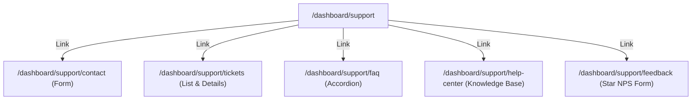

# Support Platform Architecture

This document maps the Information Architecture and components structure for the SporeKart Help & Support Center.

## Information Architecture (IA)

## Component Roles

1. **SupportDashboard**: Home hub showing overview metrics, latest tickets list, quick search hooks, and WhatsApp live chat redirection stubs.
2. **TicketsPage**: Manages list filters and loads individual timelines dynamically using useParams.
3. **KnowledgeBasePage**: Coordinates article queries and updates helpfulness counts in local states.
4. **FaqCenterPage**: Stores the active expanded question index, displaying collapsed accordions.
5. **ContactSupportPage**: Coordinates validations, preferred channels, and attachment placeholders.
6. **FeedbackPage**: Renders interactive hoverable rating stars.
