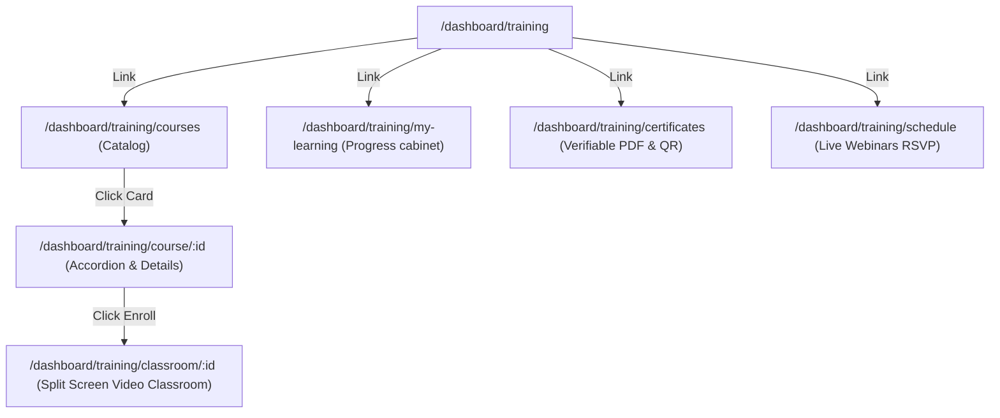

# Training System Architecture

This document maps the Information Architecture and components structure for the SporeKart Learning Experience Platform (LXP).

## Information Architecture (IA)

## Component Boundaries

1. **TrainingDashboard**:
   - Holds study progress counters and maps upcoming webinars.
2. **CourseLibrary**:
   - Integrates search queries and category filter states.
3. **CourseDetails**:
   - Renders accordions with open/close indices.
4. **VideoLearningPage**:
   - Coordinates video playback, notes logging, and toggles completed lesson checkboxes.
5. **CertificatesPage**:
   - Exposes verification modals and PDF downloads.
6. **TrainingSchedulePage**:
   - Holds seats counters in local state, updating registered flag upon RSVP click.
