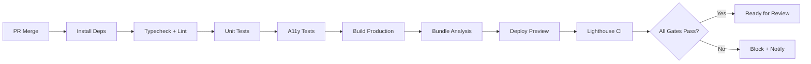

# Live Preview Policy — SporeKart Enterprise Web Application

## 1. Purpose

Define the standards, requirements, and processes for live preview environments used during the design review process. Every preview must be production-quality, accessible, and representative of the final shipped experience.

---

## 2. Preview Environment Requirements

### 2.1 Infrastructure

| Requirement | Specification |
|-------------|---------------|
| **Platform** | Vercel / Netlify / AWS Amplify (configured in CI) |
| **Domain** | `preview-[sprint]-[feature].sporekart.dev` |
| **SSL** | Automatic via platform; HSTS enabled |
| **CDN** | Global edge; cache static assets 1 year; HTML no-cache |
| **Region** | Primary: Mumbai (ap-south-1); Failover: Singapore |

### 2.2 Performance Parity

| Metric | Preview | Production |
|--------|---------|------------|
| **Build** | Production build (`vite build --mode production`) | Same |
| **Minification** | Enabled | Same |
| **Compression** | Brotli + Gzip | Same |
| **Cache Headers** | Static: 1yr; HTML: no-store | Same |
| **Service Worker** | Enabled (offline shell) | Same |

**No Preview-Only Optimizations:** Preview must use the exact same build as production.

---

## 3. Data Strategy

### 3.1 Test Data Requirements

| Data Type | Strategy |
|-----------|----------|
| **Users** | 5 seeded test users (one per persona); no real PII |
| **Products** | 20 seeded products across categories; realistic images |
| **Orders** | 15 orders in various states (pending, shipped, delivered) |
| **Trainings** | 10 sessions; past/upcoming; mixed enrollment |
| **AI Knowledge** | 50 seeded documents; vector index pre-built |
| **Analytics** | Pre-computed metrics; deterministic for testing |

**No Production Data.** Ever. Preview uses isolated test database.

### 3.2 Data Persistence

| Operation | Behavior |
|-----------|----------|
| **Read** | From test DB |
| **Write (Mutation)** | Optimistic UI; written to test DB; visible in same session |
| **Reset** | "Reset Preview Data" button in preview header (dev only) |
| **Isolation** | Each preview deployment = isolated test DB schema |

---

## 4. Preview Deployment Process

### 4.1 Trigger Conditions

| Trigger | Branch | Environment |
|---------|--------|-------------|
| **PR Merge** | `preview/*` | Auto-deploy |
| **Manual** | Any branch | Manual trigger in CI |
| **Scheduled** | `main` (nightly) | Nightly preview |
| **Hotfix** | `hotfix/*` | Manual; expedited |

### 4.2 Deployment Pipeline



### 4.3 Deployment Artifacts

| Artifact | Retention |
|----------|-----------|
| Preview URL | 14 days post-sprint |
| Build Logs | 30 days |
| Bundle Analysis | 30 days |
| Lighthouse Reports | 30 days |
| Bundle Size History | 90 days (trend) |

---

## 5. Preview Quality Standards

### 5.1 Mandatory Checks (Pre-Deploy)

| Check | Tool | Threshold |
|-------|------|-----------|
| TypeScript | `tsc --noEmit` | 0 errors |
| Lint | ESLint + token lint | 0 errors |
| Unit Tests | Vitest | 100% pass |
| A11y Tests | axe-core (JSDOM) | 0 violations |
| Bundle Size | Vite bundle analyzer | Within budget |

### 5.2 Post-Deploy Verification (Automated)

| Check | Tool | Threshold |
|-------|------|-----------|
| LCP | Lighthouse CI | ≤ 2.5s |
| INP | Lighthouse CI | ≤ 200ms |
| CLS | Lighthouse CI | ≤ 0.1 |
| Accessibility | Lighthouse CI + axe | 100 / 0 violations |
| SEO | Lighthouse CI | ≥ 90 |
| Best Practices | Lighthouse CI | ≥ 90 |

**Failure = Preview blocked + Slack alert to team.**

---

## 6. Preview Features

### 6.1 Preview Header (Visible in All Previews)

```
┌─────────────────────────────────────────────────────────────┐
│ 🧪 PREVIEW — Sprint 19 Part 1E — v1.2.3-abc123  [Reset Data] │
├─────────────────────────────────────────────────────────────┤
│ [Feedback]  [Open in Figma]  [View Tokens]  [Copy URL]      │
└─────────────────────────────────────────────────────────────┘
```

| Element | Purpose |
|---------|---------|
| **Environment Badge** | Prevents confusion with production |
| **Version** | Design system version + git SHA |
| **Reset Data** | Clears test DB mutations (dev only) |
| **Feedback** | Opens GitHub Discussion with context |
| **Figma Link** | Deep link to design file |
| **Tokens** | Opens token inspector for current page |
| **Copy URL** | Shares exact preview state |

### 6.2 Feedback Widget

```tsx
<FeedbackWidget
  previewUrl={window.location.href}
  designSystemVersion={DESIGN_SYSTEM_VERSION}
  gitSha={GIT_SHA}
  onSubmit={(feedback) => createGitHubDiscussion(feedback)}
/>
```

Creates GitHub Discussion with:
- Preview URL + timestamp
- User agent + viewport
- Screenshot (optional, via `navigator.mediaDevices`)
- Design system version + git SHA
- Auto-label: `preview-feedback`, `sprint-19`

---

## 7. Stakeholder Access

### 7.1 Access Control

| Role | Access Method | Permissions |
|------|---------------|-------------|
| **Product** | GitHub Team `sporekart-product` | View, Feedback |
| **Design** | GitHub Team `sporekart-design` | View, Feedback, Figma sync |
| **Engineering** | GitHub Team `sporekart-engineering` | View, Feedback, Debug |
| **Support** | GitHub Team `sporekart-support` | View, Feedback |
| **Business** | Magic link (SSO) | View, Feedback |
| **External** | Magic link (expiry: 7 days) | View, Feedback |

### 7.2 Access Request Process
1. Requestor adds user to appropriate GitHub team
2. CI auto-syncs team membership to preview auth (via OIDC)
3. User receives email with preview URL + magic link
4. Access auto-revoked 14 days after sprint end

---

## 8. Preview Lifecycle

| Phase | Duration | Action |
|-------|----------|--------|
| **Active Review** | Sprint duration + 3 days | Stakeholder feedback collected |
| **Post-Sprint** | 14 days | Read-only; feedback archived |
| **Archival** | Day 15 | Preview URL returns 410; data purged |
| **Archive Access** | On request | Snapshot in S3 (read-only, no interactivity) |

---

## 9. Preview-Specific Features

### 9.1 Design Token Inspector
- **Trigger:** Keyboard shortcut `Shift + T` or header button
- **Features:**
  - Search/filter tokens by category
  - Copy CSS var / TS token / Figma token
  - View primitive → semantic → component chain
  - Light/Dark theme toggle

### 9.2 Design System Version Overlay
- Shows `@sporekart/tokens@X.Y.Z` + `@sporekart/ui@X.Y.Z`
- Links to changelog
- Warns if preview version ≠ latest published

### 9.3 Responsive Preview Toolbar
- Breakpoint selector (xs/sm/md/lg/xl/2xl)
- Grid overlay toggle
- Device frame simulation
- Orientation toggle

### 9.4 Accessibility Debug Overlay
- `Shift + A` toggles
- Landmarks highlighted
- Focus order numbers
- Color contrast warnings
- ARIA tree viewer

---

## 10. Monitoring & Alerting

### 10.1 Preview Health Metrics

| Metric | Alert Threshold |
|--------|-----------------|
| Deploy Success Rate | < 95% over 7 days |
| Preview Uptime | < 99.5% |
| Lighthouse Performance | < 90 |
| Lighthouse Accessibility | < 100 |
| Bundle Size Regression | > 10% increase |
| Deploy Duration | > 10 minutes |

### 10.2 Alert Channels
- **Slack:** `#sporekart-preview-alerts`
- **Email:** `preview-alerts@sporekart.com`
- **PagerDuty:** Critical only (uptime < 99%)

---

## 11. Security

### 11.1 Preview Isolation
- Separate AWS account / Vercel project
- No access to production secrets, databases, APIs
- Separate CDN domain (no access to production deployment pipeline)
- Separate Sentry project (preview errors only)

### 11.2 Authentication
- **Primary:** GitHub OIDC via platform (Vercel/Netlify)
- **Fallback:** Magic link (email) for non-GitHub stakeholders
- **Session:** 8 hours; refresh on activity

### 11.3 Data Protection
- No real user data
- No real payment data
- Test emails: `@sporekart.test` domain
- All logs scrubbed of PII

---

## 12. Compliance

| Standard | Preview Compliance |
|----------|-------------------|
| **SOC 2** | Preview isolated from production; auditable deploy logs |
| **GDPR** | No personal data; right to erasure via "Reset Data" |
| **PCI DSS** | No payment processing in preview |
| **ISO 27001** | Separate environment; access controlled |

---

## 13. Exception Handling

| Scenario | Resolution |
|----------|------------|
| Preview deploy fails | Block PR merge; alert team; fix in follow-up PR |
| Lighthouse fails | Block preview; auto-comment on PR with report |
| Preview down > 15 min | PagerDuty alert; on-call investigates |
| Stakeholder can't access | Check GitHub team sync; resend magic link |
| Data corruption | "Reset Preview Data" button; if persists, redeploy |

---

## 14. Version History

| Version | Date | Changes |
|---------|------|---------|
| 1.0 | Sprint 19 Part 1E | Initial policy |

---

**Enforcement:** Any preview not meeting these standards is blocked from stakeholder review. No exceptions.

**Owner:** Enterprise Release Manager
**Review:** Semi-annual