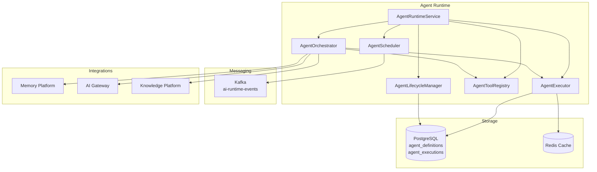
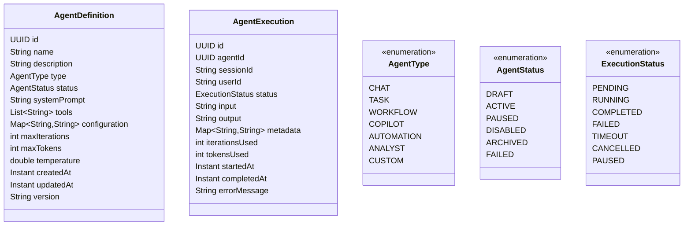

# Agent Runtime

## Overview

The Agent Runtime provides execution infrastructure for AI agents. It supports agent registration, scheduling, execution with tool integration, and full lifecycle management.

## Capabilities

- **Agent Registration** — Define agent types, tools, prompts
- **Execution** — Synchronous and asynchronous execution
- **Scheduling** — Cron-based execution schedules
- **Tool Registry** — Register and invoke tools
- **Orchestration** — Multi-step workflow execution
- **Memory Integration** — Context-aware execution
- **Lifecycle Management** — Activate, pause, archive, delete
- **Monitoring** — Execution metrics and tracing

## Architecture

## API Endpoints

| Method | Path | Description |
|--------|------|-------------|
| POST | `/api/v1/ai/runtime/agents` | Register a new agent |
| GET | `/api/v1/ai/runtime/agents/{id}` | Get agent definition |
| GET | `/api/v1/ai/runtime/agents` | List agents (filterable) |
| PUT | `/api/v1/ai/runtime/agents/{id}` | Update agent |
| DELETE | `/api/v1/ai/runtime/agents/{id}` | Delete agent |
| POST | `/api/v1/ai/runtime/agents/{id}/execute` | Execute agent (async) |
| POST | `/api/v1/ai/runtime/agents/{id}/execute-sync` | Execute agent (sync) |
| GET | `/api/v1/ai/runtime/executions/{id}` | Get execution result |
| GET | `/api/v1/ai/runtime/agents/{id}/executions` | Get execution history |
| POST | `/api/v1/ai/runtime/executions/{id}/cancel` | Cancel execution |
| PUT | `/api/v1/ai/runtime/agents/{id}/status` | Update agent status |
| GET | `/api/v1/ai/runtime/metrics` | Get runtime metrics |
| GET | `/api/v1/ai/runtime/health` | Health check |
| POST | `/api/v1/ai/runtime/schedules` | Create schedule |
| GET | `/api/v1/ai/runtime/schedules/{agentId}` | Get schedule |
| DELETE | `/api/v1/ai/runtime/schedules/{agentId}` | Delete schedule |
| POST | `/api/v1/ai/runtime/schedules/{agentId}/trigger` | Trigger now |

## Domain Model

