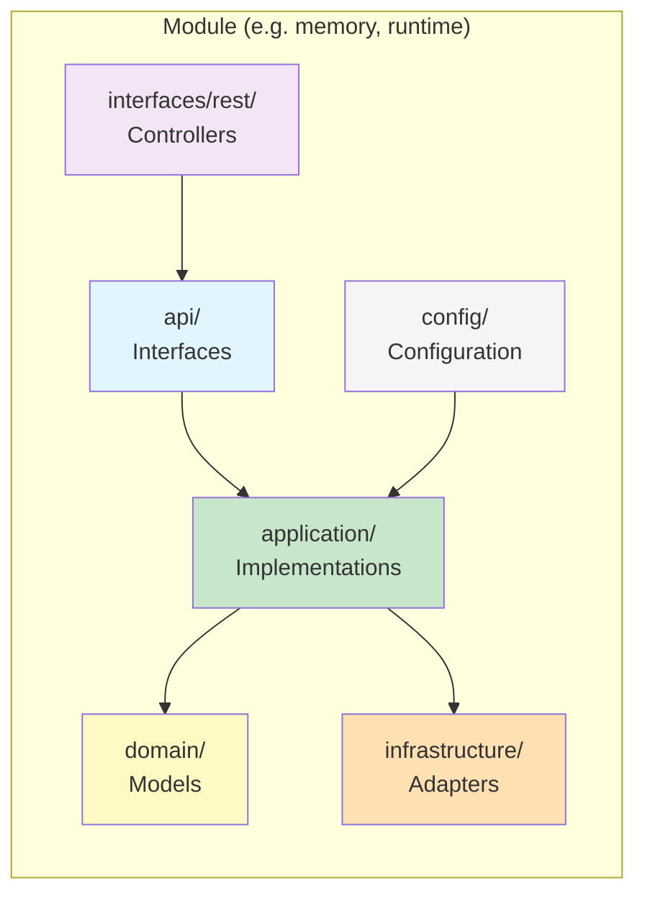
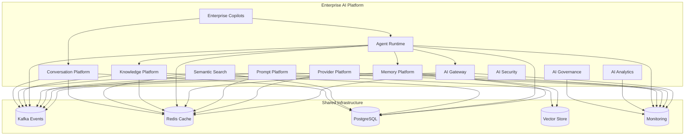
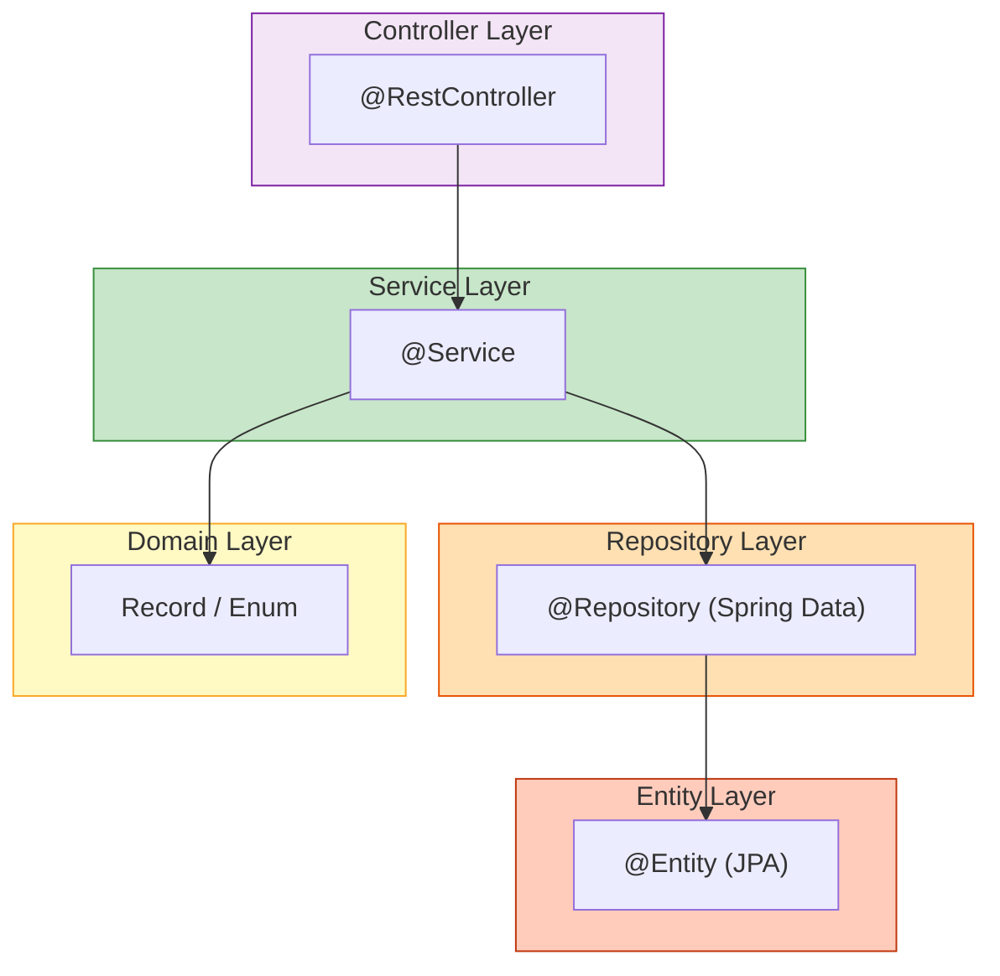

# Enterprise AI Platform Architecture

**Version:** 1.0.0  
**Status:** Foundation  

---

## Module Dependency Diagram

```mermaid
graph TD
    subgraph API_Layer["API Layer (Interfaces)"]
        REST["REST Controllers<br/>(interfaces/rest/)"]
        Internal["Internal APIs<br/>(interfaces/internal/)"]
    end

    subgraph Application_Layer["Application Layer"]
        Services["Application Services<br/>(application/)"]
        Ports["API Ports<br/>(api/)"]
    end

    subgraph Domain_Layer["Domain Layer"]
        Models["Domain Models<br/>(domain/)"]
        Enums["Enums & Records<br/>(domain/)"]
    end

    subgraph Infrastructure_Layer["Infrastructure Layer"]
        Persistence[(PostgreSQL<br/>persistence/)]
        Cache[(Redis<br/>redis/)]
        Events[Kafka<br/>(kafka/)]
        Monitoring[Monitoring<br/>(monitoring/)]
        Vector[(Vector Store<br/>vector/)]
    end

    REST --> Ports
    Internal --> Ports
    Ports --> Services
    Services --> Models
    Services --> Persistence
    Services --> Cache
    Services --> Events
    Services --> Monitoring
    Services --> Vector
    Events --> Domain_Events[(Outbox/Kafka Topics)]
```

---

## Module Architecture (per module)



---

## Enterprise AI Platform



---

## Layer Isolation



---

## Package Naming Convention

```
com.sporekart.ai
├── {module}/
│   ├── api/                     -- Inbound port interfaces
│   ├── application/             -- @Service implementations
│   ├── config/                  -- @ConfigurationProperties
│   ├── domain/                  -- Records, enums (no framework)
│   ├── infrastructure/
│   │   ├── kafka/               -- Kafka publishers
│   │   ├── monitoring/          -- Micrometer metrics
│   │   ├── persistence/         -- @Entity, @Repository
│   │   └── redis/               -- Cache services
│   └── interfaces/
│       └── rest/                -- @RestController
│           └── dto/             -- Request/Response records
├── events/                      -- Domain/Integration events
├── shared/
│   ├── constants/               -- Constants
│   ├── enums/                   -- Shared enums
│   ├── interfaces/              -- Base interfaces
│   └── util/                    -- Utilities
└── config/                      -- Global config
```

---

## Technology Stack

- **Java 21** — Records, sealed classes, pattern matching
- **Spring Boot 3.3.3** — Web, JPA, Security, Actuator, Cache, Validation
- **Spring Modulith 1.2.4** — Module boundary verification
- **Kafka** — Event-driven messaging
- **Redis** — Caching
- **PostgreSQL** — Primary database (H2 for dev/test)
- **Flyway** — Database migrations
- **OpenSearch** — Full-text search (via Vector Store)
- **Micrometer + Prometheus** — Metrics and monitoring
- **SpringDoc OpenAPI** — API documentation
- **ArchUnit** — Architecture validation
