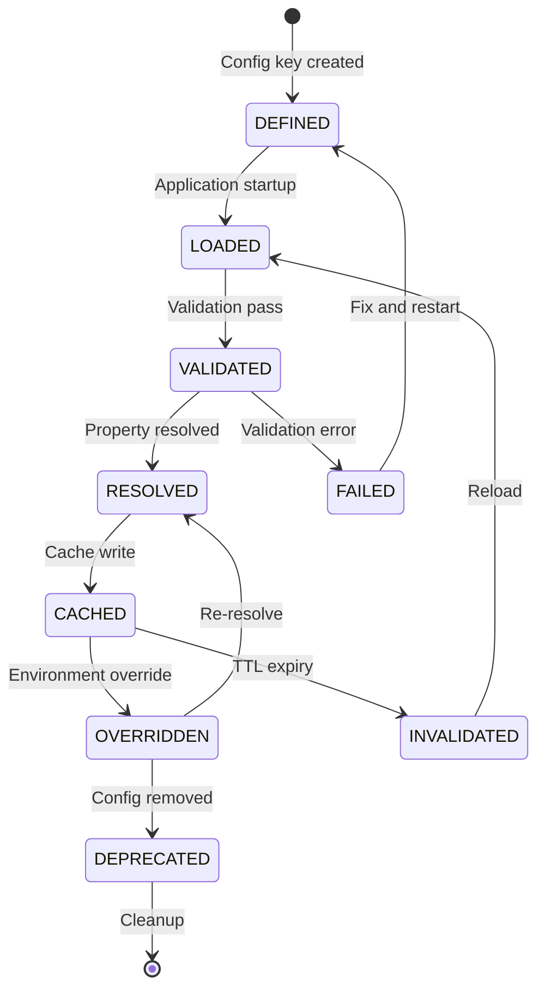
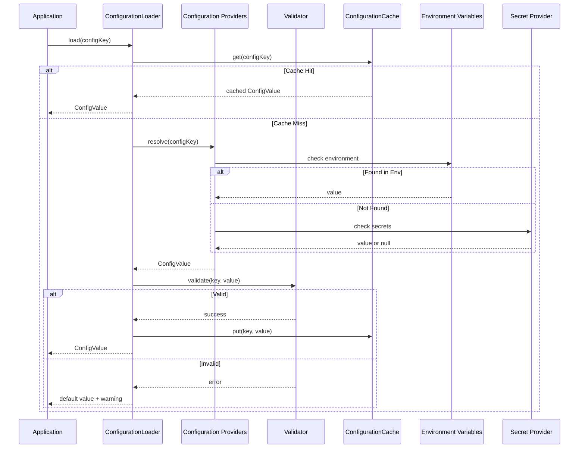
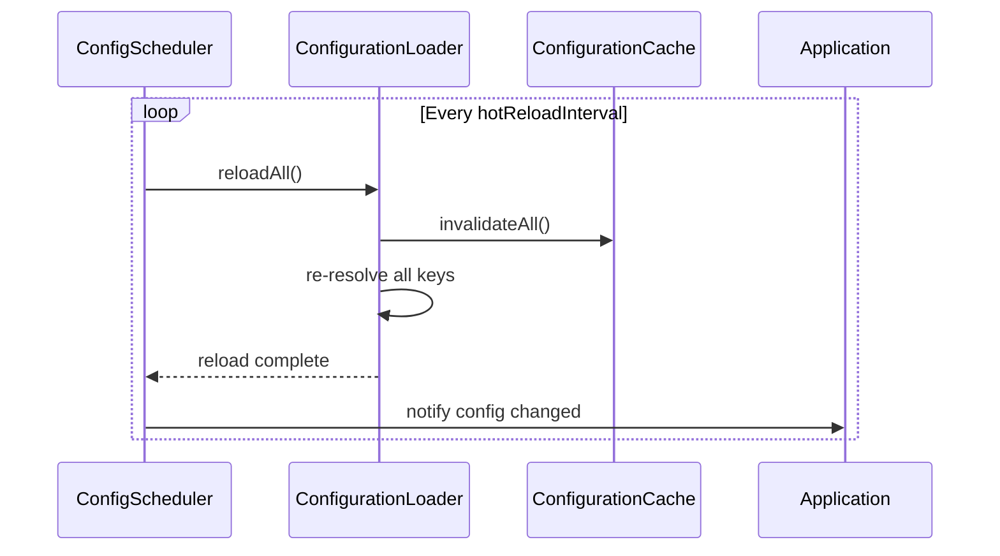

# Configuration Lifecycle

## Lifecycle States

## Resolution Flow

## Hot Reload Flow

## Cache Strategy by Environment

| Environment | Strategy | TTL | Versioning |
|-------------|----------|-----|------------|
| Local | CACHE_ASIDE | 30m | No |
| Dev | CACHE_ASIDE | 10m | No |
| Test | None (disabled) | N/A | N/A |
| Stage | CACHE_ASIDE | 5m | Yes |
| Prod | REFRESH_AHEAD | 2m | Yes |
| Docker | CACHE_ASIDE | 5m | No |
| Cloud | REFRESH_AHEAD | 2m | Yes |
