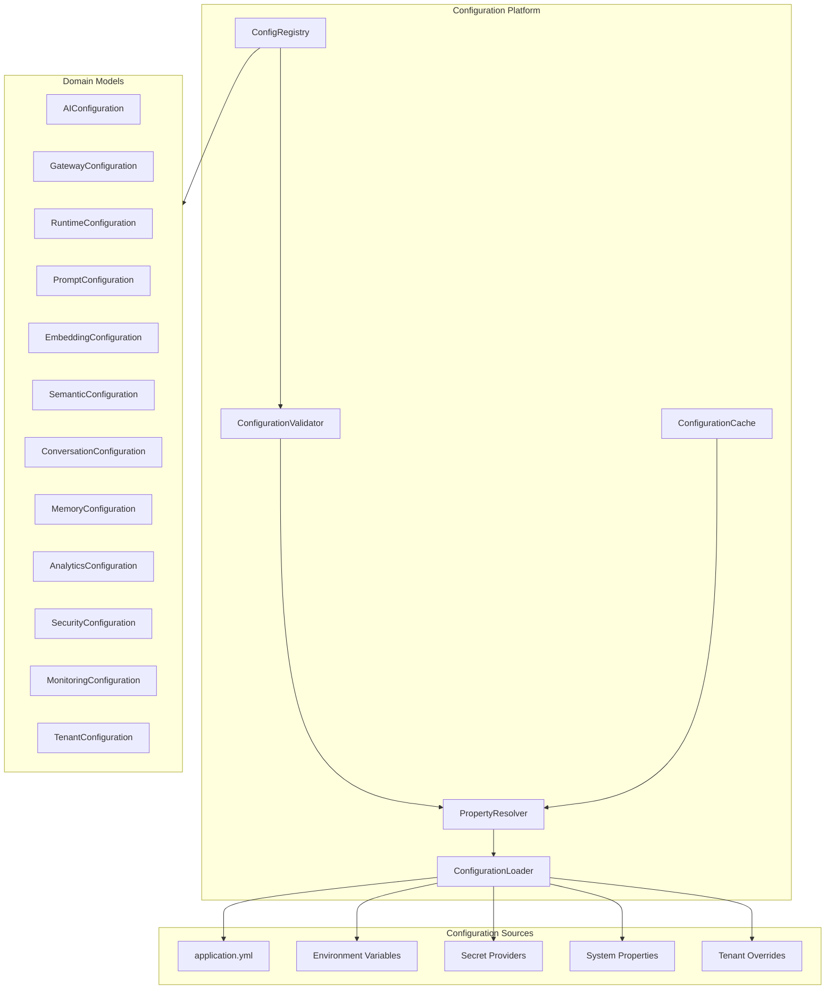
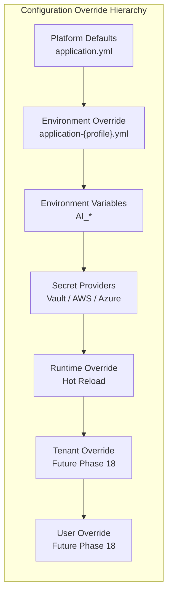

# Enterprise AI Configuration Platform

**Version:** 1.0.0
**Status:** Foundation (Chapter 2)
**Package:** `com.sporekart.ai.configuration`

---

## Overview

The Enterprise AI Configuration Platform is the single source of truth for all AI-related configuration in SporeKart. Every future AI component MUST obtain configuration exclusively through this platform.

---

## Architecture



---

## Configuration Hierarchy



---

## Module Structure

```
configuration/
├── api/                          -- Configuration interfaces
│   ├── ConfigurationLoader.java      -- Load configuration from sources
│   ├── ConfigurationProvider.java    -- Source-specific provider
│   ├── EnvironmentProvider.java      -- Environment detection
│   ├── SecretProvider.java           -- Secret resolution
│   ├── PropertyResolver.java         -- Typed property resolution
│   ├── ConfigurationCache.java       -- Caching abstraction
│   └── ConfigurationValidator.java   -- Validation interface
├── domain/                       -- Domain models (records)
│   ├── AIConfiguration.java          -- Global AI settings
│   ├── ProviderConfiguration.java    -- Per-provider settings
│   ├── GatewayConfiguration.java     -- Gateway settings
│   ├── RuntimeConfiguration.java     -- Runtime settings
│   ├── PromptConfiguration.java      -- Prompt module settings
│   ├── EmbeddingConfiguration.java   -- Embedding settings
│   ├── SemanticConfiguration.java    -- Semantic search settings
│   ├── ConversationConfiguration.java-- Conversation settings
│   ├── MemoryConfiguration.java      -- Memory platform settings
│   ├── AnalyticsConfiguration.java   -- Analytics settings
│   ├── SecurityConfiguration.java    -- Security settings
│   ├── MonitoringConfiguration.java  -- Monitoring settings
│   ├── TenantConfiguration.java      -- Tenant settings
│   ├── ConfigKey.java                -- Typed configuration key
│   ├── ConfigValue.java              -- Typed configuration value
│   ├── ConfigurationSource.java      -- Source enum
│   ├── ConfigurationStatus.java      -- Status enum
│   └── ConfigurationHierarchy.java   -- Hierarchy enum
├── model/
│   ├── provider/                 -- Provider configuration models
│   │   ├── OpenAiConfig.java
│   │   ├── GeminiConfig.java
│   │   ├── ClaudeConfig.java
│   │   ├── AzureOpenAiConfig.java
│   │   ├── BedrockConfig.java
│   │   ├── OllamaConfig.java
│   │   ├── OpenRouterConfig.java
│   │   └── ProviderModelConfig.java
│   ├── feature/                  -- Feature flag models
│   │   ├── FeatureFlag.java
│   │   ├── FeatureFlagRegistry.java
│   │   └── FeatureScope.java
│   ├── environment/              -- Environment models
│   │   ├── Environment.java
│   │   ├── EnvironmentVariable.java
│   │   └── DeploymentProfile.java
│   └── secret/                   -- Secret management models
│       ├── SecretReference.java
│       ├── SecretScope.java
│       └── SecretProviderType.java
├── validation/                   -- Configuration validation
│   ├── ConfigValidationResult.java
│   ├── ConfigValidationError.java
│   ├── ValidationSeverity.java
│   └── ConfigValidator.java
├── config/                       -- Spring Boot @ConfigurationProperties
│   ├── AiConfigurationProperties.java
│   ├── ProviderConfigurationProperties.java
│   ├── FeatureFlagConfigurationProperties.java
│   ├── RuntimeConfigurationProperties.java
│   ├── CacheConfigurationProperties.java
│   ├── ObservabilityConfigurationProperties.java
│   └── ConfigurationPropertiesConfig.java
└── binder/                       -- Property binding
    └── ConfigPropertyBinder.java
```

---

## Configuration Sources (Priority Order)

| Priority | Source | Description |
|----------|--------|-------------|
| 1 | User Override | Per-user configuration (future) |
| 2 | Tenant Override | Per-tenant configuration (future) |
| 3 | Runtime Override | Hot-reloaded configuration |
| 4 | Secret Provider | Vault, AWS, Azure, Env secrets |
| 5 | Environment Variable | `AI_*` environment variables |
| 6 | Profile YAML | `application-{profile}.yml` |
| 7 | Default YAML | `application.yml` |

---

## Provider Configuration Matrix

| Provider | Streaming | Vision | Reasoning | Embeddings | Function Calling |
|----------|-----------|--------|-----------|------------|-----------------|
| OpenAI | ✓ | ✓ | ✓ | ✓ | ✓ |
| Gemini | ✓ | ✓ | ✓ | ✓ | ✓ |
| Claude | ✓ | ✓ | ✓ | ✗ | ✓ |
| Azure OpenAI | ✓ | ✓ | ✓ | ✓ | ✓ |
| AWS Bedrock | ✓ | ✓ | ✓ | ✗ | ✗ |
| Ollama | ✓ | ✓ | ✗ | ✗ | ✗ |
| OpenRouter | ✓ | ✓ | ✓ | ✓ | ✓ |

---

## Environment Profiles

| Profile | Production | Secrets Required | SSL Required | Purpose |
|---------|-----------|-----------------|-------------|---------|
| local | ✗ | ✗ | ✗ | Local development |
| dev | ✗ | ✓ | ✗ | Development server |
| test | ✗ | ✗ | ✗ | Automated testing |
| stage | ✗ | ✓ | ✗ | Pre-production |
| prod | ✓ | ✓ | ✓ | Production |
| docker | ✗ | ✗ | ✗ | Docker Compose |
| cloud | ✓ | ✓ | ✓ | Cloud deployment |

---

## Feature Flags

| Flag | Default | Runtime Mutable | Tenant Override |
|------|---------|----------------|-----------------|
| ai-enabled | true | false | true |
| gateway-enabled | true | false | true |
| prompt-registry-enabled | true | false | true |
| conversation-enabled | true | false | true |
| knowledge-enabled | true | false | true |
| semantic-search-enabled | true | false | true |
| embeddings-enabled | true | false | true |
| copilots-enabled | true | false | true |
| analytics-enabled | true | false | true |
| monitoring-enabled | true | false | true |
| provider-failover-enabled | true | true | true |
| rate-limiter-enabled | true | true | true |
| streaming-enabled | true | true | true |
| image-generation-enabled | true | false | true |
| audio-enabled | true | false | true |
| vision-enabled | true | false | true |
| reasoning-models-enabled | true | false | true |
| memory-enabled | true | false | true |
| runtime-enabled | true | false | true |

---

## Secret Provider Abstraction

| Provider | Status | Use Case |
|----------|--------|----------|
| AWS Secrets Manager | Prepared | Cloud production |
| Azure Key Vault | Prepared | Cloud production |
| Hashicorp Vault | Prepared | Enterprise on-prem |
| Google Secret Manager | Prepared | GCP deployment |
| Docker Secrets | Prepared | Docker Compose |
| Environment Variables | Prepared | Development |

---

## Key Design Decisions

1. **All configuration is immutable** — Records only, no setters
2. **No direct System.getenv()** — Every access goes through the platform
3. **Configuration > Environment > Defaults** — Consistent override chain
4. **Future tenant-ready** — Tenant field in every ConfigValue
5. **Hot-reload ready** — Every configuration supports runtime refresh
6. **Validation at load time** — Invalid config is rejected immediately
7. **Observability built-in** — Every resolution is traceable
