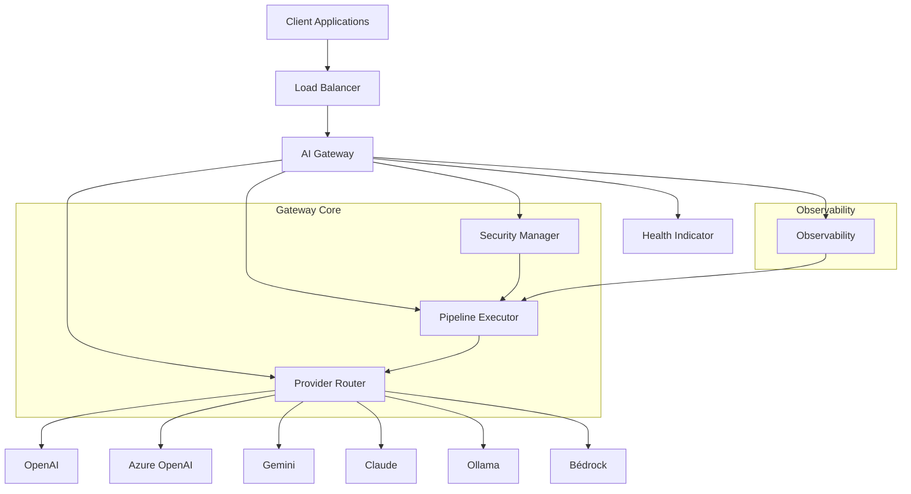
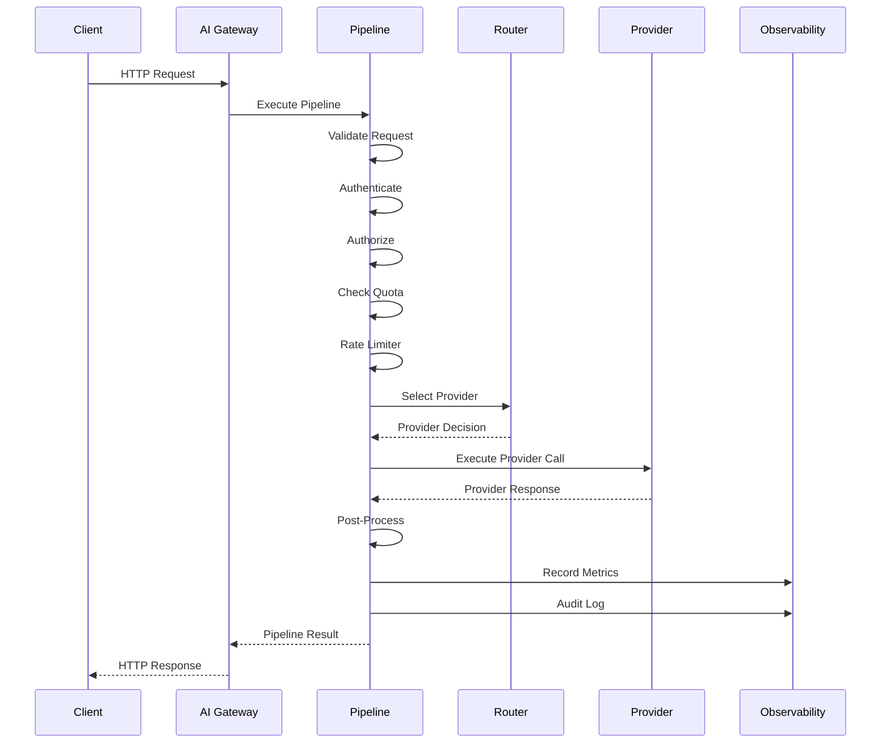
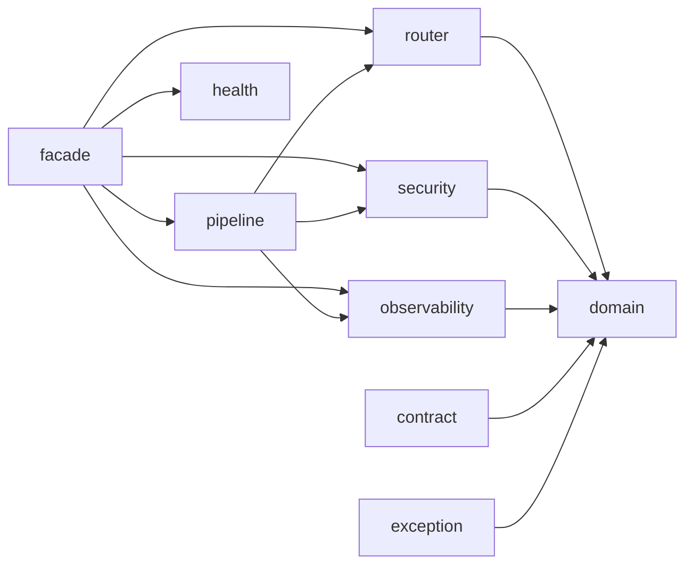

# AI Gateway Architecture

## Overview

The AI Gateway is a middleware layer that sits between AI clients and AI provider APIs. It provides a unified interface for request handling, routing, security, observability, and health management.

## Architecture Diagram



## High-Level Flow



## Component Description

| Component | Responsibility |
|-----------|---------------|
| Pipeline Executor | Orchestrates request through defined stages |
| Provider Router | Resolves which AI provider to use |
| Security Manager | Handles authentication, authorization, tenant isolation |
| Metrics Collector | Records pipeline and provider metrics |
| Tracer | Distributed tracing across pipeline stages |
| Audit Recorder | Captures audit trail for all requests |
| Health Indicator | Monitors gateway and downstream health |
| Gateway Facade | Unified entry point for all gateway operations |

## Directory Structure

```
gateway/
├── pipeline/           # Pipeline framework (stages, interceptors)
├── router/             # Provider routing strategies
├── contract/           # Request/response data contracts
├── security/           # Authentication & authorization hooks
├── exception/          # Exception hierarchy
├── health/             # Health check framework
├── observability/      # Metrics, tracing, logging, audit
├── facade/             # Public API facade
├── config/             # Spring Boot configuration
└── domain/             # Domain models & records
```

## Package Dependencies


