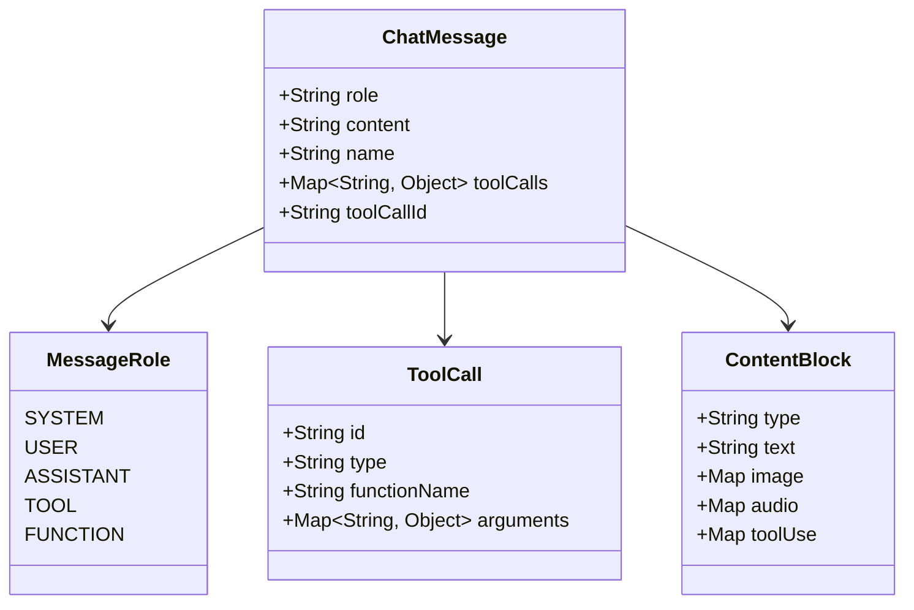

# AI Gateway Contracts

## Request Types

| Request Type | Description |
|-------------|-------------|
| `GatewayRequest` | Generic gateway request wrapper |
| `CompletionRequest` | Text completion request |
| `ChatCompletionRequest` | Multi-turn chat request |
| `StreamingRequest` | Streaming completion request |
| `EmbeddingRequest` | Text embedding request |
| `FunctionCallingRequest` | Function/tool calling request |
| `VisionRequest` | Image analysis request |
| `AudioRequest` | Audio transcription request |
| `FineTuningRequest` | Fine-tuning job request |

## Response Types

| Response Type | Description |
|--------------|-------------|
| `GatewayResponse` | Generic gateway response wrapper |
| `CompletionResponse` | Text completion response |
| `ChatCompletionResponse` | Chat completion response |
| `StreamingResponse` | Streaming chunk response |
| `EmbeddingResponse` | Embedding vector response |
| `FunctionCallingResponse` | Function call result response |
| `VisionResponse` | Image analysis response |
| `AudioResponse` | Audio transcription response |
| `FineTuningResponse` | Fine-tuning status response |
| `ErrorResponse` | Standard error response |

## Message Types



## Contract Relationships

```mermaid
graph TB
    GR[GatewayRequest] --> CR[CompletionRequest]
    GR --> CCR[ChatCompletionRequest]
    GR --> SR[StreamingRequest]
    GR --> ER[EmbeddingRequest]
    GR --> FCR[FunctionCallingRequest]
    GR --> VR[VisionRequest]
    GR --> AR[AudioRequest]
    GR --> FTR[FineTuningRequest]
    GRS[GatewayResponse] --> CMR[CompletionResponse]
    GRS --> CC[ChatCompletionResponse]
    GRS --> STR[StreamingResponse]
    GRS --> EMR[EmbeddingResponse]
    GRS --> FC[FunctionCallingResponse]
    GRS --> VSR[VisionResponse]
    GRS --> ATR[AudioResponse]
    GRS --> FT[FineTuningResponse]
    GRS --> ERR[ErrorResponse]
```



## Standard Response Envelope

All gateway responses follow a consistent envelope:

```json
{
  "responseId": "uuid",
  "requestId": "uuid",
  "success": true,
  "provider": "openai",
  "model": "gpt-4",
  "generatedText": ["..."],
  "data": {},
  "errorCode": null,
  "errorMessage": null,
  "statusCode": 200,
  "metadata": {},
  "timestamp": "2026-01-01T00:00:00Z"
}
```
