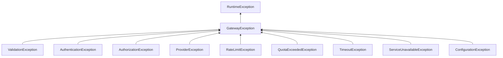
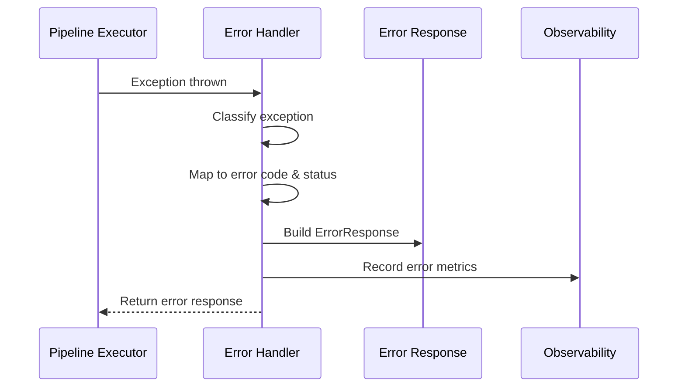

# AI Gateway Error Handling

## Exception Hierarchy



## Exception Details

| Exception | HTTP Status | Error Code | Description |
|-----------|-------------|------------|-------------|
| `ValidationException` | 400 | VALIDATION_ERROR | Invalid request structure |
| `AuthenticationException` | 401 | AUTHENTICATION_FAILED | Missing/invalid credentials |
| `AuthorizationException` | 403 | FORBIDDEN | Insufficient permissions |
| `RateLimitException` | 429 | RATE_LIMITED | Rate limit exceeded |
| `QuotaExceededException` | 429 | QUOTA_EXCEEDED | Resource quota exceeded |
| `ProviderException` | 502 | PROVIDER_ERROR | Upstream provider failure |
| `TimeoutException` | 504 | TIMEOUT | Request timed out |
| `ServiceUnavailableException` | 503 | SERVICE_UNAVAILABLE | Service temporarily down |
| `ConfigurationException` | 500 | CONFIGURATION_ERROR | Misconfiguration |

## Error Response Format

```json
{
  "errorCode": "VALIDATION_ERROR",
  "message": "Request validation failed",
  "statusCode": 400,
  "details": "...",
  "errors": ["field 'model' is required"],
  "requestId": "uuid",
  "timestamp": "2026-01-01T00:00:00Z",
  "additionalInfo": {}
}
```

## Error Handling Flow



## Error Codes

| Code | Meaning | Retryable |
|------|---------|-----------|
| VALIDATION_ERROR | Invalid request | No |
| AUTHENTICATION_FAILED | Auth failure | No |
| FORBIDDEN | Access denied | No |
| RATE_LIMITED | Rate limit hit | Yes |
| QUOTA_EXCEEDED | Quota exhausted | No |
| PROVIDER_ERROR | Provider failure | Maybe |
| TIMEOUT | Request timeout | Yes |
| SERVICE_UNAVAILABLE | Service down | Yes |
| CONFIGURATION_ERROR | Bad config | No |
