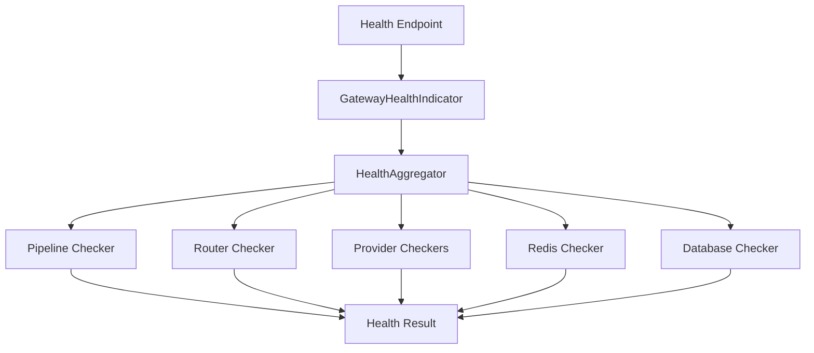
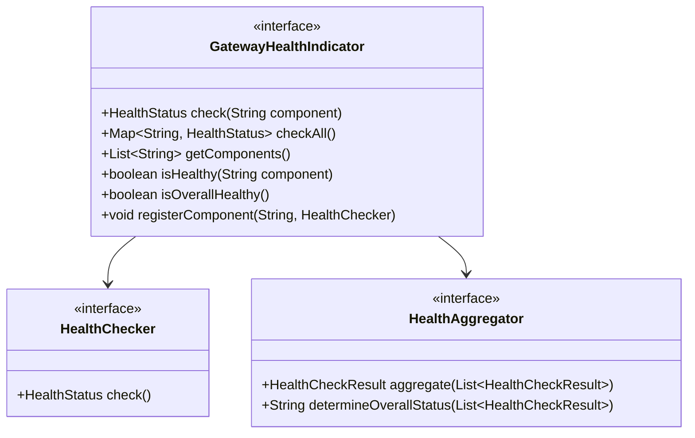

# AI Gateway Health

## Health Architecture



## Health Check Interface



## Health Status Levels

| Status | Description |
|--------|-------------|
| UP | Component is fully operational |
| DEGRADED | Component is operational but degraded |
| DOWN | Component is not operational |

## Health Check Components

| Component | Checker | Description |
|-----------|---------|-------------|
| pipeline | Pipeline Checker | Pipeline executor health |
| router | Router Checker | Provider router health |
| provider:* | Provider Checkers | Each provider's health |
| redis | Redis Checker | Cache connectivity |
| database | Database Checker | Database connectivity |

## Response Format

```json
{
  "status": "UP",
  "details": {
    "pipeline": {
      "status": "UP",
      "lastChecked": "2026-01-01T00:00:00Z",
      "responseTime": "5ms"
    },
    "router": {
      "status": "UP",
      "lastChecked": "2026-01-01T00:00:00Z",
      "responseTime": "2ms"
    },
    "provider:openai": {
      "status": "DEGRADED",
      "lastChecked": "2026-01-01T00:00:00Z",
      "responseTime": "1500ms"
    }
  },
  "timestamp": "2026-01-01T00:00:00Z"
}
```
