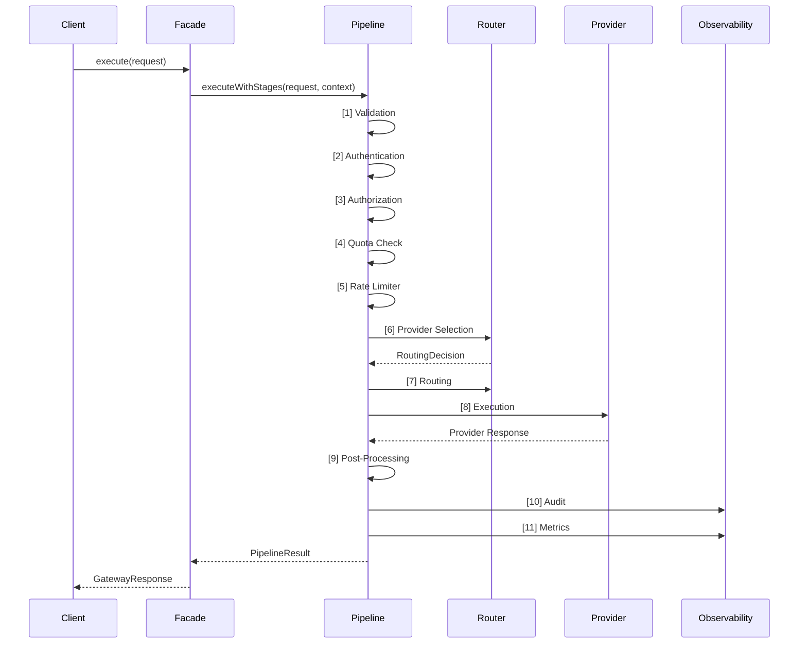
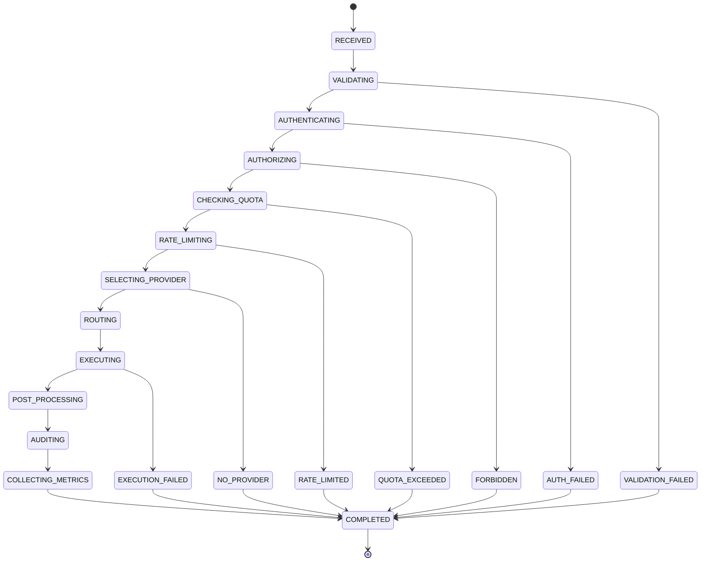

# AI Gateway Request Lifecycle

## Complete Request Flow

```mermaid
sequenceDiagram
    participant C as Client
    participant F as Facade
    participant PL as Pipeline
    participant RT as Router
    participant PR as Provider
    participant OBS as Observability

    C->>F: execute(request)
    F->>PL: executeWithStages(request, context)
    PL->>PL: [1] Validation
    PL->>PL: [2] Authentication
    PL->>PL: [3] Authorization
    PL->>PL: [4] Quota Check
    PL->>PL: [5] Rate Limiter
    PL->>RT: [6] Provider Selection
    RT-->>PL: RoutingDecision
    PL->>RT: [7] Routing
    PL->>PR: [8] Execution
    PR-->>PL: Provider Response
    PL->>PL: [9] Post-Processing
    PL->>OBS: [10] Audit
    PL->>OBS: [11] Metrics
    PL-->>F: PipelineResult
    F-->>C: GatewayResponse
```

## Lifecycle States

```mermaid
stateDiagram-v2
    [*] --> RECEIVED
    RECEIVED --> VALIDATING
    VALIDATING --> AUTHENTICATING
    VALIDATING --> VALIDATION_FAILED
    AUTHENTICATING --> AUTHORIZING
    AUTHENTICATING --> AUTH_FAILED
    AUTHORIZING --> CHECKING_QUOTA
    AUTHORIZING --> FORBIDDEN
    CHECKING_QUOTA --> RATE_LIMITING
    CHECKING_QUOTA --> QUOTA_EXCEEDED
    RATE_LIMITING --> SELECTING_PROVIDER
    RATE_LIMITING --> RATE_LIMITED
    SELECTING_PROVIDER --> ROUTING
    SELECTING_PROVIDER --> NO_PROVIDER
    ROUTING --> EXECUTING
    EXECUTING --> POST_PROCESSING
    EXECUTING --> EXECUTION_FAILED
    POST_PROCESSING --> AUDITING
    AUDITING --> COLLECTING_METRICS
    COLLECTING_METRICS --> COMPLETED
    VALIDATION_FAILED --> COMPLETED
    AUTH_FAILED --> COMPLETED
    FORBIDDEN --> COMPLETED
    QUOTA_EXCEEDED --> COMPLETED
    RATE_LIMITED --> COMPLETED
    NO_PROVIDER --> COMPLETED
    EXECUTION_FAILED --> COMPLETED
    COMPLETED --> [*]
```

## Timing Breakdown

```mermaid
gantt
    title Request Lifecycle Timing
    dateFormat  X
    axisFormat %s
    section Processing
    Validation           : 0, 2
    Authentication       : 2, 2
    Authorization        : 4, 1
    Quota Check          : 5, 1
    Rate Limiter         : 6, 1
    Provider Selection   : 7, 2
    Routing              : 9, 1
    Execution            : 10, 50
    Post-Processing      : 60, 5
    Audit                : 65, 2
    Metrics              : 67, 1
```
