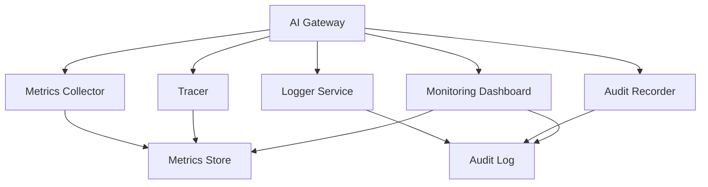
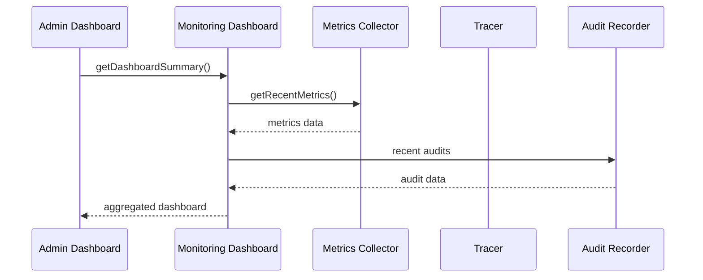

# AI Gateway Observability

## Observability Components

## Metrics Collector

| Method | Description |
|--------|-------------|
| `record(PipelineContext)` | Record pipeline execution metrics |
| `record(GatewayMetrics)` | Record custom metrics |
| `recordLatency(operation, durationMs)` | Record operation latency |
| `recordCount(metric, count)` | Record counter metric |
| `recordError(errorCode, provider)` | Record error occurrence |

## Tracer

| Method | Description |
|--------|-------------|
| `startSpan(operationName, context)` | Start a new trace span |
| `endSpan(spanId)` | End a span successfully |
| `endSpanWithError(spanId, error)` | End a span with error |
| `addEvent(spanId, eventName, attributes)` | Add span event |
| `setAttribute(spanId, key, value)` | Set span attribute |

## Audit Recorder

| Method | Description |
|--------|-------------|
| `record(context, action)` | Record audit entry from pipeline |
| `record(userId, tenantId, action, details)` | Record structured audit entry |
| `recordSecurityEvent(userId, tenantId, event, success, reason)` | Record security event |
| `recordProviderCall(providerId, model, durationMs, success)` | Record provider call audit |

## Logger Service

| Method | Description |
|--------|-------------|
| `logRequest(context)` | Log incoming request |
| `logResponse(context)` | Log outgoing response |
| `logError(context, error)` | Log error details |
| `logSecurityEvent(context, eventType)` | Log security event |
| `logAudit(context, action)` | Log audit trail entry |

## Monitoring Dashboard

## Metrics Collected

| Metric | Type | Description |
|--------|------|-------------|
| `gateway.requests.total` | Counter | Total request count |
| `gateway.requests.success` | Counter | Successful request count |
| `gateway.requests.error` | Counter | Error request count |
| `gateway.latency.pipeline` | Histogram | Pipeline execution latency |
| `gateway.latency.provider` | Histogram | Provider call latency |
| `gateway.tokens.input` | Counter | Input token count |
| `gateway.tokens.output` | Counter | Output token count |
| `gateway.active.requests` | Gauge | Currently active requests |
