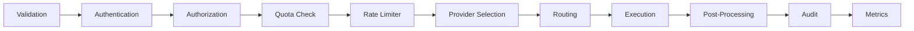
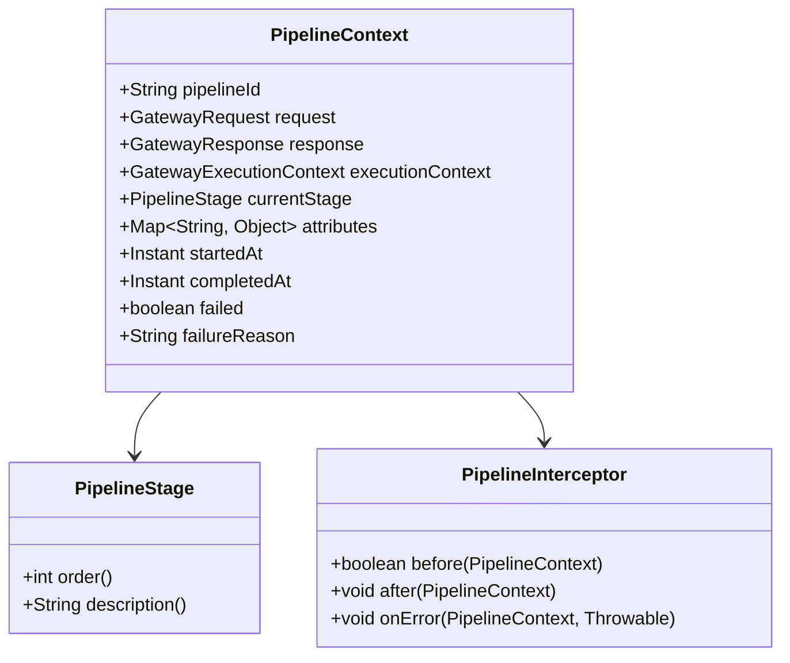
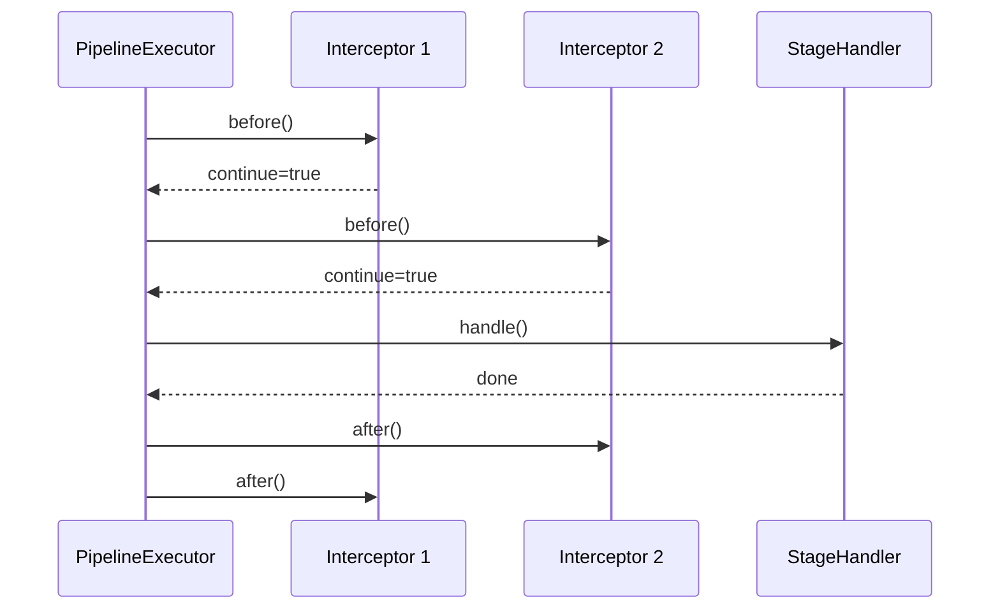
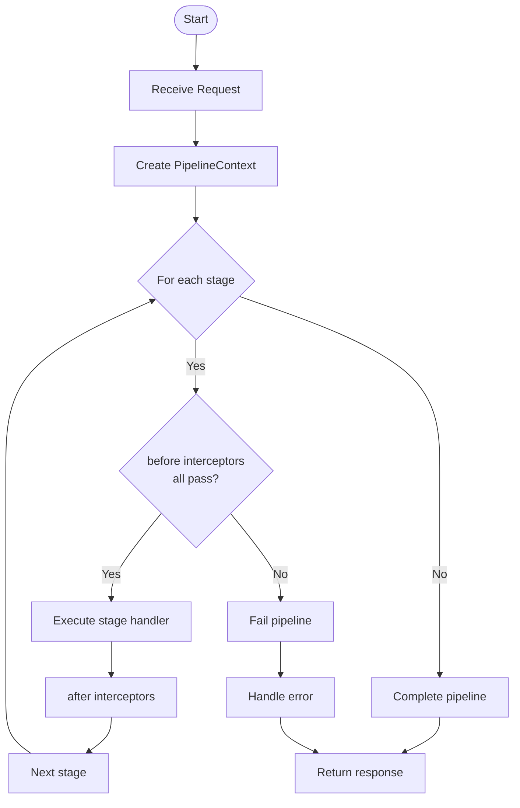

# AI Gateway Pipeline

## Pipeline Stages

The pipeline consists of 11 ordered stages that process each request.

## Stage Details

| Stage | Order | Responsibility |
|-------|-------|----------------|
| VALIDATION | 1 | Validate request structure and required fields |
| AUTHENTICATION | 2 | Verify client identity |
| AUTHORIZATION | 3 | Check access permissions |
| QUOTA_CHECK | 4 | Verify token/resource quota |
| RATE_LIMITER | 5 | Enforce rate limits |
| PROVIDER_SELECTION | 6 | Select target AI provider |
| ROUTING | 7 | Route request to provider |
| EXECUTION | 8 | Execute provider API call |
| POST_PROCESSING | 9 | Transform/normalize response |
| AUDIT | 10 | Record audit trail |
| METRICS | 11 | Collect performance metrics |

## Pipeline Context

Each request creates a `PipelineContext` that flows through all stages:

## Stage Handlers

Each stage has a dedicated handler class:

- `ValidationStage` - Validates request
- `AuthenticationStage` - Verifies identity
- `AuthorizationStage` - Checks permissions
- `QuotaStage` - Verifies quota
- `RateLimiterStage` - Enforces rate limits
- `ProviderSelectionStage` - Selects provider
- `RoutingStage` - Routes to provider
- `ExecutionStage` - Executes provider call
- `PostProcessingStage` - Processes response
- `AuditStage` - Records audit
- `MetricsStage` - Collects metrics

## Interceptor Chain

## Execution Flow

