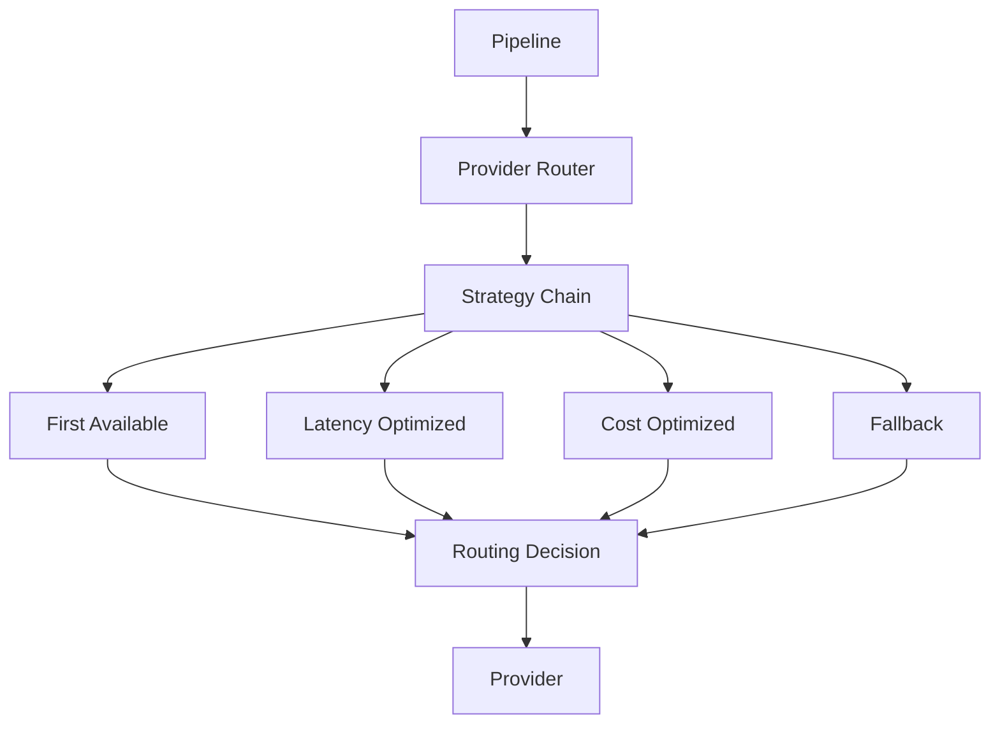
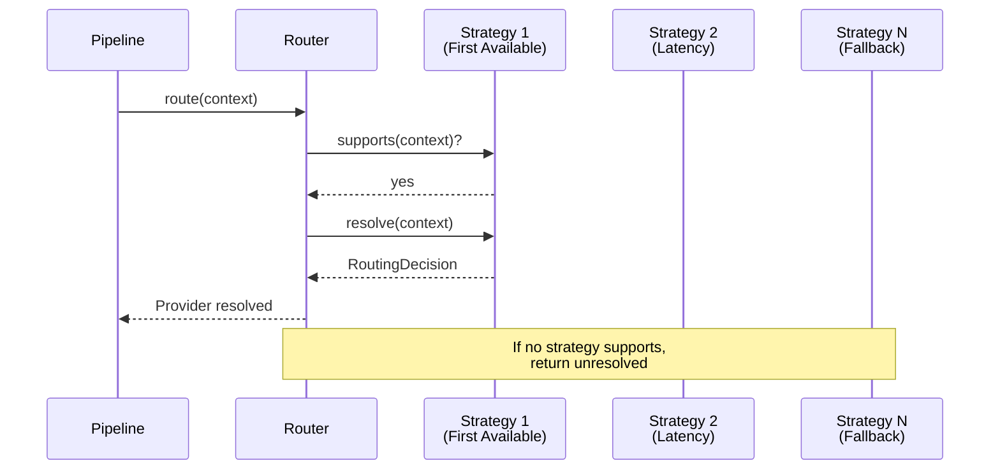
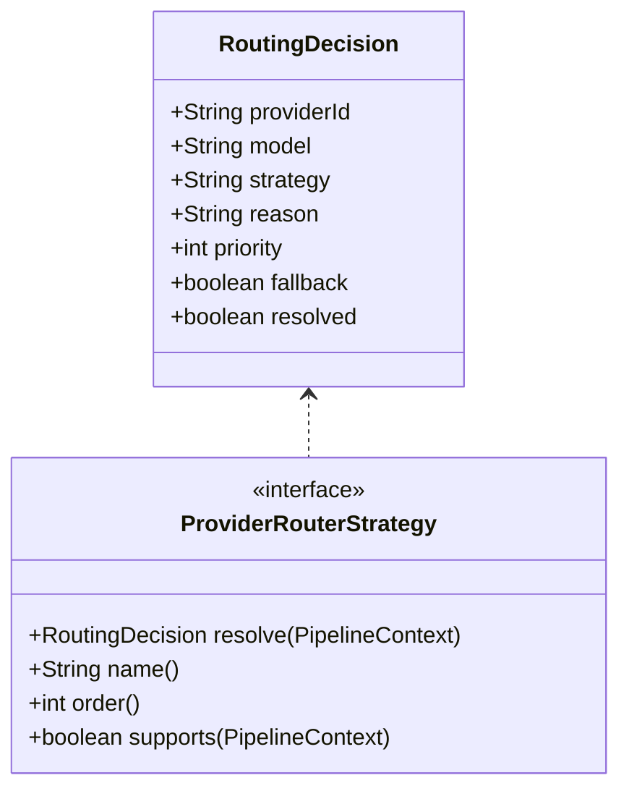

# AI Gateway Routing

## Provider Router Overview

The Provider Router selects which AI provider handles each request based on configurable strategies.

## Routing Strategies

| Strategy | Order | Description |
|----------|-------|-------------|
| First Available | 1 | Use the first provider that matches |
| Latency Optimized | 2 | Route to lowest-latency provider |
| Cost Optimized | 3 | Route to cheapest provider |
| Fallback | 10 | Try fallback providers on failure |

## Strategy Chain

## Routing Decision

## Provider Selection Criteria

- Model availability
- Region proximity
- Cost constraints
- Capability requirements (streaming, vision, audio)
- Tenant-specific routing rules
- Current provider health status
