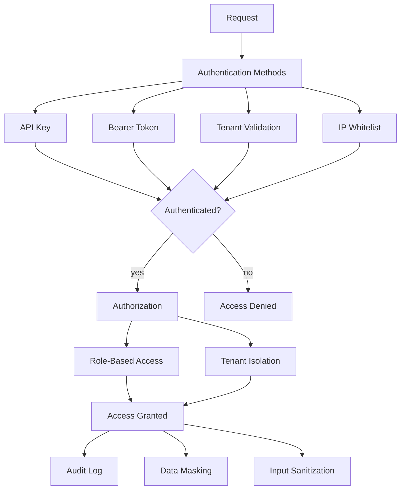
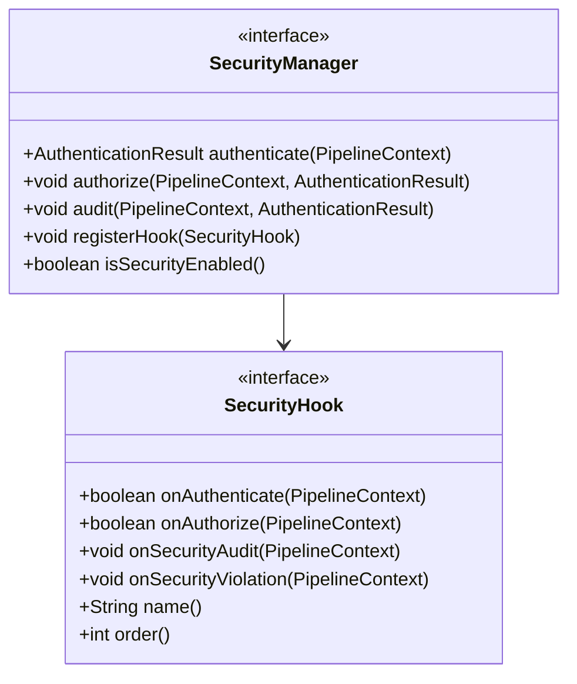
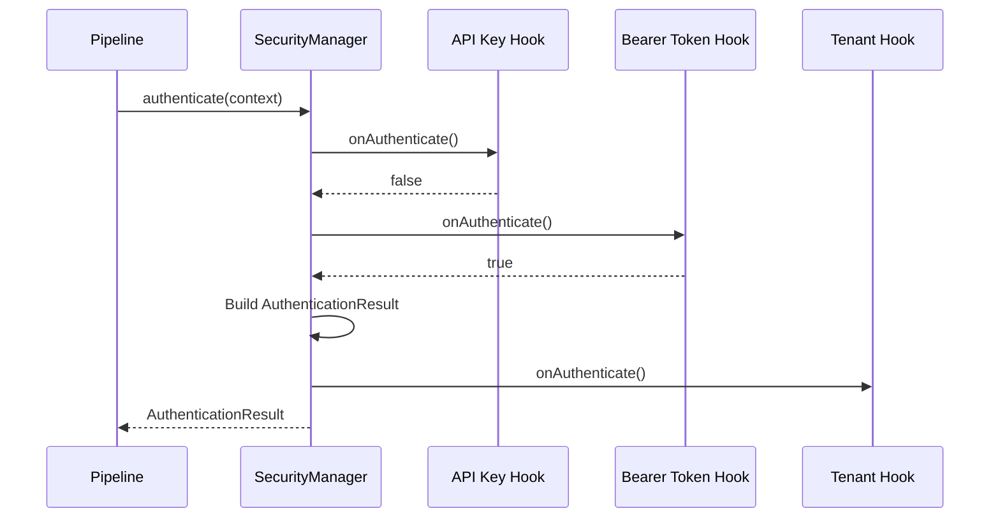
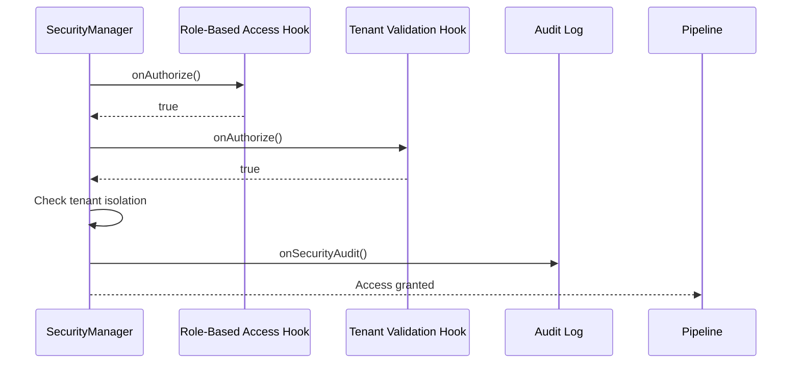

# AI Gateway Security

## Security Architecture

## Security Hooks

| Hook | Order | Purpose |
|------|-------|---------|
| ApiKeyAuthHook | 1 | API key-based authentication |
| BearerTokenHook | 2 | JWT/bearer token authentication |
| TenantValidationHook | 3 | Multi-tenant isolation |
| RoleBasedAccessHook | 4 | RBAC enforcement |
| IpWhitelistHook | 5 | IP-based access control |
| RateLimitSecurityHook | 6 | Security rate limiting |
| AuditLogHook | 7 | Security audit logging |
| DataMaskingHook | 8 | PII data masking |
| InputSanitizationHook | 9 | Input validation & sanitization |

## Security Hook Interface

## Authentication Flow

## Authorization Flow

