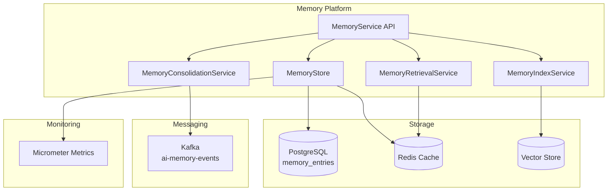
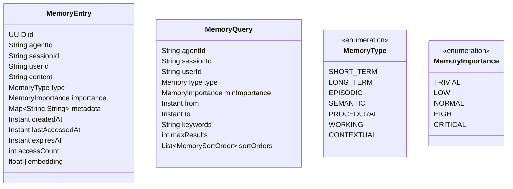

# Memory Platform

## Overview

The Memory Platform provides persistent, retrievable memory for AI agents and conversations. It supports multiple memory types with configurable consolidation policies and vector-based semantic retrieval.

## Capabilities

- **Short-term memory** — Session-scoped, ephemeral
- **Long-term memory** — Persistent across sessions
- **Episodic memory** — Event/experience-based
- **Semantic memory** — Fact/knowledge-based
- **Procedural memory** — How-to/process-based
- **Contextual memory** — Context-aware retrieval
- **Vector indexing** — Semantic similarity search
- **Consolidation** — TTL-based pruning and archiving
- **Importance scoring** — Prioritize critical memories

## Architecture

## API Endpoints

| Method | Path | Description |
|--------|------|-------------|
| POST | `/api/v1/ai/memory` | Store a memory entry |
| GET | `/api/v1/ai/memory/{id}` | Retrieve a memory entry |
| POST | `/api/v1/ai/memory/search` | Search memories |
| PUT | `/api/v1/ai/memory/{id}` | Update a memory entry |
| DELETE | `/api/v1/ai/memory/{id}` | Delete a memory entry |
| DELETE | `/api/v1/ai/memory/session/{sessionId}` | Delete by session |
| DELETE | `/api/v1/ai/memory/agent/{agentId}` | Delete by agent |
| GET | `/api/v1/ai/memory/stats` | Get memory statistics |
| GET | `/api/v1/ai/memory/summaries` | Get memory summaries |
| POST | `/api/v1/ai/memory/consolidate` | Trigger consolidation |
| POST | `/api/v1/ai/memory/prune` | Trigger pruning |

## Domain Model

