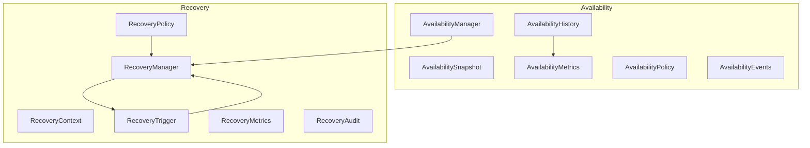
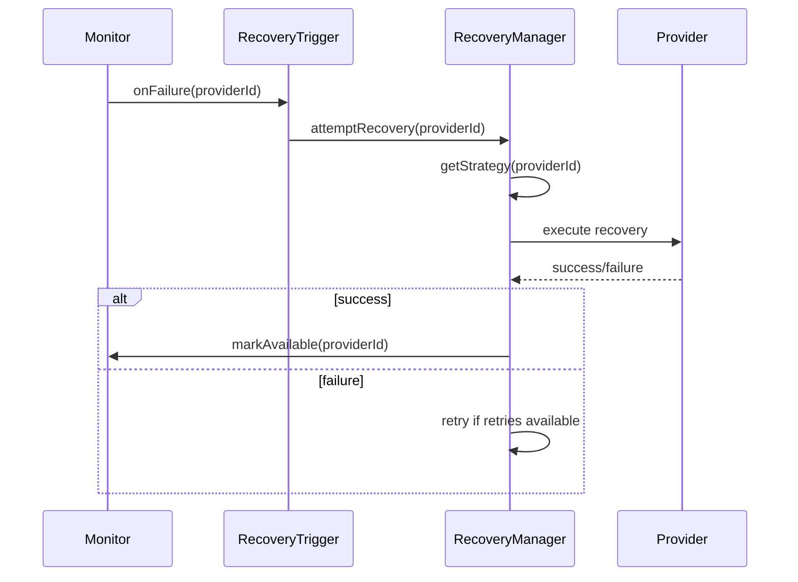

# Enterprise AI Provider Availability & Recovery

## Overview

The Availability and Recovery frameworks ensure providers maintain service levels and can recover automatically from failures.

## Availability Architecture

## Recovery Flow

## Recovery Strategies

| Strategy | Description |
|----------|-------------|
| AUTOMATIC | System-initiated recovery |
| MANUAL | Human-initiated recovery |
| SCHEDULED | Time-based recovery |
| GRACEFUL | Controlled recovery with drain |
| EMERGENCY | Immediate forced recovery |

## SLA Management

- Track availability percentage per provider
- Calculate uptime/downtime windows
- Monitor SLA compliance
- Alert on SLA violations
