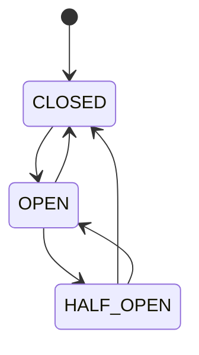
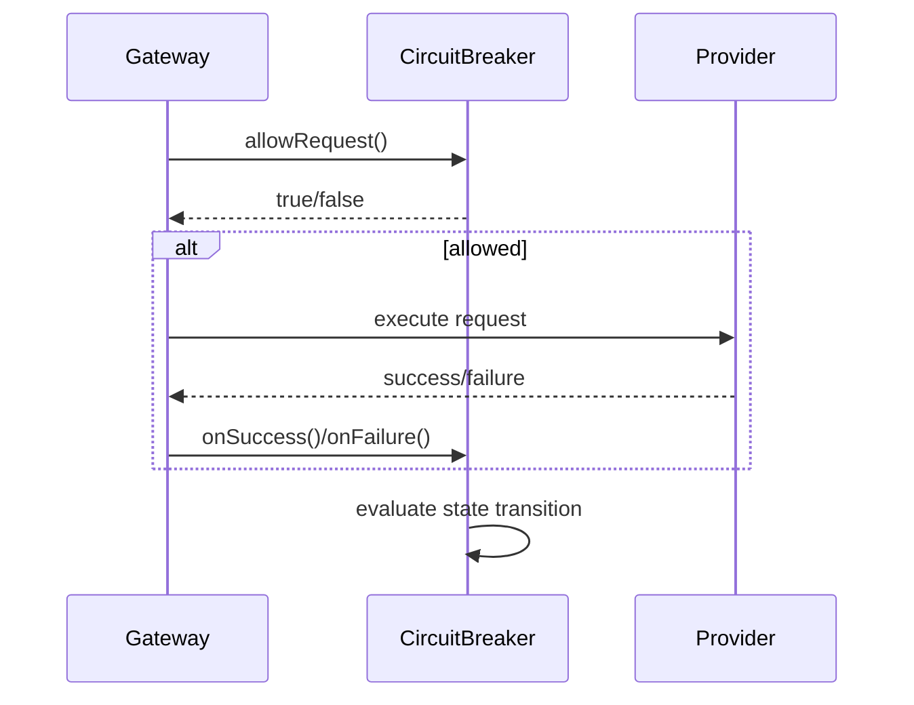

# Enterprise AI Provider Circuit Breaker

## Overview

The Circuit Breaker framework provides automatic failure isolation and recovery for AI providers, preventing cascading failures across the platform.

## Circuit Breaker States

## Circuit Breaker Flow

## State Transitions

| From | To | Condition |
|------|----|-----------|
| CLOSED | OPEN | Failure threshold exceeded |
| OPEN | HALF_OPEN | Timeout elapsed + cooldown |
| HALF_OPEN | CLOSED | Success threshold reached |
| HALF_OPEN | OPEN | Single failure during half-open |

## Configuration

| Parameter | Description |
|-----------|-------------|
| failureThreshold | Failures before opening circuit |
| successThreshold | Successes before closing circuit |
| timeout | Duration before attempting reset |
| halfOpenMaxDuration | Max time in half-open state |
| halfOpenMaxCalls | Max calls during half-open |
| automaticReset | Enable auto reset |
| cooldownPeriod | Cooldown between retries |
