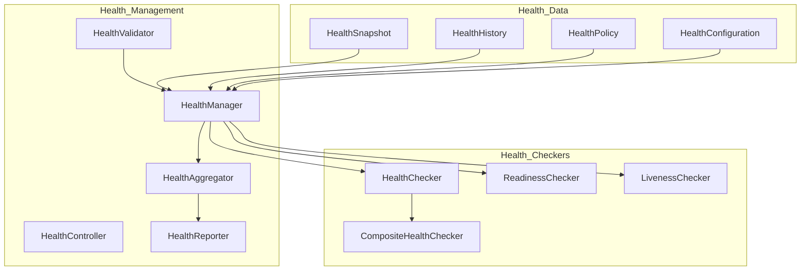
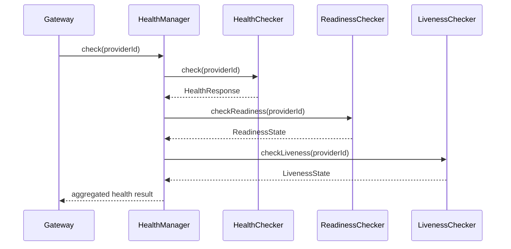

# Enterprise AI Provider Health Management

## Overview

The Health Management platform provides comprehensive health monitoring for every AI provider, including readiness, liveness, diagnostics, and health aggregation.

## Health Architecture

## Health Check Flow

## Health Model

Every provider exposes:

| Metric | Description |
|--------|-------------|
| Overall Health | Composite health status |
| Readiness | Provider ready to serve |
| Liveness | Provider process alive |
| Availability | Provider accessible |
| Latency | Response time |
| Failure Count | Total failures |
| Success Count | Total successes |
| Timeout Count | Total timeouts |
| Recovery Count | Total recoveries |
| Circuit Status | Circuit breaker state |
| Heartbeat Status | Heartbeat state |
| Maintenance Status | Maintenance mode |
| Resource Status | Resource utilization |
