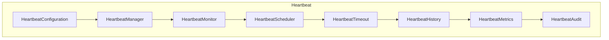
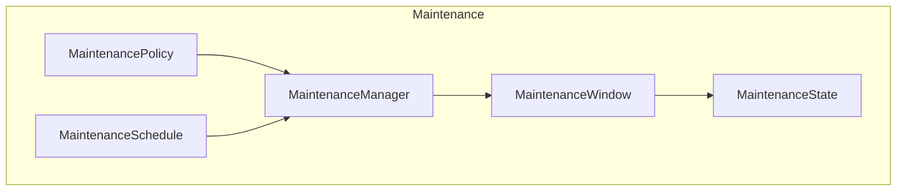

# Enterprise AI Provider Heartbeat & Maintenance

## Overview

The Heartbeat framework monitors provider liveness through periodic signals. The Maintenance framework manages planned downtime for provider updates.

## Heartbeat Architecture

## Maintenance Architecture

## Heartbeat States

| State | Description |
|-------|-------------|
| ALIVE | Heartbeat received within threshold |
| DEAD | Heartbeat not received |
| UNKNOWN | Initial state |
| EXPIRED | Heartbeat expired |
| PAUSED | Monitoring paused |

## Maintenance States

| State | Description |
|-------|-------------|
| SCHEDULED | Maintenance planned |
| ACTIVE | Maintenance in progress |
| COMPLETED | Maintenance finished |
| CANCELLED | Maintenance cancelled |
| OVERDUE | Maintenance past scheduled end |
