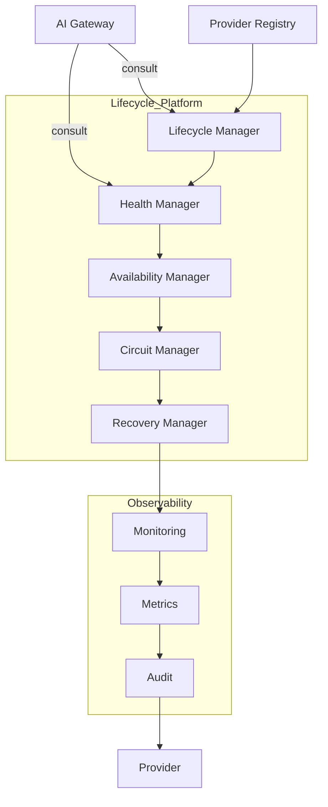
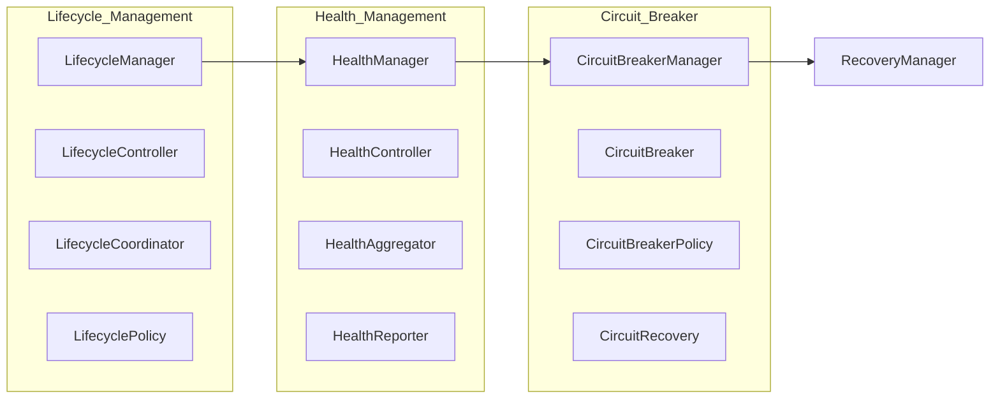

# Enterprise AI Provider Lifecycle & Health Architecture

## Overview

The Lifecycle & Health Management Platform governs the operational lifecycle of every AI provider through standardized lifecycle management, health monitoring, availability tracking, circuit breaker architecture, and recovery orchestration.

## Architecture Diagram

## Component Architecture

## Key Design Principles

- Gateway consults Health Platform — never determines health itself
- Every provider exposes lifecycle, health, readiness, liveness, availability
- Standardized state machine governs all transitions
- Circuit breaker provides automatic failure isolation
- Recovery orchestration supports automatic/manual/scheduled recovery
- Full observability via metrics, audit, and monitoring
