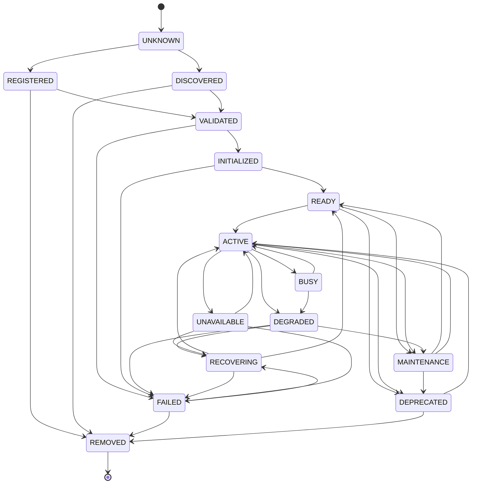

# Enterprise AI Provider Lifecycle State Machine

## State Machine Diagram

## State Descriptions

| State | Description |
|-------|-------------|
| UNKNOWN | Initial state before registration |
| REGISTERED | Provider registered in registry |
| DISCOVERED | Provider auto-discovered |
| VALIDATED | Provider metadata validated |
| INITIALIZED | Provider initialized |
| READY | Provider ready for activation |
| ACTIVE | Provider actively serving |
| BUSY | Provider at capacity |
| DEGRADED | Provider experiencing issues |
| RECOVERING | Provider in recovery process |
| MAINTENANCE | Provider in maintenance mode |
| UNAVAILABLE | Provider unavailable |
| FAILED | Provider in failure state |
| DEPRECATED | Provider marked for removal |
| REMOVED | Provider permanently removed |

## Transition Rules

- All transitions validated by LifecyclePolicy
- Some transitions require approval
- Failed transitions are recorded in LifecycleHistory
- Automatic transitions follow configured policies
