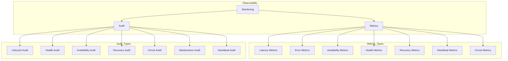

# Enterprise AI Provider Observability

## Overview

Observability provides comprehensive visibility into provider operations through metrics, auditing, and monitoring.

## Observability Architecture

## Metrics Model

| Metric | Description |
|--------|-------------|
| Average Latency | Mean response time |
| P95 Latency | 95th percentile latency |
| P99 Latency | 99th percentile latency |
| Error Rate | Percentage of failed requests |
| Success Rate | Percentage of successful requests |
| Availability % | Provider uptime percentage |
| Uptime % | Overall uptime |
| Recovery Time | Mean time to recover |
| Circuit Opens | Number of circuit opens |
| Circuit Closes | Number of circuit closes |
| Health Score | Composite health metric |
| Heartbeat Delay | Heartbeat latency |
| Queue Time | Request queue time |
| Processing Time | Request processing time |

## Audit Event Types

| Type | Source |
|------|--------|
| LIFECYCLE | State transitions |
| HEALTH | Health checks and status |
| AVAILABILITY | Availability changes |
| RECOVERY | Recovery attempts |
| CIRCUIT | Circuit breaker events |
| MAINTENANCE | Maintenance windows |
| HEARTBEAT | Heartbeat events |
| REGISTRY | Registry operations |
| PROVIDER | Provider operations |
| GATEWAY | Gateway interactions |
| FAILOVER | Failover events |
| METRICS | Metric thresholds |
| CONFIGURATION | Configuration changes |
