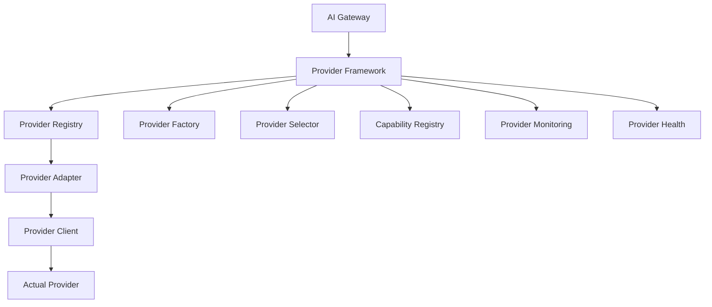

# Enterprise AI Provider Abstraction Framework

## Architecture

The Provider Abstraction Layer sits between the AI Gateway (Chapter 3) and actual AI providers, ensuring complete decoupling.



## Module Structure

```
providers/
├── AIProvider.java              # Core provider interface
├── ProviderContext.java         # Execution context
├── ProviderConfiguration.java   # Configuration contract
├── ProviderType.java            # Provider type enum
├── ProviderStatus.java          # Status enum
├── ProviderHealth.java          # Health record
├── ProviderHealthService.java   # Health service interface
├── CircuitBreaker.java          # Circuit breaker interface
├── ProviderAdminService.java    # Admin operations
├── adapter/                     # Request/response adaptation
│   ├── ProviderAdapter.java
│   ├── RequestAdapter.java
│   └── ConfigurationAdapter.java
├── client/                      # Provider client abstraction
│   ├── ProviderClient.java
│   ├── GatewayClientBridge.java
│   └── ClientConnectionPool.java
├── model/                       # Domain models
│   ├── ProviderRequest.java
│   ├── ProviderResponse.java
│   ├── ProviderOperation.java
│   ├── ProviderEndpoint.java
│   └── ProviderCredentials.java
├── capability/                  # Capability definitions
│   ├── ProviderCapability.java  # 20 capability enums
│   ├── CapabilityProfile.java
│   ├── CapabilityRegistry.java
│   └── CapabilityValidator.java
├── registry/                    # Provider registry
│   ├── ProviderRegistry.java
│   ├── ProviderDiscovery.java
│   ├── ProviderActivator.java
│   └── ProviderVersionTracker.java
├── factory/                     # Provider factory
│   ├── ProviderFactory.java
│   ├── FactoryRegistry.java
│   └── DependencyResolver.java
├── selector/                    # Provider selection
│   ├── ProviderSelector.java
│   ├── SelectionStrategy.java
│   ├── SelectionContext.java
│   └── strategies/
│       ├── PrioritySelectionStrategy.java
│       ├── CapabilitySelectionStrategy.java
│       ├── AvailabilitySelectionStrategy.java
│       ├── FallbackSelectionStrategy.java
│       ├── RoundRobinSelectionStrategy.java
│       └── WeightedSelectionStrategy.java
├── lifecycle/                   # Lifecycle management
│   ├── ProviderLifecycle.java
│   ├── ProviderLifecycleStage.java
│   ├── LifecycleEvent.java
│   └── LifecycleAuditor.java
├── validator/                   # Provider validation
│   ├── ProviderValidator.java
│   └── ValidationResult.java
├── discovery/                   # Provider discovery
│   ├── ProviderDiscoveryService.java
│   └── DiscoverySource.java
├── metadata/                    # Provider metadata
│   ├── ProviderMetadata.java
│   └── MetadataRegistry.java
├── monitoring/                  # Monitoring interfaces
│   ├── ProviderMetricsCollector.java
│   ├── ProviderHealthMonitor.java
│   ├── ProviderPerformanceTracker.java
│   ├── ProviderCostTracker.java
│   └── AvailabilityTracker.java
├── exception/                   # Exception hierarchy
│   ├── ProviderException.java
│   ├── ProviderUnavailableException.java
│   ├── UnsupportedCapabilityException.java
│   ├── ProviderConfigurationException.java
│   ├── ProviderAuthenticationException.java
│   ├── ProviderRateLimitException.java
│   ├── ProviderTimeoutException.java
│   ├── ProviderHealthException.java
│   ├── ProviderDiscoveryException.java
│   ├── ProviderValidationException.java
│   └── ProviderSelectionException.java
├── contracts/                   # Provider contracts
│   ├── ChatContract.java
│   ├── CompletionContract.java
│   ├── StreamingContract.java
│   ├── EmbeddingContract.java
│   ├── VisionContract.java
│   ├── ImageGenerationContract.java
│   ├── AudioContract.java
│   ├── ReasoningContract.java
│   ├── ToolCallingContract.java
│   ├── StructuredOutputContract.java
│   ├── FunctionCallingContract.java
│   └── JSONModeContract.java
└── config/                      # Spring Boot configuration
    ├── ProviderAutoConfiguration.java
    ├── ProviderConfigProperties.java
    └── ProviderHealthIndicator.java
```

## Core Interfaces

### AIProvider
The central contract every provider must implement.

### ProviderAdapter
Adapts requests/responses between canonical format and provider-specific format.

### ProviderClient
Manages transport-level communication with the provider.

### ProviderFactory
Creates provider instances from configuration.

### ProviderRegistry
Manages provider lifecycle (register, activate, deactivate).

### ProviderSelector
Selects the optimal provider for each request.
