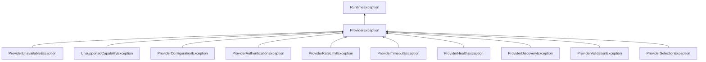
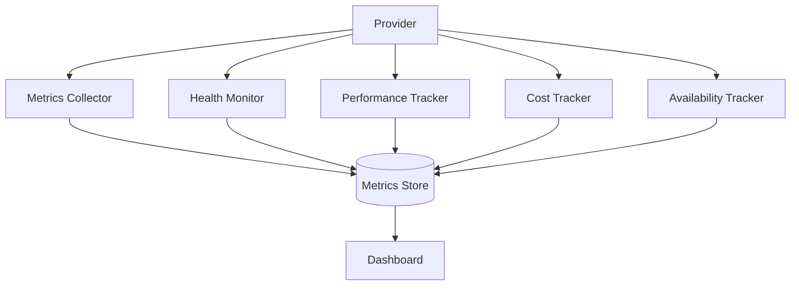

# Provider Contracts

## Contract Types

| Contract | Purpose |
|----------|---------|
| ChatContract | Multi-turn chat completions |
| CompletionContract | Single-turn text completion |
| StreamingContract | Streaming response support |
| EmbeddingContract | Text vector embeddings |
| VisionContract | Image analysis |
| ImageGenerationContract | Image generation |
| AudioContract | Speech/transcription |
| ReasoningContract | Reasoning model invocation |
| ToolCallingContract | Tool/function execution |
| StructuredOutputContract | Structured JSON output |
| FunctionCallingContract | Function definition execution |
| JSONModeContract | Strict JSON mode |

## Exception Hierarchy

## Provider Metadata

| Field | Type | Description |
|-------|------|-------------|
| providerId | String | Unique identifier |
| providerName | String | Display name |
| type | ProviderType | Enum (OPENAI, GEMINI, etc.) |
| version | String | API version |
| supportedModels | List~String~ | Available models |
| regions | List~String~ | Deployment regions |
| contextWindow | long | Max context tokens |
| rateLimitPerMinute | int | RPM limit |
| streamingSupported | boolean | Streaming capability |

## Monitoring Architecture

