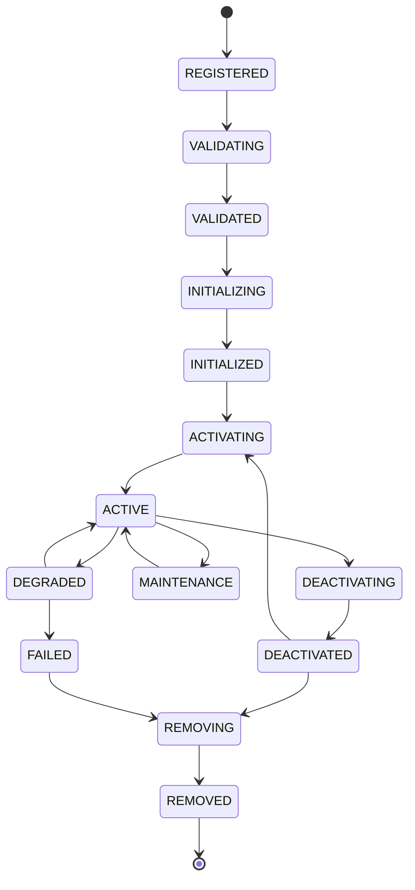
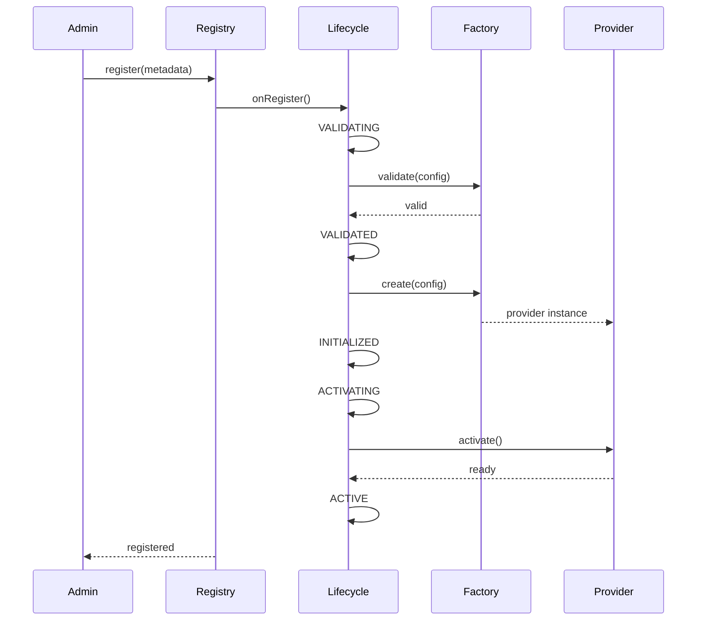

# Provider Lifecycle

## Lifecycle Stages

```mermaid
stateDiagram-v2
    [*] --> REGISTERED
    REGISTERED --> VALIDATING
    VALIDATING --> VALIDATED
    VALIDATED --> INITIALIZING
    INITIALIZING --> INITIALIZED
    INITIALIZED --> ACTIVATING
    ACTIVATING --> ACTIVE
    ACTIVE --> DEGRADED
    ACTIVE --> MAINTENANCE
    DEGRADED --> ACTIVE
    DEGRADED --> FAILED
    MAINTENANCE --> ACTIVE
    ACTIVE --> DEACTIVATING
    DEACTIVATING --> DEACTIVATED
    DEACTIVATED --> REMOVING
    REMOVING --> REMOVED
    DEACTIVATED --> ACTIVATING
    FAILED --> REMOVING
    REMOVED --> [*]
```

## Lifecycle Flow

```mermaid
sequenceDiagram
    participant ADM as Admin
    participant REG as Registry
    participant LIF as Lifecycle
    participant FAC as Factory
    participant PRO as Provider

    ADM->>REG: register(metadata)
    REG->>LIF: onRegister()
    LIF->>LIF: VALIDATING
    LIF->>FAC: validate(config)
    FAC-->>LIF: valid
    LIF->>LIF: VALIDATED
    LIF->>FAC: create(config)
    FAC-->>PRO: provider instance
    LIF->>LIF: INITIALIZED
    LIF->>LIF: ACTIVATING
    LIF->>PRO: activate()
    PRO-->>LIF: ready
    LIF->>LIF: ACTIVE
    REG-->>ADM: registered
```

## Events

Each lifecycle transition emits a `LifecycleEvent` recorded by `LifecycleAuditor`.
