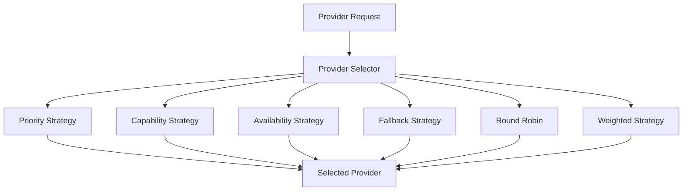
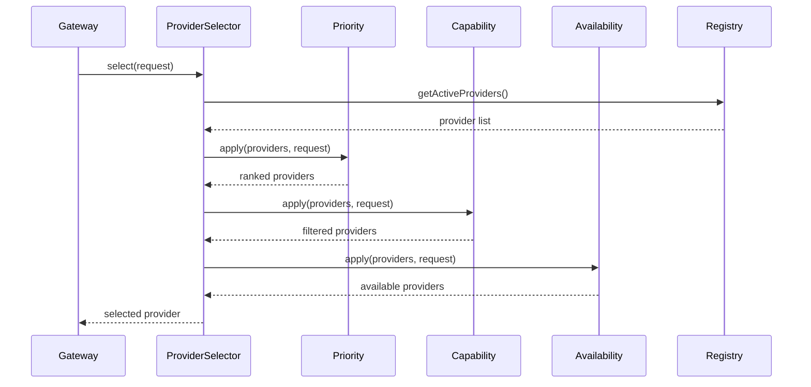
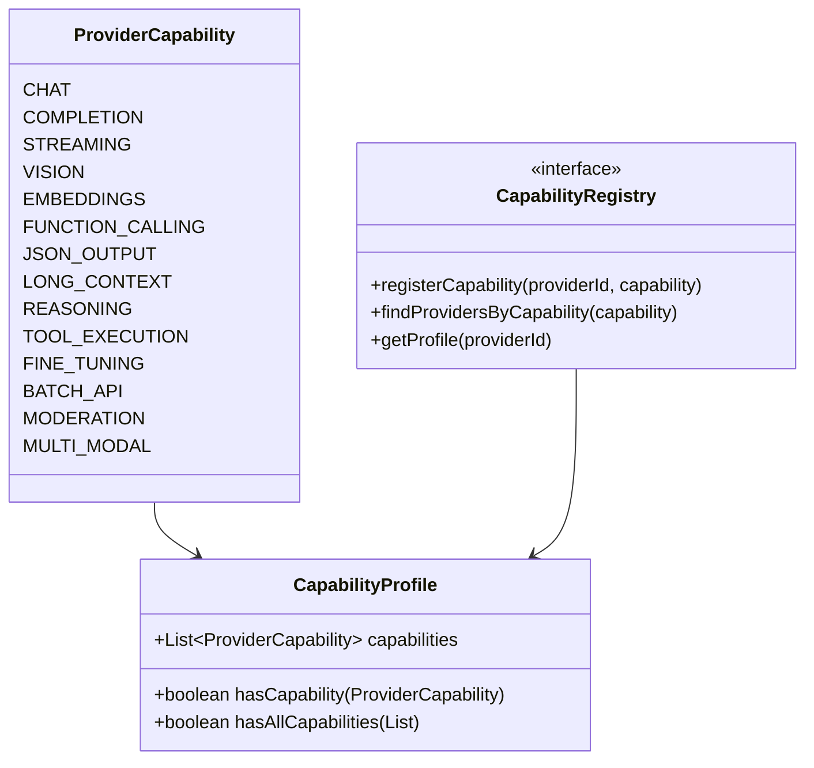

# Provider Selection

## Selection Strategies

| Strategy | Order | Description |
|----------|-------|-------------|
| Priority | 1 | Select by configured priority |
| Capability | 2 | Filter by required capabilities |
| Availability | 3 | Filter by health status |
| Weighted | 6 | Weighted random selection |
| Round Robin | 7 | Distribute across providers |
| Fallback | 10 | Ordered fallback chain |

## Selection Flow

## Capability Model

