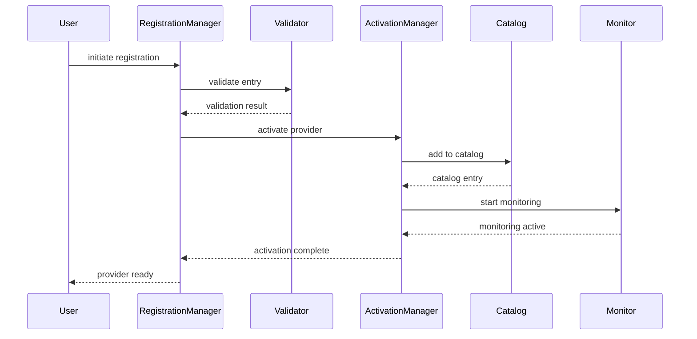
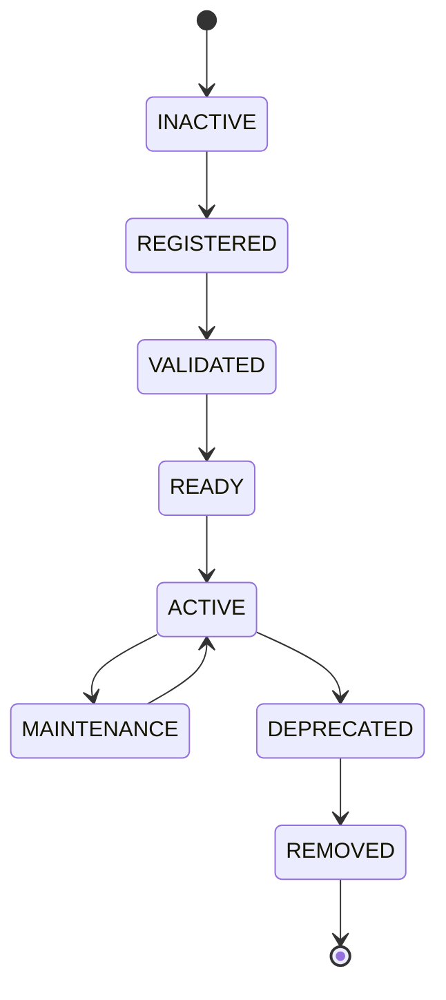

# Enterprise AI Provider Activation Workflow

## Overview

The Activation Workflow manages the lifecycle of provider activation from initial registration through active service to eventual removal.

## Activation Flow

## Activation States

## Activation Manager Responsibilities

- Activate providers for use
- Deactivate providers when needed
- Track activation state
- Support maintenance mode
- List active/inactive providers
