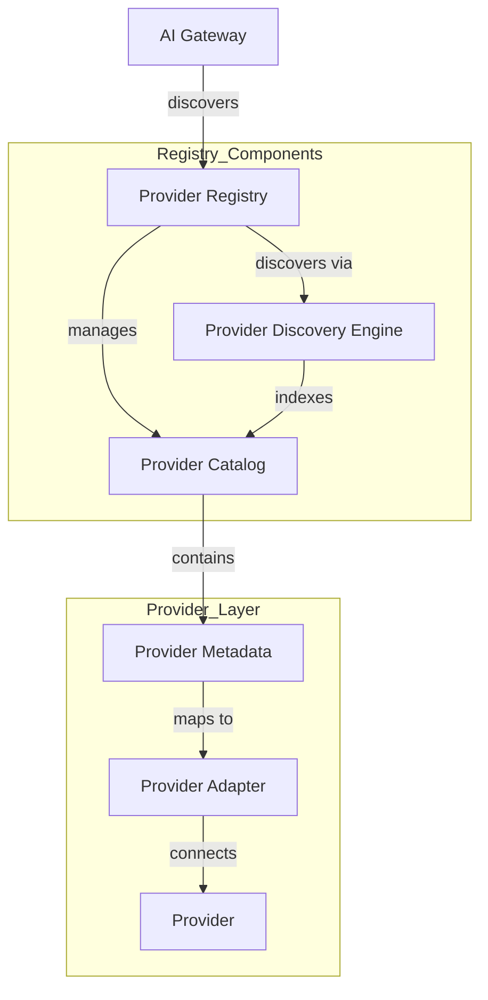
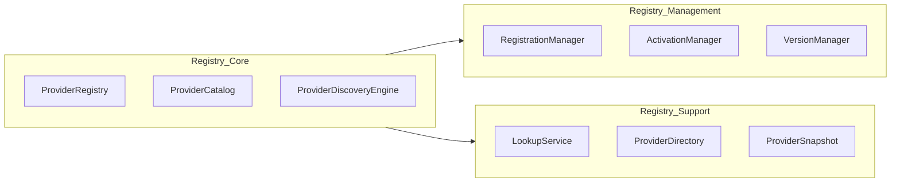

# Enterprise AI Provider Registry Architecture

## Overview

The Provider Registry is the single source of truth for every AI provider inside SporeKart. Every provider must register itself here before use. The Gateway discovers providers only through this Registry.

## Architecture Diagram

## Component Architecture

## Key Design Principles

- **Single Source of Truth**: All provider metadata is managed here
- **Discovery-Only Gateway Access**: Gateway never accesses providers directly
- **Pluggable Discovery Sources**: New discovery mechanisms can be added
- **Versioned Catalog**: Every provider entry is version-tracked
- **Health-Aware**: Registry tracks provider health for intelligent routing
