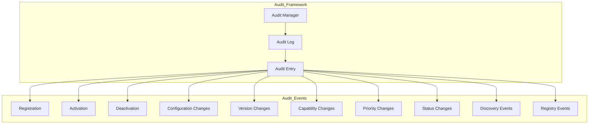

# Enterprise AI Provider Registry Audit

## Overview

The Registry Audit framework provides a complete audit trail for all provider-related events including registration, activation, configuration changes, and lifecycle transitions.

## Audit Architecture

## Audit Entry Fields

| Field | Type | Description |
|-------|------|-------------|
| eventId | String | Unique event identifier |
| providerId | String | Provider reference |
| eventType | String | Event classification |
| description | String | Human-readable description |
| source | String | Event source |
| timestamp | Instant | When event occurred |
| details | String | Additional details |

## Audit Operations

- Record audit events
- Query events by provider
- Query events by type
- Query events by time range
- Query recent events
- Clear provider events
