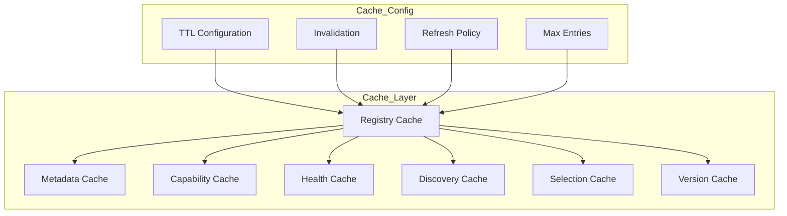

# Enterprise AI Provider Registry Cache

## Overview

The Registry Cache provides TTL-based caching for provider metadata, capabilities, health status, and discovery results to optimize registry performance.

## Cache Architecture

## Cache Configuration

| Cache Type | Default TTL | Description |
|------------|-------------|-------------|
| Metadata | 5 minutes | Provider metadata |
| Capability | 5 minutes | Provider capabilities |
| Health | 30 seconds | Health status (short TTL) |
| Discovery | 10 minutes | Discovery results |
| Selection | 1 minute | Selection context |
| Version | 30 minutes | Version information |

## Cache Operations

- Put entry with TTL
- Get entry (records access count)
- Invalidate single entry
- Invalidate all entries
- Refresh entry
- Check existence
