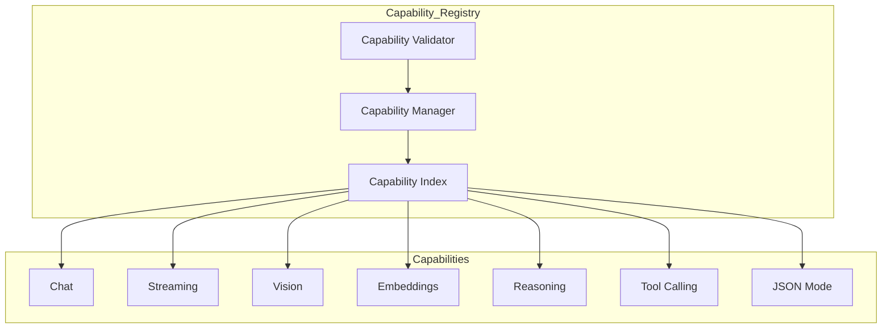
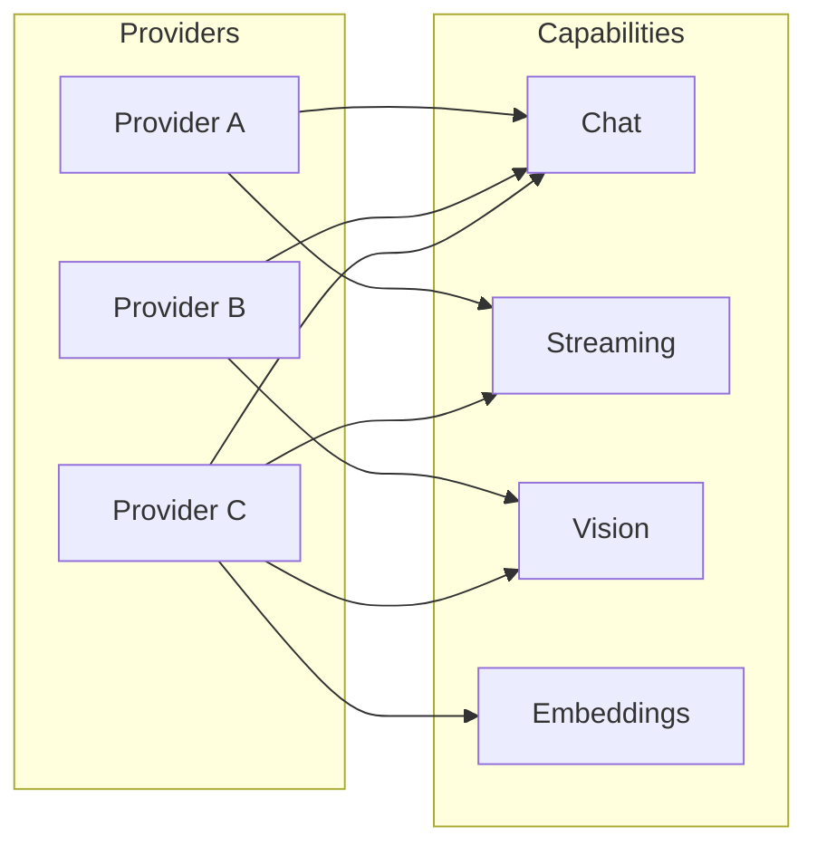

# Enterprise AI Provider Capability Registry

## Overview

The Capability Registry indexes provider capabilities for efficient discovery and matching. Enables capability-based provider selection.

## Capability Index Architecture

## Capability Mapping

## Capability Manager Responsibilities

- Register capabilities per provider
- Query provider capabilities
- Find providers by capability (AND/OR)
- Remove capabilities
- Track capability count
