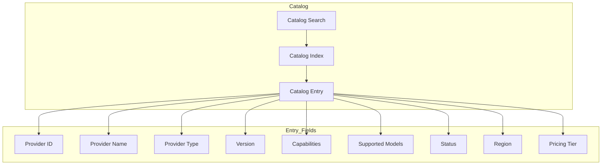

# Enterprise AI Provider Catalog

## Overview

The Provider Catalog is the authoritative index of all registered AI providers. Each entry contains complete metadata about a provider's capabilities, models, regions, and operational status.

## Catalog Architecture

## Catalog Entry Fields

| Field | Type | Description |
|-------|------|-------------|
| providerId | String | Unique provider identifier |
| providerName | String | Provider name |
| displayName | String | Human-readable name |
| type | ProviderType | Provider type enum |
| version | String | Provider version |
| capabilities | List | Supported capabilities |
| supportedModels | List | Models provided |
| status | ProviderStatus | Current status |
| priority | int | Selection priority |
| weight | int | Selection weight |
| region | String | Deployment region |
| available | boolean | Availability flag |
| latency | long | Response latency |
| pricingTier | String | Pricing category |
| contextWindow | long | Max context window |
| maximumTokens | int | Max output tokens |
| streamingSupported | boolean | Streaming support |
| embeddingSupported | boolean | Embedding support |
| visionSupported | boolean | Vision support |
| reasoningSupported | boolean | Reasoning support |
| toolCallingSupported | boolean | Tool calling support |
| jsonModeSupported | boolean | JSON mode support |
| complianceLevel | String | Compliance level |

## Search Capabilities

- Search by name
- Search by capability
- Search by model
- Search by region
- Filter by status
- Filter by type
