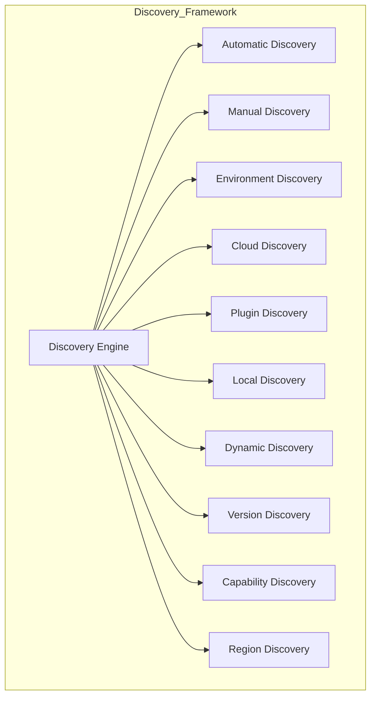
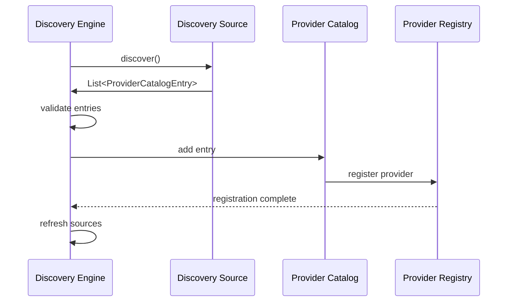

# Enterprise AI Provider Discovery Framework

## Overview

The Discovery Framework provides multiple strategies for discovering and registering AI providers in the registry. Each discovery source can be independently enabled, configured, and extended.

## Discovery Sources

## Discovery Flow

## Discovery Types

| Type | Strategy | Description |
|------|----------|-------------|
| Automatic | Auto-detection | Automatically detect available providers |
| Manual | User registration | Manually register provider details |
| Environment | Env variables | Discover from environment variables |
| Cloud | Cloud providers | Discover from cloud provider APIs |
| Plugin | Plugin system | Discover from plugin classpath |
| Local | Local filesystem | Discover from local configuration |
| Dynamic | Runtime | Dynamically discover at runtime |
| Version | Version-based | Discover by version constraints |
| Capability | Capability-based | Discover by required capabilities |
| Region | Region-based | Discover by geographic region |
