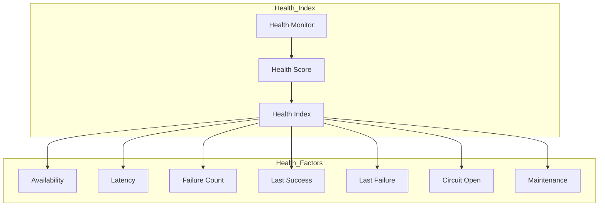

# Enterprise AI Provider Registry Health

## Overview

The Registry Health Index tracks provider availability, latency, failure rates, and provides a composite health score for each registered provider.

## Health Architecture

## Health Score Levels

| Level | Score Range | Description |
|-------|-------------|-------------|
| CRITICAL | 0.0 - 0.2 | Provider unavailable or failing |
| DEGRADED | 0.2 - 0.5 | Provider experiencing issues |
| STABLE | 0.5 - 0.8 | Provider operating normally |
| HEALTHY | 0.8 - 1.0 | Provider operating optimally |

## Health Manager Responsibilities

- Report provider health
- Query individual health
- Query aggregate health
- List healthy/unhealthy/degraded providers
- Track circuit breaker status
- Monitor maintenance mode
