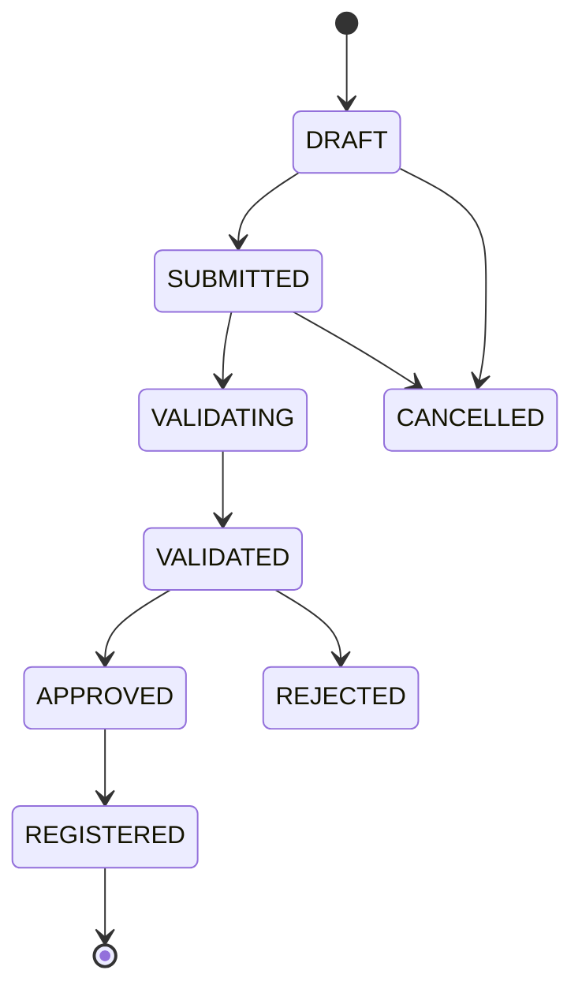
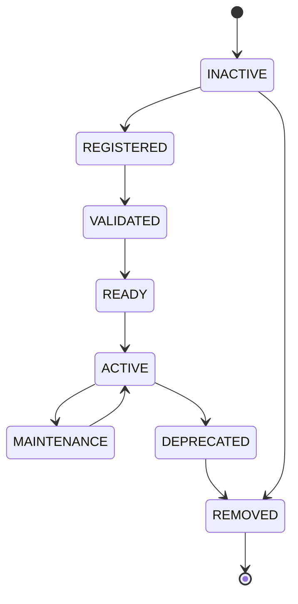
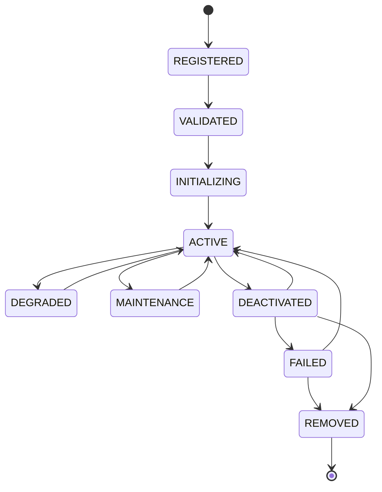

# Enterprise AI Provider Registry Lifecycle

## Registration Lifecycle

## Activation Lifecycle

## Status Transition

## Lifecycle Events

- **Registration**: Provider enters the registry
- **Validation**: Provider metadata and capabilities validated
- **Activation**: Provider becomes available for use
- **Maintenance**: Provider temporarily unavailable
- **Deprecation**: Provider marked for removal
- **Removal**: Provider permanently removed from registry
